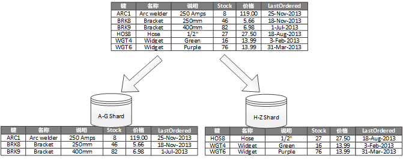
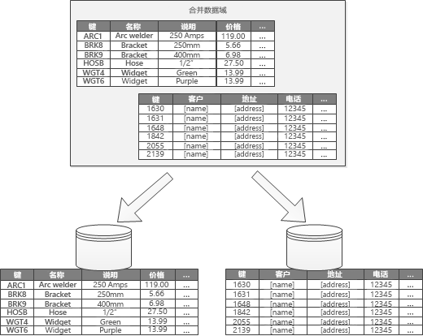

# 水平数据分区、垂直数据分区和功能数据分区

在许多大型解决方案中，数据分割成分区，而这些分区可以单独进行管理和访问。 分区可以改善可伸缩性、减少争用，以及优化性能。 另外，它还能提供一种按使用模式来分割数据的机制。 例如，可以将较旧的数据存档在成本较低的数据存储中。

但是，必须慎重选择分区策略，才能最大程度地提高效益，将负面影响降到最低。

> [!NOTE]
> 在本文中，术语“分区”是指以物理方式将数据分割成独立数据存储的过程。 它与 SQL Server 表分区不同。

<!-- markdownlint-disable MD026 -->

## 为何要将数据分区？

<!-- markdownlint-enable MD026 -->

- **提高缩放性**。 纵向扩展单一数据库系统最终会达到物理硬件的限制。 如果跨多个分区来分割数据，则每个分区托管在独立的服务器上，使系统几乎能够无限横向扩展。

- **提高性能**。 在每个分区上的数据访问操作通过较小的数据卷进行。 在正确操作的情况下，分区可以提高系统的效率。 影响多个分区的操作可以同时运行。

- **提高安全性**。 在某些情况下，可以将机密和非机密数据隔离到不同的分区，对敏感数据应用不同的安全控制。

- **提供操作灵活性**。 使用分区可以从多方面优化操作、最大程度提高管理效率及降低成本。 例如，可以根据数据在每个分区中的重要性定义不同的策略，以管理、监视、备份和还原及其他管理任务。

- **将数据存储和使用模式相匹配**。 分区允许根据数据存储提供的成本和内置功能，将每个分区部署在不同类型的数据存储上。 例如，大型二进制数据可存储在 Blob 存储中，而结构化程度更高的数据则可保存在文档数据库中。 请参阅[选择适当的数据存储](../guide/technology-choices/data-store-overview.md)。

- **提高可用性**。 跨多个服务器隔离数据可避免单点故障。 如果一个实例发生故障，只有该分区中的数据不可用。 其他分区上的操作可以继续进行。 对于托管型 PaaS 数据存储，则不怎么需要进行这种考虑，因为这些服务在设计时已经考虑到了内置冗余。

## 设计分区

数据分区有三个典型策略：

- **水平分区**\（通常称为*分片*）。 在此策略中，每个分区都是独立的数据存储，但所有分区具有相同的架构。 每个分区称为分片，保存数据的特定子集，例如特定的一组客户的所有订单。

- **垂直分区**。 在此策略中，每个分区在数据存储中保存项字段的子集。 这些字段已根据其使用模式进行分割。 例如，将经常访问的字段放在一个垂直分区，将较不经常访问的字段放在另一个垂直分区。

- **功能分区**。 在此策略中，数据已根据系统中每个界限上下文使用数据的方式进行聚合。 例如，电子商务系统可能在一个分区中存储发票数据，在另一个分区中存储产品库存数据。

这些策略可以组合起来使用，建议在设计分区方案时全盘考虑。 例如，可以将数据分割成分片，然后使用垂直分区进一步细分每个分片中的数据。

### 水平分区（分片）

图 1 显示了水平分区或分片。 在此示例中，产品库存数据已根据产品键分割成分片。 每个分片保存分区键（A-G 和 H-Z）的连续范围数据，根据字母顺序排列。 分片可以将负载分散到多台计算机，减少争用并改善性能。

图 1.基于分区键将数据水平分区（分片）。

最重要的因素是分片键的选择。 系统运行之后，就很难更改该键。 键必须确保在进行数据分区时，工作负荷能够尽量跨分片平均分配。

分片不需大小一致。 请求数的平衡更为重要。 有些分片可能非常大，但每个项的访问操作数目少。 其他分片可能较小，但是更常访问每个项。 另一个重点是确保单个分片不超过数据存储的规模限制（在容量和资源处理方面）。

避免产生“热”分区，否则可能会影响性能与可用性。 例如，使用客户名称的第一个字母会导致分配不均衡，因为某些字母更常见。请改用客户标识符的哈希，这样可以更均衡地跨分区分配数据。

选择分片键时，应尽量避免将来还需要把大分片拆分、把小分片合并成大分区或者更改架构的情况。 这些操作可能非常耗时，并且可能需要在执行时使一个或多个分片脱机。

如果复制分片，则某些副本也许能够保持联机，而其他副本会被拆分、合并，或者重新配置。 但是，系统可能需要限制可以在重新配置期间执行的操作。 例如，可以将副本中的数据标记为只读，避免出现数据不一致的情况。

有关水平分区的详细信息，请参阅[分片模式]。

### 垂直分区

垂直分区的最常见用途是降低与提取频繁访问的项相关的 I/O 和性能成本。 图 2 显示了垂直分区的示例。 在此示例中，项的不同属性存储在不同的分区中。 一个分区保存经常访问的数据，包括产品名称、说明和价格。 另一个分区保存清单数据：库存计数和上次订购日期。

图 2.按使用模式将数据垂直分区。

在此示例中，应用程序在向客户显示产品详细信息时，按常规查询产品名称、描述和价格。 库存计数和上次订购日期保存在单独的分区中，因为这两项通常一起使用。

垂直分区的其他优势：

- 不怎么变化的数据（产品名称、说明和价格）和较动态的数据（库存水平和上次订购日期）可以彼此隔离。 应用程序可以将不怎么变化的数据缓存在内存中。

- 可以将敏感数据存储在单独的分区中并施加额外的安全控制。

- 垂直分区可以减少必需的并发访问数量。

垂直分区在数据存储中的实体级运行，会部分规范化某个实体，以将它从*宽*项分割成一组*窄*项。 在理想的情况下，垂直分区适用于 HBase 和 Cassandra 等列导向型数据存储。 如果列集合中的数据不太可能会更改，还可以考虑使用 SQL Server 中的列存储。

### 功能分区

如果可以在应用程序中确定每个不同商业领域的受限上下文，则可通过功能分区来改善隔离效果和数据访问性能。 功能分区的另一种常见用途是将读写数据与只读数据隔离。 图 3 显示了功能分区的概览，其中的库存数据已与客户数据相隔离。

图 3.按界限上下文或子域对数据进行功能分区。

此分区策略可帮助减少跨系统中不同部件的数据访问争用。

## 针对缩放性设计分区

请务必考虑每个分区的大小和工作负荷并进行平衡，使数据分布实现最大伸缩性。 但是，还必须将数据分区，使它不超过单个分区存储的缩放限制。

在针对缩放性设计分区时，请执行以下步骤：

1. 分析应用程序以了解数据访问模式，例如每个查询返回的结果集大小、访问的频率、固有的延迟，以及服务器端计算处理要求。 在许多情况下，一些主要实体需要大部分的处理资源。
2. 使用这种分析来确定当前和将来的缩放性目标，例如数据大小和工作负荷。 然后将数据跨分区分布以符合缩放性目标。 对于水平分区，选择适当的分片键很重要，可以确保数据的均衡分配。 有关详细信息，请参阅[分片模式]。
3. 确保每个分区有足够的资源，能够在数据大小和吞吐量方面应对可伸缩性要求。 每个分区的存储空间量、处理能力或网络带宽可能存在限制，具体取决于数据存储的情况。 如果可伸缩性要求会超出这些限制，则可能需要优化分区策略或进一步拆分数据，也许需要将至少两个策略组合在一起。
4. 对系统进行监视，以验证数据是否按预期分配，以及分区是否可以处理负载。 实际使用情况并非始终符合分析的预期。 如果出现这种情况，可以对分区进行再平衡，或者重新设计系统的某些部分，以实现所需的平衡。

某些云环境会根据基础结构边界分配资源。 请确保所选边界的限制可在数据存储、处理能力和带宽等方面提供足够的空间，以满足数据量的预期增长。

例如，如果使用 Azure 表存储，则单一分区在特定时限内能够处理的请求数会存在限制。 （请参阅 [Azure 存储可伸缩性和性能目标]。）繁忙的分片所需的资源可能会超出单个分区的处理能力。 如果属于这种情况，可能需要对分片进行重新分区以分散负载。 如果这些表的总大小或吞吐量超过存储帐户的容量，可能需要创建其他存储帐户并跨帐户分散表。

## 针对查询性能设计分区

使用较小的数据集和运行并行查询通常可以提高查询性能。 每个分区应该包含整个数据集的一小部分。 这种数量缩减可以提高查询性能。 但是，分区并不是合理设计和配置数据库的替代方式。 例如，请确保编制必要的索引。

在针对查询性能设计分区时，请执行以下步骤：

1. 检查应用程序的要求和性能：

   - 根据业务要求来确定必须始终快速执行的重要查询。
   - 监视系统以识别任何执行速度缓慢的查询。
   - 找出最常执行的查询。 即使单个查询的开销极少，也会出现资源累积消耗很大的情况。

2. 将导致性能变慢的数据分区。
   - 限制每个分区的大小，使查询响应时间在目标范围内。
   - 如果使用水平分区，请在设计分片键时，确保应用程序能够轻松地选择适当的分区。 这可防止查询需要扫描每个分区。
   - 考虑分区的位置。 如果可能，请尽量将数据保留在地理位置靠近访问数据的应用程序和用户的分区中。

3. 如果实体有吞吐量和查询性能的要求，请根据该实体使用功能分区。 如果这样还是无法满足要求，请同时应用水平分区。 在大多数情况下，单个分区策略就已足够，但在某些情况下，结合两种策略会更有效率。

4. 考虑跨分区并行运行查询以改善性能。

## 针对可用性设计分区

将数据分区可以确保整个数据集不会构成单一故障点，并可确保数据集的单个子集可以独立进行管理，从而提高应用程序的可用性。

请注意以下会影响可用性的因素：

**数据对业务运营的重要程度**。 确定属于重要业务信息的数据（例如交易），以及较不重要的操作数据（例如日志文件）。

- 考虑将重要数据存储在高度可用且有适当备份计划的分区中。

- 为不同的数据集建立独立的管理和监视过程。

- 将具有相同级别重要性的数据放在相同的分区中，以便可以按照相应的频率一同备份。 例如，保存交易数据的分区需要备份的频率可能高于保存日志记录或跟踪信息的分区。

**单个分区的管理方式**。 将分区设计为支持单独管理和维护可提供多种优势。 例如：

- 如果分区故障，可以独立恢复该分区，不需使用在其他分区中访问数据的应用程序。

- 按地理区域将数据分区可以在每个位置的非高峰时段进行计划的维护任务。 确保分区不会太大，避免任何计划中的维护在这段时间无法完成。

**是否要跨分区复制重要数据**。 此策略可以提高可用性和性能，但也可能会造成一致性问题。 在每个副本中同步所做的更改需要时间。 在这段时间，不同的分区会包含不同的数据值。

## 应用程序设计注意事项

分区会增大系统设计和开发的复杂性。 即使系统一开始只包含单个分区，也必须将分区视为系统设计的基础部分。 如果事后才解决分区问题，则会更为困难，因为有一个实时系统需要维护：

- 数据访问逻辑需要修改。
- 大量现有数据可能需要通过迁移的方式跨分区分配。
- 用户期望在迁移期间能够继续使用系统。

在某些情况下，分区并不重要，因为初始数据集很小，可以轻松地由单个服务器处理。 对某些工作负荷来说，这可能是真的，但是许多商务系统需要随用户数的增加而扩展。

另外，并非只有大型数据存储才受益于分区。 例如，数百个并发客户端可能会重度访问一个小型数据存储。 在此情况下，将数据分区有助于减少争用并提高吞吐量。

在设计数据分区方案时，请注意以下几点：

**尽量减少跨分区数据访问操作**。 尽可能将每个分区中最常见数据库操作的数据保存在一起，尽量减少跨分区数据访问操作。 跨分区查询可能比在单个分区中查询更费时，而优化一个查询集的分区可能对其他查询集造成不利影响。 如果必须跨分区查询，则应通过运行并行查询并在应用程序中聚合结果来尽量减少查询时间。 （在某些情况下可能无法使用这种方法，例如一个查询的结果会在下一个查询中使用时。）

**考虑复制静态引用数据。** 如果查询使用相对静态的引用数据，例如邮政编码表或产品列表，请考虑将该数据复制到所有分区，以减少不同分区中的独立查找操作。 这种方法还可以降低引用数据变成“热”数据集（来自整个系统的流量很大）的可能性。 不过，将更改同步到引用数据会产生额外的开销。

**尽量减少跨分区联接。** 尽量减少跨垂直和功能分区的引用完整性的要求。 在这些方案中，应用程序负责维护跨分区的引用完整性。 跨多个分区联接数据的查询效率不高，因为应用程序通常需要按照先键后外键的方式执行连续查询。 建议复制或取消规范化相关的数据。 如果需要进行跨分区联接，请对各分区运行并行查询，并在应用程序内部联接数据。

**实现最终一致性**。 评估强一致性是否为实际要求。 分布式系统中的一种常见方法是实施最终一致性。 每个分区中的数据将单独更新，应用程序逻辑可确保所有更新成功完成。 此外，它还会处理在运行最终一致操作时查询数据所造成的不一致。

**考虑查询如何查找正确的分区**。 如果查询必须扫描所有分区来查找所需的数据，即使运行多个并行查询，也会对性能产生严重的影响。 使用垂直和功能分区时，查询可以自然地指定分区。 另一方面，水平分区可能会导致项的查找变得困难，因为每个分片都有相同的架构。 典型的解决方案是保留一种映射，用于查找特定项的分片位置。 此映射可以在应用程序的分片逻辑中实施，或者由数据存储维护（如果数据存储支持透明分片）。

**考虑定期重新平衡分片**。 使用水平分区时，重新平衡分片可能有助于根据大小和工作负荷均衡地分配数据，尽量减少热点，最大化查询性能，并解决物理存储限制。 不过，这是一个复杂的任务，通常需要使用定制工具或过程。

**复制分区。** 复制每个分区可以进一步防范故障。 如果单个副本发生故障，查询可以定向到可用的副本。

**如果达到了分区策略的物理限制，可能需要将缩放性扩展到其他级别**。 例如，如果分区位于数据库级别，则可能需要在多个数据库中查找或复制分区。 如果分区已在数据库级别，而物理限制成为一个问题，则可能需要在多个托管帐户中查找或复制分区。

**避免执行在多个分区中访问数据的事务**。 某些数据存储针对修改数据的操作实施事务一致性和完整性，但仅当数据位于单个分区时才能如此。 如果需要跨多个分区的事务支持，可能需要实施此支持作为应用程序逻辑的一部分，因为大多数分区系统不提供本机支持。

所有数据存储都需要某种操作管理和监视活动。 任务的范围可能包括加载数据、备份和还原数据、重新组织数据，以及确保系统正常有效地执行。

请注意以下会影响操作管理的因素：

- **将数据分区时如何实施适当的管理和操作任务**。 这些任务可能包括备份与还原、存档数据，监视系统及其他管理任务。 例如，在备份和还原操作期间保持逻辑一致性可能是一个难题。

- **如何将数据载入多个分区，以及如何添加来自其他源的新数据**。 某些工具和实用程序可能不支持分片数据操作（例如将数据载入正确的分区）。

- **如何定期存档和删除数据**。 为防止分区过度增长，需要定期（也许是每月）存档和删除数据。 可能需要转换数据以符合不同的存档架构。

- **如何找出数据完整性问题**。 考虑运行定期过程来查找数据完整性问题，例如一个分区的数据引用了另一个分区中缺少的信息。 该过程可能会尝试自动修复这些问题，或者会直接生成一个需手动审阅的报表。

## 重新平衡分区

随着系统成熟，可能需要调整分区方案。 例如，各个分区可能会开始获得比例不当的流量并且变得热门，导致过度争用资源。 或者，你可能低估了某些分区中的数据量，导致这些分区达到容量限制。

某些数据存储（例如 Cosmos DB）可能会自动对分区进行重新平衡。 在其他情况下，重新平衡是由两个阶段组成的管理任务：

1. 确定新的分区策略。

    - 哪些分区需要拆分（或者可能需要合并）？
    - 新分区键是什么？

2. 将数据从旧的分区方案迁移到一组新的分区。

也许能够在分区被使用时在分区之间迁移数据，具体取决于数据存储。 这称为联机迁移。 如果这不可行，可能需要在重定位数据时使分区不可用（脱机迁移）。

### 脱机迁移

脱机迁移通常更为简单，因为降低了发生争用的可能性。 从概念上讲，脱机迁移的工作方式如下所示：

1. 将分区标记为脱机。
2. 拆分/合并数据，并将其转移到新分区。
3. 验证数据。
4. 使新分区联机。
5. 删除旧分区。

可以选择在步骤 1 中将分区标记为只读，使应用程序仍然能够在移动数据时读取数据。

## 联机迁移

联机迁移执行起来更复杂，但对用户的干扰较少。 该过程与脱机迁移类似，不同之处在于，原始分区不会标记为脱机。 根据迁移过程的粒度（例如，是逐项迁移还是逐分片迁移），客户端应用程序中的数据访问代码可能需要处理保存在两个位置（原始分区和新分区）的数据的读取和写入。

## 相关模式

以下设计模式可能与方案相关：

- [分配模式](../patterns/sharding.md)介绍了一些进行数据分片的常见策略。

- [索引表模式](../patterns/index-table.md)介绍了如何基于数据创建辅助索引。 此方法可让应用程序使用未引用集合主键的查询快速检索数据。

- [具体化视图模式](../patterns/materialized-view.md)介绍了如何生成预先填充的视图，用于汇总数据以支持快速查询操作。 如果包含汇总数据的分区分布在多个站点上，此方法可能对分区的数据存储很有用。

## 后续步骤

- 了解特定 Azure 服务的分区策略。 请参阅 [Data partitioning strategies](./data-partitioning-strategies.md)（数据分区策略）

[Azure 存储可伸缩性和性能目标]: /azure/storage/storage-scalability-targets
