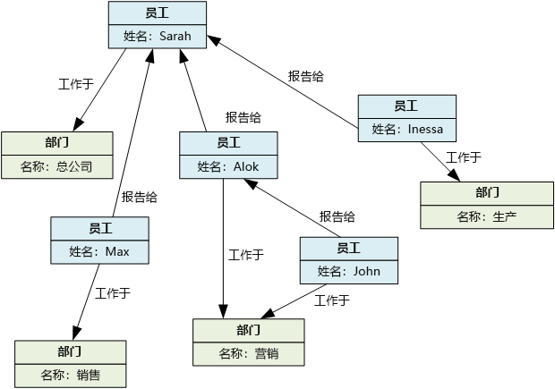
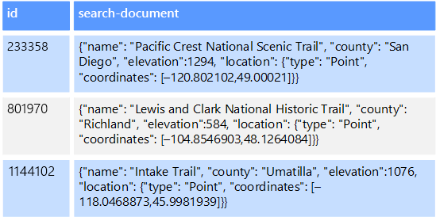

# 非关系数据和 NoSQL

非关系数据库是一种不使用表格架构的数据库，这种包含行和列的架构在传统的数据库系统中很常见。 与传统数据库相反，非关系数据库使用经过优化的存储模型，符合所存储数据类型的具体要求。 例如，可以将数据存储为简单的键值对、JSON 文档或者由边缘和顶点组成的图形。

所有这些数据存储的共同点是不使用[关系模型](../relational-data/index.md)。 另外，这些数据存储会尽量细化所支持的数据类型以及所允许的数据查询方式。 例如，时序数据存储适用于对基于时间的数据序列进行查询，而图形数据存储则适用于对实体之间的权重关系进行分析。 这两种格式都不适合事务数据管理任务。

*NoSQL* 这个术语是指一类数据存储，此类存储不使用 SQL 而是使用其他编程语言和构造来查询数据。 在实践中，“NoSQL”是指“非关系数据库”，虽然许多此类数据库支持 SQL 兼容查询。 但是，其基础查询执行策略通常与传统 RDBMS 执行 SQL 查询的方式有很大的不同。

以下部分介绍非关系数据库或 NoSQL 数据库的主要类别。

## 文档数据存储

文档数据存储在称为“文档”的实体中管理一组命名的字符串字段和对象数据值。 这些数据存储通常以 JSON 文档形式存储数据。 每个字段值可以是标量项，例如数字，也可以是复合元素，例如列表或父-子集合。 可以通过多种方式（例如 XML、YAML、JSON、BSON）将文档字段中的数据编码，甚至可以将其存储为纯文本。 文档中的字段会向存储管理系统公开，因此应用程序能够使用这些字段中的值查询和筛选数据。

通常，文档包含实体的整个数据。 至于实体由哪些项构成，则取决于所用的应用程序。 例如，实体可能包含客户和/或订单的详细信息。 单个文档可能包含会在关系数据库管理系统 (RDBMS) 中的多个关系表之间分散的信息。 文档存储不要求所有文档具有相同的结构。 这种自由格式方法提供了极大的灵活性。 例如，应用程序可将不同的数据存储在文档中，以应对业务需求的变化。

  

应用程序可以使用文档键检索文档。 文档键是文档的唯一标识符，通常已经过哈希处理，可帮助均匀分配数据。 某些文档数据库可自动创建文档键。 还有一些文档数据库允许指定要用作键的文档属性。 应用程序还可以基于一个或多个字段的值查询文档。 有些文档数据库支持索引，从而有助于根据一个或多个已编制索引的字段快速查找文档。

许多文档数据库支持就地更新，使应用程序能够在不重写整个文档的情况下修改文档中特定字段的值。 基于单个文档中的多个字段执行的读取和写入操作通常是原子性的。

相关的 Azure 服务：  

- [Azure Cosmos DB](https://azure.microsoft.com/services/cosmos-db/)

## 列式数据存储

列式数据存储或列系列数据存储会将数据整理到列和行中。 最简单形式的列系列数据存储可能与关系数据库十分类似，至少在概念上是这样。 列系列数据库的真正强大之处在于，它能够以非规范化方式将稀疏数据结构化，该方式源自面向列的数据存储方式。

可将列系列数据存储视为使用行与列保存表格数据，但是，列已分割为称作“列系列”的组。 每个列系列保存一组逻辑相关的且通常以单元形式检索或处理的列。 其他单独访问的数据可存储在单独的列系列中。 在列系列中，可以动态添加新列，行可以稀疏分布（即，行不需要包含每个列的值）。

下图显示了包含两个列系列（`Identity` 和 `Contact Info`）的示例。 在每个列系列中，单个实体的数据具有相同的行键。 此结构体现了列系列方法的重要优势，即列系列中任意给定对象的行可以动态变化，因此，这种形式的数据存储非常适用于存储各种架构的数据。

与键/值存储或文档数据库不同，大多数列系列数据库以物理方式根据键顺序而不是通过计算哈希来存储数据。 可以将行键视为主索引，因此可以通过特定的键或一系列键进行基于键的访问。 某些实现允许基于列系列中的特定列创建辅助索引。 使用辅助索引可以根据列值而不是行键检索数据。

在磁盘上，列系列中的所有列一起存储在同一文件中，每个文件中有特定数目的行。 使用大型数据集时，此方法会产生性能优势，因为一次只集中查询数个列，减少了需要从磁盘读取的数据量。

针对行执行的读取和写入操作通常是在单个列系列中执行的原子操作，不过，某些实现可以跨多个列系列对整行进行原子操作。

相关的 Azure 服务：  

- [HDInsight 中的 HBase](/azure/hdinsight/hdinsight-hbase-overview)

## 键/值数据存储

键/值存储实质上是一个大型哈希表。 将每个数据值与唯一的键关联后，键/值存储会使用此键通过相应的哈希函数来存储数据。 选择的哈希函数可在整个数据存储中均匀分配哈希键。

大多数键/值存储仅支持简单的查询、插入和删除操作。 若要修改某个值（修改一部分或整个值），应用程序必须覆盖整个值的现有数据。 在大多数实现中，读取或写入单个值是原子操作。 如果值较大，写入操作可能需要一段时间。

应用程序可将任意数据存储为一组值，不过，某些键/值存储会对值的最大大小施加限制。 存储的值对存储系统软件不透明。 应用程序必须提供并解释所有架构信息。 从本质上讲，值是 Blob，键/值存储只是根据键检索或存储值。

键/值存储特别适合应用程序使用单个键或一系列键的值来进行简单的查找，但不怎么适合需要跨不同的键/值表来查询数据（例如，需要跨多个表来联接数据）的系统。

键/值存储也不适合除了按键值进行查找，还必须按非键值进行查询或筛选的情况。 例如，对于关系数据库，可以使用 WHERE 子句来筛选非键列，以便查找记录，但键/值存储通常不会提供针对值的此类查找功能，仅在需要对所有值进行慢扫描的情况下才提供此类功能。

单个键/值存储就具有极高的可伸缩性，因为数据存储可在独立计算机上的多个节点之间轻松分配数据。

相关的 Azure 服务：  

- [Azure Cosmos DB 表 API](/azure/cosmos-db/table-introduction)
- [Azure Redis 缓存](https://azure.microsoft.com/services/cache/)  
- [Azure 表存储](https://azure.microsoft.com/services/storage/tables/)

## 图形数据存储

图形数据存储管理两类信息：节点信息和边缘信息。 节点表示实体，边缘表示这些实体之间的关系。 节点和边缘都可以包含一些属性用于提供有关该节点或边缘的信息（类似于表中的列）。 边缘还可以包含一个方向用于指示关系的性质。

图形数据存储的用途是让应用程序有效执行需遍历节点和边缘网络的查询，以及分析实体之间的关系。 下图显示了已结构化为图形的组织人员数据。 实体为员工和部门，边缘指示隶属关系以及员工所在的部门。 在此图形中，边缘上的箭头显示关系的方向。

使用此结构可以简单直接地执行类似于“查找 Sarah 的直接或间接下属”或“谁与 John 在同一个部门工作？”的查询。 对于包含大量实体和关系的大型图形，可以极快地执行非常复杂的分析。 多个图形数据库提供一种可用于高效遍历关系网络的查询语言。

相关的 Azure 服务：  

- [Azure Cosmos DB 图形 API](/azure/cosmos-db/graph-introduction)  

## 时序数据存储

时序数据是按时间组织的一组值，时序数据存储适用于此类数据。 时序数据存储必须支持极大量的写入，因为它们通常会从大量源实时收集大量数据。 时序数据存储适用于存储遥测数据。 方案包括 IoT 传感器或应用程序/系统计数器。 更新极少发生，而删除操作往往以批量操作的形式执行。

尽管写入时序数据库的记录通常较小，但记录数量往往很大，并且总数据大小可能迅速增长。 时序数据存储还处理无序的以及晚到的数据，可以自动编制数据点的索引，并且对于按时间窗口描述的查询，它还负责优化。 可以通过最后这项功能跨数百万数据点和多个数据流快速运行查询，为时序可视化提供支持。通常会通过这种方式来使用时序数据。

有关详细信息，请参阅[时序解决方案](../scenarios/time-series.md)

相关的 Azure 服务：

- [Azure 时序见解](https://azure.microsoft.com/services/time-series-insights/)  
- [将 OpenTSDB 与 HBase on HDInsight 配合使用](/azure/hdinsight/hdinsight-hbase-overview)

## 对象数据存储

对象数据存储适用于存储和检索大型二进制对象或 Blob，例如图像、文本文件、视频和音频流、大型应用程序数据对象和文档、虚拟机磁盘映像。 对象包括存储的数据、某些元数据，以及用于访问对象的唯一 ID。 对象存储旨在支持单个来说很大的文件，其提供的总存储容量很大，可以管理所有文件。

某些对象数据存储可以跨多个服务器节点复制给定的 Blob，因此可以快速地进行并行读取。 反过来也可以对大文件中包含的数据进行横向扩展查询，因为通常在不同的服务器上会运行多个进程，这些进程均可同时查询大数据文件。

对象数据存储的一个特例是网络文件共享。 使用文件共享时，可以通过服务器消息块 (SMB) 之类的标准网络协议在整个网络中访问文件。 在提供了相应的安全和并发访问控制机制的前提下，以这种方法共享数据可让分布式服务提供高度可缩放的数据访问方式来执行基本的低级操作，例如简单的读取和写入请求。

相关的 Azure 服务：

- [Azure Blob 存储](https://azure.microsoft.com/services/storage/blobs/)
- [Azure Data Lake Store](https://azure.microsoft.com/services/data-lake-store/)  
- [Azure 文件存储](https://azure.microsoft.com/services/storage/files/)

## 外部索引数据存储

外部索引数据存储提供搜索功能，可以搜索在其他数据存储和服务中保存的信息。 外部索引可充当任何数据存储的辅助索引，并且可以用来编制大量数据的索引，可以对这些索引进行近实时的访问。

例如，你可能将文本文件存储在某个文件系统中。 按文件路径查找文件很快，但根据文件内容进行搜索时，需要扫描所有文件，这很慢。 使用外部索引时，可以先创建辅助搜索索引，然后快速查找与条件相符的文件的路径。 外部索引的另一示例应用是用于只按键索引的键/值存储。 可以根据数据中的值生成一个辅助索引，然后快速查找可以唯一标识每个匹配项的键。

运行一个索引编制进程即可创建索引。 可以使用由数据存储触发的拉取模型或者由应用程序代码启动的推送模型来执行此操作。 索引可以是多维的，并且可以支持对大量文本数据进行自定义文本搜索。

外部索引数据存储通常用于支持全文搜索和基于 Web 的搜索。 在这些示例中，搜索可以采用精确匹配或模糊匹配。 模糊搜索查找与一组字词匹配的文档，并计算它们的匹配程度。 某些外部索引还支持语言分析，因此可以根据同义词、类型扩展来返回匹配项（例如，将“狗”作为“宠物”的匹配项返回），以及根据词干来返回匹配项（例如，搜索“run”时，也会返回“ran”和“running”作为匹配项）。

相关的 Azure 服务：  

- [Azure 搜索](https://azure.microsoft.com/services/search/)

## 典型要求

非关系数据存储所使用的存储体系结构通常不同于关系数据库所使用的。 具体说来，非关系数据存储通常没有固定的架构。 另外，此类存储通常不支持事务，即使支持事务，也会对其范围进行限制，而且出于可伸缩性原因，通常不包括辅助索引。

下表对每种非关系数据存储的要求进行了比较：

| 要求 | 文档数据 | 列系列数据 | 键/值数据 | 图形数据 |
| --- | --- | --- | --- | --- |
| 规范化 | 非规范化 | 非规范化 | 非规范化 | 规范化 |
| 架构 | 基于读取的架构 | 列系列定义基于写入，列架构基于读取 | 基于读取的架构 | 基于读取的架构 |
| 一致性（跨并发事务） | 可调式一致性，文档级别保证 | 列系列级别保证 | 键级别保证 | 图形级别保证 |
| 原子性（事务范围） | 集合 | 表 | 表 | 图形 |
| 锁定策略 | 乐观（无锁） | 悲观（行锁） | 乐观 (ETag) |
| 访问模式 | 随机访问 | 对高/宽数据进行聚合 | 随机访问 | 随机访问 |
| 索引 | 主要和辅助索引 | 主要和辅助索引 | 仅主要索引 | 主要和辅助索引 |
| 数据形状 | 文档 | 列系列包含列的表格 | 键和值 | 包含边缘和顶点的图形 |
| 稀疏 | 是 | 是 | 是 | 否 |
| 宽（很多列/属性） | 是 | 是 | 否 | 否 |  
| 基准大小 | 小 (KB) 到中（低 MB） | 中 (MB) 到大（低 GB） | 小 (KB) | 小 (KB) |
| 总体最大规模 | 极大 (PB) | 极大 (PB) | 极大 (PB) | 大 (TB) |

| 要求 | 时序数据 | 对象数据 | 外部索引数据 |
| --- | --- | --- | --- |
| 规范化 | 规范化 | 非规范化 | 非规范化 |
| 架构 | 基于读取的架构 | 基于读取的架构 | 基于写入的架构 |
| 一致性（跨并发事务） | 不适用 | 不适用 | 不适用 |
| 原子性（事务范围） | 不适用 | 对象 | 不适用 |
| 锁定策略 | 不适用 | 悲观（Blob 锁） | 不适用 |
| 访问模式 | 随机访问和聚合 | 顺序访问 | 随机访问 |
| 索引 | 主要和辅助索引 | 仅主要索引 | 不适用 |
| 数据形状 | 表格 | Blob 和元数据 | 文档 |
| 稀疏 | 否 | 不适用 | 否 |
| 宽（很多列/属性） |  否 | 是 | 是 |  
| 基准大小 | 小 (KB) | 大 (GB) 到极大 (TB) | 小 (KB) |
| 总体最大规模 | 大（低 TB）  | 极大 (PB) | 大（低 TB） |
