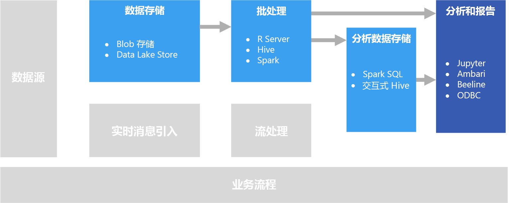

# 交互式数据探索

在许多企业商业智能 (BI) 解决方案中，报告和语义模型由 BI 专家创建并统一管理。 但是，越来越多的组织希望能让用户做出数据驱动的决策。 此外，有越来越多的组织在招聘数据科学家或数据分析师，他们的工作是以交互方式探索数据，并运用统计模型和分析方法在数据中发现趋势和模式。 交互式数据探索要求工具和平台对即席查询和数据可视化提供低延迟的处理。

## 自助服务 BI

自助服务 BI 是业务决策的新方法，在其中，整个企业的用户能够发现、探索和分享数据见解。 为此，数据解决方案必须支持几项要求：

* 通过数据目录发现业务数据源。
* 用于确保数据实体定义和值一致性的主数据管理。
* 适用于业务用户的交互式数据建模和可视化工具。

在自助服务 BI 解决方案中，业务用户通常会查找并使用与其特定业务领域相关的数据源，使用直观的工具和生产力应用程序来定义个人数据模型和报告并与同事共享。

相关的 Azure 服务：

- [Azure 数据目录](/azure/data-catalog/data-catalog-what-is-data-catalog)
- [Microsoft Power BI](https://powerbi.microsoft.com/)

## 数据科学试验
当组织需要高级分析和预测建模时，专业数据科学家通常会执行初始的准备工作。 数据科学家将探索数据，并运用统计分析方法来查找数据特征与所需预测标签之间的关系。 通常使用原生支持统计建模和可视化的编程语言（例如 Python 或 R）完成数据探索。 用于探索数据的脚本通常托管在 Jupyter Notebook 等专用环境中。 在阐述和共享所发现的见解时，数据科学家可以使用这些工具以编程方式探索数据。

相关的 Azure 服务：

- [Azure Notebook](https://notebooks.azure.com/)
- [Azure 机器学习工作室](/azure/machine-learning/studio/what-is-ml-studio)
- [Azure 机器学习试验服务](/azure/machine-learning/preview/experimentation-service-configuration)
- [数据科学虚拟机](/azure/machine-learning/data-science-virtual-machine/overview)

## 挑战

- **数据隐私符合性。** 需要谨慎地向执行自助分析和报告的用户提供个人数据。 由于组织政策和法规问题，可能要考虑到符合性方面的要求。 

- **数据量。** 尽管让用户访问整个数据源可能有好处，但是，这可能会导致 Excel 或 Power BI 操作时间过长，或者 Spark SQL 查询使用大量的群集资源。

- **用户知识。** 用户可以创建自己的查询和聚合来告知业务决策。 你是否确信用户具备所需的分析和查询技能，可以获取准确结果？

- **共享结果。** 如果用户可以创建和共享报告或数据可视化效果，则可能需要考虑安全要求。

## 体系结构

尽管此方案的目标是支持交互式数据分析，但数据科学涉及的数据清理、采样和结构化任务通常包括长时间运行的过程。 在此情况下，适合使用[批处理](./batch-processing.md)体系结构。

## 技术选择

建议对 Azure 中的交互式数据探索选择以下技术。

### 数据存储

- **Azure 存储 Blob 容器**或 **Azure Data Lake Store**。 数据科学家通常会处理原始源数据，以确保他们能够访问数据中的所有可能特征、离群值和错误。 在大数据方案中，此数据通常在数据存储中以文件的形式出现。

有关详细信息，请参阅[数据存储](../technology-choices/data-storage.md)。

### 批处理

- **R Server** 或 **Spark**。 大部分数据科学家使用强力支持数学和统计包的编程语言，例如 R 或 Python。 在处理大量数据时，可以借助允许这些语言使用分布式处理的平台来降低延迟。 可以单独使用 R Server 或者将它与 Spark 结合使用来横向扩展 R 处理功能。Spark 原生支持 Python，可实现 Python 的类似横向扩展功能。
- **Hive**。 使用类似于 SQL 的语义转换数据时，Hive 是不错的选择。 用户可以使用在语义上类似于 SQL 的 HiveQL 语句来创建和加载表。

有关详细信息，请参阅[批处理](../technology-choices/batch-processing.md)。

### 分析数据存储

- **Spark SQL**。 Spark SQL 是在 Spark 基础上构建的 API，支持创建可使用 SQL 语法查询的数据帧和表。 不管要分析的数据文件是原始源文件，还是已由批处理清理并准备好的新文件，用户都可以在这些文件中定义 Spark SQL 表用于进一步查询分析。 
- **Hive**。 除了使用 Hive 批处理原始数据以外，还可以基于存储数据的文件夹创建包含 Hive 表和视图的 Hive 数据库，以启用交互式查询进行分析和报告。 HDInsight 包含使用内存中缓存的交互式 Hive 群集类型来减少 Hive 查询响应时间。 熟悉类似 SQL 的语法的用户可以使用交互式 Hive 来探索数据。

有关详细信息，请参阅[分析数据存储](../technology-choices/analytical-data-stores.md)。

### 分析和报告

- **Jupyter**。 Jupyter Notebook 提供基于浏览器的界面，用于通过 R、Python 或 Scala 等语言运行代码。 使用 R Server 或 Spark 批处理数据，或者使用 Spark SQL 定义查询表的架构时，Jupyter 可能非常适合用于查询数据。 使用 Spark 时，可以使用标准 Spark 数据帧 API 或 Spark SQL API 以及嵌入式 SQL 语句来查询数据和生成可视化效果。
- **交互式 Hive 客户端**。 如果使用交互式 Hive 群集查询数据，则可以使用 Ambari 群集仪表板中的 Hive 视图、Beeline 命令行工具或任何基于 ODBC 的工具（使用 Hive ODBC 驱动程序），例如 Microsoft Excel 或 Power BI。

有关详细信息，请参阅[数据分析和报告技术](../technology-choices/analysis-visualizations-reporting.md)。