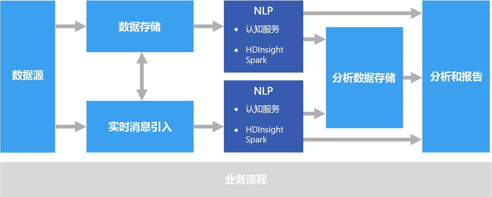

# 自然语言处理Natural language processing

自然语言处理 (NLP) 用于诸如情绪分析、主题检测、语言检测、关键短语提取和文档归类之类的任务。Natural language processing (NLP) is used for tasks such as sentiment analysis, topic detection, language detection, key phrase extraction, and document categorization.

## 何时使用此解决方案When to use this solution

NLP 可以用来对文档进行分类，例如将文档标记为敏感文档或垃圾文档。NLP can be use to classify documents, such as labeling documents as sensitive or spam. NLP 的输出可用于后续处理或搜索。The output of NLP can be used for subsequent processing or search. NLP 的另一个用途是通过识别文档中存在的实体对文本进行总结。Another use for NLP is to summarize text by identifying the entities present in the document. 这些实体还可以用来为文档标记关键字，从而启用基于内容的搜索和检索。These entities can also be used to tag documents with keywords, which enables search and retrieval based on content. 可以将实体以及说明每个文档中存在的重要主题的总结组合到主题中。Entities might be combined into topics, with summaries that describe the important topics present in each document. 可以使用检测到的主题来对文档进行分类以便导航，或者针对选定的主题枚举相关文档。The detected topics may be used to categorize the documents for navigation, or to enumerate related documents given a selected topic. NLP 的另一个用途是对文本进行情绪评分，以评估文档的正面或负面语气。Another use for NLP is to score text for sentiment, to assess the positive or negative tone of a document. 这些方法使用许多自然语言处理技术，例如：These approaches use many techniques from natural language processing, such as: 

- **分词器**。**Tokenizer**. 将文本拆分为字或短语。Splitting the text into words or phrases.
- **词干分解和词元化**。**Stemming and lemmatization**. 对字进行规范化，以便将不同的形式映射到具有相同含义的规范字。Normalizing words so that that different forms map to the canonical word with the same meaning. 例如，“running”和“ran”映射到“run”。For example, "running" and "ran" map to "run." 
- **实体提取**。**Entity extraction**. 识别文本中的主题。Identifying subjects in the text.
- **语音部件检测**。**Part of speech detection**. 将文本标识为谓词、名词、分词、谓词短语，等等。Identifying text as a verb, noun, participle, verb phrase, and so on.
- **句子边界检测**。**Sentence boundary detection**. 检测文本段落中的完整句子。Detecting complete sentences within paragraphs of text.

当使用 NLP 从自由格式文本提取信息和见解时，起点通常是存储在对象存储（例如 Azure 存储或 Azure Data Lake Store）中的原始文档。When using NLP to extract information and insight from free-form text, the starting point is typically the raw documents stored in object storage such as Azure Storage or Azure Data Lake Store. 

## 挑战Challenges

- 处理自由格式文本文档的集合在计算时通常需要消耗大量资源，而且非常耗时。Processing a collection of free-form text documents is typically computationally resource intensive, as well as being time intensive.
- 没有一种标准化的文档格式，可能非常难以使用自由格式文本处理来从文档中提取特定事实以稳定地获得准确结果。Without a standardized document format, it can be very difficult to achieve consistently accurate results using free-form text processing to extract specific facts from a document. 例如，想一想发票的文本表示形式&mdash;难以构建一个流程来准确地从任意数量的供应商那里提取发票编号和发票日期。For example, think of a text representation of an invoice&mdash;it can be difficult to build a process that correctly extracts the invoice number and invoice date for invoices across any number of vendors.

## 体系结构Architecture

在 NLP 解决方案中，可以对包含文本段落的文档执行自由格式文本处理。In an NLP solution, free-form text processing is performed against documents containing paragraphs of text. 总体体系结构可以是[批处理](../big-data/batch-processing.md)或[实时流处理](../big-data/real-time-processing.md)体系结构。The overall architecture can be a [batch processing](../big-data/batch-processing.md) or [real-time stream processing](../big-data/real-time-processing.md) architecture.

实际处理因所需的输出而异，但是就管道而言，可以采用批处理方式或实时方式来应用 NLP。The actual processing varies based on the desired outcome, but in terms of the pipeline, NLP may be applied in a batch or real-time fashion. 例如，可以对文本块使用情绪分析来生成情绪分数。For example, sentiment analysis can be used against blocks of text to produce a sentiment score. 可以通过对存储中的数据运行批处理来执行此操作，或者使用流经消息传递服务的较小数据块实时执行此操作。This can could be done by running a batch process against data in storage, or in real time using smaller chunks of data flowing through a messaging service.

## 技术选择Technology choices

- [自然语言处理Natural language processing](../technology-choices/natural-language-processing.md)