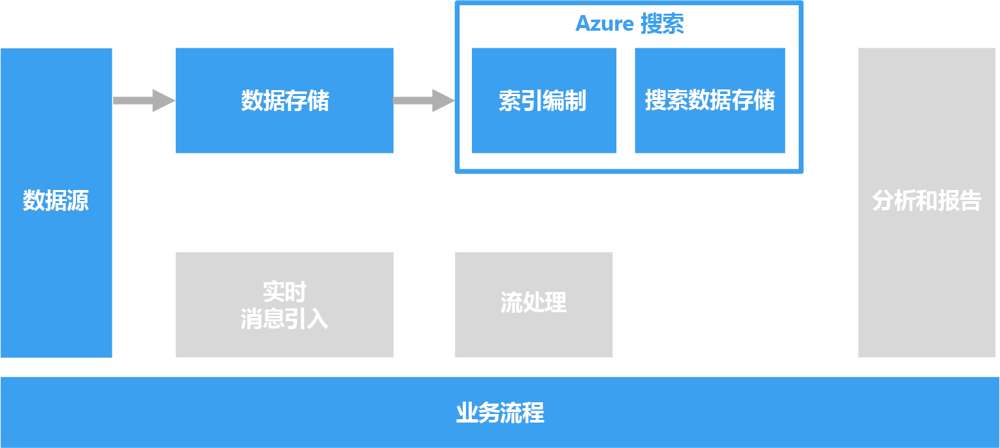

# 为搜索处理自由格式文本Processing free-form text for search

若要支持搜索，可以对包含文本段落的文档执行自由格式文本处理。To support search, free-form text processing can be performed against documents containing paragraphs of text.

文本搜索通过构造针对文档集合预先计算的专用索引进行工作。Text search works by constructing a specialized index that is precomputed against a collection of documents. 客户端应用程序提交包含搜索词的查询。A client application submits a query that contains the search terms. 查询返回一个结果集，其中包含根据每个文档与搜索条件的匹配程度排序的文档列表。The query returns a result set, consisting of a list of documents sorted by how well each document matches the search criteria. 搜索集还可能包括文档与条件进行匹配时所处的上下文，这使得应用程序能够突出显示文档中的匹配段落。The result set may also include the context in which the document matches the criteria, which enables the application to highlight the matching phrase in the document. 

自由格式文本处理可以基于大量的嘈杂文本数据生成有用的可操作数据。Free-form text processing can produce useful, actionable data from large amounts of noisy text data. 结果可以为非结构化文档提供定义完善的且可查询的结构。The results can give unstructured documents a well-defined and queryable structure.

## 挑战Challenges

- 处理自由格式文本文档的集合通常需要密集进行计算，而且非常耗时。Processing a collection of free-form text documents is typically computationally intensive, as well as time intensive.
- 为了高效地搜索自由格式文本，搜索索引应当支持基于具有相似构造的词语进行模糊搜索。In order to search free-form text effectively, the search index should support fuzzy search based on terms that have a similar construction. 例如，搜索索引是通过词元化和语言词干分解构建的，因此，对“run”的查询将与包含“ran”和“running”的文档匹配。For example, search indexes are built with lemmatization and linguistic stemming, so that queries for "run" will match documents that contain "ran" and "running."

## 体系结构Architecture

在大多数情况下，源文本文档将加载到对象存储，例如 Azure 存储或 Azure Data Lake Store。In most scenarios, the source text documents are loaded into object storage such as Azure Storage or Azure Data Lake Store. 例外情况是在 SQL Server 或 Azure SQL 数据库中使用全文搜索。An exception is using full text search within SQL Server or Azure SQL Database. 在这种情况下，文档数据加载到由数据库管理的表中。In this case, the document data is loaded into tables managed by the database. 一旦存储，将批量处理文档来创建索引。Once stored, the documents are processed in a batch to create the index.

## 技术选择Technology choices

用于创建搜索索引的选项包括 Azure 搜索、Elasticsearch 和基于 Solr 的 HDInsight。Options for creating a search index include Azure Search, Elasticsearch, and HDInsight with Solr. 这些技术每一种都可以基于文档集合来填充搜索索引。Each of these technologies can populate a search index from a collection of documents. Azure 搜索提供了索引器，它们可以自动针对从纯文本到 Excel 和 PDF 格式的文档填充索引。Azure Search provides indexers that can automatically populate the index for documents ranging from plain text to Excel and PDF formats. 在 HDInsight 上，Apache Solr 可以为许多类型（包括纯文本、Word 和 PDF）的二进制文件编制索引。On HDInsight, Apache Solr can index binary files of many types, including plain text, Word, and PDF. 在构造索引后，客户端可以通过 REST API 访问搜索接口。Once the index is constructed, clients can access the search interface by means of a REST API. 

如果文本数据存储在 SQL Server 或 Azure SQL 数据库中，则可以使用数据库中内置的全文索引。If your text data is stored in SQL Server or Azure SQL Database, you can use the full-text search that is built into the database. 数据库可以基于同一数据库中存储的文本、二进制或 XML 数据来填充索引。The database populates the index from text, binary, or XML data stored within the same database. 客户端使用 T-SQL 查询进行搜索。Clients search by using T-SQL queries. 

有关详细信息，请参阅[搜索数据存储](../technology-choices/search-options.md)。For more information, see [Search data stores](../technology-choices/search-options.md).
