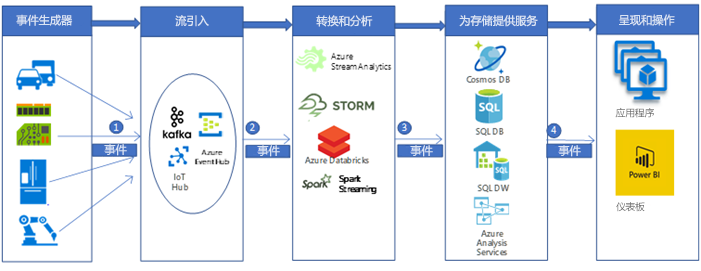

# 引入和处理实时汽车 IoT 数据

本示例方案生成实时数据引入和处理管道，用于将 IoT 设备（常规传感器）发出的消息引入到 Azure 中的大数据分析平台并对其进行处理。 车载远程通信数据引入和处理平台是创建联网汽车解决方案的关键所在。 此具体方案是由汽车远程通信数据引入和处理系统促成的。 但是，使用传感器来管理和监视复杂系统的许多行业（例如智能建筑、通信、制造、零售和医疗保健）都采用这种设计模式。

本示例演示从汽车中安装的 IoT 设备实时引入和处理消息数据的管道。 IoT 设备和传感器生成数千甚至数百万条消息（或事件）。 捕获并分析这些消息可以获得有价值的见解并采取相应的措施。 例如，在配备远程通信设备的汽车中，如果我们能够实时捕获设备 (IoT) 消息，则可以监视车辆的实际位置、规划优化的路线、为驾驶员提供辅助，并为远程通信相关的行业（例如汽车保险）提供支持。

本示例演示假设某家汽车制造公司想要创建一个实时系统，用于从远程通信设备引入和处理消息。 该公司的目标包括：
* 从车辆传感器和设备实时引入和存储数据。
* 分析消息以了解车辆位置，并分析不同类型的传感器（例如引擎相关的传感器和环境相关的传感器）发出的其他信息。
* 分析后存储数据，供其他下游组件进行处理，以提供可行的见解（例如，在发生事故时，保险机构可能想要了解当时发生了什么情况，等等。）

## 相关用例

其他相关用例包括：

* 车辆保养提醒和警报。
* 为乘客提供基于位置的服务（例如 SOS）。
* 自主车辆（自动驾驶）。

## 体系结构

在典型的大数据处理管道实现中，数据从左向右流动。 在此实时大数据处理管道中，数据按如下所述流经解决方案：

1. IoT 数据源生成的事件以消息流的形式通过 Azure HDInsight Kafka 发送到流引入层。 HDInsight Kafka 在主题中将数据流存储一段时间（此时间可配置）。
2. Kafka 使用者（即 Azure Databricks）从 Kafka 主题中实时拾取消息，以基于业务逻辑处理数据，然后将数据发送到“服务”层进行存储。
3. 然后，Azure Cosmos DB、Azure SQL 数据仓库或 Azure SQL 数据库等下游存储服务将成为呈现层和操作层的数据源。
4. 业务分析师可以使用 Microsoft Power BI 来分析数据仓库数据。 也可以基于服务层构建其他应用程序。 例如，我们可以基于服务层数据公开 API 供第三方使用。

### 组件
使用以下 Azure 组件来引入、处理并存储 IoT 设备生成的事件（数据或消息），以做进一步的分析、呈现和处理：
* [Apache Kafka on HDInsight](/azure/hdinsight/kafka/apache-kafka-introduction) 位于引入层。 使用 Kafka 生成者 API 将数据写入 Kafka 主题。
* [Azure Databricks](/services/databricks) 位于转换和分析层。 Databricks Notebook 实现 Kafka 使用者 API，以从 Kafka 主题读取数据。
* [Azure Cosmos DB](/services/cosmos-db)、[Azure SQL 数据库](/azure/sql-database/sql-database-technical-overview)和 Azure SQL 数据仓库位于“服务”存储层，其中的 Azure Databricks 可以通过数据连接器写入数据。
* [Azure SQL 数据仓库](/azure/sql-data-warehouse/sql-data-warehouse-overview-what-is)是用于存储和分析大型数据集的分布式系统。 它使用大规模并行处理 (MPP)，因此很适合用于运行高性能分析。
* [Power BI](https://docs.microsoft.com/power-bi) 是一套业务分析工具，可以分析数据和分享见解。 Power BI 可以查询 Analysis Services 中存储的语义模型，或者直接查询 SQL 数据仓库。
* 连接到 [Azure Databricks](https://azure.microsoft.com/services/databricks) 时，[Azure Active Directory (Azure AD)](/azure/active-directory) 对用户进行身份验证。 如果我们根据 Azure SQL 数据仓库数据在 [Analysis Services](/azure/analysis-services) 中基于模型生成多维数据集，则可以使用 AAD 通过 Power BI 连接到 Analysis Services 服务器。 数据工厂还可以使用 Azure AD 通过服务主体或托管服务标识 (MSI) 对 SQL 数据仓库进行身份验证。
* 可以基于服务层中存储的数据，使用 [Azure 应用服务](/azure/app-service/app-service-web-overview)（具体而言是 [API 应用](/services/app-service/api)）向第三方公开数据。

## 备选项

可以使用其他 Azure 组件实现更通用化的大数据管道。
* 在流引入层，可以使用 [IoT 中心](https://azure.microsoft.com/services/iot-hub)或[事件中心](https://azure.microsoft.com/services/event-hubs)而不是[HDInsight Kafka](/azure/hdinsight/kafka/apache-kafka-introduction) 来引入数据。
* 在转换和分析层，可以使用 [HDInsight Storm](/azure/hdinsight/storm/apache-storm-overview)、[HDInsight Spark](/azure/hdinsight/spark/apache-spark-overview) 或 [Azure 流分析](https://azure.microsoft.com/services/stream-analytics)。
* [Analysis Services](/azure/analysis-services) 为数据提供语义模型。 分析数据时，它还可以提高系统性能。 可以基于 Azure 数据仓库数据构建模型。

## 注意事项

此体系结构中的技术是根据处理事件所需的规模、服务的 SLA、成本管理和组件的易管理性选择的。
* 托管的 [HDInsight Kafka](/azure/hdinsight/kafka/apache-kafka-introduction) 附带 99.9% 的 SLA，并与 Azure 托管磁盘集成
* [Azure Databricks](/azure/azure-databricks/what-is-azure-databricks) 一开始就针对云中的性能和成本效益做了优化。 Databricks 运行时为 Apache Spark 工作负荷增加了多个关键功能，在提高 Azure 中运行的工作负荷性能的同时，还能将成本降低 10 到 100 倍。这些功能包括：
* Azure Databricks 与以下 Azure 数据库和存储深度集成：[Azure SQL 数据仓库](/azure/sql-data-warehouse)、[Azure Cosmos DB](https://azure.microsoft.com/services/cosmos-db)、[Azure Data Lake Storage](https://azure.microsoft.com/services/storage/data-lake-storage) 和 [Azure Blob 存储](https://azure.microsoft.com/services/storage/blobs)。
    * 自动缩放和自动终止 Spark 群集，以自动将成本降至最低。
    * 性能优化，包括缓存、索引和高级查询优化，与云中或本地环境中的传统 Apache Spark 部署相比，可将性能提升 10 到 100 倍。
    * 与 Azure Active Directory 集成后，可以使用 Azure Databricks 运行基于 Azure 的完整解决方案。
    * 使用 Azure Databricks 中基于角色的访问可以精细地向用户授予对笔记本、群集、作业和数据的权限。
    * 附带企业级 SLA。
* Azure Cosmos DB 是 Microsoft 提供的全球分布式多模型数据库。 Azure Cosmos DB 是以全球分布和横向缩放为核心全新构建的。 通过透明地缩放和复制数据（无论用户位于何处），在任意数量的 Azure 区域提供统包全球分布。 可灵活缩放全球范围内的吞吐量和存储，只为需要的吞吐量和存储付费。
* SQL 数据仓库的大规模并行处理体系结构提供可伸缩性和高性能。
* Azure SQL 数据仓库提供有保障的 SLA，以及实现高可用性的建议做法。
* 当分析活动较少时，公司可以按需缩减 Azure SQL 数据仓库，以减少甚至暂停计算资源，从而较低成本。
* Azure SQL 数据仓库安全模型通过 Azure AD 或 SQL Server 身份验证和加密提供连接安全性、身份验证和授权。

## 定价

请查看 [Azure Databricks 定价](https://azure.microsoft.com/pricing/details/databricks)和 [Azure HDInsight 定价](https://azure.microsoft.com/pricing/details/hdinsight)，并通过 Azure 定价计算器了解[数据仓库方案的定价示例](https://azure.com/e/b798fb70c53e4dd19fdeacea4db78276)。 请调整值，查看要求如何影响成本。
* [Azure HDInsight](/azure/hdinsight) 是完全托管的云服务，使用它可以轻松、快捷、经济地处理大量数据。
* [Azure Databricks](https://azure.microsoft.com/services/databricks) 在多个 [VM 实例](https://azure.microsoft.com/pricing/details/databricks/#instances)上为数据分析工作流量身打造了 2 个不同的工作负荷：借助数据工程工作负荷，数据工程师可轻松生成和执行作业；借助数据分析工作负荷，数据科学家可轻松以交互方式探索、直观显示、操作和共享数据及见解。
* [Azure Cosmos DB](https://azure.microsoft.com/services/cosmos-db) 保证全球任意位置在 99% 的时间内的延迟不超过 10 毫秒，提供[多种定义明确的一致性模型](/azure/cosmos-db/consistency-levels)来微调性能，并保证多宿主功能的高可用性 - 所有功能均有全面领先的[服务级别协议](https://azure.microsoft.com/support/legal/sla/cosmos-db) (SLA) 作为保障。
* [Azure SQL 数据仓库](https://azure.microsoft.com/pricing/details/sql-data-warehouse/gen2)允许独立缩放计算和存储级别。 计算资源按小时计费，可按需缩放或暂停这些资源。 存储资源按 TB 计费，因此，引入的数据越多，费用就越高。
* 可在开发人员层、基本层和标准层使用 [Analysis Services](https://azure.microsoft.com/pricing/details/analysis-services)。 实例按查询处理单位 (QPU) 和可用内存定价。 为了控制成本，请尽量减少运行的查询数、查询处理的数据量以及查询的运行频率。
* [Power BI](https://powerbi.microsoft.com/pricing) 提供不同的产品选项来满足不同的要求。 [Power BI Embedded](https://azure.microsoft.com/pricing/details/power-bi-embedded) 提供基于 Azure 的选项用于在应用程序中嵌入 Power BI 功能。 上述定价示例包括 Power BI Embedded 实例。

## 后续步骤

* 请查看包含大数据管道流的[实时分析](https://azure.microsoft.com/solutions/architecture/real-time-analytics)参考体系结构。
* 请查看[针对大数据的高级分析](https://azure.microsoft.com/solutions/architecture/advanced-analytics-on-big-data)参考体系结构，以了解如何借助不同的 Azure 组件来生成大数据管道。
* 请阅读[实时处理](/azure/architecture/data-guide/big-data/real-time-processing) Azure 文档，以快速了解如何借助不同的 Azure 组件来实时处理数据流。
* 在 [Azure 数据体系结构指南](/azure/architecture/data-guide)中查找有关数据管道、数据仓库、联机分析处理 (OLAP) 和大数据的综合体系结构指导。
