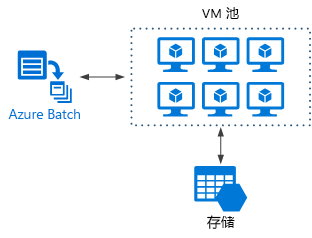
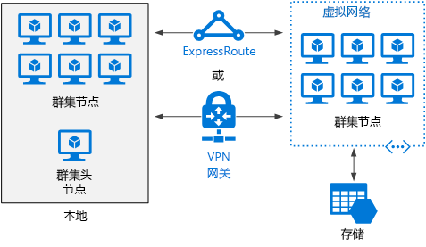

# 大计算的体系结构样式Big compute architecture style

术语“大计算”指的是需要大量核心的大规模工作负载，核心数量通常以数百或数千计。The term *big compute* describes large-scale workloads that require a large number of cores, often numbering in the hundreds or thousands. 方案包括图像渲染、流体动力学、金融风险建模、石油勘探、药物设计和工程应力分析等等。Scenarios include image rendering, fluid dynamics, financial risk modeling, oil exploration, drug design, and engineering stress analysis, among others.

以下是大计算应用程序的一些典型特征：Here are some typical characteristics of big compute applications:

- 工作可拆分为离散的任务，这些任务可以跨多个核心同时运行。The work can be split into discrete tasks, which can be run across many cores simultaneously.
- 各任务都是有限的。Each task is finite. 接收一些输入，执行某些处理操作，然后生成输出。It takes some input, does some processing, and produces output. 整个应用程序的运行时间（从数分钟到数天）有限。The entire application runs for a finite amount of time (minutes to days). 常见模式是突然预配大量核心，在应用程序完成后，核心数量减少到零。A common pattern is to provision a large number of cores in a burst, and then spin down to zero once the application completes. 
- 应用程序不需要全天候运行。The application does not need to stay up 24/7. 但是，系统必须处理节点故障或应用程序故障。However, the system must handle node failures or application crashes.
- 对于某些应用程序，任务是独立的且可并行运行。For some applications, tasks are independent and can run in parallel. 在其他情况下，任务紧密耦合，这意味着它们必须交互或交换中间结果。In other cases, tasks are tightly coupled, meaning they must interact or exchange intermediate results. 在该情况下，请考虑使用 InfiniBand 和远程直接内存访问 (RDMA) 等高速联网技术。In that case, consider using high-speed networking technologies such as InfiniBand and remote direct memory access (RDMA). 
- 可以根据工作负载，使用不同大小的计算密集型 VM（H16r、H16mr 和 A9）。Depending on your workload, you might use compute-intensive VM sizes (H16r, H16mr, and A9).

## 此体系结构适用的情况When to use this architecture

- 模拟和数字运算等计算密集型操作。Computationally intensive operations such as simulation and number crunching.
- 计算密集型模拟，须拆分到多台计算机（10 - 1000 台）的 CPU 中。Simulations that are computationally intensive and must be split across CPUs in multiple computers (10-1000s).
- 对一台计算机的内存要求过高的模拟，须拆分到多台计算机中。Simulations that require too much memory for one computer, and must be split across multiple computers.
- 长时间运行的计算，在一台计算机上完成计算会花费过长时间。Long-running computations that would take too long to complete on a single computer.
- 必须运行 100 次或 1000 次的较小型计算，如 Monte Carlo 模拟。Smaller computations that must be run 100s or 1000s of times, such as Monte Carlo simulations.

## 优点Benefits

- 高性能和“[易并行][embarrassingly-parallel]”处理。High performance with "[embarrassingly parallel][embarrassingly-parallel]" processing.
- 可以利用数百或数千个计算机核心更快地解决大型问题。Can harness hundreds or thousands of computer cores to solve large problems faster.
- 可以通过 InfiniBand 高速专用网络，访问高性能专用硬件。Access to specialized high-performance hardware, with dedicated high-speed InfiniBand networks.
- 可以根据工作需要预配 VM，然后再将它们关闭。You can provision VMs as needed to do work, and then tear them down. 

## 挑战Challenges

- 管理 VM 基础结构。Managing the VM infrastructure.
- 管理数字运算量。Managing the volume of number crunching. 
- 及时预配数千个核心。Provisioning thousands of cores in a timely manner.
- 对于紧密耦合的任务，添加更多核心可能会减少返回量。For tightly coupled tasks, adding more cores can have diminishing returns. 可能需要进行试验来找到最适宜的核心数。You may need to experiment to find the optimum number of cores.

## 使用 Azure Batch 的大计算Big compute using Azure Batch

[Azure Batch][batch] 是一个托管服务，适用于运行大规模高性能计算 (HPC) 应用程序。[Azure Batch][batch] is a managed service for running large-scale high-performance computing (HPC) applications.

使用 Azure Batch 配置 VM 池并上传应用程序和数据文件。Using Azure Batch, you configure a VM pool, and upload the applications and data files. 然后 Batch 服务预配 VM、将任务分配给 VM、运行任务并监视进度。Then the Batch service provisions the VMs, assign tasks to the VMs, runs the tasks, and monitors the progress. Batch 可以根据工作负载横向扩展 VM。Batch can automatically scale out the VMs in response to the workload. Batch 还提供作业计划。Batch also provides job scheduling.

 

## 在虚拟机上运行的大计算Big compute running on Virtual Machines

可以使用 [Microsoft HPC Pack][hpc-pack] 管理 VM 群集以及计划并监视 HPC 作业。You can use [Microsoft HPC Pack][hpc-pack] to administer a cluster of VMs, and schedule and monitor HPC jobs. 在此方法中，必须预配并管理 VM 和网络基础结构。With this approach, you must provision and manage the VMs and network infrastructure. 如果有现有的 HPC 工作负载且要将其部分或全部移动到 Azure，请考虑使用此方法。Consider this approach if you have existing HPC workloads and want to move some or all it to Azure. 可将整个 HPC 群集移动到 Azure，或本地保存 HPC 群集但对迸发容量使用 Azure。You can move the entire HPC cluster to Azure, or keep your HPC cluster on-premises but use Azure for burst capacity. 有关详细信息，请参阅[适用于大规模计算工作负载的 Batch 和 HPC 解决方案][batch-hpc-solutions]。For more information, see [Batch and HPC solutions for large-scale computing workloads][batch-hpc-solutions].

### 部署到 Azure 的 HPC PackHPC Pack deployed to Azure

在此方案中，HPC 群集完全是在 Azure 中创建的。In this scenario, the HPC cluster is created entirely within Azure.

 
 
头节点向群集提供管理和作业计划服务。The head node provides management and job scheduling services to the cluster. 对于紧密耦合的任务，所使用的 RDMA 网络需提供极高的带宽，并在 VM 之间提供低延迟的通信。For tightly coupled tasks, use an RDMA network that provides very high bandwidth, low latency communication between VMs. 有关详细信息，请参阅[在 Azure 中部署 HPC Pack 2016 群集][deploy-hpc-azure]。For more information see [Deploy an HPC Pack 2016 cluster in Azure][deploy-hpc-azure].

### 将 HPC 群集迸发到 AzureBurst an HPC cluster to Azure

在此方案中，组织在本地运行 HPC Pack，并对迸发容量使用 Azure VM。In this scenario, an organization is running HPC Pack on-premises, and uses Azure VMs for burst capacity. 群集的头节点位于本地。The cluster head node is on-premises. ExpressRoute 或 VPN 网关将本地网络连接到 Azure VNet。ExpressRoute or VPN Gateway connects the on-premises network to the Azure VNet.

 

[batch]: /azure/batch/
[batch-hpc-solutions]: /azure/batch/batch-hpc-solutions
[deploy-hpc-azure]: /azure/virtual-machines/windows/hpcpack-2016-cluster
[embarrassingly-parallel]: https://en.wikipedia.org/wiki/Embarrassingly_parallel
[hpc-pack]: https://technet.microsoft.com/library/cc514029

 
