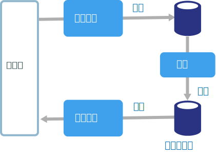
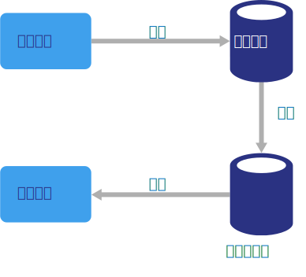

# CQRS 体系结构样式

命令和查询责任分离 (CQRS) 是将读取操作与写入操作分离的体系结构样式。 

在传统的体系结构中，使用同一数据模型查询和更新数据库。 这十分简单，非常适用于基本的 CRUD 操作。 但是，在更复杂的应用程序中，此方法会变得难以操作。 例如，在读取方面，应用程序可能执行大量不同的查询，返回具有不同形状的数据传输对象 (DTO)。 对象映射可能会变得复杂。 在写入方面，模型可能实施复杂验证和业务逻辑。 结果，模型执行太多操作，过度复杂。

另一潜在问题是，读取和写入工作负载通常是非对称的，两者的性能和缩放需求存在显著差异。 

CQRS 将读取和写入分离到单独的模型中，使用命令更新数据，使用查询读取数据，从而解决上述问题。

- 命令应基于任务，而非以数据为中心。 （“预订酒店房间”，而不是“将预订状态设置为已预订”。）可将命令放置于队列上供异步处理，而不是同步处理。

- 查询从不修改数据库。 查询返回的 DTO 不封装任何域知识。

为更好地实现隔离，可将读取数据与写入数据通过物理方式分离。 在此情况下，读取数据库可使用自己的已针对查询进行优化的数据架构。 例如，它可以存储数据的[具体化视图][materialized-view]，从而避免复杂联接或复杂 O/RM 映射。 它甚至可能使用不同类型的数据存储。 例如，写入数据库可能是关系数据库，而读取数据库是文档数据库。

如果使用了单独的读取和写入数据库，必须将它们保持同步。通常情况下，每次更新数据库时写模型会发布一个事件，从而实现同步。 必须在一个事务中更新数据库和发布事件。 

某些 CQRS 实现使用[事件溯源模式][event-sourcing]。 在此模式中，应用程序状态存储为事件序列。 每个事件表示对数据所作的一系列更改。 通过重播事件构造当前状态。 在 CQRS 上下文中，事件溯源的一个好处是，可以使用相同的事件通知其他组件 &mdash; 特别是通知读模型。 读模型使用事件创建当前状态的快照，这对查询而言更高效。 但是，事件溯源增加了设计的复杂度。

## 何时使用此架构

请考虑对协作域使用 CQRS，在该域中，多名用户访问相同的数据，尤其当读取和写入工作负载非对称时。

CQRS 不是适用于整个系统的顶层体系结构。 仅将 CQRS 应用于分离读写行为具有显著价值的子系统。 否则，会增加复杂性，却无任何好处。

## 优点

- **独立缩放**。 CQRS 允许读取和写入工作负载独立缩放，这可能会减少锁争用。
- **优化的数据架构。**  读取端可使用针对查询优化的架构，写入端可使用针对更新优化的架构。  
- **安全性**。 更轻松地确保仅正确的域实体对数据执行写入操作。
- **将问题分离**。 分离读取和写入端可使模型更易维护且更灵活。 大多数复杂的业务逻辑被分到写模型。 读模型会变得相对简单。
- **查询更简单**。 通过将具体化视图存储在读取数据库中，应用程序可在查询时避免复杂联接。

## 挑战

- **复杂性**。 CQRS 的基本理念十分简单。 但它可能导致应用程序的设计更为复杂，尤其在包含事件溯源模式时。

- **消息**。 虽然 CQRS 不需要消息，但它通常会使用消息处理命令和发布更新事件。 在此情况下，应用程序必须处理消息失败或重复的消息。 

- **最终一致性**。 如果分离读取和写入数据库，读取数据可能会过时。 

## 最佳实践

- 有关实现 CQRS 的详细信息，请参阅 [CQRS 模式][cqrs-pattern]。

- 请考虑使用[事件溯源][event-sourcing]模式，避免出现更新冲突。

- 请考虑对读模型使用[具体化视图模式][materialized-view]，以便优化查询架构。

## 微服务中的 CQRS

CQRS 尤其适用于[微服务体系结构][microservices]。 微服务的一项原则是服务不能直接访问另一服务的数据存储。

在下图中，服务 A 写入到数据存储，服务 B 保存数据的具体化视图。 服务 A 在每次写入到数据存储时发布事件。 服务 B 订阅该事件。

<!-- links -->

[cqrs-pattern]: ../../patterns/cqrs.md
[event-sourcing]: ../../patterns/event-sourcing.md
[materialized-view]: ../../patterns/materialized-view.md
[microservices]: ./microservices.md
