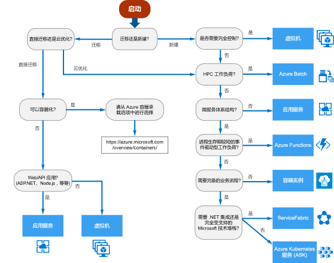

# Azure 计算服务的决策树Decision tree for Azure compute services

Azure 提供多种方式来托管应用程序代码。Azure offers a number of ways to host your application code. 术语“计算”指的是计算资源（应用程序在这些资源上运行）的承载模型。The term *compute* refers to the hosting model for the computing resources that your application runs on. 以下流程图将会帮助你选择应用程序的计算服务。The following flowchart will help you to choose a compute service for your application. 该流程图将引导你创建一组关键决策条件用于访问建议。The flowchart guides you through a set of key decision criteria to reach a recommendation. 

**请将此流程图视为起点。****Treat this flowchart as a starting point.** 每个应用程序有独特的要求，因此请将该建议作为起点。Every application has unique requirements, so use the recommendation as a starting point. 然后执行更详细的评估，例如查看：Then perform a more detailed evaluation, looking at aspects such as:
 
- 特征集Feature set
- [服务限制Service limits](/azure/azure-subscription-service-limits)
- [成本Cost](https://azure.microsoft.com/pricing/)
- [SLASLA](https://azure.microsoft.com/support/legal/sla/)
- [区域可用性Regional availability](https://azure.microsoft.com/global-infrastructure/services/)
- 开发人员生态系统和团队技能Developer ecosystem and team skills
- [计算比较表Compute comparison tables](./compute-comparison.md)

如果应用程序包括多个工作负荷，请单独评估每个工作负荷。If your application consists of multiple workloads, evaluate each workload separately. 完整的解决方案可能会合并两个或更多个计算服务。A complete solution may incorporate two or more compute services.

