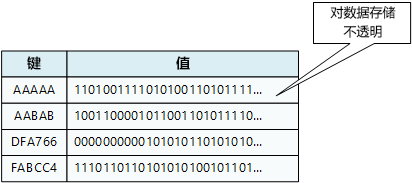
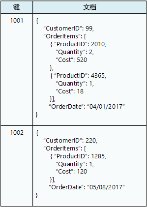
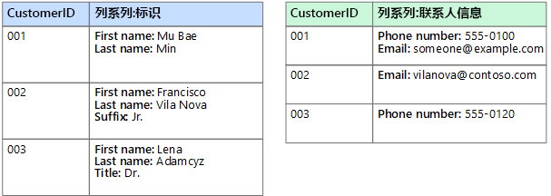

# 选择适当的数据存储Choose the right data store

现代业务系统必须管理日益庞大的数据。Modern business systems manage increasingly large volumes of data. 数据可能是从外部服务引入、由系统本身生成或者用户创建的。Data may be ingested from external services, generated by the system itself, or created by users. 这些数据集可能具有截然不同的特征和处理要求。These data sets may have extremely varied characteristics and processing requirements. 企业可以使用数据来评估趋势、触发业务过程、审核其运营、分析客户行为，等等。Businesses use data to assess trends, trigger business processes, audit their operations, analyze customer behavior, and many other things. 

这种异构性意味着单一数据存储通常不是最佳的方案。This heterogeneity means that a single data store is usually not the best approach. 相反，更好的做法往往将不同类型的数据存储在不同的数据存储中，每个数据存储专注于处理特定的工作负荷或使用模式。Instead, it's often better to store different types of data in different data stores, each focused towards a specific workload or usage pattern. 术语“多语言持久性”用于描述混合使用多种数据存储技术的解决方案。The term *polyglot persistence* is used to describe solutions that use a mix of data store technologies.

根据要求选择适当的数据存储是一项关键设计决策。Selecting the right data store for your requirements is a key design decision. 我们真正可以从数百种 SQL 和 NoSQL 数据库实现中进行选择。There are literally hundreds of implementations to choose from among SQL and NoSQL databases. 数据存储通常根据它们将数据结构化的方式以及支持的操作类型分类。Data stores are often categorized by how they structure data and the types of operations they support. 本文介绍几种最常见的存储模型。This article describes several of the most common storage models. 请注意，某种特定的数据存储技术可能支持多个存储模型。Note that a particular data store technology may support multiple storage models. 例如，关系数据库管理系统 (RDBMS) 可能还支持键/值或图形存储。For example, a relational database management systems (RDBMS) may also support key/value or graph storage. 实际上，行业中出现了一种所谓“多模”支持的总体趋势，即单个数据库系统支持多个模型。In fact, there is a general trend for so-called *multimodel* support, where a single database system supports several models. 但是，在较高层面上了解不同的模型仍然很有帮助。But it's still useful to understand the different models at a high level. 

并非给定类别中的所有数据存储都提供相同的功能集。Not all data stores in a given category provide the same feature-set. 大多数数据存储提供服务器端功能用于查询和处理数据。Most data stores provide server-side functionality to query and process data. 有时，此功能已内置在数据存储引擎中。Sometimes this functionality is built into the data storage engine. 在其他情况下，数据存储和处理功能是分离的，另外，可能还有一些选项可用于执行处理和分析。In other cases, the data storage and processing capabilities are separated, and there may be several options for processing and analysis. 数据存储还支持不同的编程和管理接口。Data stores also support different programmatic and management interfaces. 

一般而言，应该先考虑哪种存储模型最符合要求。Generally, you should start by considering which storage model is best suited for your requirements. 然后，根据功能集、成本和易管理性等因素，考虑该类别中的特定数据存储。Then consider a particular data store within that category, based on factors such as feature set, cost, and ease of management.

## 关系数据库管理系统Relational database management systems

关系数据库可将数据组织成一系列包含行与列的二维表。Relational databases organize data as a series of two-dimensional tables with rows and columns. 每个表包含自身的列，表中的每个行具有相同的列集。Each table has its own columns, and every row in a table has the same set of columns. 此模型以数学为基础，大多数供应商提供结构化查询语言 (SQL) 的方言用于检索和管理数据。This model is mathematically based, and most vendors provide a dialect of the Structured Query Language (SQL) for retrieving and managing data. RDBMS 通常实施一个事务一致性机制，该机制遵守用于更新信息的 ACID（原子性、一致性、隔离性、持久性）模型。An RDBMS typically implements a transactionally consistent mechanism that conforms to the ACID (Atomic, Consistent, Isolated, Durable) model for updating information. 

RDBMS 通常支持写时架构模型，其中的数据结构已提前定义，所有读取或写入操作必须使用该架构。An RDBMS typically supports a schema-on-write model, where the data structure is defined ahead of time, and all read or write operations must use the schema. 这与大多数 NoSQL 数据存储相反，尤其是键/值类型方面，其中，读时架构模型假设客户端针对传出数据库的数据施加其自身的解释性架构，并且对写入的数据格式不可知。This is in contrast to most NoSQL data stores, particularly key/value types, where the schema-on-read model assumes that the client will be imposing its own interpretive schema on data coming out of the database, and is agnostic to the data format being written.

当强一致性保证很重要时，RDBMS 非常有用 &mdash; 其中的所有更改都是原子性的，事务始终可让数据保持一致状态。An RDBMS is very useful when strong consistency guarantees are important &mdash; where all changes are atomic, and transactions always leave the data in a consistent state. 但是，底层结构会将存储和处理工作负荷分散在不同的计算机之间，因此不利于横向扩展。However, the underlying structures do not lend themselves to scaling out by distributing storage and processing across machines. 此外，必须遵循规范化过程将 RDBMS 中存储的信息放入关系结构。Also, information stored in an RDBMS, must be put into a relational structure by following the normalization process. 尽管此过程易于理解，但可能导致效率低下，因为需要在单独的表中将逻辑实体拆解为实体，然后在运行查询时重组数据。While this process is well understood, it can lead to inefficiencies, because of the need to disassemble logical entities into rows in separate tables, and then reassemble the data when running queries. 

相关的 Azure 服务：Relevant Azure service: 

- [Azure SQL 数据库][sql-db][Azure SQL Database][sql-db]
- [Azure Database for MySQL][mysql][Azure Database for MySQL][mysql]
- [Azure Database for PostgreSQL][postgres][Azure Database for PostgreSQL][postgres]

## 键/值存储Key/value stores

键/值存储实质上是一个大型哈希表。A key/value store is essentially a large hash table. 将每个数据值与唯一的键关联后，键/值存储会使用此键通过相应的哈希函数来存储数据。You associate each data value with a unique key, and the key/value store uses this key to store the data by using an appropriate hashing function. 选择的哈希函数可在整个数据存储中均匀分配哈希键。The hashing function is selected to provide an even distribution of hashed keys across the data storage. 

大多数键/值存储仅支持简单的查询、插入和删除操作。Most key/value stores only support simple query, insert, and delete operations. 若要修改某个值（修改一部分或整个值），应用程序必须覆盖整个值的现有数据。To modify a value (either partially or completely), an application must overwrite the existing data for the entire value. 在大多数实现中，读取或写入单个值是原子操作。In most implementations, reading or writing a single value is an atomic operation. 如果值较大，写入操作可能需要一段时间。If the value is large, writing may take some time. 

应用程序可将任意数据存储为一组值，不过，某些键/值存储会对值的最大大小施加限制。An application can store arbitrary data as a set of values, although some key/value stores impose limits on the maximum size of values. 存储的值对存储系统软件不透明。The stored values are opaque to the storage system software. 应用程序必须提供并解释所有架构信息。Any schema information must be provided and interpreted by the application. 从本质上讲，值是 Blob，键/值存储只是根据键检索或存储值。Essentially, values are blobs and the key/value store simply retrieves or stores the value by key. 

键/值存储已针对执行简单查找的应用程序进行高度优化，但不太适合用于需要跨不同键/值存储查询数据的系统。Key/value stores are highly optimized for applications performing simple lookups, but are less suitable for systems that need to query data across different key/value stores. 另外，对于必须按值执行查询，而不只是基于键执行查找的情况，键/值存储未经过优化。Key/value stores are also not optimized for scenarios where querying by value is important, rather than performing lookups based only on keys. 例如，对于关系数据库，可以使用 WHERE 子句查找记录，但键/值存储通常不会针对值提供此类查找功能。For example, with a relational database, you can find a record by using a WHERE clause, but key/values stores usually do not have this type of lookup capability for values.

单个键/值存储就具有极高的可伸缩性，因为数据存储可在独立计算机上的多个节点之间轻松分配数据。A single key/value store can be extremely scalable, as the data store can easily distribute data across multiple nodes on separate machines. 

相关的 Azure 服务：Relevant Azure services: 

- [Cosmos DB][cosmosdb][Cosmos DB][cosmosdb]
- [Azure Redis 缓存][redis-cache][Azure Redis Cache][redis-cache]

## 文档数据库Document databases

文档数据库在概念上类似于键/值存储，不过，它存储的是命名字段和数据的集合（称为文档），其中的每个存储项可能是简单的标量项，也可能是列表和子集合等复合元素。A document database is conceptually similar to a key/value store, except that it stores a collection of named fields and data (known as documents), each of which could be simple scalar items or compound elements such as lists and child collections. 可通过多种方式将文档字段中的数据编码，包括 XML、YAML、JSON、BSON，甚至存储为纯文本。The data in the fields of a document can be encoded in a variety of ways, including XML, YAML, JSON, BSON,or even stored as plain text. 与键/值存储不同，文档中的字段会向存储管理系统公开，使应用程序能够使用这些字段中的值查询和筛选数据。Unlike key/value stores, the fields in documents are exposed to the storage management system, enabling an application to query and filter data by using the values in these fields. 

通常，文档包含实体的整个数据。Typically, a document contains the entire data for an entity. 至于实体由哪些项构成，则取决于所用的应用程序。What items constitute an entity are application specific. 例如，实体可能包含客户和/或订单的详细信息。For example, an entity could contain the details of a customer, an order, or a combination of both. 单个文档可以包含要在 RDBMS 中多个关系表之间分散的信息。A single document may contain information that would be spread across several relational tables in an RDBMS. 

文档存储不要求所有文档具有相同的结构。A document store does not require that all documents have the same structure. 这种自由格式方法提供了极大的灵活性。This free-form approach provides a great deal of flexibility. 随着业务要求发生变化，应用程序可将不同的数据存储在文档中。Applications can store different data in documents as business requirements change.

应用程序可以使用文档键检索文档。The application can retrieve documents by using the document key. 文档键是文档的唯一标识符，通常已经过哈希处理，可帮助均匀分配数据。This is a unique identifier for the document, which is often hashed, to help distribute data evenly. 某些文档数据库可自动创建文档键。Some document databases create the document key automatically. 还有一些文档数据库允许指定要用作键的文档属性。Others enable you to specify an attribute of the document to use as the key. 应用程序还可以基于一个或多个字段的值查询文档。The application can also query documents based on the value of one or more fields. 有些文档数据库支持索引，从而有助于根据一个或多个已编制索引的字段快速查找文档。Some document databases support indexing to facilitate fast lookup of documents based on one or more indexed fields. 

许多文档数据库支持就地更新，使应用程序能够在不重写整个文档的情况下修改文档中特定字段的值。Many document databases support in-place updates, enabling an application to modify the values of specific fields in a document without rewriting the entire document. 基于单个文档中的多个字段执行的读取和写入操作通常是原子性的。Read and write operations over multiple fields in a single document are usually atomic.

相关的 Azure 服务：[Cosmos DB][cosmosdb]Relevant Azure service: [Cosmos DB][cosmosdb]

## 图形数据库Graph databases

图形数据库存储两种类型的信息：节点和边缘。A graph database stores two types of information, nodes and edges. 可将节点视为实体。You can think of nodes as entities. 边缘指定节点之间的关系。Edges which specify the relationships between nodes. 节点和边缘都可以包含一些属性用于提供有关该节点或边缘的信息（类似于表中的列）。Both nodes and edges can have properties that provide information about that node or edge, similar to columns in a table. 边缘还可以包含一个方向用于指示关系的性质。Edges can also have a direction indicating the nature of the relationship.

图形数据库的用途是让应用程序有效执行需遍历节点和边缘网络的查询，以及分析实体之间的关系。The purpose of a graph database is to allow an application to efficiently perform queries that traverse the network of nodes and edges, and to analyze the relationships between entities. 下图显示了一个已结构化为图形的组织人员数据库。The following diagram shows an organization's personnel database structured as a graph. 实体为员工和部门，边缘指示隶属关系以及员工所在的部门。The entities are employees and departments, and the edges indicate reporting relationships and the department in which employees work. 在此图形中，边缘上的箭头显示关系的方向。In this graph, the arrows on the edges show the direction of the relationships.
 

使用此结构可以简单直接地执行类似于“查找 Sarah 的直接或间接下属”或“谁与 John 在同一个部门工作？”的查询。This structure makes it straightforward to perform queries such as "Find all employees who report directly or indirectly to Sarah" or "Who works in the same department as John?" 对于包含大量实体和关系的大型图形，可以极快地执行非常复杂的分析。For large graphs with lots of entities and relationships, you can perform very complex analyses very quickly. 多个图形数据库提供一种可用于高效遍历关系网络的查询语言。Many graph databases provide a query language that you can use to traverse a network of relationships efficiently. 

相关的 Azure 服务：[Cosmos DB][cosmosdb]Relevant Azure service: [Cosmos DB][cosmosdb]

## 列系列数据库Column-family databases

列系列数据库将数据组织成行与列。A column-family database organizes data into rows and columns. 最简单形式的列系列数据库可能与关系数据库十分类似，至少在概念上是这样。In its simplest form, a column-family database can appear very similar to a relational database, at least conceptually. 列系列数据库的真正强大之处在于，它能够以非规范化方式将稀疏数据结构化。The real power of a column-family database lies in its denormalized approach to structuring sparse data. 

可将列系列将数据库视为使用行与列保存表格数据，但是，列已分割为称作“列系列”的组。You can think of a column-family database as holding tabular data with rows and columns, but the columns are divided into groups known as *column families*. 每个列系列保存一组逻辑相关的、通常以单元形式检索或处理的列。Each column family holds a set of columns that are logically related together and are typically retrieved or manipulated as a unit. 其他单独访问的数据可存储在单独的列系列中。Other data that is accessed separately can be stored in separate column families. 在列系列中，可以动态添加新列，行可以稀疏分布（即，行不需要包含每个列的值）。Within a column family, new columns can be added dynamically, and rows can be sparse (that is, a row doesn't need to have a value for every column).

下图显示了包含两个列系列（`Identity` 和 `Contact Info`）的示例。The following diagram shows an example with two column families, `Identity` and `Contact Info`. 在每个列系列中，单个实体的数据具有相同的行键。The data for a single entity has the same row key in each column-family. 此结构体现了列系列方法的重要优势，其中的列系列中任意给定对象的行可能动态变化，因此，这种形式的数据存储非常适合用于存储结构化的易失性数据。This structure, where the rows for any given object in a column family can vary dynamically, is an important benefit of the column-family approach, making this form of data store highly suited for storing structured, volatile data.

 

与键/值存储或文档数据库不同，大多数列系列数据库根据键顺序而不是通过计算哈希来存储数据。Unlike a key/value store or a document database, most column-family databases store data in key order, rather than by computing a hash. 许多实现允许基于列系列中的特定列创建索引。Many implementations allow you to create indexes over specific columns in a column-family. 使用索引可以根据列值而不是行键检索数据。Indexes let you retrieve data by columns value, rather than row key.

针对行执行的读取和写入操作通常是对单个列系列执行的原子操作，不过，某些实现可提供跨多个列系列的整行读写原子性。Read and write operations for a row are usually atomic with a single column-family, although some implementations provide atomicity across the entire row, spanning multiple column-families.

相关的 Azure 服务：[HDInsight 中的 HBase][hbase]Relevant Azure service: [HBase in HDInsight][hbase]

## 数据分析Data analytics

数据分析存储提供用于引入、存储和分析数据的大规模并行解决方案。Data analytics stores provide massively parallel solutions for ingesting, storing, and analyzing data. 此数据是使用无共享体系结构跨多个服务器分布的，可最大程度地提高可伸缩性和降低依赖性。This data is distributed across multiple servers using a share-nothing architecture to maximize scalability and minimize dependencies. 数据不太可能是静态的，因此这些存储必须能够处理多个流以不同格式发来的大量信息，同时能够继续处理新查询。The data is unlikely to be static, so these stores must be able to handle large quantities of information, arriving in a variety of formats from multiple streams, while continuing to process new queries. 

相关的 Azure 服务：Relevant Azure services:

- [SQL 数据仓库][sql-dw][SQL Data Warehouse][sql-dw]
- [Azure Data Lake][data-lake][Azure Data Lake][data-lake]

## 搜索引擎数据库Search Engine Databases  

搜索引擎数据库支持搜索外部数据存储和服务中保存的信息的功能。A search engine database supports the ability to search for information held in external data stores and services. 可以使用搜索引擎数据库为大量数据编制索引，并以接近实时的速度访问这些索引。A search engine database can be used to index massive volumes of data and provide near real-time access to these indexes. 尽管搜索引擎数据库广泛被认为与 Web 同义，但许多大型系统在其自身数据库的顶层使用搜索引擎数据库来提供结构化即席搜索功能。Although search engine databases are commonly thought of as being synonymous with the web, many large-scale systems use them to provide structured and ad-hoc search capabilities on top of their own databases.

搜索引擎数据库的主要特征是能够极快地存储信息和编制信息的索引，并针对搜索请求快速做出响应。The key characteristics of a search engine database are the ability to store and index information very quickly, and provide fast response times for search requests. 索引可以是多维的，且支持跨大量文本数据执行自由文本搜索。Indexes can be multi-dimensional and may support free-text searches across large volumes of text data. 可以使用由搜索引擎数据库触发的拉取模型或者使用由外部应用程序代码启动的推送模型来执行索引编制。Indexing can be performed using a pull model, triggered by the search engine database, or using a push model, initiated by external application code. 

搜索可以采用精确匹配或模糊匹配。Searching can be exact or fuzzy. 模糊搜索查找与一组字词匹配的文档，并计算它们的匹配程度。A fuzzy search finds documents that match a set of terms and calculates how closely they match. 某些搜索引擎还支持语言分析，此功能可根据同义词、类型扩展（例如，将 `dogs` 与 `pets` 匹配）和词干（将单词与同一个字根进行匹配）返回匹配结果。Some search engines also support linguistic analysis that can return matches based on synonyms, genre expansions (for example, matching `dogs` to `pets`), and stemming (matching words with the same root). 

相关的 Azure 服务：[Azure 搜索][search]Relevant Azure service: [Azure Search][search]

## 时序数据库Time Series Databases

时序数据是按时间组织的一组值，时序数据库是已针对此类数据进行优化的数据库。Time series data is a set of values organized by time, and a time series database is a database that is optimized for this type of data. 时序数据库必须支持极大量的写入，因为它们通常实时从大量源收集大量数据。Time series databases must support a very high number of writes, as they typically collect large amounts of data in real time from a large number of sources. 更新极少发生，而删除操作往往以批量操作的形式执行。Updates are rare, and deletes are often done as bulk operations. 尽管写入时序数据库的记录通常较小，但记录数量往往很大，并且总数据大小可能迅速增长。Although the records written to a time-series database are generally small,  there are often a large number of records, and total data size can grow rapidly.

时序数据库适合用于存储遥测数据。Time series databases are good for storing telemetry data. 方案包括 IoT 传感器或应用程序/系统计数器。Scenarios include IoT sensors or application/system counters.

相关的 Azure 服务：[时序见解][time-series]Relevant Azure service: [Time Series Insights][time-series]

## 对象存储Object storage  

经优化的对象存储适合用于存储和检索大型二进制对象（图像、文件、视频和音频流、大型应用程序数据对象和文档、虚拟机磁盘映像）。Object storage is optimized for storing and retrieving large binary objects (images, files, video and audio streams, large application data objects and documents, virtual machine disk images). 这些存储类型中的对象包括存储的数据、某些元数据，以及用于访问对象的唯一 ID。Objects in these store types are composed of the stored data, some metadata, and a unique ID for accessing the object. 使用对象存储可以管理极大量的非结构化数据。Object stores enables the management of extremely large amounts of unstructured data.  

相关的 Azure 服务：[Blob 存储][blob]Relevant Azure service: [Blob Storage][blob]

## 共享文件Shared files   

有时，使用简单的平面文件可能是存储和检索信息的最有效方法。Sometimes, using simple flat files can be the most effective means of storing and retrieving information. 使用文件共享可以跨网络访问文件。Using file shares enables files to be accessed across a network. 在提供了相应的安全和并发访问控制机制的前提下，以这种方法共享数据可让分布式服务提供高度可缩放的数据访问方式来执行基本的低级别操作，例如简单的读取和写入请求。Given appropriate security and concurrent access control mechanisms, sharing data in this way can enable distributed services to provide highly scalable data access for performing basic, low-level operations such as simple read and write requests.

相关的 Azure 服务：[文件存储][file-storage]Relevant Azure service: [File Storage][file-storage]

<!-- links -->

[blob]: https://azure.microsoft.com/services/storage/blobs/
[cosmosdb]: https://azure.microsoft.com/services/cosmos-db/
[data-lake]: https://azure.microsoft.com/solutions/data-lake/
[file-storage]: https://azure.microsoft.com/services/storage/files/
[hbase]: /azure/hdinsight/hdinsight-hbase-overview
[mysql]: https://azure.microsoft.com/services/mysql/
[postgres]: https://azure.microsoft.com/services/postgresql/
[redis-cache]: https://azure.microsoft.com/services/cache/
[search]: https://azure.microsoft.com/services/search/
[sql-db]: https://azure.microsoft.com/services/sql-database
[sql-dw]: https://azure.microsoft.com/services/sql-data-warehouse/
[time-series]: https://azure.microsoft.com/services/time-series-insights/
