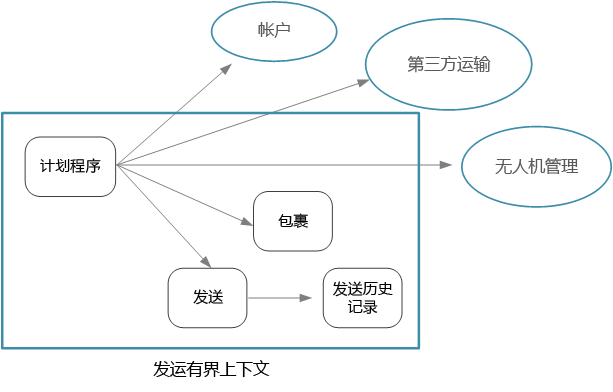

# 设计微服务：标识微服务边界

微服务的适当大小是什么？ 我们经常听到有人说，“不要太大，也不要太小”&mdash; 这句话绝对正确，但实际上没有太大意义。 但是，如果从一个精心设计的域模型着手，则规划出微服务就容易得多。

## 从域模型到微服务

在[前面的章节](./domain-analysis.md)中，我们为无人机交付应用程序定义了一组边界上下文。 然后，我们更详细地探讨了其中的某个边界上下文（“交货”边界上下文），并为该边界上下文标识了一组实体、聚合和域服务。

现在，我们可以从域模型转到应用程序设计。 下面介绍了一个可以从域模型派生微服务的方法。

1. 从边界上下文着手。 一般而言，微服务中的功能不应跨越多个边界上下文。 根据定义，边界上下文标记特定域模型的边界。 如果你发现微服务混用了不同的域模型，可能意味着需要回过头来优化域分析。

2. 接下来，查看域模型中的聚合。 聚合通常是微服务的适当候选项。 合理设计的聚合能够展示合理设计的微服务许多特征，例如：

    - 聚合派生自业务要求，而不是数据访问或消息传递等技术因素。  
    - 聚合应具有较高的功能内聚性。
    - 聚合是持久性边界。
    - 聚合应松散耦合。 
    
3. 域服务也是微服务的适当候选项。 域服务针对多个聚合执行无状态操作。 一个典型的示例是涉及多个微服务的工作流。 可在无人机交付应用程序中看到此示例。

4. 最后，考虑非功能性要求。 分析团队规模、数据类型、技术、可伸缩性要求、可用性要求和安全要求等因素。 这些因素可能导致需要进一步将微服务分解成两个或更多个较小服务，或执行相反的操作，即，将多个微服务合并成一个。 

在应用程序中标识微服务之后，请根据以下条件验证设计：

- 每个服务承担单一责任。
- 服务之间不存在琐碎的调用。 如果将功能拆分成两个服务会导致它们过度琐碎，该症状的原因可能是这些功能属于同一个服务。
- 每个服务足够小，独立工作的小团队即可生成它。
- 不存在需要以一致步调部署两个或更多个服务的相互依赖关系。 应该始终可以在不重新部署其他任何服务的情况下部署某个服务。
- 服务未紧密耦合，可独立演变。
- 服务边界不会造成数据一致性或完整性方面的问题。 有时，必须通过将功能放入单个微服务来保持数据一致性。 话虽如此，但应该是否确实需要强一致性。 可通过某些策略来解决分布式系统中的最终一致性，分解服务的好处通常比管理最终一致性所存在的挑战更具效益。

最重要的是，必须追求实用，并记住域驱动的设计是一个迭代过程。 如果有疑问，可以从更粗粒度的微服务入手。 将微服务拆分成两个较小服务比跨多个现有微服务重构功能更方便。
  
## 无人机交付：定义微服务

回顾一下，前面开发团队已标识四个聚合（“交付”、“包裹”、“无人机”和“帐户”）和两个域服务（“计划程序”和“监督程序”）。 

“交付”和“包裹”是微服务的突出候选项。 “计划程序”和“监督程序”协调其他微服务执行的活动，因此，将这些域服务实施为微服务比较有利。  

“无人机”和“帐户”比较特别，它们属于其他边界上下文。 一种做法是让“计划程序”直接调用“无人机”和“帐户”边界上下文。 另一种做法是在“交货”边界上下文中创建“无人机”和“帐户”微服务。 这些微服务通过公开更适合“交货”上下文的 API 或数据架构，在边界上下文之间充当中介。

“无人机”和“帐户”边界上下文的详细信息超出了本指南的范畴，因此我们在参考实现中创建了它们的模拟服务。 但在此情况下，需考虑一些因素：

- 直接调入其他边界上下文会产生多大的网络开销？ 

- 其他边界上下文的数据架构是否适用于此上下文，或者，专门针对此边界上下文定制一个架构是否更好？ 

- 其他边界上下文是否为旧式系统？ 如果是，则可以创建一个充当[防损层](../patterns/anti-corruption-layer.md)的服务，用于在旧式系统与新式应用程序之间进行转换。 

- 团队结构是什么？ 是否能够方便地与负责其他边界上下文的团队通信？ 如果不是，创建一个充当两个上下文之间的中介的服务可能有助于降低跨团队通信所产生的成本。

到目前为止，我们尚未考虑任何非功能性要求。 考虑到应用程序的吞吐量要求，开发团队决定创建一个负责引入客户端请求的独立“引入”微服务。 此微服务将传入的请求放入缓冲区进行处理，以此实施[负载调节](../patterns/queue-based-load-leveling.md)。 计划程序将从缓冲区读取请求，并执行工作流。 

非功能性要求使得团队必须额外创建一个服务。 到目前为止，所有服务都与包裹的实时安排和交付过程相关。 但是，系统还需要在长期存储中存储每项交付的历史记录，以进行数据分析。 团队认为这是交付服务的责任。 但是，历史分析与现行操作的数据存储要求有较大的差别（请参阅[数据注意事项](./data-considerations.md)）。 因此，团队决定创建一个独立的交付历史记录服务，用于侦听来自交付服务的 DeliveryTracking 事件，并将这些事件写入长期存储。

下图展示了现阶段的设计：
 

## 选择计算选项

术语“计算”指的是计算资源（应用程序在这些资源上运行）的承载模型。 在微服务体系结构方面，有两种方案特别流行：

- 可管理专用节点 (VM) 上运行的服务的服务业务流程协调程序。
- 使用函数即服务 (FaaS) 的无服务器体系结构。 

尽管这不是仅有的两个选项，但两者是用于构建微服务的成熟方案。 应用程序可以包含这两种方案。

### 服务业务流程协调程序

业务流程协调程序处理与一组服务的部署和管理相关的任务。 这些任务包括在节点上放置服务、监视服务运行状况、重启不正常的服务、对服务实例之间的网络流量进行负载均衡、服务发现、缩放服务实例的数目，以及应用配置更新。 流行的业务流程协调程序包括 Kubernetes、DC/OS、Docker Swarm 和 Service Fabric。 

- [Azure 容器服务](/azure/container-service/) (ACS) 是一个 Azure 服务，可用于部署随时可投入生产的 Kubernetes、DC/OS 或 Docker Swarm 群集。

- [AKS（Azure 容器服务）](/azure/aks/)是托管的 Kubernetes 服务。 AKS 预配 Kubernetes 并公开 Kubernetes API 终结点，但可以承载和管理 Kubernetes 控制平面，并可以执行自动升级、自动修补、自动缩放和其他管理任务。 可将 AKS 视为“Kubernetes API 即服务”。 在撰写本文时，AKS 仍为预览版。 但是，AKS 有望成为在 Azure 中运行 Kubernetes 的首选方法。 

- [Service Fabric](/azure/service-fabric/) 是用于打包、部署和管理微服务的分布式系统平台。 可将微服务作为容器、二进制可执行文件或 [Reliable Services](/azure/service-fabric/service-fabric-reliable-services-introduction) 部署到 Service Fabric。 借助 Reliable Services 编程模型，服务可以直接使用 Service Fabric 编程 API 来查询系统、报告运行状况、接收有关配置和代码更改的通知，以及发现其他服务。 它与 Service Fabric 之间的重要区别在于，它重点用于构建使用 [Reliable Collections](/azure/service-fabric/service-fabric-reliable-services-reliable-collections) 的有状态服务。

### 容器

有时，人们在谈论容器和微服务时将它们看作相同的事物。 尽管这种看法不对 &mdash; 不需要容器即可构建微服务 &mdash; 但是，容器确实有一些专门与微服务相关的优势，例如：

- **可移植性**。 容器映像是一个独立包，无需安装库或其他依赖项即可运行。 因此，它们的部署非常轻松。 容器可以快速启动和停止，因此，我们可以运转新的实例来处理更多负载，或者在发生节点故障后进行恢复。 

- **密度**。 与运行虚拟机相比，容器比较轻量，因为它们共享 OS 资源。 因此，可将多个容器打包到单个节点。当应用程序由许多小型服务构成时，这种做法特别有利。

- **资源隔离**。 可以限制容器可用的内存量和 CPU，这有助于确保失控的进程不会耗尽主机资源。 有关详细信息，请参阅[隔舱模式](../patterns/bulkhead.md)。

### 无服务器（函数即服务）

使用无服务器体系结构时，无需管理 VM 或虚拟网络基础结构。 可以部署代码，然后让托管服务将该代码放入 VM 并执行。 这种方法往往比较适合用于使用基于事件的触发器协调的小粒度函数。 例如，放入队列的消息可能会触发一个函数，该函数从队列中读取并处理该消息。

[Azure Functions][functions] 是支持各种函数触发器（包括 HTTP 请求、服务总线队列和事件中心事件）的无服务器计算服务。 有关完整列表，请参阅 [Azure Functions 触发器和绑定概念][functions-triggers]。 另请考虑 [Azure 事件网格][event-grid]，它是 Azure 中的托管事件路由服务。

### 选择业务流程协调程序还是无服务器？

在业务流程协调程序方案与无服务器方案之间做出选择时，请考虑下面一些因素。

**易管理性**无服务器应用程序易于管理，因为平台可自行管理所有计算资源。 尽管业务流程协调程序可将群集管理和配置工作的某些方面抽象化，但它不会完全隐藏底层 VM。 使用业务流程协调程序时，需要考虑负载均衡、CPU 和内存使用率以及网络等方面的问题。

**灵活性和控制**。 在服务与群集的配置和管理方面，业务流程协调程序提供很高的控制度。 弊端是复杂性会增大。 使用无服务器体系结构会牺牲一定的控制度，因为这些细节已抽象化。

**可移植性**。 此处列出的所有业务流程协调程序（Kubernetes、DC/OS、Docker Swarm 和 Service Fabric）都可以在本地或多个公有云中运行。 

**应用程序集成**。 使用无服务器体系结构构建复杂应用程序可能有难度。 在 Azure 中，一种做法是使用 [Azure 逻辑应用](/azure/logic-apps/)来协调一组 Azure 函数。 有关此方法的示例，请参阅[创建与 Azure 逻辑应用集成的函数](/azure/azure-functions/functions-twitter-email)。

**成本**。 使用业务流程协调程序时，需要为群集中运行的 VM 付费。 使用无服务器应用程序时，只需为实际消耗的计算资源付费。 在这两种情况下，都需要考虑到任何附加服务（例如存储、数据库和消息传递服务）的成本。

**可伸缩性**。 Azure Functions 可以根据传入事件的数目按需自动缩放。 使用业务流程协调程序时，可以通过增加群集中运行的服务实例数进行横向扩展。 此外，可以通过将更多 VM 添加到群集进行扩展。

我们的参考实现主要使用 Kubernetes，但对“交付历史记录”服务使用了 Azure Functions。 Azure Functions 非常适合此特定服务，因为它是事件驱动的工作负荷。 该服务使用事件中心触发器来调用函数，因此只需少量的代码。 此外，“交付历史记录”服务并非主要工作流的一部分，因此，在 Kubernetes 群集外部运行该服务不会影响用户发起的操作的端到端延迟。 

> [!div class="nextstepaction"]
> [数据注意事项](./data-considerations.md)

<!-- links -->

[acs-engine]: https://github.com/Azure/acs-engine
[acs-faq]: /azure/container-service/dcos-swarm/container-service-faq
[event-grid]: /azure/event-grid/
[functions]: /azure/azure-functions/functions-overview
[functions-triggers]: /azure/azure-functions/functions-triggers-bindings
