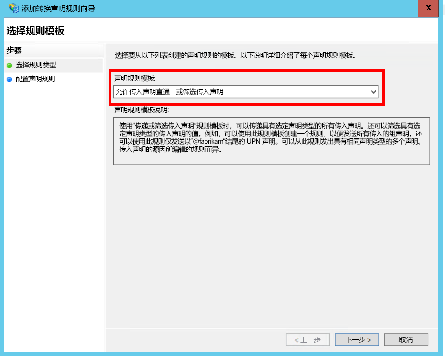

# <a name="federate-with-a-customers-ad-fs"></a>与客户的 AD FS 联合

本文介绍了多租户 SaaS 应用程序如何支持通过 Active Directory 联合身份验证服务 (AD FS) 进行的身份验证，以便与客户的 AD FS 联合。

## <a name="overview"></a>概述
Azure Active Directory (Azure AD) 让从 Azure AD 租户（包括 Office365 和 Dynamics CRM Online 客户）登录用户变得简便易行。 但是，在公司 Intranet 使用本地 Active Directory 的客户该怎么办？

一种选择是，客户使用 [Azure AD Connect] 将其本地 AD 与 Azure AD 同步。 但是，由于公司的 IT 政策或其他原因，某些客户可能无法使用此方法。 在这种情况下，另一个选择是通过 Active Directory 联合身份验证服务 (AD FS) 进行联合。

若要启用此方案：

* 客户必须具有面向 Internet 的 AD FS 场。
* SaaS 提供程序部署自己的 AD FS 场。
* 客户和 SaaS 提供程序必须设置[联合身份验证信任]。 这是一个手动过程。

在信任关系中有三个主要角色：

* 客户的 AD FS 是[帐户伙伴]，负责从客户的 AD 中对用户进行身份验证，并使用用户声明创建安全令牌。
* SaaS 提供程序的 AD FS 是[资源伙伴]，负责信任帐户伙伴和接收用户声明。
* 应用程序在 SaaS 提供程序的 AD FS 中配置为信赖方 (RP)。
  
  

> [!NOTE]
> 在本文中，我们假设应用程序使用 OpenID connect 作为身份验证协议。 另一种选择是使用 WS 联合身份验证。
> 
> 对于 OpenID Connect，SaaS 提供程序必须使用在 Windows Server 2016 中运行的 AD FS 2016。 AD FS 3.0 不支持 OpenID Connect。
> 
> ASP.NET Core 没有现成可用的 WS 联合身份验证支持。
> 
> 

有关将 WS 联合身份验证与 ASP.NET 4 配合使用的示例，请参阅 [active-directory-dotnet-webapp-wsfederation 示例][active-directory-dotnet-webapp-wsfederation]。

## <a name="authentication-flow"></a>身份验证流
1. 用户单击"登录"时，应用程序会重定向到 SaaS 提供程序 AD FS 上的 OpenID Connect 终结点。
2. 用户输入所在组织中的用户名 ("`alice@corp.contoso.com`")。 AD FS 使用主领域发现重定向到客户的 AD FS，用户在此处输入其凭据。
3. 客户的 AD FS 使用 WF 联合身份验证（或 SAML）将用户声明发送到 SaaS 提供程序的 AD FS。
4. 声明使用 OpenID Connect 从 AD FS 流动到应用。 这需要 WS 联合身份验证的协议转换。

## <a name="limitations"></a>限制
默认情况下，信赖方应用程序仅接收一组在 id_token 中提供的固定声明，如下表所示。 通过 AD FS 2016，可以在 OpenID Connect 方案中自定义 id_token。 有关详细信息，请参阅[在 AD FS 中自定义 ID 令牌](/windows-server/identity/ad-fs/development/customize-id-token-ad-fs-2016)。

| 声明 | 说明 |
| --- | --- |
| aud |目标受众。 为其发出声明的应用程序。 |
| authenticationinstant |[身份验证时刻]。 身份验证的发生时间。 |
| c_hash |代码哈希值。 这是令牌内容的哈希值。 |
| exp |[过期时间]。 此后将不再接受令牌。 |
| iat |颁发时间。 颁发令牌的时间。 |
| iss |颁发者。 此声明的值一直是资源伙伴的 AD FS。 |
| 名称 |用户名。 示例： `john@corp.fabrikam.com` |
| NameIdentifier |[名称标识符]。 为其颁发令牌的实体的名称标识符。 |
| nonce |会话 nonce。 AD FS 生成的唯一值，用于帮助防止遭受重播攻击。 |
| upn |用户主体名称 (UPN)。 示例： `john@corp.fabrikam.com` |
| pwd_exp |密码过期时段。 用户密码或类似的身份验证机密（例如 PIN）过期前的 秒数。 |

> [!NOTE]
> “iss”声明包含合作伙伴的 AD FS（通常，此声明将 SaaS 提供程序标识为颁发者）。 它不会标识客户的 AD FS。 你可以发现客户的域名是 UPN 的一部分。
> 
> 

本文的其余部分介绍如何设置 RP（应用）和帐户伙伴（客户）之间的信任关系。

## <a name="ad-fs-deployment"></a>AD FS 部署
SaaS 提供程序可以在本地或 Azure VM 上部署 AD FS。 为了确保安全性和可用性，以下准则非常重要：

* 至少部署两个 AD FS 服务器和两个 AD FS 代理服务器，以获得 AD FS 服务的最佳可用性。
* 域控制器和 AD FS 服务器一定不能直接向 Internet 公开，而应置于可以直接访问它们的虚拟网络中。
* 必须使用 Web 应用程序代理（以前称为 AD FS 代理）将 AD FS 服务器发布到 Internet。

在 Azure 中设置类似的拓扑需要使用虚拟网络、NSG 集、Azure VM 集和可用性集。 有关详细信息，请参阅[在 Azure 虚拟机上部署 Windows Server Active Directory 的指南][active-directory-on-azure]。

## <a name="configure-openid-connect-authentication-with-ad-fs"></a>使用 AD FS 配置 OpenID Connect 身份验证
SaaS 提供程序必须在应用程序与 AD FS 之间启用 OpenID Connect。 若要执行此操作，请在 AD FS 中添加应用程序组。  有关详细说明，请参阅此[博客文章]的“为 OpenId connect 登录 AD FS 设置一个 Web 应用”一节。 

接下来，配置 OpenID Connect 中间件。 元数据终结点是 `https://domain/adfs/.well-known/openid-configuration`，其中，域是 SaaS 提供程序的 AD FS 域。

通常情况下，可以将其与其他 OpenID Connect 终结点（如 AAD）结合。 不过，这需要设置两个不同的登录按钮或通过其他方式来区分它们，以便将用户发送到正确的身份验证终结点。

## <a name="configure-the-ad-fs-resource-partner"></a>配置 AD FS 资源伙伴
SaaS 提供程序必须为每个想通过 ADFS 连接的客户执行下列操作：

1. 添加声明提供程序信任。
2. 添加声明规则。
3. 启用主领域发现。

以下是更详细的步骤。

### <a name="add-the-claims-provider-trust"></a>添加声明提供程序信任
1. 在服务器管理器中，单击“工具”，选择“AD FS 管理”。
2. 在控制台树的“AD FS”下，右键单击“声明提供程序信任”。 选择“添加声明提供程序信任”。
3. 单击“启动”以启动向导。
4. 选择“导入有关联机发布或在本地网络上发布的声明提供程序的数据”选项。 输入客户联合身份验证元数据终结点的 URI。 （示例：`https://contoso.com/FederationMetadata/2007-06/FederationMetadata.xml`。）需要从客户那里获取此项。
5. 使用默认选项完成向导。

### <a name="edit-claims-rules"></a>编辑声明规则
1. 右键单击新添加的声明提供程序信任，然后选择“编辑声明规则”。
2. 单击“添加规则”。
3. 选择"传递或筛选传入声明"，然后单击“下一步”。
   
4. 输入规则的名称。
5. 在“传入声明类型”下选择“UPN”。
6. 选择“传递所有声明值”。
   
7. 单击“完成” 。
8. 重复步骤 2 - 7，为传入声明类型指定“定位声明类型”。
9. 单击“确定”完成本向导。

### <a name="enable-home-realm-discovery"></a>启用主领域发现
运行以下 PowerShell 脚本：

```
Set-ADFSClaimsProviderTrust -TargetName "name" -OrganizationalAccountSuffix @("suffix")
```

其中“name”是声明提供程序信任的友好名称，“suffix”是客户 AD 的 UPN 后缀（例如，“corp.fabrikam.com”）。

通过此配置，最终用户可以键入其组织帐户，并且 AD FS 会自动选择相应的声明提供程序。 请参阅[自定义 AD FS 登录页]中“配置标识提供者以使用某些电子邮件后缀”一节。

## <a name="configure-the-ad-fs-account-partner"></a>配置 AD FS 帐户伙伴
客户必须执行以下操作：

1. 添加信赖方 (RP) 信任。
2. 添加声明规则。

### <a name="add-the-rp-trust"></a>添加 RP 信任
1. 在服务器管理器中，单击“工具”，选择“AD FS 管理”。
2. 在控制台树的“AD FS”下，右键单击“信赖方信任”。 选择“添加信赖方信任”。
3. 选择“声明感知”，然后单击“启动”。
4. 在“选择数据源”页上，选择“导入有关联机发布或在本地网络上发布的声明提供程序的数据”选项。 输入 SaaS 提供程序的联合身份验证元数据终结点的 URI。
   
5. 在“指定显示名称”页上，输入任意名称。
6. 在“选择访问控制策略”页上选择一项策略。 可以允许组织中的每个人，也可选择特定安全组。
   
7. 在“策略”框中输入所需的任何参数。
8. 单击“下一步”按钮完成向导。

### <a name="add-claims-rules"></a>添加声明规则
1. 右键单击新添加的信赖方信任，然后选择“编辑声明颁发策略”。
2. 单击“添加规则”。
3. 选择“以声明方式发送 LDAP 属性”，然后单击“下一步”。
4. 输入规则的名称，如“UPN”。
5. 在“属性存储”下，选择“Active Directory”。
   
6. 在“LDAP 属性的映射”部分中：
   * 在“LDAP 属性”下，选择“用户主体名称”。
   * 在"传出声明类型"下选择“UPN”。
     
7. 单击“完成” 。
8. 再次单击“添加规则”。
9. 选择“使用自定义规则发送声明”，并单击“下一步”。
10. 输入规则名称，如"定位点声明类型"。
11. 在“自定义规则”下，输入以下内容：
    
    ```
    EXISTS([Type == "http://schemas.microsoft.com/ws/2014/01/identity/claims/anchorclaimtype"])=>
    issue (Type = "http://schemas.microsoft.com/ws/2014/01/identity/claims/anchorclaimtype",
          Value = "http://schemas.xmlsoap.org/ws/2005/05/identity/claims/upn");
    ```
    
    此规则发出 `anchorclaimtype` 类型的声明。 此声明告知信赖方使用 UPN 作为用户的不可变 ID。
12. 单击“完成” 。
13. 单击“确定”完成本向导。


<!-- Links -->
[Azure AD Connect]: /azure/active-directory/hybrid/whatis-hybrid-identity
[联合身份验证信任]: https://technet.microsoft.com/library/cc770993(v=ws.11).aspx
[帐户伙伴]: https://technet.microsoft.com/library/cc731141(v=ws.11).aspx
[资源伙伴]: https://technet.microsoft.com/library/cc731141(v=ws.11).aspx
[身份验证时刻]: https://msdn.microsoft.com/library/system.security.claims.claimtypes.authenticationinstant%28v=vs.110%29.aspx
[过期时间]: https://tools.ietf.org/html/draft-ietf-oauth-json-web-token-25#section-4.1.
[名称标识符]: https://msdn.microsoft.com/library/system.security.claims.claimtypes.nameidentifier(v=vs.110).aspx
[active-directory-on-azure]: https://msdn.microsoft.com/library/azure/jj156090.aspx
[博客文章]: https://www.cloudidentity.com/blog/2015/08/21/OPENID-CONNECT-WEB-SIGN-ON-WITH-ADFS-IN-WINDOWS-SERVER-2016-TP3/
[自定义 AD FS 登录页]: https://technet.microsoft.com/library/dn280950.aspx
[sample application]: https://github.com/mspnp/multitenant-saas-guidance
[client assertion]: client-assertion.md
[active-directory-dotnet-webapp-wsfederation]: https://github.com/Azure-Samples/active-directory-dotnet-webapp-wsfederation
