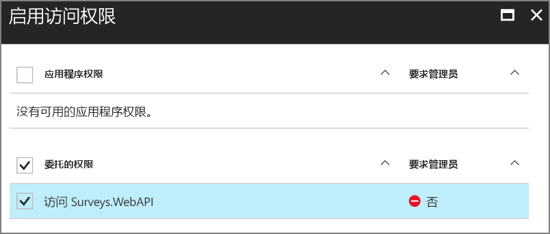
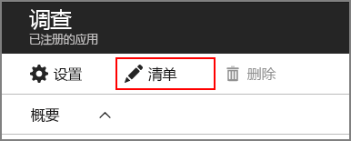
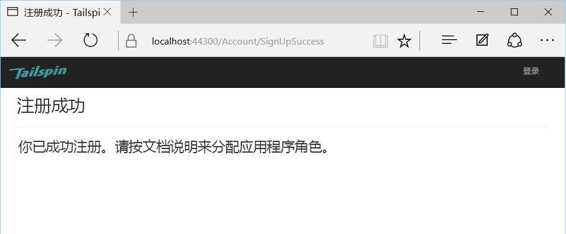

# <a name="run-the-surveys-application"></a>运行 Surveys 应用程序

本文介绍了如何从 Visual Studio 在本地运行 [Tailspin Surveys](./tailspin.md) 应用程序。 在这些步骤中，不会将应用程序部署到 Azure。 但是，需要创建一些 Azure 资源 &mdash; 一个 Azure Active Directory (Azure AD) 目录和一个 Redis 缓存。

下面是这些步骤的摘要：

1. 为虚构的 Tailspin 公司创建一个 Azure AD 目录（租户）。
2. 向 Azure AD 注册 Surveys 应用程序和后端 web API。
3. 创建一个 Azure Redis 缓存实例。
4. 配置应用程序设置并创建一个本地数据库。
5. 运行应用程序并注册一个新租户。
6. 为用户添加应用程序角色。

## <a name="prerequisites"></a>先决条件
-   [Visual Studio 2017][VS2017]
-   [Microsoft Azure](https://azure.microsoft.com) 帐户

## <a name="create-the-tailspin-tenant"></a>创建 Tailspin 租户

Tailspin 是虚构的公司，它托管着 Surveys 应用程序。 Tailspin 使用 Azure AD 来使其他租户能够向应用程序进行注册。 然后，这些客户可以使用其 Azure AD 凭据登录到应用程序。

在此步骤中，将为 Tailspin 创建一个 Azure AD 目录。

1. 登录到 [Azure 门户][portal]。

2. 单击“新建” > “安全 + 标识” > “Azure Active Directory”。

3. 输入 `Tailspin` 作为组织名称，然后输入域名。 域名将采用 `xxxx.onmicrosoft.com` 形式并且必须全局唯一。 

    

4. 单击“创建” 。 创建新目录可能需要花费几分钟时间。

若要完成端到端方案，你将需要另一个 Azure AD 目录来表示向应用程序进行注册的客户。 对于此用途，可以使用默认的 Azure AD 目录（不是 Tailspin），也可以创建一个新目录。 在示例中，我们使用 Contoso 作为虚构的客户。

## <a name="register-the-surveys-web-api"></a>注册 Surveys Web API 

1. 在 [Azure 门户][portal]中，通过在门户的右上角选择你的帐户切换到新的 Tailspin 目录。

2. 在左侧导航窗格中，选择“Azure Active Directory”。 

3. 单击“应用注册” > “新建应用程序注册”。

4.  在“创建”边栏选项卡中，输入以下信息：

  - **名称**：`Surveys.WebAPI`

  - **应用程序类型**：`Web app / API`

  - **登录 URL**：`https://localhost:44301/`
   
   

5. 单击“创建” 。

6. 在“应用注册”边栏选项卡中，选择新的“Surveys.WebAPI”应用程序。
 
7. 单击“属性”。

8. 在“应用 ID URI”编辑框中，输入 `https://<domain>/surveys.webapi`，其中 `<domain>` 是目录的域名。 例如： `https://tailspin.onmicrosoft.com/surveys.webapi`

    

9. 将“多租户”设置为“是”。

10. 单击“保存” 。

## <a name="register-the-surveys-web-app"></a>注册 Surveys Web 应用 

1.  返回到“应用注册”边栏选项卡，单击“新建应用程序注册”。

2.  在“创建”边栏选项卡中，输入以下信息：

  - **名称**：`Surveys`
  - **应用程序类型**：`Web app / API`
  - **登录 URL**：`https://localhost:44300/`
   
    注意，登录 URL 具有与上一步骤中的 `Surveys.WebAPI` 应用不同的端口号。

3. 单击“创建” 。
 
4. 在“应用注册”边栏选项卡中，选择新的“Surveys”应用程序。
 
5. 复制应用程序 ID。 稍后需要此项。

    

6. 单击“属性”。

7. 在“应用 ID URI”编辑框中，输入 `https://<domain>/surveys`，其中 `<domain>` 是目录的域名。 

    

8. 将“多租户”设置为“是”。

9. 单击“保存” 。

10. 在“设置”边栏选项卡中，单击“回复 URL”。
 
11. 添加以下回复 URL：`https://localhost:44300/signin-oidc`。

12. 单击“保存” 。

13. 在“API 访问”下，单击“密钥”。

14. 输入描述，例如 `client secret`。

15. 在“选择持续时间”下拉列表中，选择“1 年”。 

16. 单击“保存” 。 保存时，将生成密钥。

17. 在离开此边栏选项卡之前，复制密钥的值。

    > [!NOTE] 
    > 离开此边栏选项卡后，密钥将不再可见。 

18. 在“API 访问”下，单击“所需权限”。

19. 单击“添加” > “选择 API”。

20. 在搜索框中，搜索 `Surveys.WebAPI`。

    

21. 选择 `Surveys.WebAPI` 并单击“选择”。

22. 在“委派的权限”下，选中“访问 Surveys.WebAPI”复选框。

    

23. 单击“选择” > “完成”。


## <a name="update-the-application-manifests"></a>部署应用程序清单

1. 返回到 `Surveys.WebAPI` 应用程序的“设置”边栏选项卡。

2. 单击“清单” > “编辑”。

    
 
3.  将以下 JSON 添加到 `appRoles` 元素。 为 `id` 属性生成新的 GUID。

    ```json
    {
      "allowedMemberTypes": ["User"],
      "description": "Creators can create surveys",
      "displayName": "SurveyCreator",
      "id": "<Generate a new GUID. Example: 1b4f816e-5eaf-48b9-8613-7923830595ad>",
      "isEnabled": true,
      "value": "SurveyCreator"
    },
    {
      "allowedMemberTypes": ["User"],
      "description": "Administrators can manage the surveys in their tenant",
      "displayName": "SurveyAdmin",
      "id": "<Generate a new GUID>",  
      "isEnabled": true,
      "value": "SurveyAdmin"
    }
    ```

5.  在 `knownClientApplications` 属性中，添加 Surveys Web 应用程序的应用程序 ID，该 ID 是在前面注册 Surveys 应用程序时获取的。 例如：

  ```json
  "knownClientApplications": ["be2cea23-aa0e-4e98-8b21-2963d494912e"],
  ```

  此设置将 Surveys 应用添加到被授权调用 Web API 的客户端列表。

6.  单击“保存” 。

现在，为 Surveys 应用重复相同的步骤，但是不要添加 `knownClientApplications` 的条目。 使用相同的角色定义，但是为 ID 生成新的 GUID。

## <a name="create-a-new-redis-cache-instance"></a>创建一个新的 Redis 缓存实例

Surveys 应用程序使用 Redis 来缓存 OAuth 2 访问令牌。 若要创建缓存，请执行以下步骤：

1.  转到 [Azure 门户](https://portal.azure.com)并单击“新建” > “数据库” > “Redis 缓存”。

2.  填写所需的信息，包括 DNS 名称、资源组、位置和定价层。 可以创建新的资源组，也可以使用现有资源组。

3. 单击“创建” 。

4. 在创建 Resis 缓存后，在门户中导航到该资源。

5. 单击“访问密钥”并复制主密钥。

有关创建 Redis 缓存的详细信息，请参阅 [How to Use Azure Redis Cache](/azure/redis-cache/cache-dotnet-how-to-use-azure-redis-cache)（如何使用 Azure Redis 缓存）。

## <a name="set-application-secrets"></a>设置应用程序机密

1.  在 Visual Studio 中打开 Tailspin.Surveys 解决方案。

2.  在“解决方案资源管理器”中，右键单击 Tailspin.Surveys.Web 项目并选“管理用户机密”。

3.  在 secrets.json 文件中，粘贴以下代码：
    
    ```json
    {
      "AzureAd": {
        "ClientId": "<Surveys application ID>",
        "ClientSecret": "<Surveys app client secret>",
        "PostLogoutRedirectUri": "https://localhost:44300/",
        "WebApiResourceId": "<Surveys.WebAPI app ID URI>"
      },
      "Redis": {
        "Configuration": "<Redis DNS name>.redis.cache.windows.net,password=<Redis primary key>,ssl=true"
      }
    }
    ```
   
    替换尖括号中显示的项，如下所示：

    - `AzureAd:ClientId`：Surveys 应用的应用程序 ID。
    - `AzureAd:ClientSecret`：在 Azure AD 中注册 Surveys 应用程序时生成的密钥。
    - `AzureAd:WebApiResourceId`：在 Azure AD 中创建 Surveys.WebAPI 应用程序时指定的“应用 ID URI”。 它应当采用 `https://<directory>.onmicrosoft.com/surveys.webapi` 形式
    - `Redis:Configuration`：基于 Redis 缓存的 DNS 名称和主访问密钥构建此字符串。 例如“tailspin.redis.cache.windows.net,password=2h5tBxxx,ssl=true”。

4.  保存更新后的 secrets.json 文件。

5.  对 Tailspin.Surveys.WebAPI 项目重复这些步骤，但将以下内容粘贴到 secrets.json。 像前面一样，替换尖括号中显示的项。

    ```json
    {
      "AzureAd": {
        "WebApiResourceId": "<Surveys.WebAPI app ID URI>"
      },
      "Redis": {
        "Configuration": "<Redis DNS name>.redis.cache.windows.net,password=<Redis primary key>,ssl=true"
      }
    }
    ```

## <a name="initialize-the-database"></a>初始化数据库

在此步骤中，将通过 Entity Framework 7 并使用 LocalDB 创建一个本地 SQL 数据库。

1.  打开命令窗口

2.  导航到 Tailspin.Surveys.Data 项目。

3.  运行以下命令：

    ```
    dotnet ef database update --startup-project ..\Tailspin.Surveys.Web
    ```
    
## <a name="run-the-application"></a>运行应用程序

若要运行此应用程序，请同时启动 Tailspin.Surveys.Web 和 Tailspin.Surveys.WebAPI 项目。

可以将 Visual Studio 设置为在按 F5 时自动运行这两个项目，如下所述：

1.  在解决方案资源管理器中，右键单击此解决方案并选择“设置启动项目”。
2.  选择“多启动项目”。
3.  为 Tailspin.Surveys.Web 和 Tailspin.Surveys.WebAPI 项目设置“操作” = “启动”。

## <a name="sign-up-a-new-tenant"></a>注册一个新租户

当应用程序启动时，你未登录，因此会看到欢迎页面：


若要注册某个组织，请执行以下操作：

1. 单击“在 Tailspin 中注册公司”。
2. 使用 Surveys 应用登录到代表该组织的 Azure AD 目录。 必须以管理员用户身份登录。
3. 接受许可提示。

应用程序将注册该租户，然后将你注销。应用将你注销是因为你在使用应用程序之前需要在 Azure AD 中设置应用程序角色。



## <a name="assign-application-roles"></a>分配应用程序角色

当租户注册时，租户的 AD 管理员必须将应用程序角色分配给用户。


1. 在 [Azure 门户][portal]中，切换到注册 Surveys 时使用的 Azure AD 目录。 

2. 在左侧导航窗格中，选择“Azure Active Directory”。 

3. 单击“企业应用程序” > “所有应用程序”。 门户将列出 `Survey` 和 `Survey.WebAPI`。 如果没有列出，请确保你已完成了注册流程。

4.  单击 Surveys 应用程序。

5.  单击“用户和组”。

4.  单击“添加用户”。

5.  如果你具有 Azure AD Premium，请单击“用户和组”。 否则，请单击“用户”。 （将角色分配给组需要 Azure AD Premium。）

6. 选择一个或多个用户，然后单击“选择”。

    

6.  选择角色并单击“选择”。

    

7.  单击“分配”。

重复相同的步骤来为 Survey.WebAPI 应用程序分配角色。

> 重要说明：用户在 Survey 和 Survey.WebAPI 中应当始终具有相同的角色。 否则，用户将具有不一致的权限，这将导致 Web API 发出 403（被禁止）错误。

现在，返回到应用并再次登录。 单击“我的调查”。 如果为用户分配了 SurveyAdmin 或 SurveyCreator 角色，则你会看到一个“创建调查”按钮，这表示用户有权创建新调查。


<!-- links -->

[portal]: https://portal.azure.com
[VS2017]: https://www.visualstudio.com/vs/
