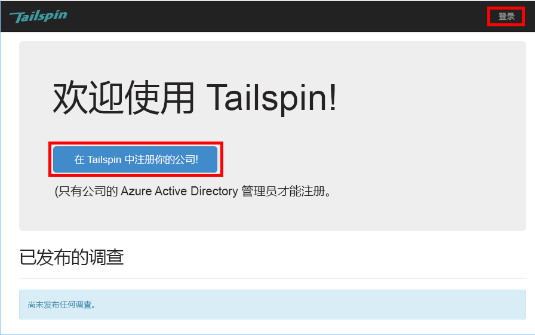
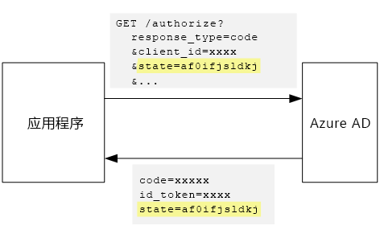

# <a name="tenant-sign-up-and-onboarding"></a>租户注册和加入

[ 示例代码][sample application]

本文介绍如何在多租户应用程序中实施注册过程，使客户能够代表其组织注册应用程序。
实施注册过程的原因有多种：

* 使 AD 管理员能够许可客户所在的整个组织使用该应用程序。
* 收集信用卡付款信息或其他客户信息。
* 执行应用程序所需的任何按租户一次性设置。

## <a name="admin-consent-and-azure-ad-permissions"></a>管理员许可和 Azure AD 权限
若要使用 Azure AD 进行身份验证，应用程序需要有权访问用户的目录。 应用程序最起码需要用户配置文件的读取权限。 当某个用户首次登录时，Azure AD 会显示许可页面，其中列出了请求的权限。 用户单击“接受”即表示向应用程序授予了权限。

默认情况下，许可是按用户授予的。 每个登录用户都会看到许可页面。 但是，Azure AD 还支持管理员许可：可让 AD 管理员许可整个组织的访问。

使用管理员许可流时，许可页面会指出 AD 管理员正在代表整个租户授予权限：


管理员单击“接受”后，同一租户中的其他用户可以登录，Azure AD 会跳过许可屏幕。

只有 AD 管理员可以授予管理员许可，因为他（她）代表整个组织授予权限。 如果非管理员尝试使用管理员许可流进行身份验证，Azure AD 会显示以下错误：


如果应用程序后来需要其他权限，则客户需要再次登录，并许可更新的权限。  

## <a name="implementing-tenant-sign-up"></a>实施租户注册
针对 [Tailspin Surveys][Tailspin] 应用程序，我们定义了有关注册过程的几项要求：

* 在用户可以登录之前，租户必须注册。
* 注册过程使用管理员许可流。
* 注册过程将用户的租户添加到应用程序数据库。
* 租户注册后，应用程序显示加入页面。

本部分将逐步讲解注册过程的实施方式。
必须知道，“注册”与“登录”是应用程序相关的概念。 在执行身份验证流期间，Azure AD 并非原本就知道用户是否正在注册。 由应用程序负责跟踪上下文。

当某个匿名用户访问 Surveys 应用程序时，该用户会看到两个按钮：一个按钮用于登录，另一个按钮用于登记公司（注册）。



这些按钮调用 `AccountController` 类中的操作。

`SignIn` 操作返回 **ChallegeResult**，导致 OpenID Connect 中间件重定向到身份验证终结点。 这是在 ASP.NET Core 中触发身份验证的默认方式。  

```csharp
[AllowAnonymous]
public IActionResult SignIn()
{
    return new ChallengeResult(
        OpenIdConnectDefaults.AuthenticationScheme,
        new AuthenticationProperties
        {
            IsPersistent = true,
            RedirectUri = Url.Action("SignInCallback", "Account")
        });
}
```

现在，我们与 `SignUp` 操作相对比：

```csharp
[AllowAnonymous]
public IActionResult SignUp()
{
    var state = new Dictionary<string, string> { { "signup", "true" }};
    return new ChallengeResult(
        OpenIdConnectDefaults.AuthenticationScheme,
        new AuthenticationProperties(state)
        {
            RedirectUri = Url.Action(nameof(SignUpCallback), "Account")
        });
}
```

与 `SignIn` 一样，`SignUp` 操作也会返回 `ChallengeResult`。 但这一次，我们将一段状态信息添加到了 `ChallengeResult` 中的 `AuthenticationProperties`：

* signup：一个布尔标志，指示用户是否已启动注册过程。

`AuthenticationProperties` 中的状态信息会添加到在执行身份验证流期间往返的 OpenID Connect [state] 参数。



用户在 Azure AD 中完成身份验证并重定向回到应用程序之后，身份验证票证包含状态。 我们将使用此事实数据来确保整个身份验证流中保留“signup”值。

## <a name="adding-the-admin-consent-prompt"></a>添加管理员许可提示
在 Azure AD 中，可以通过将“prompt”参数添加到身份验证请求中的查询字符串来触发管理员许可流：

```
/authorize?prompt=admin_consent&...
```

Surveys 应用程序在 `RedirectToAuthenticationEndpoint` 事件期间添加提示。 调用此事件之后，紧接着中间件会重定向到身份验证终结点。

```csharp
public override Task RedirectToAuthenticationEndpoint(RedirectContext context)
{
    if (context.IsSigningUp())
    {
        context.ProtocolMessage.Prompt = "admin_consent";
    }

    _logger.RedirectToIdentityProvider();
    return Task.FromResult(0);
}
```

设置 ` ProtocolMessage.Prompt` 会告知中间件要将“prompt”参数添加到身份验证请求。

请注意，仅在注册期间才需要提示。 常规登录不应包含提示。 为了区分这两种情况，让我们查看身份验证状态中的 `signup` 值。 以下扩展方法检查此条件：

```csharp
internal static bool IsSigningUp(this BaseControlContext context)
{
    Guard.ArgumentNotNull(context, nameof(context));

    string signupValue;
    // Check the HTTP context and convert to string
    if ((context.Ticket == null) ||
        (!context.Ticket.Properties.Items.TryGetValue("signup", out signupValue)))
    {
        return false;
    }

    // We have found the value, so see if it's valid
    bool isSigningUp;
    if (!bool.TryParse(signupValue, out isSigningUp))
    {
        // The value for signup is not a valid boolean, throw                
        throw new InvalidOperationException($"'{signupValue}' is an invalid boolean value");
    }

    return isSigningUp;
}
```

## <a name="registering-a-tenant"></a>注册租户
Surveys 应用程序在应用程序数据库中存储有关每个租户和用户的一些信息。


在租户表中，IssuerValue 是租户的颁发者声明值。 对于 Azure AD，此声明为 `https://sts.windows.net/<tentantID>`，提供每个租户的唯一值。

当新租户注册时，Surveys 应用程序会将租户记录写入数据库。 此操作在 `AuthenticationValidated` 事件中发生。 （不要在此事件之前执行此操作，因为 ID 令牌尚未经过验证，因此不能信任声明值。） 请参阅[身份验证]。

下面是 Surveys 应用程序中的相关代码：

```csharp
public override async Task TokenValidated(TokenValidatedContext context)
{
    var principal = context.AuthenticationTicket.Principal;
    var userId = principal.GetObjectIdentifierValue();
    var tenantManager = context.HttpContext.RequestServices.GetService<TenantManager>();
    var userManager = context.HttpContext.RequestServices.GetService<UserManager>();
    var issuerValue = principal.GetIssuerValue();
    _logger.AuthenticationValidated(userId, issuerValue);

    // Normalize the claims first.
    NormalizeClaims(principal);
    var tenant = await tenantManager.FindByIssuerValueAsync(issuerValue)
        .ConfigureAwait(false);

    if (context.IsSigningUp())
    {
        if (tenant == null)
        {
            tenant = await SignUpTenantAsync(context, tenantManager)
                .ConfigureAwait(false);
        }

        // In this case, we need to go ahead and set up the user signing us up.
        await CreateOrUpdateUserAsync(context.Ticket, userManager, tenant)
            .ConfigureAwait(false);
    }
    else
    {
        if (tenant == null)
        {
            _logger.UnregisteredUserSignInAttempted(userId, issuerValue);
            throw new SecurityTokenValidationException($"Tenant {issuerValue} is not registered");
        }

        await CreateOrUpdateUserAsync(context.Ticket, userManager, tenant)
            .ConfigureAwait(false);
    }
}
```

此代码将执行以下操作：

1. 检查租户的颁发者值是否已在数据库中。 如果租户尚未注册，`FindByIssuerValueAsync` 会返回 null。
2. 如果用户已注册：
   1. 将租户添加到数据库 (`SignUpTenantAsync`)。
   2. 将经过身份验证的用户添加到数据库 (`CreateOrUpdateUserAsync`)。
3. 否则，完成正常的登录流：
   1. 如果在数据库中找不到租户的颁发者，则表示租户尚未注册，并且客户需要注册。 在这种情况下，会引发异常，导致身份验证失败。
   2. 否则，为此用户创建数据库记录（如果尚不存在）(`CreateOrUpdateUserAsync`)。

下面是用于将租户添加到数据库的 `SignUpTenantAsync` 方法。

```csharp
private async Task<Tenant> SignUpTenantAsync(BaseControlContext context, TenantManager tenantManager)
{
    Guard.ArgumentNotNull(context, nameof(context));
    Guard.ArgumentNotNull(tenantManager, nameof(tenantManager));

    var principal = context.Ticket.Principal;
    var issuerValue = principal.GetIssuerValue();
    var tenant = new Tenant
    {
        IssuerValue = issuerValue,
        Created = DateTimeOffset.UtcNow
    };

    try
    {
        await tenantManager.CreateAsync(tenant)
            .ConfigureAwait(false);
    }
    catch(Exception ex)
    {
        _logger.SignUpTenantFailed(principal.GetObjectIdentifierValue(), issuerValue, ex);
        throw;
    }

    return tenant;
}
```

下面是 Surveys 应用程序中整个注册流的摘要：

1. 用户单击“注册”按钮。
2. `AccountController.SignUp` 操作返回质询结果。  身份验证状态包含“signup”值。
3. 在 `RedirectToAuthenticationEndpoint` 事件中添加 `admin_consent` 提示。
4. OpenID Connect 中间件重定向到 Azure AD，用户执行身份验证。
5. 在 `AuthenticationValidated` 事件中查找“signup”状态。
6. 将租户添加到数据库。

[**下一篇**][app roles]

<!-- Links -->
[app roles]: app-roles.md
[Tailspin]: tailspin.md

[state]: https://openid.net/specs/openid-connect-core-1_0.html#AuthRequest
[身份验证]: authenticate.md
[sample application]: https://github.com/mspnp/multitenant-saas-guidance
