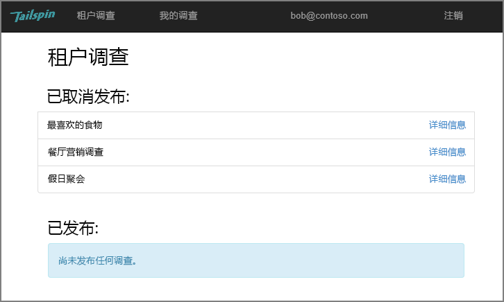

# Tailspin 方案The Tailspin scenario

[ 示例代码][sample application][ Sample code][sample application]

Tailspin 是一家虚构公司，开发名为 Surveys 的 SaaS 应用程序。Tailspin is a fictitious company that is developing a SaaS application named Surveys. 组织可以使用此应用程序创建并发布在线调查。This application enables organizations to create and publish online surveys.

* 组织可以注册使用此应用程序。An organization can sign up for the application.
* 组织注册后，用户可以使用组织的凭据登录到此应用程序。After the organization is signed up, users can sign into the application with their organizational credentials.
* 用户可以创建、编辑和发布调查。Users can create, edit, and publish surveys.

> [!NOTE]
> 要开始使用此应用程序，请参阅[运行 Surveys 应用程序]。To get started with the application, see [Run the Surveys application].
> 
> 

## 用户可以创建、编辑和查看调查Users can create, edit, and view surveys
经过身份验证的用户可以查看自己创建的或拥有参与者权限的所有调查，还可以创建新调查。An authenticated user can view all the surveys that he or she has created or has contributor rights to, and create new surveys. 请注意，用户使用其组织身份 `bob@contoso.com` 登录。Notice that the user is signed in with his organizational identity, `bob@contoso.com`.

此屏幕截图显示“编辑调查”页面：This screenshot shows the Edit Survey page:

用户还可以查看同一租户中其他用户创建的任何调查。Users can also view any surveys created by other users within the same tenant.

## 调查所有者可以邀请参与者Survey owners can invite contributors
用户创建调查时，他/她可以邀请其他人成为调查的参与者。When a user creates a survey, he or she can invite other people to be contributors on the survey. 参与者可以编辑调查，但无法删除或发布调查。Contributors can edit the survey, but cannot delete or publish it.  

用户可以从其他租户添加参与者，从而实现跨租户资源共享。A user can add contributors from other tenants, which enables cross-tenant sharing of resources. 在此屏幕截图中，Bob (`bob@contoso.com`) 将 Alice (`alice@fabrikam.com`) 添加为他创建的调查的参与者。In this screenshot, Bob (`bob@contoso.com`) is adding Alice (`alice@fabrikam.com`) as a contributor to a survey that Bob created.

Alice 登录时，会看到“我可以参与的调查”下列出了该调查。When Alice logs in, she sees the survey listed under "Surveys I can contribute to".

请注意，Alice 是登录到她自己的租户，而不是作为 Contoso 租户的来宾登录。Note that Alice signs into her own tenant, not as a guest of the Contoso tenant. Alice 仅拥有对该调查的参与者权限 &mdash; 而无法查看 Contoso 租户中的其他调查。Alice has contributor permissions only for that survey &mdash; she cannot view other surveys from the Contoso tenant.

## 体系结构Architecture
Surveys 应用程序由 Web 前端和 Web API 后端组成。The Surveys application consists of a web front end and a web API backend. 两者都通过使用 [ASP.NET Core] 实现。Both are implemented using [ASP.NET Core].

Web 应用程序使用 Azure Active Directory (Azure AD) 对用户进行身份验证。The web application uses Azure Active Directory (Azure AD) to authenticate users. Web 应用程序还调用 Azure AD 来获取 Web API 的 OAuth 2 访问令牌。The web application also calls Azure AD to get OAuth 2 access tokens for the Web API. 访问令牌在 Azure Redis 缓存中进行缓存。Access tokens are cached in Azure Redis Cache. 通过缓存，多个实例可以共享同一令牌缓存（例如，在服务器场中）。The cache enables multiple instances to share the same token cache (e.g., in a server farm).

[下一篇][authentication][**Next**][authentication]

<!-- Links -->

[authentication]: authenticate.md

[运行 Surveys 应用程序]: ./run-the-app.md
[Run the Surveys application]: ./run-the-app.md
[ASP.NET Core]: /aspnet/core
[sample application]: https://github.com/mspnp/multitenant-saas-guidance
