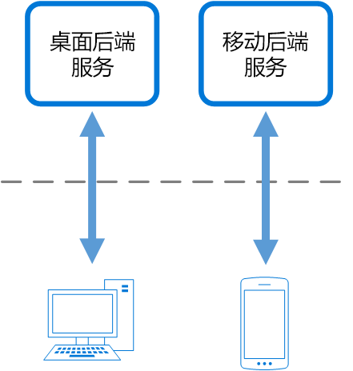

# 用于前端的后端模式Backends for Frontends pattern

创建单独的后端服务，供特定的前端应用程序或接口使用。Create separate backend services to be consumed by specific frontend applications or interfaces. 要避免为多个接口自定义一个后端时，此模式十分有用。This pattern is useful when you want to avoid customizing a single backend for multiple interfaces. 此模式最先是由 Sam Newman 描述的。This pattern was first described by Sam Newman.

## 上下文和问题Context and problem

应用程序最初可能面向桌面 Web UI。An application may initially be targeted at a desktop web UI. 通常并行开发提供该 UI 所需功能的后端服务。Typically, a backend service is developed in parallel that provides the features needed for that UI. 随着应用程序用户群的增长，开发出了必须与同一后端交互的移动应用程序。As the application's user base grows, a mobile application is developed that must interact with the same backend. 后端服务成为一般用途的后端，满足桌面和移动接口的需求。The backend service becomes a general-purpose backend, serving the requirements of both the desktop and mobile interfaces.

但移动设备和桌面浏览器在屏幕大小、性能和显示限制方面的功能存在显著差异。But the capabilities of a mobile device differ significantly from a desktop browser, in terms of screen size, performance, and display limitations. 因此，移动应用程序和桌面 Web UI 对后端的需求也有所不同。As a result, the requirements for a mobile application backend differ from the desktop web UI. 

这些差异导致两者对后端的需求相互冲突。These differences result in competing requirements for the backend. 为向桌面 Web UI 和移动应用程序提供服务，后端需要进行常规更改和重大更改。The backend requires regular and significant changes to serve both the desktop web UI and the mobile application. 单独的接口团队通常致力于每个前端，导致后端成为开发过程中的瓶颈。Often, separate interface teams work on each frontend, causing the backend to become a bottleneck in the development process. 矛盾的更新需求以及让服务适用于这两个前端的需要会导致在一个可部署资源上花费大量精力。Conflicting update requirements, and the need to keep the service working for both frontends, can result in spending a lot of effort on a single deployable resource.

 

因为开发活动注重后端服务，所以可能要建立单独的团队来管理和维护后端。As the development activity focuses on the backend service, a separate team may be created to manage and maintain the backend. 这最终导致接口和后端开发团队之间的连接断开，为平衡不同 UI 团队冲突的需求而增加后端团队的负担。Ultimately, this results in a disconnect between the interface and backend development teams, placing a burden on the backend team to balance the competing requirements of the different UI teams. 一个接口团队要求更改后端时，必须先与其他接口团队验证这些更改，然后才能将其集成到后端。When one interface team requires changes to the backend, those changes must be validated with other interface teams before they can be integrated into the backend. 

## 解决方案Solution

为每个用户界面创建一个后端。Create one backend per user interface. 在无需担心影响其他前端体验的情况下，微调每个后端的行为和性能以最大程度地满足前端环境的需求。Fine tune the behavior and performance of each backend to best match the needs of the frontend environment, without worrying about affecting other frontend experiences.

 

每个后端特定于一个接口，因此可针对该接口优化后端。Because each backend is specific to one interface, it can be optimized for that interface. 因此，与试图满足所有接口的需求的泛型后端相比，它更小、复杂性更低并且速度可能更快。As a result, it will be smaller, less complex, and likely faster than a generic backend that tries to satisfy the requirements for all interfaces. 每个接口团队可自主控制其后端，无需依赖于集中式后端开发团队。Each interface team has autonomy to control their own backend and doesn't rely on a centralized backend development team. 这向接口团队提供了后端的语言选择、发布节奏、工作负载优先顺序和功能集成方面的灵活性。This gives the interface team flexibility in language selection, release cadence, prioritization of workload, and feature integration in their backend.

有关详细信息，请参阅[模式：用于前端的后端](http://samnewman.io/patterns/architectural/bff/)。For more information, see [Pattern: Backends For Frontends](http://samnewman.io/patterns/architectural/bff/).

## 问题和注意事项Issues and considerations

- 请考虑要部署的后端数量。Consider how many backends to deploy.
- 如果不同接口（如移动客户端）发出相同请求，请考虑是否必须为每个接口实现一个后端，或者一个后端是否可以满足需求。If different interfaces (such as mobile clients) will make the same requests, consider whether it is necessary to implement a backend for each interface, or if a single backend will suffice.
- 实现此模式时，服务之间的代码很可能重复。Code duplication across services is highly likely when implementing this pattern.
- 专注于前端的后端服务应仅包含特定于客户端的逻辑和行为。Frontend-focused backend services should only contain client-specific logic and behavior. 应当在应用程序的其他位置管理常规业务逻辑和其他全局功能。General business logic and other global features should be managed elsewhere in your application.
- 思考此模式在开发团队责任中可能具有的体现。Think about how this pattern might be reflected in the responsibilities of a development team.
- 请考虑实现此模式所需的时间。Consider how long it will take to implement this pattern. 假如你继续支持现有的泛型后端，生成新后端所需的工作量是否会导致出现技术债务？Will the effort of building the new backends incur technical debt, while you continue to support the existing generic backend?

## 何时使用此模式When to use this pattern

在以下情况下使用此模式：Use this pattern when:

- 必须使用大量开发开销维护共享或常规用途的后端服务。A shared or general purpose backend service must be maintained with significant development overhead.
- 想要优化后端以满足特定客户端接口的需求。You want to optimize the backend for the requirements of specific client interfaces.
- 自定义一般用途的后端以适应多个接口。Customizations are made to a general-purpose backend to accommodate multiple interfaces.
- 另一种语言更适合另一用户界面的后端。An alternative language is better suited for the backend of a different user interface.

此模式可能不适用于以下情况：This pattern may not be suitable:

- 接口向后端发出相同或类似的请求时。When interfaces make the same or similar requests to the backend.
- 仅使用一个接口与后端交互时。When only one interface is used to interact with the backend.

## 相关指南Related guidance

- [网关聚合模式Gateway Aggregation pattern](./gateway-aggregation.md)
- [网关卸载模式Gateway Offloading pattern](./gateway-offloading.md)
- [网关路由模式Gateway Routing pattern](./gateway-routing.md)

