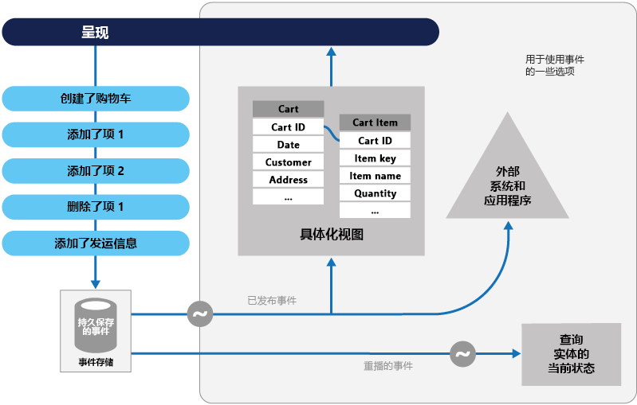
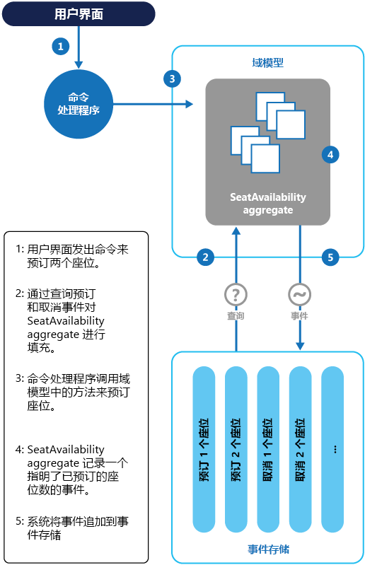

# 事件溯源模式

[!INCLUDE [header](../_includes/header.md)]

使用只追加存储来记录对数据采取的完整系列操作，而不是仅存储域中数据的当前状态。
该存储可作为记录系统，可用于具体化域对象。 这样一来，无需同步数据模型和业务域，从而简化复杂域中的任务，同时可提高性能、可扩展性和响应能力。 它还可提供事务数据一致性并保留可启用补偿操作的完整审核记录和历史记录。

## 上下文和问题

大多数应用程序会使用数据，而典型的方法是用户使用数据时通过更新数据使应用程序保持数据的当前状态。 例如，在传统的创建、读取、更新和删除 (CRUD) 模型中，典型的数据处理是从存储读取数据、对其作出修改、使用新值更新数据的当前状态（通常通过使用锁定数据的事务）。

CRUD 方法具有一些限制：

- CRUD 系统直接对数据存储执行更新操作，其所需的处理工作开销会降低性能和响应能力，并会限制可扩展性。

- 在包含多个并发用户的协作域中，由于会对数据单个项进行更新操作，因此出现数据更新冲突的可能性更大。

- 除非存在记录单独日志中每个操作详细信息的其他审核机制，否则历史记录会丢失。

> 若要深入了解有关 CRUD 方法的限制，请参阅 [CRUD, Only When You Can Afford It](https://blogs.msdn.microsoft.com/maarten_mullender/2004/07/23/crud-only-when-you-can-afford-it-revisited/)（仅在可承受一定限制的情况下使用 CRUD）。

## 解决方案

事件溯源模式定义对一系列事件（每个事件记录在只追加存储中）驱动的数据进行处理操作的方法。 应用程序代码以命令方式描述每个数据操作的一系列事件发送到事件存储，这些事件在其中是持久化的。 每个事件表示对数据所作的一系列更改（例如 `AddedItemToOrder`）。

事件在事件存储中持久化，事件存储充当数据当前状态的记录系统（权威数据源）。 事件存储通常会发布这些事件，使用者可收到通知并在需要时对其进行处理。 例如，使用者可启动将事件中的操作应用到其他系统的任务，或者执行完成此操作所需的任何关联操作。 请注意，生成事件的应用程序代码从订阅到事件的系统中分离。

事件存储发布的事件的典型用途是在应用程序中的操作更改实体时保持实体的具体化视图以及用于与外部系统集成。 例如，系统可保持用于填充 UI 各部分的所有客户订单的具体化视图。 应用程序添加新的订单、添加或删除订单中的项和添加发货信息时，可处理描述这些更改的事件以及使用这些事件来更新[具体化视图](materialized-view.md)。

此外，应用程序可随时读取事件历史记录，并通过播放和使用所有与实体相关的事件，使用事件历史记录来具体化实体的当前状态。 可根据需要，在处理请求时或通过计划任务具体化域对象，将实体状态保存为具体化视图以支持演示层。

此图提供了此模式的概述，其中包括使用事件流的部分选项，例如创建具体化视图、将事件与外部应用程序和系统集成以及重播事件以创建特定实体的当前状态投影。

事件溯源模式具有以下优点：

- 事件不可变，并且可使用只追加操作进行存储。 用户界面、工作流或启动事件的进程可继续，处理事件的任务可在后台运行。 此外，处理事务期间不存在争用，这两点可极大提高应用程序的性能和可伸缩性，尤其是对于演示级别或用户界面。

- 事件是描述已发生操作的简单对象以及描述事件代表的操作所需的相关数据。 事件不会直接更新数据存储。 只会对事件进行记录，以便在合适的时间进行处理。 这可简化实施和管理。

- 事件通常对域专家而言具有意义，然而[对象关系阻抗不匹配](https://en.wikipedia.org/wiki/Object-relational_impedance_mismatch)却会让复杂数据库表变得难以理解。 表是表示系统的当前状态（而不是已发生事件）的人工构造。

- 事件溯源不需要直接更新数据存储中的对象，因而有助于防止并发更新造成冲突。 但是，域模型必须仍然设计为避免可能导致不一致状态的请求。

- 事件的只追加存储提供的审核线索可用于监视对数据存储采取的操作，通过随时重播事件将当前状态重新生成为具体化视图或投影，以及测试和调试系统。 此外，需要使用补偿事件来取消更改，此要求可提供已撤销更改的历史记录，但对于模型只存储当前状态的情况则不适用。 事件列表还可用于分析应用程序性能和检测用户行为趋势或者获取其他有用的业务信息。

- 事件存储会引发事件，任务会执行操作以响应这些事件。 通过将任务从事件中分离，可提供灵活性和可扩展性。 任务知道事件类型和事件数据，但不知道触发事件的操作。 此外，多个任务可以处理每个事件。 这样可实现与仅侦听事件存储引发的新事件的其他服务和系统的轻松集成。 但是，事件溯源事件的级别通常非常低，可能需要生成特定的集成事件。

> 通过执行响应事件的数据管理任务和具体化存储事件的视图，事件溯源通常与 CQRS 模式结合。

## 问题和注意事项

在决定如何实现此模式时，请考虑以下几点：

只有通过重播事件创建具体化视图或生成数据投影时，系统才可实现最终一致性。 应用程序将事件添加到事件存储作为处理请求的结果、发布事件和事件使用者处理事件之间存在一定程度的延迟。 在此期间，描述实体的进一步更改的新事件可能已到达事件存储。

> [!NOTE]
> 有关最终一致性的信息，请参阅 [Data consistency primer](https://msdn.microsoft.com/library/dn589800.aspx)（数据一致性入门）。

事件存储是信息的永久源，因此请勿更新事件数据。 更新实体以撤销更改的唯一方式是将补偿事件添加到事件存储。 如果持久化事件的格式（而不是数据）需要更改，也许在迁移期间，很难将存储中的现有事件和新版本结合。 可能需要循环访问所有事件进行更改，使其符合新格式，或添加使用新格式的新事件。 考虑在事件架构的每个版本上使用版本标记，以同时保留事件的旧格式和新格式。

多线程应用程序和应用程序的多个实例可能将事件存储在事件存储中。 事件存储中的事件一致性至关重要，影响特定实体的事件的顺序（实体更改发生的顺序会影响当前状态）同样至关重要。 将时间戳添加到每个事件有助于避免出现问题。 另一常见做法是使用增量标识符注释请求引起的每个事件。 如果两个操作尝试同时为同一实体添加事件，则事件存储可拒绝与现有实体标识符和事件标识符相匹配的事件。

读取事件以获取信息并没有标准方法或现有机制，例如 SQL 查询。 可提取的唯一数据是将事件标识符用作条件的事件流。 事件 ID 通常会映射到各个实体。 仅可根据实体原始状态通过重播与其关联的所有事件来确定实体的当前状态。

每个事件流的长度会影响管理和更新系统。 如果是大型流，请考虑按特定间隔（例如指定数量的事件）创建快照。 可通过快照和重播此时间点后发生的事件获取实体的当前状态。 有关创建数据快照的详细信息，请参阅 [Martin Fowler 的企业应用程序体系结构网站上的快照](https://martinfowler.com/eaaDev/Snapshot.html)和 [Master-Subordinate Snapshot Replication](https://msdn.microsoft.com/library/ff650012.aspx)（主从关系快照复制）。

即使事件溯源会最大程度降低数据更新冲突的可能性，应用程序仍必须能够处理由最终一致性和缺少事务引起的不一致性。 例如，在指示存货减少的事件到达数据存储时，客户可能正在对该商品下订单，这会导致需要在这两个操作之间作出协调，即通知客户或创建延期交付订单。

事件发布可能是“至少一次”，因此事件使用者必须是幂等的。 如果事件处理次数大于 1，则使用者不得重新应用该事件中描述的更新。 例如，如果使用者的多个实例将一个合计保留为实体的属性（例如已下订单总数），则下订单事件发生时，仅一个实例必须可成功增加合计。 尽管这不是事件溯源的主要特点，但却是通常的实施决策。

## 何时使用此模式

请在以下方案中使用此模式：

- 要捕获数据中的意图、用途或原因。 例如，可将对客户实体的更改捕获为一系列特定事件类型，例如“已搬家”、“帐户已关闭”或“已死亡”。

- 尽量减少或完全避免出现数据更新冲突。

- 需要记录发生的事件，并可重播事件以还原系统状态、回滚更改或保留历史记录和审核日志。 例如，任务涉及多个步骤时，可能需要执行操作来恢复更新，并重播某些步骤使数据重返一致的状态。

- 使用事件是应用程序操作的自然功能，且几乎不需要其他开发或实施工作。

- 需要将输入或更新数据的过程从应用这些操作所需的任务中分离。 为了提高 UI 性能或在事件发生时会事件分发到采取操作的其他侦听器。 例如，将工资系统与开支报销网站集成，使由事件存储引起的响应网站中数据更新的事件可同时供该网站和工资系统使用。

- 希望随要求更改而灵活更改具体化模型和实体数据的格式，或需要调整读取模型或公开数据的视图（与 CQRS 结合使用时）。

- 与 CQRS 结合使用且更新读取模型时最终一致性可接受或事件流中的解冻实体和数据的性能影响可接受。

此模式在以下情况中可能不起作用：

- 小型域或简单域、几乎或完全没有业务逻辑的系统或者自然地适用于传统 CRUD 数据管理机制的非域系统。

- 要求一致性和数据视图实时更新的系统。

- 不需要审核线索、历史记录以及回滚和重播操作功能的系统。

- 基础数据更新冲突发生率极低的系统。 例如，主要是添加数据而不是更新数据的系统。

## 示例

会议管理系统需要跟踪会议的已完成预订数，以检查潜在与会者预订时是否有可用席位。 此系统可通过至少两种方式存储会议的预订总数：

- 此系统可将预订总数信息作为单独的实体存储在包含预订信息的数据库中。 进行预订或取消预订时，此系统可相应地增加或减少此数量。 理论上而言，此方式很简单，但如果短时间内有大量与会者尝试预订席位，则可能导致可伸缩性问题。 例如，在预订期结束前的最后一天左右。

- 此系统可将预订和取消预订信息存储为事件存储中的事件。 可通过重播这些事件来计算可用的席位数。 由于事件的不变性，此方式更具伸缩性。 此系统仅需要可从事件存储读取数据，或将数据追加到事件存储。 不会修改有关预订和取消预订的事件信息。

下图说明了如何使用事件溯源实施会议管理系统的席位预订子系统。

预订两个席位的操作顺序如下：

1. 用户界面发出为两位与会者预订席位的命令。 该命令由单独的命令处理程序处理。 一条逻辑，此逻辑从用户界面分离且负责处理发布为命令的请求。

2. 通过查询描述预订和取消预订的事件，构造包含有关会议的所有预订的信息的一个聚合。 此聚合名为 `SeatAvailability`，且包含在公开此聚合中数据的查询和修改方法的域模型中。

    > 需要考虑的一些优化是使用快照（使获取聚合的当前状态无需查询和重播事件的完整列表）和将此聚合的缓存副本保留在内存中。

3. 命令处理程序调用域模型公开的方法来进行预订。

4. `SeatAvailability` 聚合会记录包含已预订席位数的事件。 聚合下次应用事件时，会使用所有的预订数来计算剩余的席位数。

5. 此系统将新事件追加到事件存储中的事件列表。

如果某位用户取消席位，此系统将执行相似过程，但命令处理程序会发出生成席位取消事件并将其追加到事件存储的命令。

除了扩大可伸缩性范围外，使用事件存储还可提供会议预订和取消预订的完整历史记录或审核线索。 事件存储中的事件是准确的记录。 无需以其他任何方式持久化聚合，因为此系统可轻松重播事件并将状态还原到任意时间点。

> 有关此示例的详细信息，请参阅[事件溯源介绍](https://msdn.microsoft.com/library/jj591559.aspx)。

## 相关模式和指南

实施此模式时，可能也会与以下模式和指南相关：

- [命令和查询责任分离 (CQRS) 模式](cqrs.md)。 提供 CQRS 实现的信息永久源的写入存储通常基于事件溯源模式的实现。 介绍使用独立接口将读取应用程序中数据的操作与更新数据的操作分离。

- [具体化视图模式](materialized-view.md)。 基于事件溯源的系统所使用的数据存储通常不是很适合高效查询。 常见做法是定期或在数据更改时生成数据的预填充视图。 演示如何执行此操作。

- [补偿事务模式](compensating-transaction.md)。 不会更新事件溯源存储中的现有数据，而是添加将实体状态转换到新值的新条目。 撤销更改需要使用补偿条目，因为不可能仅撤销上一个更改。 介绍如何撤销上一个操作执行的工作。

- [Data Consistency Primer](https://msdn.microsoft.com/library/dn589800.aspx)（数据一致性入门）。 将事件溯源用于单独的读取存储或具体化视图时，读取数据不会立即一致，而是仅为最终一致。 总结有关保持分布式数据一致性的问题。

- [Data Partitioning Guidance](https://msdn.microsoft.com/library/dn589795.aspx)（数据分区指南）。 使用事件溯源时通常进行数据分区，以提高可伸缩性、减少争用和优化性能。 介绍如何将数据划分到离散分区以及可能出现的问题。
