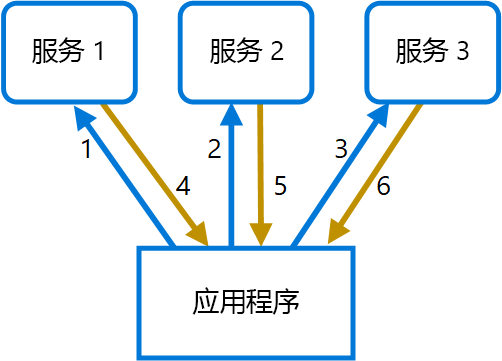
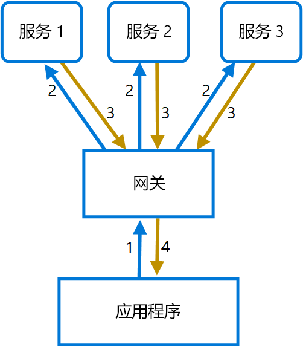

# <a name="gateway-aggregation-pattern"></a><span data-ttu-id="9e919-104">网关聚合模式</span><span class="sxs-lookup"><span data-stu-id="9e919-104">Gateway Aggregation pattern</span></span>

<span data-ttu-id="9e919-105">使用网关可将多个单独请求聚合成一个请求。</span><span class="sxs-lookup"><span data-stu-id="9e919-105">Use a gateway to aggregate multiple individual requests into a single request.</span></span> <span data-ttu-id="9e919-106">当客户端必须向不同的后端系统发出多个调用来执行某项操作时，此模式非常有用。</span><span class="sxs-lookup"><span data-stu-id="9e919-106">This pattern is useful when a client must make multiple calls to different backend systems to perform an operation.</span></span>

## <a name="context-and-problem"></a><span data-ttu-id="9e919-107">上下文和问题</span><span class="sxs-lookup"><span data-stu-id="9e919-107">Context and problem</span></span>

<span data-ttu-id="9e919-108">若要执行单个任务，客户端可能需要向不同的后端服务发出多个调用。</span><span class="sxs-lookup"><span data-stu-id="9e919-108">To perform a single task, a client may have to make multiple calls to various backend services.</span></span> <span data-ttu-id="9e919-109">依赖使用许多服务执行某项任务的应用程序必须扩展每个请求的资源。</span><span class="sxs-lookup"><span data-stu-id="9e919-109">An application that relies on many services to perform a task must expend resources on each request.</span></span> <span data-ttu-id="9e919-110">将任何新的功能或服务添加到应用程序时，需要额外的请求，从而进一步提高了资源要求并增加了网络调用。</span><span class="sxs-lookup"><span data-stu-id="9e919-110">When any new feature or service is added to the application, additional requests are needed, further increasing resource requirements and network calls.</span></span> <span data-ttu-id="9e919-111">客户端与后端之间的这种频繁通信可能会对应用程序的性能和规模产生不利影响。</span><span class="sxs-lookup"><span data-stu-id="9e919-111">This chattiness between a client and a backend can adversely impact the performance and scale of the application.</span></span>  <span data-ttu-id="9e919-112">此问题在微服务体系结构中更常见，因为围绕许多小型服务构建的应用程序原生就包含更多的跨服务调用。</span><span class="sxs-lookup"><span data-stu-id="9e919-112">Microservice architectures have made this problem more common, as applications built around many smaller services naturally have a higher amount of cross-service calls.</span></span>

<span data-ttu-id="9e919-113">在下图中，客户端向每个服务发送请求 (1,2,3)。</span><span class="sxs-lookup"><span data-stu-id="9e919-113">In the following diagram, the client sends requests to each service (1,2,3).</span></span> <span data-ttu-id="9e919-114">每个服务处理该请求，然后向应用程序返回响应 (4,5,6)。</span><span class="sxs-lookup"><span data-stu-id="9e919-114">Each service processes the request and sends the response back to the application (4,5,6).</span></span> <span data-ttu-id="9e919-115">通过延迟通常较高的移动电话网络，以这种方式使用各个请求并不高效，可能导致连接断开或请求不完整。</span><span class="sxs-lookup"><span data-stu-id="9e919-115">Over a cellular network with typically high latency, using individual requests in this manner is inefficient and could result in broken connectivity or incomplete requests.</span></span> <span data-ttu-id="9e919-116">尽管可以并行执行每个请求，但应用程序必须发送、等待并处理每个请求的数据，而所有这些操作都要通过单独的连接完成，因此增大了故障可能性。</span><span class="sxs-lookup"><span data-stu-id="9e919-116">While each request may be done in parallel, the application must send, wait, and process data for each request, all on separate connections, increasing the chance of failure.</span></span>



## <a name="solution"></a><span data-ttu-id="9e919-118">解决方案</span><span class="sxs-lookup"><span data-stu-id="9e919-118">Solution</span></span>

<span data-ttu-id="9e919-119">使用网关减少客户端与服务之间的通信频率。</span><span class="sxs-lookup"><span data-stu-id="9e919-119">Use a gateway to reduce chattiness between the client and the services.</span></span> <span data-ttu-id="9e919-120">网关会接收客户端请求，将请求分派到不同的后端系统，然后聚合结果并将其返回给请求客户端。</span><span class="sxs-lookup"><span data-stu-id="9e919-120">The gateway receives client requests, dispatches requests to the various backend systems, and then aggregates the results and sends them back to the requesting client.</span></span>

<span data-ttu-id="9e919-121">此模式可以减少应用程序向后端服务发出的请求数，并通过高延迟网络改进应用程序的性能。</span><span class="sxs-lookup"><span data-stu-id="9e919-121">This pattern can reduce the number of requests that the application makes to backend services, and improve application performance over high-latency networks.</span></span>

<span data-ttu-id="9e919-122">在下图中，应用程序网关发送一个请求 (1)。</span><span class="sxs-lookup"><span data-stu-id="9e919-122">In the following diagram, the application sends a request to the gateway (1).</span></span> <span data-ttu-id="9e919-123">该请求包含其他一些请求。</span><span class="sxs-lookup"><span data-stu-id="9e919-123">The request contains a package of additional requests.</span></span> <span data-ttu-id="9e919-124">网关分解其他这些请求，并通过将每个请求发送到相关的服务来处理每个请求 (2)。</span><span class="sxs-lookup"><span data-stu-id="9e919-124">The gateway decomposes these and processes each request by sending it to the relevant service (2).</span></span> <span data-ttu-id="9e919-125">每个服务向网关返回响应 (3)。</span><span class="sxs-lookup"><span data-stu-id="9e919-125">Each service returns a response to the gateway (3).</span></span> <span data-ttu-id="9e919-126">网关组合来自每个服务的响应，并向应用程序发送响应 (4)。</span><span class="sxs-lookup"><span data-stu-id="9e919-126">The gateway combines the responses from each service and sends the response to the application (4).</span></span> <span data-ttu-id="9e919-127">应用程序发出单个请求，并仅接收来自网关的单个响应。</span><span class="sxs-lookup"><span data-stu-id="9e919-127">The application makes a single request and receives only a single response from the gateway.</span></span>



## <a name="issues-and-considerations"></a><span data-ttu-id="9e919-129">问题和注意事项</span><span class="sxs-lookup"><span data-stu-id="9e919-129">Issues and considerations</span></span>

- <span data-ttu-id="9e919-130">网关不应在后端服务之间造成服务耦合。</span><span class="sxs-lookup"><span data-stu-id="9e919-130">The gateway should not introduce service coupling across the backend services.</span></span>
- <span data-ttu-id="9e919-131">网关应靠近后端服务，以尽量降低延迟。</span><span class="sxs-lookup"><span data-stu-id="9e919-131">The gateway should be located near the backend services to reduce latency as much as possible.</span></span>
- <span data-ttu-id="9e919-132">网关服务可能会造成单一故障点。</span><span class="sxs-lookup"><span data-stu-id="9e919-132">The gateway service may introduce a single point of failure.</span></span> <span data-ttu-id="9e919-133">请确保网关设计合理，符合应用程序的可用性要求。</span><span class="sxs-lookup"><span data-stu-id="9e919-133">Ensure the gateway is properly designed to meet your application's availability requirements.</span></span>
- <span data-ttu-id="9e919-134">网关可能造成瓶颈。</span><span class="sxs-lookup"><span data-stu-id="9e919-134">The gateway may introduce a bottleneck.</span></span> <span data-ttu-id="9e919-135">请确保网关可提供足够的性能来处理负载，并可根据预期的发展进行缩放。</span><span class="sxs-lookup"><span data-stu-id="9e919-135">Ensure the gateway has adequate performance to handle load and can be scaled to meet your anticipated growth.</span></span>
- <span data-ttu-id="9e919-136">对网关执行负载测试，确保不会对服务造成连锁故障。</span><span class="sxs-lookup"><span data-stu-id="9e919-136">Perform load testing against the gateway to ensure you don't introduce cascading failures for services.</span></span>
- <span data-ttu-id="9e919-137">使用[隔舱][bulkhead]、[断路][circuit-breaker]、[重试][retry]和超时等技术实施弹性设计。</span><span class="sxs-lookup"><span data-stu-id="9e919-137">Implement a resilient design, using techniques such as [bulkheads][bulkhead], [circuit breaking][circuit-breaker], [retry][retry], and timeouts.</span></span>
- <span data-ttu-id="9e919-138">如果一个或多个服务调用花费的时间过长，可接受超时并返回一部分数据。</span><span class="sxs-lookup"><span data-stu-id="9e919-138">If one or more service calls takes too long, it may be acceptable to timeout and return a partial set of data.</span></span> <span data-ttu-id="9e919-139">请考虑应用程序处理这种情况的方式。</span><span class="sxs-lookup"><span data-stu-id="9e919-139">Consider how your application will handle this scenario.</span></span>
- <span data-ttu-id="9e919-140">使用异步 I/O 来确保后端延迟不会导致应用程序中出现性能问题。</span><span class="sxs-lookup"><span data-stu-id="9e919-140">Use asynchronous I/O to ensure that a delay at the backend doesn't cause performance issues in the application.</span></span>
- <span data-ttu-id="9e919-141">使用关联 ID 实施分布式跟踪，以跟踪每个调用。</span><span class="sxs-lookup"><span data-stu-id="9e919-141">Implement distributed tracing using correlation IDs to track each individual call.</span></span>
- <span data-ttu-id="9e919-142">监视请求指标和响应大小。</span><span class="sxs-lookup"><span data-stu-id="9e919-142">Monitor request metrics and response sizes.</span></span>
- <span data-ttu-id="9e919-143">考虑返回缓存的数据（作为故障转移策略）来处理故障。</span><span class="sxs-lookup"><span data-stu-id="9e919-143">Consider returning cached data as a failover strategy to handle failures.</span></span>
- <span data-ttu-id="9e919-144">不要在网关中内置聚合，而应考虑将聚合服务放在网关后面。</span><span class="sxs-lookup"><span data-stu-id="9e919-144">Instead of building aggregation into the gateway, consider placing an aggregation service behind the gateway.</span></span> <span data-ttu-id="9e919-145">请求聚合的资源要求可能与网关中其他服务不同，并可能影响网关的路由和卸载功能。</span><span class="sxs-lookup"><span data-stu-id="9e919-145">Request aggregation will likely have different resource requirements than other services in the gateway and may impact the gateway's routing and offloading functionality.</span></span>

## <a name="when-to-use-this-pattern"></a><span data-ttu-id="9e919-146">何时使用此模式</span><span class="sxs-lookup"><span data-stu-id="9e919-146">When to use this pattern</span></span>

<span data-ttu-id="9e919-147">在以下情况下使用此模式：</span><span class="sxs-lookup"><span data-stu-id="9e919-147">Use this pattern when:</span></span>

- <span data-ttu-id="9e919-148">客户端需与多个后端服务通信来执行某个操作。</span><span class="sxs-lookup"><span data-stu-id="9e919-148">A client needs to communicate with multiple backend services to perform an operation.</span></span>
- <span data-ttu-id="9e919-149">客户端可能要使用延迟很高的网络，例如移动电话网络。</span><span class="sxs-lookup"><span data-stu-id="9e919-149">The client may use networks with significant latency, such as cellular networks.</span></span>

<span data-ttu-id="9e919-150">此模式可能不适用于以下情况：</span><span class="sxs-lookup"><span data-stu-id="9e919-150">This pattern may not be suitable when:</span></span>

- <span data-ttu-id="9e919-151">在执行多个不同的操作时，希望减少客户端与单个服务之间的调用次数。</span><span class="sxs-lookup"><span data-stu-id="9e919-151">You want to reduce the number of calls between a client and a single service across multiple operations.</span></span> <span data-ttu-id="9e919-152">在这种情况下，将批处理操作添加到服务可能更有利。</span><span class="sxs-lookup"><span data-stu-id="9e919-152">In that scenario, it may be better to add a batch operation to the service.</span></span>
- <span data-ttu-id="9e919-153">客户端或应用程序靠近后端服务，延迟并不是一个重要考虑因素。</span><span class="sxs-lookup"><span data-stu-id="9e919-153">The client or application is located near the backend services and latency is not a significant factor.</span></span>

## <a name="example"></a><span data-ttu-id="9e919-154">示例</span><span class="sxs-lookup"><span data-stu-id="9e919-154">Example</span></span>

<span data-ttu-id="9e919-155">以下示例演示如何使用 Lua 创建一个简单的网关聚合 NGINX 服务。</span><span class="sxs-lookup"><span data-stu-id="9e919-155">The following example illustrates how to create a simple a gateway aggregation NGINX service using Lua.</span></span>

```lua
worker_processes  4;

events {
  worker_connections 1024;
}

http {
  server {
    listen 80;

    location = /batch {
      content_by_lua '
        ngx.req.read_body()

        -- read json body content
        local cjson = require "cjson"
        local batch = cjson.decode(ngx.req.get_body_data())["batch"]

        -- create capture_multi table
        local requests = {}
        for i, item in ipairs(batch) do
          table.insert(requests, {item.relative_url, { method = ngx.HTTP_GET}})
        end

        -- execute batch requests in parallel
        local results = {}
        local resps = { ngx.location.capture_multi(requests) }
        for i, res in ipairs(resps) do
          table.insert(results, {status = res.status, body = cjson.decode(res.body), header = res.header})
        end

        ngx.say(cjson.encode({results = results}))
      ';
    }

    location = /service1 {
      default_type application/json;
      echo '{"attr1":"val1"}';
    }

    location = /service2 {
      default_type application/json;
      echo '{"attr2":"val2"}';
    }
  }
}
```

## <a name="related-guidance"></a><span data-ttu-id="9e919-156">相关指南</span><span class="sxs-lookup"><span data-stu-id="9e919-156">Related guidance</span></span>

- [<span data-ttu-id="9e919-157">用于前端的后端模式</span><span class="sxs-lookup"><span data-stu-id="9e919-157">Backends for Frontends pattern</span></span>](./backends-for-frontends.md)
- [<span data-ttu-id="9e919-158">网关卸载模式</span><span class="sxs-lookup"><span data-stu-id="9e919-158">Gateway Offloading pattern</span></span>](./gateway-offloading.md)
- [<span data-ttu-id="9e919-159">网关路由模式</span><span class="sxs-lookup"><span data-stu-id="9e919-159">Gateway Routing pattern</span></span>](./gateway-routing.md)

[bulkhead]: ./bulkhead.md
[circuit-breaker]: ./circuit-breaker.md
[retry]: ./retry.md