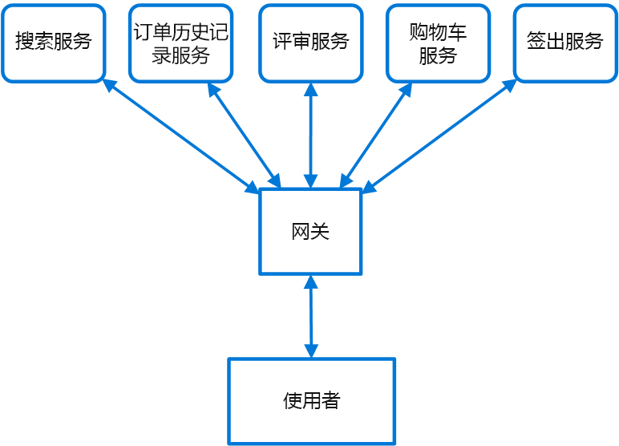

# <a name="gateway-routing-pattern"></a><span data-ttu-id="5431a-103">网关路由模式</span><span class="sxs-lookup"><span data-stu-id="5431a-103">Gateway Routing pattern</span></span>

<span data-ttu-id="5431a-104">使用单个终结点将请求路由到多个服务。</span><span class="sxs-lookup"><span data-stu-id="5431a-104">Route requests to multiple services using a single endpoint.</span></span> <span data-ttu-id="5431a-105">如果希望在单个终结点上公开多个服务，并根据请求路由到适当的服务，则此模式非常有用。</span><span class="sxs-lookup"><span data-stu-id="5431a-105">This pattern is useful when you wish to expose multiple services on a single endpoint and route to the appropriate service based on the request.</span></span>

## <a name="context-and-problem"></a><span data-ttu-id="5431a-106">上下文和问题</span><span class="sxs-lookup"><span data-stu-id="5431a-106">Context and problem</span></span>

<span data-ttu-id="5431a-107">客户端需要使用多个服务时，为每个服务设置单独的终结点并让客户端管理每个终结点是具有挑战性的。</span><span class="sxs-lookup"><span data-stu-id="5431a-107">When a client needs to consume multiple services, setting up a separate endpoint for each service and having the client manage each endpoint can be challenging.</span></span> <span data-ttu-id="5431a-108">例如，一个电子商务应用程序可以提供搜索、评价、购物车、结账和订单历史记录等服务。</span><span class="sxs-lookup"><span data-stu-id="5431a-108">For example, an e-commerce application might provide services such as search, reviews, cart, checkout, and order history.</span></span> <span data-ttu-id="5431a-109">每个服务都有一个客户端必须与之交互的不同 API，客户端必须了解每个终结点，以便连接到服务。</span><span class="sxs-lookup"><span data-stu-id="5431a-109">Each service has a different API that the client must interact with, and the client must know about each endpoint in order to connect to the services.</span></span> <span data-ttu-id="5431a-110">如果一个 API 发生变化，那么客户端也必须更新。</span><span class="sxs-lookup"><span data-stu-id="5431a-110">If an API changes, the client must be updated as well.</span></span> <span data-ttu-id="5431a-111">如果将一个服务重构为两个或多个单独的服务，则必须在服务和客户端中更改代码。</span><span class="sxs-lookup"><span data-stu-id="5431a-111">If you refactor a service into two or more separate services, the code must change in both the service and the client.</span></span>

## <a name="solution"></a><span data-ttu-id="5431a-112">解决方案</span><span class="sxs-lookup"><span data-stu-id="5431a-112">Solution</span></span>

<span data-ttu-id="5431a-113">在一组应用程序、服务或部署前放置网关。</span><span class="sxs-lookup"><span data-stu-id="5431a-113">Place a gateway in front of a set of applications, services, or deployments.</span></span> <span data-ttu-id="5431a-114">使用应用层 7 路由将请求路由到相应实例。</span><span class="sxs-lookup"><span data-stu-id="5431a-114">Use application Layer 7 routing to route the request to the appropriate instances.</span></span>

<span data-ttu-id="5431a-115">使用此模式，客户端应用程序只需了解单个终结点并与之通信。</span><span class="sxs-lookup"><span data-stu-id="5431a-115">With this pattern, the client application only needs to know about and communicate with a single endpoint.</span></span> <span data-ttu-id="5431a-116">如果服务进行合并或分解，客户端不一定需要更新。</span><span class="sxs-lookup"><span data-stu-id="5431a-116">If a service is consolidated or decomposed, the client does not necessarily require updating.</span></span> <span data-ttu-id="5431a-117">它可以继续向网关发出请求，只有路由会更改。</span><span class="sxs-lookup"><span data-stu-id="5431a-117">It can continue making requests to the gateway, and only the routing changes.</span></span>

<span data-ttu-id="5431a-118">使用网关，还可以从客户端提取后端服务，保持客户端调用的简单性，同时在网关后的后端服务中启用更改。</span><span class="sxs-lookup"><span data-stu-id="5431a-118">A gateway also lets you abstract backend services from the clients, allowing you to keep client calls simple while enabling changes in the backend services behind the gateway.</span></span> <span data-ttu-id="5431a-119">客户端调用可以被路由到任何需要处理预期的客户端行为的服务，无需更改客户端即可在网关后面添加、拆分和重组服务。</span><span class="sxs-lookup"><span data-stu-id="5431a-119">Client calls can be routed to whatever service or services need to handle the expected client behavior, allowing you to add, split, and reorganize services behind the gateway without changing the client.</span></span>


 
<span data-ttu-id="5431a-120">这种模式允许管理向用户推出更新的方式，可以帮助进行部署。</span><span class="sxs-lookup"><span data-stu-id="5431a-120">This pattern can also help with deployment, by allowing you to manage how updates are rolled out to users.</span></span> <span data-ttu-id="5431a-121">部署了新版本的服务后，它可以与现有版本并行部署。</span><span class="sxs-lookup"><span data-stu-id="5431a-121">When a new version of your service is deployed, it can be deployed in parallel with the existing version.</span></span> <span data-ttu-id="5431a-122">通过路由，你可以控制向客户端提供哪种版本的服务，能够灵活地使用各种发布策略，无论是递增、并行还是完整的推出更新都可以。</span><span class="sxs-lookup"><span data-stu-id="5431a-122">Routing let you control what version of the service is presented to the clients, giving you the flexibility to use various release strategies, whether incremental, parallel, or complete rollouts of updates.</span></span> <span data-ttu-id="5431a-123">通过在网关上进行配置更改可以快速还原部署新服务后发现的任何问题，不会影响客户端。</span><span class="sxs-lookup"><span data-stu-id="5431a-123">Any issues discovered after the new service is deployed can be quickly reverted by making a configuration change at the gateway, without affecting clients.</span></span>

## <a name="issues-and-considerations"></a><span data-ttu-id="5431a-124">问题和注意事项</span><span class="sxs-lookup"><span data-stu-id="5431a-124">Issues and considerations</span></span>

- <span data-ttu-id="5431a-125">网关服务可能会造成单一故障点。</span><span class="sxs-lookup"><span data-stu-id="5431a-125">The gateway service may introduce a single point of failure.</span></span> <span data-ttu-id="5431a-126">请确保它设计合理，符合用户的可用性需求。</span><span class="sxs-lookup"><span data-stu-id="5431a-126">Ensure it is properly designed to meet your availability requirements.</span></span> <span data-ttu-id="5431a-127">在实施时，请考虑复原和容错能力。</span><span class="sxs-lookup"><span data-stu-id="5431a-127">Consider resiliency and fault tolerance capabilities when implementing.</span></span>
- <span data-ttu-id="5431a-128">网关服务可能会造成瓶颈。</span><span class="sxs-lookup"><span data-stu-id="5431a-128">The gateway service may introduce a bottleneck.</span></span> <span data-ttu-id="5431a-129">请确保网关有足够的性能来处理负载，并且可以根据增长预期轻松扩展。</span><span class="sxs-lookup"><span data-stu-id="5431a-129">Ensure the gateway has adequate performance to handle load and can easily scale in line with your growth expectations.</span></span>
- <span data-ttu-id="5431a-130">对网关执行负载测试，确保不会对服务造成级联故障。</span><span class="sxs-lookup"><span data-stu-id="5431a-130">Perform load testing against the gateway to ensure you don't introduce cascading failures for services.</span></span>
- <span data-ttu-id="5431a-131">网关路由是第 7 级。</span><span class="sxs-lookup"><span data-stu-id="5431a-131">Gateway routing is level 7.</span></span> <span data-ttu-id="5431a-132">它可以基于 IP、端口、标头或 URL。</span><span class="sxs-lookup"><span data-stu-id="5431a-132">It can be based on IP, port, header, or URL.</span></span>

## <a name="when-to-use-this-pattern"></a><span data-ttu-id="5431a-133">何时使用此模式</span><span class="sxs-lookup"><span data-stu-id="5431a-133">When to use this pattern</span></span>

<span data-ttu-id="5431a-134">在以下情况下使用此模式：</span><span class="sxs-lookup"><span data-stu-id="5431a-134">Use this pattern when:</span></span>

- <span data-ttu-id="5431a-135">客户端需要使用可在网关后访问的多个服务。</span><span class="sxs-lookup"><span data-stu-id="5431a-135">A client needs to consume multiple services that can be accessed behind a gateway.</span></span>
- <span data-ttu-id="5431a-136">你希望通过使用单个终结点来简化客户端应用程序。</span><span class="sxs-lookup"><span data-stu-id="5431a-136">You wish to simplify client applications by using a single endpoint.</span></span>
- <span data-ttu-id="5431a-137">需要将请求从外部可寻址的终结点路由到内部虚拟终结点，例如对集群虚拟 IP 地址公开 VM 上的端口。</span><span class="sxs-lookup"><span data-stu-id="5431a-137">You need to route requests from externally addressable endpoints to internal virtual endpoints, such as exposing ports on a VM to cluster virtual IP addresses.</span></span>

<span data-ttu-id="5431a-138">当存在某个简单应用程序仅使用一两个服务时，此模式可能不适用。</span><span class="sxs-lookup"><span data-stu-id="5431a-138">This pattern may not be suitable when you have a simple application that uses only one or two services.</span></span>

## <a name="example"></a><span data-ttu-id="5431a-139">示例</span><span class="sxs-lookup"><span data-stu-id="5431a-139">Example</span></span>

<span data-ttu-id="5431a-140">使用 Nginx 作为路由器，以下为服务器的一个简单示例配置文件，将驻留在不同虚拟目录上的应用程序的请求路由到后端不同的计算机。</span><span class="sxs-lookup"><span data-stu-id="5431a-140">Using Nginx as the router, the following is a simple example configuration file for a server that routes requests for applications residing on different virtual directories to different machines at the back end.</span></span>

```
server {
    listen 80;
    server_name domain.com;

    location /app1 {
        proxy_pass http://10.0.3.10:80;
    }

    location /app2 {
        proxy_pass http://10.0.3.20:80;
    }

    location /app3 {
        proxy_pass http://10.0.3.30:80;
    }
}
```

## <a name="related-guidance"></a><span data-ttu-id="5431a-141">相关指南</span><span class="sxs-lookup"><span data-stu-id="5431a-141">Related guidance</span></span>

- [<span data-ttu-id="5431a-142">用于前端的后端模式</span><span class="sxs-lookup"><span data-stu-id="5431a-142">Backends for Frontends pattern</span></span>](./backends-for-frontends.md)
- [<span data-ttu-id="5431a-143">网关聚合模式</span><span class="sxs-lookup"><span data-stu-id="5431a-143">Gateway Aggregation pattern</span></span>](./gateway-aggregation.md)
- [<span data-ttu-id="5431a-144">网关卸载模式</span><span class="sxs-lookup"><span data-stu-id="5431a-144">Gateway Offloading pattern</span></span>](./gateway-offloading.md)


