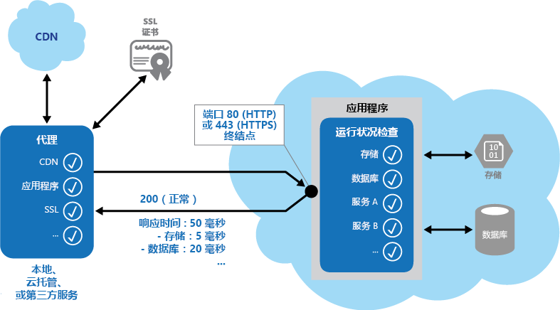

# <a name="health-endpoint-monitoring-pattern"></a>运行状况终结点监视模式

[!INCLUDE [header](../_includes/header.md)]

在应用程序中实施可让外部工具通过公开终结点定期访问的功能检查。 这有助于验证应用程序和服务的运行是否正常。

## <a name="context-and-problem"></a>上下文和问题

一种良好的做法（通常也是一项业务要求）是监视 Web 应用程序和后端服务，以确保它们保持可用且正常运行。 但是，监视云中运行的服务比监视本地服务更困难。 例如，无法完全控制宿主环境，并且服务通常依赖于平台供应商和其他公司提供的其他服务。

有许多因素会影响云托管的应用程序，例如网络延迟、底层计算与存储系统的性能和可用性，以及这些系统之间的网络带宽。 由于其中的任何因素，服务可能发生整体性或局部性的故障。 因此，必须定期验证服务是否正确运行，确保提供所需级别的可用性，这可能是服务级别协议 (SLA) 所涵盖的要求。

## <a name="solution"></a>解决方案

通过将请求发送到应用程序上的终结点来实施运行状况监视。 应用程序应执行必要的检查，并返回其状态指示。

运行状况监视检查通常结合了两个因素：

- 应用程序或服务在响应针对运行状况验证终结点的请求时执行的检查（如果有）。
- 通过执行运行状况验证检查的工具或框架分析结果。

响应代码指示应用程序的状态，并选择性地指示应用程序使用的任何组件或服务的状态。 延迟或响应时间检查由监视工具或框架执行。 下图提供了模式概览。



应用程序中运行状况监视代码可能执行的其他检查包括：
- 检查云存储或数据库的可用性和响应时间。
- 检查位于应用程序中的或者位于其他位置、但由应用程序使用的其他资源或服务。

可以使用某些服务和工具，通过将请求提交到一组可配置的终结点，并根据一组可配置的规则评估结果，来监视 Web 应用程序。 创建一个只是在系统上执行某些功能测试的服务终结点相对较为容易。

监视工具可执行的典型检查包括：

- 验证响应代码。 例如，HTTP 响应 200（正常）表示应用程序已做出响应且未出错。 监视系统可能还会检查其他响应代码以提供更全面的结果。
- 即使返回了 200（正常）状态代码，也会检查响应内容以检测错误。 这可以检测仅影响所返回网页的某个部分或服务响应的错误。 例如，检查页面标题，或查找指示返回了正确页面的特定短语。
- 测量响应时间，即网络延迟与应用程序执行请求所花费时间的合计。 如果值增大，则可能表示应用程序或网络正在出现问题。
- 检查位于应用程序外部的资源或服务，例如应用程序用来交付全局缓存中的内容的内容交付网络。
- 检查 SSL 证书过期时间。
- 测量针对应用程序 URL 执行 DNS 查找所花费的响应时间，以测量 DNS 延迟和 DNS 故障。
- 验证 DNS 查找返回的 URL 以确保条目正确。 这有助于避免恶意用户通过成功攻击 DNS 服务器进行请求重定向。

在可能的情况下，从不同的本地位置或托管位置运行这些检查来测量和比较响应时间也很有用。 理想情况下，应该从靠近客户的位置监视应用程序，以获取每个位置的准确性能视图。 除了提供更可靠的检查机制以外，结果可以帮助确定应用程序的部署位置，以及是否将其部署到多个数据中心。

此外，还应针对客户使用的所有服务实例运行测试，确保所有客户可正常运行应用程序。 例如，如果客户存储分散在多个存储帐户中，则监视过程应检查所有这些存储帐户。

## <a name="issues-and-considerations"></a>问题和注意事项

在决定如何实现此模式时，请考虑以下几点：

如何验证响应。 例如，仅凭一个 200（正常）状态代码是否足以确认应用程序在正常运行？ 尽管这是应用程序可用性的最基本测量方法，并且是此模式的最简单实现方式，但是，它在应用程序中的操作、趋势和可能即将出现的问题方面提供的信息极少。

   >  确保应用程序仅在找到并处理目标资源时才正确返回 200（正常）。 在某些情况下（例如，使用母版页托管目标网页时），即使未找到目标内容页，服务器也会发回 200（正常）状态代码而不是 404（未找到）代码。

要为应用程序公开的终结点数。 一种方法是将针对应用程序使用的核心服务至少公开一个终结点，并为低优先级服务公开另一个终结点，以便将不同级别的重要性分配给每项监视结果。 此外，请考虑公开更多的终结点，例如，为每个核心服务公开一个终结点，以获得更高的监视粒度。 例如，运行状况验证检查可能会检查应用程序使用的数据库、存储和外部地理编码服务，每个检查项需要不同级别的正常运行时间和响应时间。 如果地理编码服务或其他某个后台任务有几分钟不可用，应用程序可能仍处于正常状态。

确定是否使用进行常规访问时所用的同一个终结点进行监视，不过，要使用专门用于运行状况验证检查的特定路径，例如，在常规访问终结点上使用 /HealthCheck/{GUID}/。 这样，监视工具便可运行应用程序中的某些功能测试，例如，添加新用户注册、登录和下达测试工单，同时还可验证常规访问终结点是否可用。

响应监视请求时要在服务中收集的信息类型，以及如何返回此信息。 大多数现有工具和框架仅查看终结点返回的 HTTP 状态代码。 若要返回并验证其他信息，可能需要创建自定义监视实用工具或服务。

要收集多少信息。 在检查期间执行过多的处理可能导致应用程序过载并影响其他用户。 所需的时间可能超过监视系统的超时时间，因此会将应用程序标记为不可用。 大多数应用程序包含错误处理程序和性能计数器等检测功能用于记录性能与详细错误信息，这些信息可能已足够，而无需通过运行状况验证检查返回更多信息。

缓存终结点状态。 过于频繁地执行运行状况检查可能会产生很高的系统开销。 例如，如果通过仪表板报告运行状况，则不需要来自仪表板的每个请求都触发运行状况检查。 应该定期检查系统运行状况并缓存状态。 公开返回缓存状态的终结点。

如何配置监视终结点的安全性以保护其受到的公开访问，否则，应用程序可能会遭受恶意攻击，出现敏感信息透露或成为拒绝服务 (DoS) 攻击目标的风险。 通常应在应用程序配置中执行此操作，以便无需重启应用程序就能更新配置。 考虑使用以下一种或多种技术：

- 要求身份验证，以保护终结点。 为此，可以在请求标头中使用身份验证安全密钥，或者连同请求一起传递凭据，前提是监视服务或工具支持身份验证。

  - 使用模糊化或隐藏的终结点。 例如，在不是由默认应用程序 URL 使用的 IP 地址上公开终结点，在非标准 HTTP 端口上配置终结点，和/或使用测试页的复杂路径。 通常可以在应用程序配置中指定其他终结点地址和端口，并可以根据需要将这些终结点的条目添加到 DNS 服务器，以免直接指定 IP 地址。

  - 在终结点上公开一个可接受键值或操作模式值等参数的方法。 根据为此参数提供的值，在收到到请求时，代码可以执行一个特定的测试或一组测试；如果参数值未被识别，则代码会返回 404（未找到）错误。 可以在应用程序配置中设置识别的参数值。

     >  DoS 攻击可能只对执行基本功能测试的独立终结点产生较小的影响，而不会影响应用程序的运行。 理想情况下，请避免使用可能透露敏感信息的测试。 如果必须返回可能对攻击者有用的信息，请考虑如何防范终结点和数据受到未经授权的访问。 在这种情况下，只是依靠模糊处理并不足够。 还应考虑使用 HTTPS 连接并加密所有敏感数据，尽管这会增大服务器的负载。

- 如何访问使用身份验证保护的终结点。 并非所有工具和框架都可以配置为在运行状况验证请求中包含凭据。 例如，Microsoft Azure 内置的运行状况验证功能无法提供身份验证凭据。 某些第三方替代方案包括 [Pingdom](https://www.pingdom.com/)、[Panopta](http://www.panopta.com/)、[NewRelic](https://newrelic.com/) 和 [Statuscake](https://www.statuscake.com/)。

- 如何确保监视代理正常运行。 一种方法是公开一个只返回应用程序配置中的值，或者返回可用于测试代理的随机值的终结点。

   >  另外，请确保监视系统对自身进行检查，例如自测试和内置测试，以免发出误报结果。

## <a name="when-to-use-this-pattern"></a>何时使用此模式

此模式适合用于：
- 监视网站和 Web 应用程序，以验证可用性。
- 监视网站和 Web 应用程序以检查是否正常运行。
- 监视中间层或共享服务，以检测并隔离可能会中断其他应用程序的故障。
- 补充应用程序中的现有检测，例如性能计数器和错误处理程序。 运行状况验证检查不能取代应用程序中的日志记录和审核要求。 检测可为现有框架提供有用的信息，使它们能够监视计数器和错误日志，以检测故障或其他问题。 但是，如果应用程序不可用，则它无法提供信息。

## <a name="example"></a>示例

以下代码示例摘自 `HealthCheckController` 类（[GitHub](https://github.com/mspnp/cloud-design-patterns/tree/master/health-endpoint-monitoring) 上提供的一个用于演示此模式的示例），演示如何公开一个可执行一系列运行状况检查的终结点。

如以下 C# 代码所示，`CoreServices` 方法对应用程序中使用的服务执行一系列检查。 如果所有测试已完成运行且未出错，该方法会返回 200（正常）状态代码。 如果任何测试引发异常，该方法会返回 500（内部错误）状态代码。 如果监视工具或框架能够利用其他信息，则发生错误时，该方法可能会选择性地返回这些信息。

```csharp
public ActionResult CoreServices()
{
  try
  {
    // Run a simple check to ensure the database is available.
    DataStore.Instance.CoreHealthCheck();

    // Run a simple check on our external service.
    MyExternalService.Instance.CoreHealthCheck();
  }
  catch (Exception ex)
  {
    Trace.TraceError("Exception in basic health check: {0}", ex.Message);

    // This can optionally return different status codes based on the exception.
    // Optionally it could return more details about the exception.
    // The additional information could be used by administrators who access the
    // endpoint with a browser, or using a ping utility that can display the
    // additional information.
    return new HttpStatusCodeResult((int)HttpStatusCode.InternalServerError);
  }
  return new HttpStatusCodeResult((int)HttpStatusCode.OK);
}
```
`ObscurePath` 方法演示如何从应用程序配置中读取某个路径，并将其用作测试终结点。 此 C# 示例还演示如何接受某个 ID 作为参数，并使用它来检查有效请求。

```csharp
public ActionResult ObscurePath(string id)
{
  // The id could be used as a simple way to obscure or hide the endpoint.
  // The id to match could be retrieved from configuration and, if matched,
  // perform a specific set of tests and return the result. If not matched it
  // could return a 404 (Not Found) status.

  // The obscure path can be set through configuration to hide the endpoint.
  var hiddenPathKey = CloudConfigurationManager.GetSetting("Test.ObscurePath");

  // If the value passed does not match that in configuration, return 404 (Not Found).
  if (!string.Equals(id, hiddenPathKey))
  {
    return new HttpStatusCodeResult((int)HttpStatusCode.NotFound);
  }

  // Else continue and run the tests...
  // Return results from the core services test.
  return this.CoreServices();
}
```

`TestResponseFromConfig` 方法演示如何公开一个可以针对指定配置设置值执行检查的终结点。

```csharp
public ActionResult TestResponseFromConfig()
{
  // Health check that returns a response code set in configuration for testing.
  var returnStatusCodeSetting = CloudConfigurationManager.GetSetting(
                                                          "Test.ReturnStatusCode");

  int returnStatusCode;

  if (!int.TryParse(returnStatusCodeSetting, out returnStatusCode))
  {
    returnStatusCode = (int)HttpStatusCode.OK;
  }

  return new HttpStatusCodeResult(returnStatusCode);
}
```
## <a name="monitoring-endpoints-in-azure-hosted-applications"></a>监视 Azure 托管应用程序中的终结点

用于监视 Azure 应用程序中的终结点的一些选项包括：

- 使用 Azure 的内置监视功能。

- 使用第三方服务或框架，例 Microsoft System Center Operations Manager。

- 创建自定义实用工具，或者创建可在自己的服务器或托管服务器上运行的服务。

   >  尽管 Azure 提供了相当全面的监视选项，但你也可以使用其他服务和工具来提供附加的信息。 Azure 管理服务为警报规则提供内置监视机制。 在 Azure 门户中“管理服务”页的“警报”部分，可为服务的每个订阅最多配置 10 条警报规则。 这些规则指定服务的条件和阈值（例如 CPU 负载），或每秒的请求数或错误数，服务可以自动向每条规则中定义的地址发送电子邮件通知。

可监视的条件根据你为应用程序选择的托管机制（例如网站、云服务、虚拟机或移动服务）而异，但所有这些机制都能创建警报规则，该规则使用你在服务设置中指定的 Web 终结点。 该终结点应及时做出响应，使警报系统可以检测到应用程序在正常运行。

>  阅读有关[创建警报通知][portal-alerts]的详细信息。

如果在 Azure 云服务 Web 角色和辅助角色或虚拟机中托管应用程序，则可以利用 Azure 中的一个内置服务，即流量管理器。 流量管理器是一个路由和负载均衡服务，可以根据一系列规则和设置，将请求分发到云服务托管的应用程序的特定实例。

除了路由请求以外，流量管理器会定期针对指定的 URL、端口和相对路径执行 ping，以确定应用程序规则中定义的哪些应用程序实例处于活动状态并在响应请求。 如果流量管理器检测到状态代码 200（正常），则会将应用程序标记为可用。 其他任何状态代码会导致流量管理器将应用程序标记为脱机。 可以在流量管理器控制台中查看状态，并配置规则用于将请求重新路由到正在做出响应的其他应用程序实例。

但是，流量管理器在接收监视 URL 的响应期间只会等待 10 秒。 因此，应确保运行状况验证代码在此时限内执行，并考虑到在流量管理器与应用程序之间往返所存在的网络延迟。

>  阅读有关使用[流量管理器监视应用程序](https://azure.microsoft.com/documentation/services/traffic-manager/)的详细信息。 [多个数据中心的部署指南](https://msdn.microsoft.com/library/dn589779.aspx)中也介绍了流量管理器。

## <a name="related-guidance"></a>相关指南

实施此模式时，可参考以下指南：
- [检测和遥测指南](https://msdn.microsoft.com/library/dn589775.aspx)。 服务和组件的运行状况检查通常是通过探测来完成的，但是，另一种有用的做法是准备好相关的信息，用于监视应用程序的性能，并检测运行时发生的事件。 可将此数据作为附加信息传回到监视工具用于运行状况监视。 《检测和遥测指南》探讨了如何收集检测功能在应用程序中收集的远程诊断信息。
- [接收警报通知][portal-alerts]。
- 此模式包含一个可下载的[示例应用程序](https://github.com/mspnp/cloud-design-patterns/tree/master/health-endpoint-monitoring)。

[portal-alerts]: https://azure.microsoft.com/documentation/articles/insights-receive-alert-notifications/
