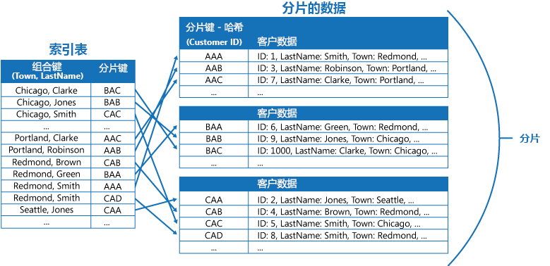

# 索引表模式

[!INCLUDE [header](../_includes/header.md)]

基于数据存储中经常由查询引用的字段创建索引。 此模式可让应用程序更快地找到要从数据存储中检索的数据，从而提高了查询性能。

## 上下文和问题

许多数据存储使用主键组织实体集合的数据。 应用程序可以使用此键来查找和检索数据。 下图显示了一个保存客户信息的数据存储示例。 主键为“客户 ID”。 该图显示按主键（“客户 ID”）组织的客户信息。

尽管主键对于基于此键值提取数据的查询很有作用，但如果应用程序需要基于其他某个字段检索数据，则可能无法使用主键。 在客户示例中，如果应用程序只是通过引用其他某个属性（例如，客户所在的城镇）的值查询数据，则无法使用“客户 ID”主键来检索客户。 若要执行此类查询，应用程序可能需要提取并检查每条客户记录，而这是一个缓慢的过程。

许多关系数据库管理系统支持辅助索引。 辅助索引是按一个或多个非主键（辅助键）字段组织的独立数据结构，指示每个索引值的数据的存储位置。 辅助索引中的项通常已按辅助键的值排序，以便快速查找数据。 这些索引通常由数据库管理系统自动维护。

可以根据需要创建任意数目的辅助索引来支持应用程序执行的不同查询。 例如，在关系数据库中“客户 ID”是主键的“客户”表中，如果应用程序经常根据客户所在的城镇查找客户，则基于城镇字段添加一个辅助索引会很有作用。

尽管辅助索引在关系数据库系统中很常见，但云应用程序使用的大多数 NoSQL 数据存储并不提供等效的功能。

## 解决方案

如果数据存储不支持辅助索引，你可以通过创建自己的索引表来手动模拟辅助索引。 索引表按指定的键组织数据。 根据所需的辅助索引数目以及应用程序执行的查询性质，我们通常可以使用三种策略来构建索引表。

第一种策略是复制每个索引表中的数据，但按不同的键（完全非规范化）组织这些数据。 下图显示了按“城镇”和“姓氏”组织相同客户信息的索引表。

如果相对于使用每个键查询数据的次数而言数据较为静态，则此策略适用。 如果数据较为动态，则维护每个索引表所产生的处理开销会变得过大，因此，此方法并不有效。 此外，如果数据量极大，存储重复数据所需的空间量也很大。

第二种策略是创建按不同键组织的规范化索引表，并使用主键来引用原始数据，而不是复制数据，如下图所示。 原始数据称为事实数据表。

此方法可节省空间，并减少维护重复数据所产生的开销。 其缺点在于，应用程序必须使用辅助键执行两项查找操作才能找到数据。 应用程序必须在索引表中查找数据的主键，然后使用主键来查找事实数据表中的数据。

第三种策略是创建按不同键组织的、可复制经常检索的字段的部分规范化索引表。 引用事实数据表即可访问不经常访问的字段。 下图显示了如何在每个索引表中复制经常访问的数据。

如果使用此策略，可以在前两种方法之间取得平衡。 可以使用单个查找操作快速检索用于常见查询的数据，同时，空间和维护开销不如复制整个数据集那么大。

如果应用程序经常通过指定值的组合（例如，“查找居住在 Redmond，且姓氏为 Smith 的所有客户”）查询数据，则你可以针对索引表中的项实现“城镇”属性与“姓氏”属性串联形式的键。 下图显示了基于组合键的索引表。 这些键先按“城镇”排序，然后，针对具有相同“城镇”值的记录按“姓氏”排序。

索引表可以加速分片数据的查询操作，当分片键已经过哈希处理时特别有用。 下图显示了将“客户 ID”哈希用作分片键的示例。 索引表可按未经哈希处理的值（“城镇”和“姓氏”）组织数据，并提供经过哈希处理的分片键作为查找数据。 这样，在应用程序需要检索处于某个范围内的数据，或者需要根据未经哈希处理的键的顺序提取数据时，就无需反复计算哈希键（此操作的开销较高）。 例如，通过在索引表中找到匹配项（所有项存储在相邻的块中），可以快速解决类似于“查找居住在 Redmond 的所有客户”的查询。 然后，可以使用索引表中存储的分片键，遵循对客户数据的引用进行操作。

## 问题和注意事项

在决定如何实现此模式时，请考虑以下几点：

- 维护辅助索引所产生的开销可能很大。 必须分析并了解应用程序使用的查询。 仅当应用程序定期使用索引表时，才创建索引表。 不要创建推理索引表来支持应用程序不会执行或只是偶尔执行的查询。
- 复制索引表中的数据可能会明显增大存储成本方面的开销，以及维护多个数据副本所需的工作量。
- 将索引表实现为引用原始数据的规范化结构需要应用程序执行两项查找操作才能找到数据。 第一项操作搜索索引表以检索主键，第二项操作使用主键提取数据。
- 如果系统基于极大型数据集整合了许多索引表，则可能很难维持索引表与原始数据之间的一致性。 也许可以围绕最终一致性模型设计应用程序。 例如，若要插入、更新或删除数据，应用程序可以向队列发布一条消息，让单独的任务执行该操作，并维护以异步方式引用此数据的索引表。 有关实施最终一致性的详细信息，请参阅[数据一致性入门](https://msdn.microsoft.com/library/dn589800.aspx)。

   >  Microsoft Azure 存储表支持对同一个分区中保存的数据所发生的更改执行事务更新（称为实体组事务）。 如果可以在同一个分区中存储一个事实数据表以及一个或多个索引表的数据，则可以使用此功能来帮助确保一致性。

- 索引表本身可能已分区或分片。

## 何时使用此模式

如果应用程序经常需要使用除主键（或分片键）以外的某个键检索数据，则使用此模式可提高查询性能。

在以下情况下，此模式可能不起作用：

- 数据是易失性的。 索引表可能很快过时，因此变得低效，或者维护索引表所产生的开销超过了它所带来的成本节省。
- 选作索引表辅助键的字段没有辨别性，可能只包含少量的值（例如性别）。
- 选作索引表辅助键的字段的数据值平衡性极度偏斜。 例如，如果 90% 的记录包含某个字段中的相同值，那么，基于此字段创建并维护用于查找数据的索引表所产生的开销，可能比依序搜索整个数据更高。 但是，如果查询经常性地以剩余 10% 的记录中的值为目标，则此索引可能非常有用。 应该了解应用程序执行的查询以及执行这些查询的频率。

## 示例

Azure 存储表针对云中运行的应用程序提供高度可缩放的键/值数据存储。 应用程序可以通过指定键来存储和检索数据值。 数据值可以包含多个字段，但数据项的结构对表存储不透明，而只是以字节数组的形式处理数据项。

Azure 存储表还支持分片。 分片键包括两个元素：分区键和行键。 具有相同分区键的项存储在同一个分区（分片）中，这些项根据行键顺序存储在分片中。 经过优化的表存储可以执行查询来提取处于分区中行键值相邻范围内的数据。 若要构建在 Azure 表中存储信息的云应用程序，应考虑使用此功能将数据结构化。

例如，假设某个应用程序存储有关电影的信息。 该应用程序经常按流派（动作片、纪录片、历史剧、喜剧、戏曲等等）查询电影。 如下图所示，可以通过使用流派作为分区键，将电影名称指定为行键，来创建一个包含每个流派的分区的 Azure 表。

如果应用程序还需要按男主角查询电影，则此方法不是很有效。 在此情况下，可以单独创建一个充当索引表的 Azure 表。 分区键是男主角，行键是电影名称。 每个男主角的数据存储在单独的分区中。 如果某部电影有多个男主角，则同一部电影将出现在多个分区中。

可以通过改编前面“解决方案”部分中所述的第一种方法，复制每个分区保存的值中的电影数据。 但是，每部电影可能会复制多次（针对每个男主角复制一次），因此，更有效的做法可能是部分性地非规范化数据，以支持最常见的查询（例如其他男主角的姓名），并让应用程序通过包含查找流派分区中整个信息所需的分区键，来检索所有剩余的详细信息。 “解决方案”部分中的第三个选项描述了此方法。 下图演示了此方法。

## 相关模式和指南

实现此模式时可能，可能也会与以下模式和指南相关：

- [Data Consistency Primer](https://msdn.microsoft.com/library/dn589800.aspx)（数据一致性入门）。 必须维护索引表，因为它编制索引的数据会发生更改。 在云中执行修改数据的相同事务过程中，可能无法或者不适合执行更新索引的操作。 在此情况下，最终一致性方法更合适。 提供有关围绕最终一致性的问题的信息。
- [分片模式](./sharding.md)。 索引表模式经常与通过分片分区的数据结合使用。 分片模式提供有关如何将数据存储划分为分片集的更多信息。
- [具体化视图模式](./materialized-view.md)。 此模式不是通过编制数据的索引来支持汇总数据的查询，可能更适合用于创建数据的具体化视图。 此文档介绍如何基于数据生成预先填充的视图来支持高效汇总查询。
