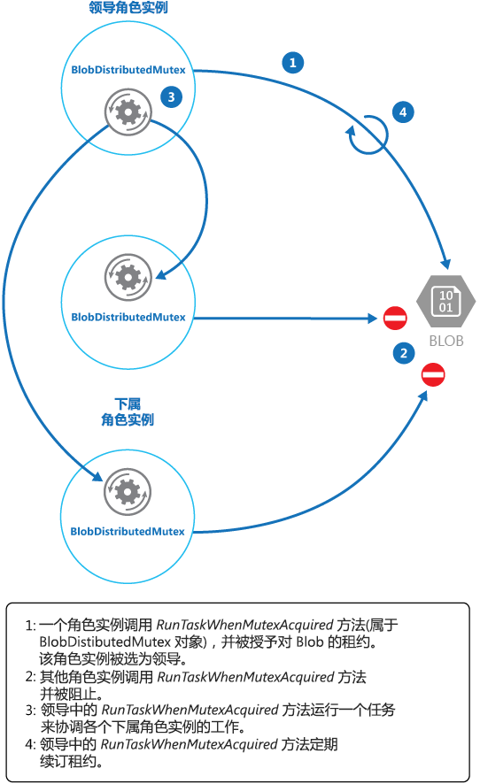

# <a name="leader-election-pattern"></a>领导选拔模式

[!INCLUDE [header](../_includes/header.md)]

通过选拔一个实例作为领导来负责管理其他实例，对分布式应用程序中协作性实例集合所执行的操作进行协调。 这有助于确保各个实例互不冲突，不会导致争用共享资源或者意外地干扰其他实例正在执行的工作。

## <a name="context-and-problem"></a>上下文和问题

典型的云应用程序具有许多以协调方式执行的任务。 这些任务可能全部是运行相同代码并需要访问相同资源的实例，也可能并行协作来执行复杂计算的各个部分。

任务实例可能大多数时间分别运行，但也可能需要协调每个实例的操作来确保它们互不冲突，不会导致争用共享资源或者意外地干扰其他任务实例正在执行的工作。

例如：

- 在实现水平缩放的基于云的系统中，同一任务的多个实例可以同时运行，并且每个实例为一个不同的用户提供服务。 如果这些实例向共享资源进行写入，则需要协调它们的操作以防止各个实例覆盖其他实例所做的更改。
- 如果各个任务并行执行复杂计算的各个元素，则需要在它们全部完成时对结果进行聚合。

任务实例全部是对等的，因此没有可以充当协调器或聚合器的天生领导。

## <a name="solution"></a>解决方案

应当选拨单个任务实例来充当领导，并且此实例应当对其他下属任务实例的操作进行协调。 如果所有任务实例都运行相同的代码，则它们每个都能够充当领导。 因此，必须仔细管理选拨流程以防止两个或更多实例同时接管领导角色。

系统必须提供用于选拨领导的可靠机制。 此方法必须能够应对网络中断或进程失败等事件。 在许多解决方案中，下属任务实例通过某种类型的检测信号方法或通过轮询来监视领导。 如果指定的领导意外终止，或者网络故障导致领导不可供下属任务实例使用，则它们需要选拨一个新领导。

有几种策略可用于从分布式环境中的一组任务中选拨领导，这些策略包括：
- 选择具有排名最低的实例或进程 ID 的任务实例。
- 争夺一个共享的分布式互斥体。 第一个获得该互斥体的任务实例成为领导。 但是，系统必须确保，当领导终止或者与系统的其余部分断开了连接时，必须释放该互斥体以允许其他任务实例成为领导。
- 实现常用的领导选拨算法之一，例如[欺负算法](http://www.cs.colostate.edu/~cs551/CourseNotes/Synchronization/BullyExample.html)或[环型算法](http://www.cs.colostate.edu/~cs551/CourseNotes/Synchronization/RingElectExample.html)。 这些算法假设选举中的每个候选者都具有唯一的 ID，并且它可以可靠地与其他候选者进行通信。

## <a name="issues-and-considerations"></a>问题和注意事项

在决定如何实现此模式时，请考虑以下几点：
- 选拨领导的流程在发生暂时性和永久性故障后应该能够复原。
- 必须能够检测领导何时发生故障或变得不可用（例如由于通信故障）。 需要多快的检测速度取决于系统。 某些系统也许能够在没有领导的情况下短时行使职责，在这期间，暂时性错误也许能够得到修复。 在其他情况下，可能需要立即检测到领导故障并触发新的选举。
- 在实现水平自动缩放的系统中，如果系统收缩并关闭一些计算资源，则领导可能会终止。
- 使用共享的分布式互斥体将依赖于提供该互斥体的外部服务。 该服务成为单一故障点。 如果它由于任何原因而变得不可用，则系统将无法选拨领导。
- 使用单个专用进程作为领导是简单明了的方法。 但是，如果该进程发生故障，则在它重新启动时可能会导致明显的延迟。 如果其他进程在等待领导来协调某个操作，则导致的延迟可能会影响其他进程的性能和响应时间。
- 手动实现领导选拨算法之一可以在调整和优化代码方面提供最大的灵活性。

## <a name="when-to-use-this-pattern"></a>何时使用此模式

当分布式应用程序（例如云托管解决方案）中的任务需要仔细协调并且没有天生的领导时，请使用此模式。

>  请避免使领导成为系统中的瓶颈。 领导的用途是协调下属任务的工作，并且它并非必须参与此工作本身 &mdash; 尽管当该任务未被选举为领导时应该能够参与此工作。

在下列情况下，此模式可能不适用：
- 有一个天生的领导或有一个能够始终充当领导的专用进程。 例如，可以实现一个对任务实例进行协调的单一实例进程。 如果此进程发生故障或变得不正常，则系统可以将其关闭并重新启动它。
- 任务之间的协调可以使用更轻量的方法来实现。 例如，如果多个任务实例只是需要实现对共享资源的协调访问，则更好的解决方案是使用乐观或悲观锁定来控制访问。
- 有更合适的第三方解决方案。 例如，Microsoft Azure HDInsight 服务（基于 Apache Hadoop）使用 Apache Zookeeper 提供的服务来协调用于收集和汇总数据的 map 和 reduce 任务。

## <a name="example"></a>示例

LeaderElection 解决方案中的 DistributedMutex 项目（[GitHub](https://github.com/mspnp/cloud-design-patterns/tree/master/leader-election) 上提供的演示了此模式的示例）展示了如何在 Azure 存储 blob 上使用租约来提供用于实现共享的分布式互斥体的机制。 可以使用此互斥体从 Azure 云服务中的一组角色实例中选拨领导。 第一个获得租约的角色实例被选拨为领导，并且它一直保持为领导，直到它释放租约或者无法续订租约。 其他角色实例可以继续监视 blob 租约，以防领导不再可用。

>  Blob 租约是一个针对 blob 的排他写入锁。 单个 blob 在任一时刻只能是一个租约的主题。 角色实例可以请求针对指定 blob 的租约，并且如果没有其他角色实例持有针对同一 blob 的租约，则会向其授予租约。 否则，请求将引发异常。
> 
> 为避免出现错误的角色实例无限期地保留租约，请指定租约的生存期。 当生存期过期时，租约将变得可用。 不过，当角色实例持有租约时，它可以请求续订租约，并且将会授权它在更长的一段时间内使用该租约。 如果角色实例希望保留租约，则它可以不断重复此过程。
> 有关如何租用 blob 的详细信息，请参阅 [Lease Blob (REST API)](https://msdn.microsoft.com/library/azure/ee691972.aspx)（租用 Blob (REST API)）。

下面的 C# 示例中的 `BlobDistributedMutex` 类包含 `RunTaskWhenMutexAquired` 方法，该方法使得角色实例能够尝试获得针对指定 blob 的租约。 当创建 `BlobDistributedMutex` 对象时（此对象是示例代码中包括的一个简单结构），会将该 blob 的详细信息（名称、容器和存储帐户）传递给 `BlobSettings` 对象中的构造函数。 该构造函数还接受一个 `Task`，后者引用了角色实例在成功获得针对 blob 的租约并被选拨为领导后应当运行的代码。 请注意，名为 `BlobLeaseManager` 的一个单独的帮助程序类中实现了用于处理有关获得租约的低层详细信息的代码。

```csharp
public class BlobDistributedMutex
{
  ...
  private readonly BlobSettings blobSettings;
  private readonly Func<CancellationToken, Task> taskToRunWhenLeaseAcquired;
  ...

  public BlobDistributedMutex(BlobSettings blobSettings,
           Func<CancellationToken, Task> taskToRunWhenLeaseAquired)
  {
    this.blobSettings = blobSettings;
    this.taskToRunWhenLeaseAquired = taskToRunWhenLeaseAquired;
  }

  public async Task RunTaskWhenMutexAcquired(CancellationToken token)
  {
    var leaseManager = new BlobLeaseManager(blobSettings);
    await this.RunTaskWhenBlobLeaseAcquired(leaseManager, token);
  }
  ...
```

上面的代码示例中的 `RunTaskWhenMutexAquired` 方法调用下面的代码示例中显示的 `RunTaskWhenBlobLeaseAcquired` 方法来实际获得租约。 `RunTaskWhenBlobLeaseAcquired` 方法以异步方式运行。 如果成功获得租约，则表明该角色实例已被选拨为领导。 `taskToRunWhenLeaseAcquired` 委托的用途是执行对其他角色实例进行协调的工作。 如果没有获得租约，则表明另一角色实例已被选拨为领导并且当前角色实例保持为下属。 请注意，`TryAcquireLeaseOrWait` 方法是一个帮助程序方法，它使用 `BlobLeaseManager` 对象来获得租约。

```csharp
  private async Task RunTaskWhenBlobLeaseAcquired(
    BlobLeaseManager leaseManager, CancellationToken token)
  {
    while (!token.IsCancellationRequested)
    {
      // Try to acquire the blob lease.
      // Otherwise wait for a short time before trying again.
      string leaseId = await this.TryAquireLeaseOrWait(leaseManager, token);

      if (!string.IsNullOrEmpty(leaseId))
      {
        // Create a new linked cancellation token source so that if either the
        // original token is canceled or the lease can't be renewed, the
        // leader task can be canceled.
        using (var leaseCts =
          CancellationTokenSource.CreateLinkedTokenSource(new[] { token }))
        {
          // Run the leader task.
          var leaderTask = this.taskToRunWhenLeaseAquired.Invoke(leaseCts.Token);
          ...
        }
      }
    }
    ...
  }
```

领导启动的任务也是以异步方式运行的。 当此任务在运行时，下面的代码示例中显示的 `RunTaskWhenBlobLeaseAquired` 方法会定期尝试续订租约。 这有助于确保该角色实例保持为领导。 在示例解决方案中，续订请求之间的延迟小于为租约的持续时间指定的时间，以防止其他角色实例被选拨为领导。 如果续订由于任何原因而失败，则任务会被取消。

如果租约未能续订或者任务被取消（可能是由于角色实例关闭），则会释放租约。 此时，可能会将此角色实例或另一角色实例选拨为领导。 下面的代码摘录显示了过程的这一部分。

```csharp
  private async Task RunTaskWhenBlobLeaseAcquired(
    BlobLeaseManager leaseManager, CancellationToken token)
  {
    while (...)
    {
      ...
      if (...)
      {
        ...
        using (var leaseCts = ...)
        {
          ...
          // Keep renewing the lease in regular intervals.
          // If the lease can't be renewed, then the task completes.
          var renewLeaseTask =
            this.KeepRenewingLease(leaseManager, leaseId, leaseCts.Token);

          // When any task completes (either the leader task itself or when it
          // couldn't renew the lease) then cancel the other task.
          await CancelAllWhenAnyCompletes(leaderTask, renewLeaseTask, leaseCts);
        }
      }
    }
  }
  ...
}
```

`KeepRenewingLease` 方法是一个帮助程序方法，它使用 `BlobLeaseManager` 对象来续订租约。 `CancelAllWhenAnyCompletes` 方法取消作为前两个参数指定的任务。 下图展示了使用 `BlobDistributedMutex` 类来选拨领导并运行对操作进行协调的任务。




下面的代码示例展示了如何以辅助角色使用 `BlobDistributedMutex` 类。 此代码在开发存储的租约容器中获得对名为 `MyLeaderCoordinatorTask` 的 blob 的租约，并指定当角色实例被选拨为领导时应当运行 `MyLeaderCoordinatorTask` 方法中定义的代码。

```csharp
var settings = new BlobSettings(CloudStorageAccount.DevelopmentStorageAccount,
  "leases", "MyLeaderCoordinatorTask");
var cts = new CancellationTokenSource();
var mutex = new BlobDistributedMutex(settings, MyLeaderCoordinatorTask);
mutex.RunTaskWhenMutexAcquired(this.cts.Token);
...

// Method that runs if the role instance is elected the leader
private static async Task MyLeaderCoordinatorTask(CancellationToken token)
{
  ...
}
```

请注意关于示例解决方案的以下要点：
- Blob 是潜在的单一故障点。 如果 blob 服务变得不可用，或者无法访问，则领导将无法续订租约，并且没有任何其他角色实例能够获得租约。 在这种情况下，将没有任何角色实例能够充当领导。 不过，blob 服务设计为具有复原能力，因此，blob 服务完全失败的情况几乎不可能出现。
- 如果领导正在执行的任务停滞，则领导可能会继续续订租约，从而阻止其他角色实例获得租约并接管领导角色来协调任务。 在现实世界中，应当频繁检查领导的运行状况。
- 选举流程具有不确定性。 无法就哪个角色实例将获得 blob 租约并成为领导做出任何假设。
- 用作 blob 租约的目标的 blob 不应当用于任何其他用途。 如果某个角色实例尝试将数据存储在此 blob 中，则此数据将无法访问，除非该角色实例是领导并持有 blob 租约。

## <a name="related-patterns-and-guidance"></a>相关模式和指南

实现此模式时，以下指南可能也比较有用：
- 此模式具有可下载的[示例应用程序](https://github.com/mspnp/cloud-design-patterns/tree/master/leader-election)。
- [Autoscaling Guidance](https://msdn.microsoft.com/library/dn589774.aspx)（自动缩放指南）。 可以根据应用程序上负载的变化来启动和停止任务主机的实例。 自动缩放有助于在峰值处理期间保持吞吐量和性能。
- [计算分区指南](https://msdn.microsoft.com/library/dn589773.aspx)。 本指南介绍了如何将任务分配给云服务中的主机，以便最大程度地降低运行成本，同时保持服务的可伸缩性、性能、可用性和安全性。
- [基于任务的异步模式](https://msdn.microsoft.com/library/hh873175.aspx)。
- 展示了[欺负算法](http://www.cs.colostate.edu/~cs551/CourseNotes/Synchronization/BullyExample.html)的示例。
- 展示了[环型算法](http://www.cs.colostate.edu/~cs551/CourseNotes/Synchronization/RingElectExample.html)的示例。
- Microsoft Open Technologies 网站上的 [Apache Zookeeper on Microsoft Azure](https://msopentech.com/opentech-projects/apache-zookeeper-on-windows-azure-2/)（Microsoft Azure 上的 Apache Zookeeper）一文。
- [Apache Curator](http://curator.apache.org/) - Apache ZooKeeper 的一个客户端库。
- MSDN 上的 [Lease Blob (REST API)](https://msdn.microsoft.com/library/azure/ee691972.aspx)（租用 Blob (REST API)）一文。
