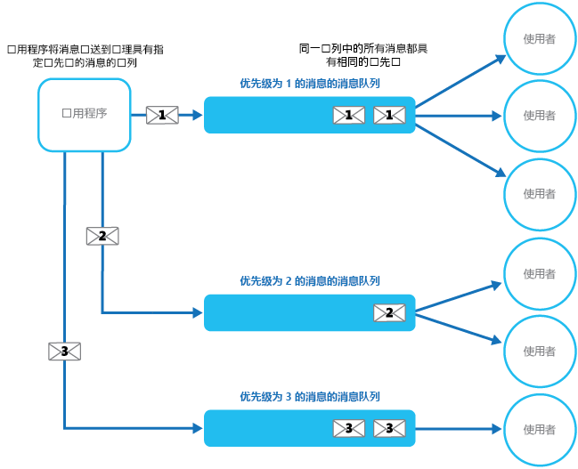

# <a name="priority-queue-pattern"></a>优先级队列模式

[!INCLUDE [header](../_includes/header.md)]

为发送到服务的请求确定优先级，以便高优先级请求能够得到比低优先级请求更快速地接收和处理。 在向各个客户端提供不同服务级别保障的应用程序中，此模式非常有用。

## <a name="context-and-problem"></a>上下文和问题

应用程序可以将特定任务委托给其他服务，例如执行后台处理，或与其他应用程序、服务集成。 在云中，消息队列通常用于将任务委托给后台处理。 在许多情况下，服务接收请求的顺序并不重要。 但在某些情况下，必须确定特定请求的优先级。 相对于应用程序以前发送的优先级较低的请求，这些请求应先于得到处理。

## <a name="solution"></a>解决方案

队列通常是先入先出 (FIFO) 结构，使用者通常是按将消息发布到队列的相同顺序接收的。 但是，某些消息队列支持优先级消息传送。 发布消息的应用程序可以分配优先级，并且队列中的消息自动重新排序，以便优先级高的消息先于优先级较低的消息收到。 该图显示具有优先级消息传送的队列。


> 大多数消息队列实现都支持多个使用者（遵照[使用者竞争模式](https://msdn.microsoft.com/library/dn568101.aspx)），使用者进程数可以根据需要增加或减少。

在不支持基于优先级的消息队列的系统中，替代解决方法是将每个优先级的消息保持一个单独队列。 应用程序负责将消息发布到相应的队列。 每个队列可以有单独的使用者池。 优先级较高的队列可以有比优先级较低的队列更大的使用者池，并且在速度更快的硬件上运行。 下图显示了对每个优先级使用单独的消息队列。




此策略的变体是使用单个使用者池，这些使用者首先检查高优先级队列中是否有消息，然后才从优先级较低的队列中提取消息。 使用单个使用者进程池的解决方案与使用多个队列的解决方案存在一些语义上的差异：前者使用单个队列支持具有不同优先级的消息，或使用多个队列，每个队列处理一种优先级的消息；而后者对每个队列使用一个单独池。

在单个池方法中，优先级较高的消息始终先于优先级较低的消息得到接收和处理。 理论上，可以不断取代并且可能永远不会处理优先级非常低的消息。 在多个池方法中，始终都会处理优先级较低的消息，只不过不会像优先级较高的消息那样快（具体要取决于它们具有的可用池和资源的相对大小）。

使用优先级排队机制可以提供以下好处：

- 它能让应用程序满足需要确定可用性或性能优先级的业务需求，比如为特定的客户群提供不同的服务级别。

- 它有助于最大程度地减少运营成本。 在单个队列方法中，可以根据需要按比例缩减使用者数量。 仍然会先处理高优先级的消息（但速度可能较慢），较低优先级的消息可能会延迟更长时间。 如果已实施对每个队列使用单个使用者池的多个消息队列方法，则可以减少较低优先级队列的使用者池，或者甚至通过阻止侦听这些队列消息的所有使用者来暂停处理某些极低优先级的队列。

- 多个消息队列方法可以基于处理要求为消息分区，从而帮助最大程度地提高应用程序性能和可伸缩性。 例如，重要任务可以由立即运行的接收方优先处理，而不太重要的后台任务可以由计划在相对空闲期间运行的接收方处理。

## <a name="issues-and-considerations"></a>问题和注意事项

在决定如何实现此模式时，请考虑以下几点：

在解决方案的上下文中定义优先级。 例如，高优先级可能表示消息应在 10 秒内处理。 确定处理高优先级项目的要求，以及应分配以满足这些条件的其他资源。

决定是否必须在任何低优先级项目之前处理所有的高优先级项目。 如果消息由单个使用者池处理，则必须提供这样一种机制：如果较高优先级的消息出现，该机制可以取代和暂停正在处理低优先级消息的任务。

在多队列方法中，使用单个使用者进程池侦听所有队列，而不是每个队列都有专用的使用者池时，使用者必须应用一种算法，以确保始终都先为较高优先级队列中的消息提供服务，之后才是较低优先级队列中的消息。

监控高优先级和低优先级队列的处理速度，确保这些队列中的消息按照预期速度进行处理。

如果需要保证低优先级的消息得到处理，则必须实施具有多个使用者池的多消息队列方法。 或者，在支持消息优先级的队列中，可以随时间的推移动态提高已排队消息的优先级。 但是，这种方法取决于提供上述功能的消息队列。

对每个消息优先级使用单独的队列，这种方法最适用于具有少量定义完善的优先级的系统。

消息优先级可以由系统按逻辑方式确定。 例如，可以将它们指定为“付费客户”或“非费付费客户”，而不是采用显式高和低优先级消息。 相对于非费付费客户的消息，系统可以分配更多的资源来处理付费客户的消息，具体要取决于业务模型。

可能会有与检查队列消息相关的财务和处理成本（每次发布或检索消息时，以及每次查询队列中的消息时，某些商业消息传递系统都会收取少量费用）。 上述成本会在检查多个队列时增加。

可以基于池所服务的队列长度动态调整使用者池的大小。 有关详细信息，请参阅[自动缩放指南](https://msdn.microsoft.com/library/dn589774.aspx)。

## <a name="when-to-use-this-pattern"></a>何时使用此模式

此模式在以下情况非常有用：

- 系统必须处理具有不同优先级的多个任务。

- 应为不同的用户或租户提供不同优先级。

## <a name="example"></a>示例

Microsoft Azure 不提供本身支持通过排序自动确定消息优先级的排队机制。 但是，Microsoft Azure 提供的 Azure 服务总线主题和订阅支持这样的一种排队机制 - 提供消息筛选以及各种灵活功能，使它最适用于大多数的优先级队列实现。

Azure 解决方案可以实施服务总线主题，应用程序可以按照与队列相同的方式将消息发布到该主题。 消息可以包含应用程序定义的自定义属性形式的元数据。 服务总线订阅可以与该主题相关联，并且这些订阅可以基于属性筛选消息。 应用程序将消息发送到主题时，消息被定向到可由使用者读取的相应订阅中。 使用者进程可以使用与消息队列相同的语义从订阅中检索消息（订阅是一个逻辑队列）。 下图展示了如何通过 Azure 服务总线主题和订阅实施优先级队列。


在上图中，应用程序创建了多条消息，并且在每个消息中分配一个名为 `Priority`、具有值 `High` 或 `Low` 的自定义属性。 应用程序将这些消息发布到主题。 主题包含两个相关联的订阅，都用于通过检查 `Priority` 属性筛选消息。 一个订阅接受 `Priority` 属性设置为 `High` 的消息，另一个接受 `Priority` 属性设置为 `Low` 的消息。 使用者池从每个订阅中读取消息。 高优先级的订阅具有更大的池，与低优先级池中的使用者相比，这些高优先级池中的使用者可能在功能更强大、可用资源更多的计算机上运行。

请注意，本例中指定的高优先级和低优先级消息没有什么特别的。 它们只是每个消息中指定为属性的标签，用于将消息定向到特定订阅。 如果需要其他优先级，相对容易的做法是创建更多订阅和使用者进程池来处理这些优先级。

[GitHub](https://github.com/mspnp/cloud-design-patterns/tree/master/priority-queue) 上提供的 PriorityQueue 解决方案包含了该方法的实现。 该解决方案包含两个名为 `PriorityQueue.High` 和 `PriorityQueue.Low` 的辅助角色项目。 这些辅助角色继承自 `PriorityWorkerRole` 类，包含用于连接 `OnStart` 方法中指定的订阅的功能。

`PriorityQueue.High` 和 `PriorityQueue.Low` 辅助角色连接到由其配置设置定义的不同订阅。 管理员可以为要运行的每个角色配置不同的数量。 通常辅助角色 `PriorityQueue.High` 会比辅助角色 `PriorityQueue.Low` 有更多实例。

`PriorityWorkerRole` 类中的 `Run` 方法将安排要为队列中收到的每条消息运行的虚拟 `ProcessMessage` 方法（也在 `PriorityWorkerRole` 类中定义）。 以下代码显示了 `Run` 和 `ProcessMessage` 方法。 PriorityQueue.Shared 项目中定义的 `QueueManager` 类提供了使用 Azure 服务总线队列的帮助程序方法。

```csharp
public class PriorityWorkerRole : RoleEntryPoint
{
  private QueueManager queueManager;
  ...

  public override void Run()
  {
    // Start listening for messages on the subscription.
    var subscriptionName = CloudConfigurationManager.GetSetting("SubscriptionName");
    this.queueManager.ReceiveMessages(subscriptionName, this.ProcessMessage);
    ...;
  }
  ...

  protected virtual async Task ProcessMessage(BrokeredMessage message)
  {
    // Simulating processing.
    await Task.Delay(TimeSpan.FromSeconds(2));
  }
}
```
`PriorityQueue.High` 和 `PriorityQueue.Low` 辅助角色都会替代 `ProcessMessage` 方法的默认功能。 下面的代码显示 `PriorityQueue.High` 辅助角色的 `ProcessMessage` 方法。

```csharp
protected override async Task ProcessMessage(BrokeredMessage message)
{
  // Simulate message processing for High priority messages.
  await base.ProcessMessage(message);
  Trace.TraceInformation("High priority message processed by " +
    RoleEnvironment.CurrentRoleInstance.Id + " MessageId: " + message.MessageId);
}
```

应用程序将消息发布到与 `PriorityQueue.High` 和 `PriorityQueue.Low` 辅助角色使用的订阅相关的主题时，它通过使用如下面的代码示例中所示的 `Priority` 自定义属性指定优先级。 此代码（在 PriorityQueue.Sender 项目的 `WorkerRole` 类中实施）使用 `QueueManager` 类的 `SendBatchAsync` 帮助程序方法将消息分批发布到主题。

```csharp
// Send a low priority batch.
var lowMessages = new List<BrokeredMessage>();

for (int i = 0; i < 10; i++)
{
  var message = new BrokeredMessage() { MessageId = Guid.NewGuid().ToString() };
  message.Properties["Priority"] = Priority.Low;
  lowMessages.Add(message);
}

this.queueManager.SendBatchAsync(lowMessages).Wait();
...

// Send a high priority batch.
var highMessages = new List<BrokeredMessage>();

for (int i = 0; i < 10; i++)
{
  var message = new BrokeredMessage() { MessageId = Guid.NewGuid().ToString() };
  message.Properties["Priority"] = Priority.High;
  highMessages.Add(message);
}

this.queueManager.SendBatchAsync(highMessages).Wait();
```

## <a name="related-patterns-and-guidance"></a>相关模式和指南

实现此模式时，可能也会与以下模式和指南相关：

- 演示此模式的示例可在 [GitHub](https://github.com/mspnp/cloud-design-patterns/tree/master/priority-queue) 上找到。

- [异步消息传送入门](https://msdn.microsoft.com/library/dn589781.aspx)。 处理请求的使用者服务可能需要将回复发送到发布请求的应用程序的实例。 提供可用于实现请求/响应消息传递的策略的相关信息。

- [使用者竞争模式](competing-consumers.md)。 若要增加队列的吞吐量，可以让多个使用者侦听同一个队列以及并行处理任务。 使用者会争用消息，但应只有一个使用者能够处理每条消息。 提供有关实现此方法的优点和缺点的详细信息。

- [限制模式](throttling.md)。 可以通过使用队列实现限制。 优先级消息传递可用于确保来自重要应用程序、或正由高价值客户运行的应用程序的请求优先于来自不太重要的应用程序的请求。

- [自动缩放指南](https://msdn.microsoft.com/library/dn589774.aspx)。 可以根据队列长度，扩展处理队列的使用者进程池的大小。 此策略可以帮助提高性能，尤其适用于处理高优先级消息的池。

- Abhishek Lal 博客上的 [Enterprise Integration Patterns with Service Bus](http://abhishekrlal.com/2013/01/11/enterprise-integration-patterns-with-service-bus-part-2/)（使用服务总线的企业集成模式）。

