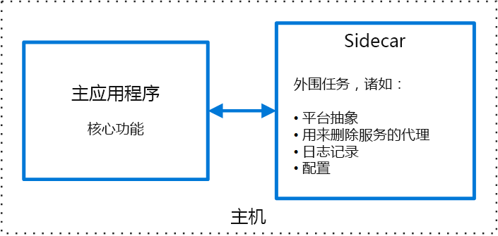

# 挎斗模式

将应用程序的组件部署到单独的进程或容器中，以提供隔离和封装。 使用此模式还可以使用异构组件和技术来构建应用程序。

此模式之所以称作“挎斗”(Sidecar)，是因为它类似于三轮摩托车上的挎斗。 在此模式中，挎斗附加到父应用程序，为应用程序提供支持性功能。 此外，挎斗与父应用程序具有相同的生命周期：与父应用程序一起创建，一起停用。 挎斗模式有时也称为搭档模式，这是一种分解模式。

## 上下文和问题

应用程序和服务通常需要相关的功能，例如监视、日志记录、配置和网络服务。 可以作为单独的组件或服务实现这些外围任务。

如果这些功能已紧密集成到应用程序中，则可以在运行应用程序的同一个进程中运行这些功能，从而有效利用共享资源。 但是，这也意味着无法对它们进行适当的隔离，其中一个组件发生故障就可能影响到其他组件甚至整个应用程序。 此外，通常需要使用与父应用程序相同的语言来实现这些功能。 因此，组件和应用程序之间保持着密切的相互依赖关系。

如果应用程序已分解为服务，则可以使用不同的语言和技术构建每个服务。 尽管这提高了灵活性，但同时也意味着，每个组件具有自身的依赖关系，需要使用特定于语言的库来访问底层平台，以及与父应用程序共享的所有资源。 此外，将这些功能部署为单独的服务可能会增大应用程序的延迟。 管理这些特定于语言的接口的代码和依赖关系还可能会显著增大复杂性，尤其是托管、部署和管理的复杂性。

## 解决方案

将一组内聚性的任务与主应用程序放在一起，不过，要将它们放在其自身的进程或容器内，以便为跨语言的平台服务提供同构接口。

挎斗服务不一定要属于应用程序的一部分，而只是与应用程序相连接。 不管它位于哪个位置，父应用程序都会跟随。 挎斗是连同主应用程序一起部署的支持性进程或服务。 以三轮摩托车为例，挎斗附加在一辆三轮摩托车上，每辆三轮摩托车有自身的挎斗。 同样，挎斗服务与其父应用程序具有相同的生命周期。 对于应用程序的每个实例，都会部署一个挎斗实例，并连同应用程序实例一起托管该挎斗实例。

使用挎斗模式的好处包括：

- 在运行时环境和编程语言方面，挎斗与其主应用程序相互独立，因此，无需为每种语言开发一个挎斗。

- 挎斗可以访问主应用程序所能访问的资源。 例如，一个挎斗可以监视该挎斗和主应用程序使用的系统资源。

- 挎斗与主应用程序保持密切的距离，因此两者之间的通信不存在明显的延迟。

- 即使是对于不提供扩展性机制的应用程序，也仍可以使用挎斗来扩展功能，只需在主应用程序所用的同一主机或子容器中，将挎斗附加为自身的进程即可。

挎斗模式通常与容器一起使用，因而称作挎斗容器或搭档容器。

## 问题和注意事项

- 请考虑部署服务、进程或容器时所用的部署和打包格式。 容器特别适合用于挎斗模式。
- 在设计挎斗服务时，请慎重决定进程间通信机制。 除非达不到性能要求，否则请尽量使用不区分语言或框架的技术。
- 在将功能放入挎斗之前，请考虑该功能是作为独立的服务还是更传统的守护程序运行更有利。
- 此外，请考虑是否能够以库的形式或使用传统扩展机制实现功能。 特定于语言的库可能提供更深度的集成和更少的网络开销。

## 何时使用此模式

在以下情况下使用此模式：

- 主应用程序使用一组异类语言和框架。 使用不同框架以不同语言编写的应用程序可以使用挎斗服务中的某个组件。
- 某个组件由远程团队或不同的组织拥有。
- 某个组件或功能必须共置在应用程序所在的同一台主机上
- 希望某个服务与主应用程序具有相同的整体生命周期，但同时又能独立更新该服务。
- 需要精细控制特定资源或组件的资源限制。 例如，想要限制特定组件使用的内存量。 可将组件部署为挎斗，然后独立于主应用程序管理内存用量。

此模式可能不适用于以下情况：

- 当进程间通信需要优化时。 父应用程序与挎斗服务之间的通信会产生一定的开销，执行调用时存在明显的延迟。 频繁通信的接口可能无法接受这种弊端。
- 在某些小型应用程序中，为每个实例部署挎斗服务所产生的资源开销会抵消隔离所带来的优势。
- 当服务需要以不同于或独立于主应用程序的方式缩放时。 如果存在这种情况，将功能部署为独立的服务可能更好。

## 示例

挎斗模式适用于许多方案。 一些常见示例：

- 基础结构 API。 基础结构开发团队创建了一个连同每个应用程序一起部署的服务，而不是特定于语言的客户端库，来访问基础结构。 该服务作为挎斗加载，为基础结构服务（包括日志记录、环境数据、配置存储、发现、运行状况检查和监视程序服务）提供一个公用层。 挎斗还监视父应用程序的主机环境和进程（或容器），并将信息记录到集中式服务。
- 管理 NGINX/HAProxy。 将 NGINX 与用于监视环境状态的挎斗服务一起部署，然后，在需要更改状态时更新 NGINX 配置文件并回收进程。
- 代表挎斗。 将[代表](./ambassador.md)服务部署为挎斗。 应用程序通过代表发出调用，后者可处理日志记录、路由、断路、和其他连接相关功能。
- 卸载代理。 将 NGINX 代理放在 node.js 服务实例的前面，以便为服务提供静态文件内容。

## 相关指南

- [代表模式](./ambassador.md)
