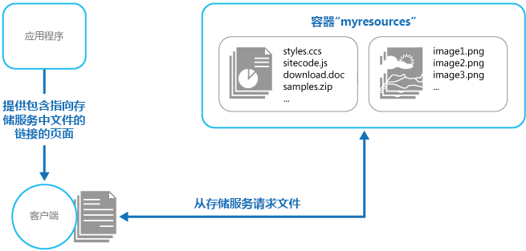

# <a name="static-content-hosting-pattern"></a>静态内容托管模式

[!INCLUDE [header](../_includes/header.md)]

将静态内容部署到基于云的存储服务，再由后者将它们直接传送给客户端。 这样可降低对可能很昂贵的计算实例的需求。

## <a name="context-and-problem"></a>上下文和问题

Web 应用程序通常包括某些静态内容元素。 此静态内容可能包括 HTML 页面和其他资源，例如可供客户端使用的图像和文档，以 HTML 页面内容（例如内联图像、样式表、客户端 JavaScript 文件）或独立下载项目（例如 PDF 文档）的形式提供。

Web 服务器已经过优化，可以通过高效且动态地执行页面代码以及对输出进行缓存来优化请求，但仍需处理下载静态内容的请求。 这样会占用那些通常可以有更好用途的处理周期。

## <a name="solution"></a>解决方案

在大多数云托管环境中，可以将应用程序的部分资源和静态页面放置到存储服务中，尽量降低对计算实例的需求（例如，使用较小或较少的实例）。 基于云的存储相对于计算实例来说，其成本通常要低得多。

将应用程序的一些部件托管在存储服务中时，主要考虑因素涉及应用程序的部署，以及保护那些不应提供给匿名用户的资源。

## <a name="issues-and-considerations"></a>问题和注意事项

在决定如何实现此模式时，请考虑以下几点：

- 托管的存储服务必须公开一个 HTTP 终结点，供下载静态资源的用户访问。 某些存储服务也支持 HTTPS，因此可以将资源托管在需要 SSL 的存储服务中。

- 为了尽量提高性能和可用性，可考虑使用内容交付网络 (CDN)，将存储容器的内容缓存在全球的多个数据中心。 但是，可能需要支付 CDN 使用费用。

- 通常情况下，存储帐户会默认进行异地复制，确保在发生可能影响某个数据中心的事件时能够复原。 这意味着，IP 地址可能会变，但 URL 会保持不变。

- 当某些内容位于存储帐户中，而另一些内容却位于托管计算实例中时，部署和更新应用程序会变得更具挑战性。 可能需要执行单独的部署，并对应用程序和内容进行版本控制以方便管理，尤其是在静态内容包含脚本文件或 UI 组件的情况下。 但是，如果只需更新静态资源，则可直接将其上传到存储帐户，不需重新部署应用程序包。

- 存储服务可能不支持使用自定义域名。 在这种情况下，需在链接中指定资源的完整 URL，因为其所在的域不同于动态生成的包含链接的内容所在的域。

- 必须将存储容器配置为允许公开读取访问，但不得将其配置为允许公开写入访问，防止用户上传内容。 考虑使用辅助密钥或令牌来控制不允许匿名使用的资源的访问。有关详细信息，请参阅[辅助密钥模式](valet-key.md)。

## <a name="when-to-use-this-pattern"></a>何时使用此模式

此模式适合用于：

- 尽量降低包含了一些静态资源的网站和应用程序的托管成本。

- 尽量降低只包含静态内容和资源的网站的托管成本。 如果托管提供商的存储系统允许，可以将全静态网站整个托管在存储帐户中。

- 公开在其他托管环境或本地服务器上运行的应用程序的静态资源和内容。

- 通过内容交付网络将内容置于多个地理区域，该网络将存储帐户的内容缓存在全球的多个数据中心。

- 监视成本和带宽使用情况。 使用单独的存储帐户来存储部分或全部静态内容，这样可以更容易地将此方面的成本与托管和运行时成本区分开来。

此模式在以下情况中可能不起作用：

- 应用程序需对静态内容进行某些处理，然后才能将其交付给客户端。 例如，可能需要向文档添加时间戳。

- 静态内容的量很小。 从单独的存储检索此内容的开销可能超过将其与计算资源分开获得的成本优势。

## <a name="example"></a>示例

位于 Azure Blob 存储中的静态内容可以直接通过 Web 浏览器来访问。 对于可以公开给客户端的存储，Azure 提供基于 HTTP 的界面。 例如，Azure Blob 存储容器中的内容使用以下形式的 URL 公开：

`http://[ storage-account-name ].blob.core.windows.net/[ container-name ]/[ file-name ]`


上传内容时，需创建一个或多个 Blob 容器来存储文件和文档。 请注意，新容器的默认权限为“专用”，必须将其更改为“公用”，然后客户端才能访问其中的内容。 如果必须防止内容被匿名访问，可以实施[辅助密钥模式](valet-key.md)，使用户必须提供有效的令牌才能下载资源。

> [Blob Service Concepts](https://msdn.microsoft.com/library/azure/dd179376.aspx)（Blob 服务概念）介绍了 Blob 存储及其访问和使用方式。

每页中的链接会指定资源的 URL，客户端可以直接从存储服务对其进行访问。 下图说明了如何直接从存储服务交付应用程序静态部分的内容。




交付给客户端的页面中的链接必须指定 Blob 容器和资源的完整 URL。 例如，包含公共容器中图像的链接的页面可能包含以下 HTML。

```html

```

> 如果通过辅助密钥（例如 Azure 共享访问签名）对资源进行保护，则链接的 URL 中必须包含该签名。

[GitHub](https://github.com/mspnp/cloud-design-patterns/tree/master/static-content-hosting) 中提供了一个名为 StaticContentHosting 的解决方案，演示了如何使用外部存储来存储静态资源。 StaticContentHosting.Cloud 项目包含的配置文件指定了用于存储静态内容的存储帐户和容器。

```xml
<Setting name="StaticContent.StorageConnectionString"
         value="UseDevelopmentStorage=true" />
<Setting name="StaticContent.Container" value="static-content" />
```

StaticContentHosting.Web 项目的 Settings.cs 文件中的 `Settings` 类包含用于提取这些值并生成一个字符串值（其中包含云存储帐户容器 URL）的方法。

```csharp
public class Settings
{
  public static string StaticContentStorageConnectionString {
    get
    {
      return RoleEnvironment.GetConfigurationSettingValue(
                              "StaticContent.StorageConnectionString");
    }
  }

  public static string StaticContentContainer
  {
    get
    {
      return RoleEnvironment.GetConfigurationSettingValue("StaticContent.Container");
    }
  }

  public static string StaticContentBaseUrl
  {
    get
    {
      var account = CloudStorageAccount.Parse(StaticContentStorageConnectionString);

      return string.Format("{0}/{1}", account.BlobEndpoint.ToString().TrimEnd('/'),
                                      StaticContentContainer.TrimStart('/'));
    }
  }
}
```

StaticContentUrlHtmlHelper.cs 文件中的 `StaticContentUrlHtmlHelper` 类公开了一个名为 `StaticContentUrl` 的方法，该方法生成的 URL 包含云存储帐户的路径，但前提是传递给它的 URL 以 ASP.NET 根路径字符 (~) 开头。

```csharp
public static class StaticContentUrlHtmlHelper
{
  public static string StaticContentUrl(this HtmlHelper helper, string contentPath)
  {
    if (contentPath.StartsWith("~"))
    {
      contentPath = contentPath.Substring(1);
    }

    contentPath = string.Format("{0}/{1}", Settings.StaticContentBaseUrl.TrimEnd('/'),
                                contentPath.TrimStart('/'));

    var url = new UrlHelper(helper.ViewContext.RequestContext);

    return url.Content(contentPath);
  }
}
```

Views\Home 文件夹中的 Index.cshtml 文件包含的图像元素使用 `StaticContentUrl` 方法为其 `src` 属性创建 URL。

```html

```

## <a name="related-patterns-and-guidance"></a>相关模式和指南

- 演示此模式的示例可在 [GitHub](https://github.com/mspnp/cloud-design-patterns/tree/master/static-content-hosting) 上找到。
- [辅助密钥模式](valet-key.md)。 如果不应将目标资源提供给匿名用户，则需对静态内容所在的存储实施安全措施。 描述如何使用令牌或密钥，让客户端以受限直接访问方式访问特定资源或服务（例如云托管存储服务）。
- Infosys 博客：[An efficient way of deploying a static web site on Azure](http://www.infosysblogs.com/microsoft/2010/06/an_efficient_way_of_deploying.html)（在 Azure 中高效部署静态网站）。
- [Blob Service Concepts](https://msdn.microsoft.com/library/azure/dd179376.aspx)（Blob 服务概念）
