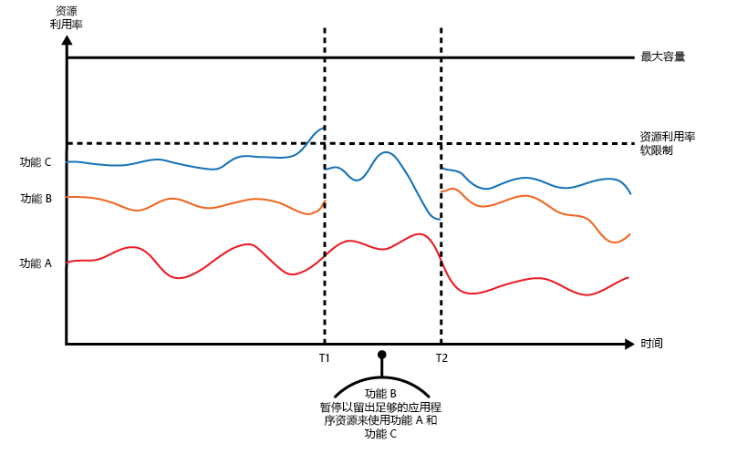
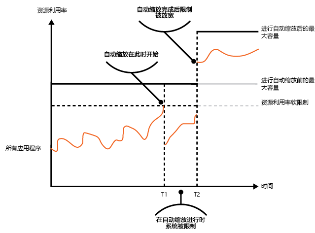
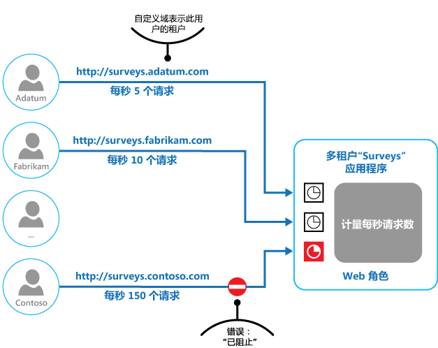

# 限制模式

[!INCLUDE [header](../_includes/header.md)]

控制应用程序实例、单个租户或整个服务对资源的消耗。 这样，即使需求增加给资源带来了极大的负载，系统也可以继续运行以满足服务级别协议。

## 上下文和问题

云应用程序上的负载通常根据活动用户的数目或其执行的活动的类型随时间而变。 例如，在营业时间内可能有更多用户处于活动状态，而系统在每个月末可能需要执行计算成本高昂的分析。 还可能会突然出现意外的活动量激增。 如果系统的处理要求超出了可用资源的容量，则系统性能将降低甚至会失败。 如果系统必须满足约定的服务级别，则这样的故障可能不可接受。

有许多策略可用于处理云中的各种负载，具体取决于应用程序的业务目标。 其中一个策略是使用自动缩放随时将预配的资源与用户需求进行匹配。 这可以持续满足用户需求，同时优化运行成本。 不过，虽然自动缩放可以触发附加资源的预配，但此预配不是即时的。 如果需求增长快速，则可能有一段时间会出现资源不足。

## 解决方案

自动缩放的一个替代策略是仅允许应用程序使用某个限制内的资源，当达到该限制时会对资源进行限制。 系统应当监视其对资源的使用情况，以便在使用量超出阈值时可以限制来自一个或多个用户的请求。 这将使系统可以继续正常工作并满足所实施的所有服务级别协议 (SLA)。 有关监视资源使用情况的详细信息，请参阅[检测和遥测指南](https://msdn.microsoft.com/library/dn589775.aspx)。

系统可以实现多个限制策略，包括：

- 如果用户在给定时间段内访问系统 API 的频率超过了每秒 n 次，则拒绝来自该用户的请求。 这要求系统对运行应用程序的每个租户或用户使用的资源量进行计量。 有关详细信息，请参阅 [Service Metering Guidance](https://msdn.microsoft.com/library/dn589796.aspx)（服务计量指南）。

- 禁用所选非基本服务的功能或将其降级，以便基本服务可以使用充足的资源畅通运行。 例如，如果应用程序对视频输出进行流式处理，则可以切换到较低的分辨率。

- 使用负载调节来均衡活动量（[基于队列的负载调节模式](./queue-based-load-leveling.md)中更详细地介绍了此方法）。 在多租户环境中，此方法会降低每个租户的性能。 如果系统必须支持混合使用具有不同 SLA 的租户，则高值租户的工作可以立即执行。 其他租户的请求可以推迟，并在积压工作得到缓解时再进行处理。 可以使用[优先级队列模式][]来帮助实现此方法。

- 推迟以低优先级应用程序或租户的身份执行的操作。 可以暂停或限制这些操作，但是要生成一个异常来通知租户系统正忙并且应当稍后重试该操作。

下图显示了一个面积图，其中显示了使用三项功能的应用程序在一段时间内的资源使用情况（包括内存、CPU、带宽和其他因素）。 一项功能是一个功能区域，例如，执行一组特定任务的组件、执行复杂计算的代码段，或者提供内存中缓存等服务的元素。 这些功能的标签为 A、B 和 C。

> 代表某项功能的线条正下方的区域表示应用程序在调用此功能时使用的资源。 例如，代表功能 A 的线条下方的区域显示了使用功能 A 的应用程序使用的资源，代表功能 A 和功能 B 的线条之间的区域表示调用功能 B 的应用程序使用的资源。将每个功能的区域聚合起来将显示系统的资源使用总量。

上图阐释了推迟操作的效果。 恰好在时间 T1 之前，分配给使用这些功能的所有应用程序的资源达到了阈值（资源使用量限制）。 此时，这些应用程序处于耗尽可用资源的危险中。 在此系统中，功能 B 没有功能 A 或功能 C 重要，因此已暂时将其禁用并释放其使用的资源。 在时间 T1 和 T2 之间，使用功能 A 和功能 C 的应用程序继续正常运行。 最终，这两项功能的资源使用量降低，到时间 T2 时已有足够的容量使功能 B 重新运行。

还可以组合使用自动缩放和限制方法来帮助保持应用程序的响应能力并满足 SLA。 如果预计需求会保持在高位，则在系统横向扩展期间，限制是一种临时解决方案。此时，可以还原系统的完整功能。

下图显示了一个面积图，其中显示了在系统中运行的所有应用程序在一段时间内使用的总体资源，并且展示了可以如何将限制与自动缩放组合使用。

在时间 T1，达到了指定了资源使用量软限制的阈值。 此时，系统可以开始横向扩展。不过，如果新资源没有足够快速地变得可用，则可能会耗尽现有资源，并且系统可能会失败。 为防止发生此情况，会暂时对系统进行限制，如上文所述。 当自动缩放已完成并且附加的资源可用时，可以放宽限制。

## 问题和注意事项

在决定如何实现此模式时，应考虑以下几点：

- 限制应用程序和要使用的策略是一个体系结构决策，它影响系统的整体设计。 在应用程序设计过程中应尽早考虑采用限制功能，因为在实施系统后不容易添加此功能。

- 限制必须快速执行。 系统必须能够检测活动量增加并相应地作出反应。 在负载减轻后，系统还必须能够快速恢复其原始状态。 这需要持续捕获并监视相应的性能数据。

- 如果某个服务需要暂时拒绝用户请求，则它应当返回一个特定的错误代码，以便客户端应用程序能够了解拒绝执行操作的原因是由于受到限制。 客户端应用程序可以等待一段时间，然后重试请求。

- 在系统进行自动缩放期间，可以使用限制作为临时措施。 在某些情况下，如果活动量激增是突发性的并且预计不会持续太长时间，则仅进行限制而不进行缩放会更好，因为缩放可能会大大增加运行成本。

- 如果在系统进行自动缩放期间使用限制作为临时措施，并且资源需求增长非常快速，则&mdash;即使在受限制模式下运行，系统也可能无法继续正常工作。 如果这不可接受，请考虑维护更大的容量预留并配置更积极的自动缩放。

## 何时使用此模式

使用此模式：

- 确保系统继续满足服务级别协议。

- 防止单个租户独占应用程序提供的资源。

- 处理活动量激增。

- 通过限制使系统保持正常运行所需的最大资源级别，帮助对系统进行成本优化。

## 示例

最后一图展示了如何在多租户系统中实现限制。 每个租户组织中的用户访问云托管的应用程序，并且在其中填写并提交调查。 应用程序包含检测机制，用以监视这些用户向应用程序提交请求的速率。

为了防止一个租户中的用户影响应用程序对所有其他用户的响应能力和可用性，可以针对任何一个租户中的用户每秒可以提交的请求数施加限制。 应用程序会阻止超出了此限制的请求。

## 相关模式和指南

实现此模式时，以下模式和指南也可能相关：

- [检测和遥测指南](https://msdn.microsoft.com/library/dn589775.aspx)。 若要进行限制，需要收集关于服务使用程度的信息。 介绍了如何生成和捕获自定义监视信息。
- [服务计量指南](https://msdn.microsoft.com/library/dn589796.aspx)。 介绍了如何计量服务使用量以便了解它们的使用情况。 此信息可以用于确定如何对服务进行限制。
- [Autoscaling Guidance](https://msdn.microsoft.com/library/dn589774.aspx)（自动缩放指南）。 可以将限制用作系统进行自动缩放期间的临时措施，或者使用它消除系统进行自动缩放的需求。 包含了关于自动缩放策略的信息。
- [基于队列的负载调节模式](./queue-based-load-leveling.md)。 基于队列的负载调节是用于实现限制的常用机制。 队列可以充当缓冲区，用以帮助稳定将应用程序发送的请求提交到服务的速率。
- [优先级队列模式](./priority-queue.md)。 系统可以使用优先级队列作为其限制策略的一部分来保持关键或高值应用程序的性能，同时降低不太重要的应用程序的性能。
