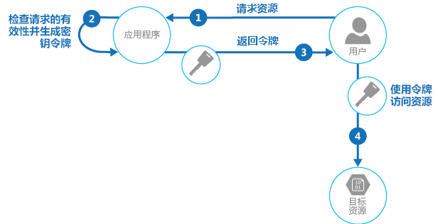

# <a name="valet-key-pattern"></a>附属密钥模式

[!INCLUDE [header](../_includes/header.md)]

使用向客户端授予对特定资源的受限直接访问权限的令牌，以便卸载从应用程序进行的传输数据。 这在使用云托管存储系统或队列的应用程序中特别有用，可以最大程度降低成本并提高可伸缩性和性能。

## <a name="context-and-problem"></a>上下文和问题

客户端程序和 Web 浏览器通常需要对应用程序的存储读取和写入文件或数据流。 通常，应用程序会处理数据的移动 &mdash; 通过从存储提取数据并流式传输到客户端，或通过从客户端读取上传的流并将它存储在数据存储中。 但是，此方法会占用宝贵资源，如计算、内存和带宽。

数据存储能够直接处理数据的上传和下载，而无需应用程序执行任何处理来移动这些数据。 但是，这通常要求客户端有权访问存储的安全凭据。 这可以是一种有用技术，可最大程度减少数据传输成本和应用程序扩大要求，并最大程度提高性能。 不过，这意味着应用程序不再能够管理数据的安全性。 客户端与数据存储连接以便进行直接访问之后，应用程序无法充当守护程序。 它不再控制过程，无法阻止从数据存储进行的后续上传或下载。

这在需要为不受信任的客户端提供服务的分布式系统中不是现实的方法。 相反，应用程序必须能够以精细方式安全地控制对数据的访问，但是仍设置此连接，然后允许客户端直接与数据存储进行通信以执行所需的读取或写入操作，从而减少服务器上的负载。

## <a name="solution"></a>解决方案

你需要解决以下问题：在存储无法管理客户端的身份验证和授权的情况下，控制对数据存储的访问。 一种典型解决方案是限制对数据存储公用连接的访问，并向客户端提供数据存储可以验证的密钥或令牌。

此密钥或令牌通常称为附属密钥。 它提供对特定资源的限时访问，仅允许执行预定义操作，如读取和写入存储或队列，或是在 Web 浏览器中上传和下载。 应用程序可以快速、方便地创建附属密钥并颁发给客户端设备和 Web 浏览器，使客户端可以执行所需操作，而无需应用程序直接处理数据传输。 这样可从应用程序和服务器中消除处理开销以及对性能和可伸缩性的影响。

客户端使用此令牌在特定时间段内访问数据存储中的特定资源，并且访问权限会受到特定限制，如图所示。 在指定时间段之后，密钥会成为无效状态，不允许访问资源。



还可以配置具有其他依赖项（如数据范围）的密钥。 例如，根据数据存储功能，密钥可以指定数据存储中的一个完整表，或是仅指定表中的特定行。 在云存储系统中，密钥可以指定一个容器，或仅指定容器中的特定项。

应用程序也可以使密钥失效。 如果客户端通知服务器数据传输操作已完成，则这是很有用的方法。 服务器随后可以使该密钥失效，防止进一步的访问。

使用此模式可以简化资源访问管理，因为无需创建用户并进行身份验证，授予权限，然后再次删除用户。 通过此模式还可以轻松地限制位置、权限和有效期 &mdash; 只需在运行时生成密钥即可实现所有这些目的。 重要因素是尽可能严格地限制有效期，特别是资源的位置，以便接收者只能将它用于预期用途。

## <a name="issues-and-considerations"></a>问题和注意事项

在决定如何实现此模式时，请考虑以下几点：

**管理密钥的有效性状态和有效期**。 如果泄露或受侵害，则密钥可有效地解锁目标项，使它可在有效期内用于恶意用途。 根据颁发方式，密钥通常可以进行撤销或禁用。 可以更改服务器端策略，也可以使签名时使用的服务器密钥失效。 指定较短的有效期可最大程度降低允许对数据存储进行未经授权操作的风险。 但是，如果有效期太短，则客户端可能无法在密钥过期之前完成操作。 如果需要对受保护资源进行多次访问，则允许授权用户在有效期过期之前续订密钥。

**控制密钥提供的访问级别**。 通常，密钥应只允许用户执行完成任务所需的操作，例如只读访问（如果客户端不应能够将数据上传到数据存储）。 对于文件上传，常常指定提供只写权限的密钥以及位置和有效期。 准确指定密钥所应用于的资源或资源集至关重要。

**考虑如何控制用户的行为**。 实现此模式意味着会失去一些对用户有权访问的资源的控制权。 可以施加的控制级别受可用于服务或目标数据存储的策略和权限的功能所限制。 例如，通常无法创建密钥来限制要写入存储的数据的大小或密钥可以用于访问文件的次数。 这可能会对数据传输导致巨大的意外成本（即使由预期客户端所使用），可能由导致重复上传或下载的代码错误所引起。 若要尽可能限制文件可以上传的次数，请强制客户端在一个操作完成时通知应用程序。 例如，某些数据存储会引发应用程序代码可以用于监视操作和控制用户行为的事件。 但是在一个租户的所有用户使用相同密钥的多租户方案中，难以对各个用户强制实施配额。

**验证，并根据需要清理所有上传的数据**。 授予密钥访问权限的恶意用户可以上传旨在危害系统的数据。 或者，授权用户上传的数据可能无效，以及在处理时，可能会导致错误或系统故障。 若要防止此情况出现，请确保所有上传的数据在使用之前都经过验证，并检查是否存在恶意内容。

**审核所有操作**。 许多基于密钥的机制可以记录诸如上传、下载和失败这类操作。 这些日志通常可以合并到一个审核进程中，还可用于计费（如果基于文件大小或数据量对用户进行收费）。 使用日志可检测可能由密钥提供程序方面的问题或意外删除存储的访问策略所导致的身份验证失败。

**安全地传递密钥**。 密钥可以嵌入在用户在网页中激活的 URL 中，也可以在服务器重定向操作中使用，以便自动进行下载。 应始终使用 HTTPS 通过安全通道传递密钥。

**在传输中保护敏感数据**。 通过应用程序传递的敏感数据通常会使用 SSL 或 TLS 进行传递，应对直接访问数据存储的客户端强制执行此操作。

实现此模式时要注意的其他问题包括：

- 如果客户端不会（或无法）向服务器通知操作完成，并且唯一的限制是密钥的有效期，则应用程序无法执行审核操作，如对上传或下载数进行计数，或阻止多次上传或下载。

- 可以生成的密钥策略的灵活性可能会受到限制。 例如，某些机制仅允许使用定时有效期。 其他一些机制则无法指定足够的读取/写入权限粒度。

- 如果指定密钥或令牌有效期的开始时间，请确保它稍早于当前服务器时间，从而允许使用可能略微不同步的服务器时钟。 如果未指定，则默认情况下通常是当前服务器时间。

- 包含密钥的 URL 会记录在服务器日志文件中。 虽然密钥通常会在使用日志文件进行分析之前过期，不过请确保限制对它们的访问。 如果日志数据传输到监视系统或存储在其他位置，请考虑实现延迟以防止密钥泄漏，直到其有效期过期后。

- 如果客户端代码在 Web 浏览器中运行，则浏览器可能需要支持跨域资源共享 (CORS)，以便使在 Web 浏览器中执行的代码可以从向页面提供服务的一个域访问不同域中的数据。 某些较旧浏览器和某些数据存储不支持 CORS，在这些浏览器中运行的代码可能能够使用附属密钥提供对不同域（如云存储帐户）中的数据的访问。

## <a name="when-to-use-this-pattern"></a>何时使用此模式

此模式可用于以下情况：

- 最大程度减少资源加载并最大程度提高性能和可伸缩性。 使用附属密钥无需锁定资源，无需远程服务器调用，对可以颁发的附属密钥数没有限制，并且可避免通过应用程序代码执行数据传输所导致的单一故障点。 创建附属密钥通常是使用密钥对字符串进行签名的简单加密操作。

- 最大程度减少运营成本。 实现对存储和队列的直接访问在资源和成本方面十分高效，可以减少网络往返，并且可能会减少所需的计算资源数。

- 当客户端定期上传或下载数据时，尤其是在具有大型卷或每个操作都涉及大型文件时。

- 当应用程序可用的计算资源有限时（由于托管限制或考虑到成本）。 在此方案中，如果有许多并发数据上传或下载，则该模式甚至更加有用，因为它会将应用程序从处理数据传输中解放出来。

- 当数据存储在远程数据存储或不同的数据中心中时。 如果应用程序需要充当守护程序，则对于数据中心之间，或是客户端与应用程序之间，随后是应用程序与数据中心之间的公用或专用网络上的数据传输额外带宽，可能会进行收费。

此模式在以下情况中可能不起作用：

- 如果应用程序在存储数据之前或将它发送到客户端之前，必须对数据执行一些任务。 例如，如果应用程序需要执行验证、记录访问成功或是对数据执行转换。 但是，某些数据存储和客户端能够进行协商并执行简单转换，如压缩和解压缩（例如，Web 浏览器通常可以处理 GZip 格式）。

- 如果现有应用程序的设计使得难以采用此模式。 使用此模式通常需要对传递和接收数据使用不同的体系结构方法。

- 如果需要维护审核线索或控制执行数据传输操作的次数，并且使用的附属密钥机制不支持服务器可以用于管理这些操作的通知。

- 如果需要限制数据的大小，尤其是在上传操作过程中。 对此情况的唯一解决方法是使应用程序在操作完成之后查看数据大小，或是在指定时间段之后或定期检查上传大小。

## <a name="example"></a>示例

Azure 在 Azure 存储上支持共享访问签名，以便对 blob、表和队列中的数据进行精细的访问控制以及用于服务总线队列和主题。 可以配置共享访问签名令牌，以提供特定访问权限，如对特定表、表中的键范围、队列、blob 或 blob 容器进行的读取、写入、更新和删除。 有效性可以是指定时间段，或没有时间限制。

Azure 共享访问签名还支持可以与特定资源（如表或 blob）关联的服务器存储访问策略。 与应用程序生成的共享访问签名令牌相比，此功能可提供更多控制和灵活性，应尽可能进行使用。 服务器存储的策略中定义的设置可以进行更改并反映在令牌中（无需颁发新令牌），但是令牌中定义的设置无法在不颁发新令牌的情况下进行更改。 通过此方法还可以在有效共享访问签名令牌过期之前撤销它。

> 有关详细信息，请参阅 MSDN 上的[介绍表 SAS（共享访问签名）、队列 SAS 和 Blob SAS 更新](https://blogs.msdn.microsoft.com/windowsazurestorage/2012/06/12/introducing-table-sas-shared-access-signature-queue-sas-and-update-to-blob-sas/)和[使用共享访问签名](https://azure.microsoft.com/documentation/articles/storage-dotnet-shared-access-signature-part-1/)。

下面的代码演示如何创建有效期为五分钟的共享访问签名令牌。 `GetSharedAccessReferenceForUpload` 方法返回可以用于将文件上传到 Azure Blob 存储的共享访问签名令牌。

```csharp
public class ValuesController : ApiController
{
  private readonly CloudStorageAccount account;
  private readonly string blobContainer;
  ...
  /// <summary>
  /// Return a limited access key that allows the caller to upload a file
  /// to this specific destination for a defined period of time.
  /// </summary>
  private StorageEntitySas GetSharedAccessReferenceForUpload(string blobName)
  {
    var blobClient = this.account.CreateCloudBlobClient();
    var container = blobClient.GetContainerReference(this.blobContainer);

    var blob = container.GetBlockBlobReference(blobName);

    var policy = new SharedAccessBlobPolicy
    {
      Permissions = SharedAccessBlobPermissions.Write,

      // Specify a start time five minutes earlier to allow for client clock skew.
      SharedAccessStartTime = DateTime.UtcNow.AddMinutes(-5),

      // Specify a validity period of five minutes starting from now.
      SharedAccessExpiryTime = DateTime.UtcNow.AddMinutes(5)
    };

    // Create the signature.
    var sas = blob.GetSharedAccessSignature(policy);

    return new StorageEntitySas
    {
      BlobUri = blob.Uri,
      Credentials = sas,
      Name = blobName
    };
  }

  public struct StorageEntitySas
  {
    public string Credentials;
    public Uri BlobUri;
    public string Name;
  }
}
```

> 完整示例位于可从 [GitHub](https://github.com/mspnp/cloud-design-patterns/tree/master/valet-key) 下载的 ValetKey 解决方案中。 此解决方案中的 ValetKey.Web 项目包含一个 Web 应用程序，其中包括 `ValuesController` 类，如上所示。 ValetKey.Client 项目中提供了使用此 web 应用程序检索共享访问签名密钥并将文件上传到 blob 存储的示例客户端应用程序。

## <a name="next-steps"></a>后续步骤

实施此模式时，可能也会与以下模式和指南相关：
- 演示此模式的示例可在 [GitHub](https://github.com/mspnp/cloud-design-patterns/tree/master/valet-key) 上找到。
- [守护程序模式](gatekeeper.md)。 此模式可以与附属密钥模式结合使用，通过充当客户端与应用程序或服务之间中转站的专用主机实例，来保护应用程序和服务。 守护程序可验证和清理请求，以及在客户端与应用程序之间传递请求和数据。 可以额外提供一层安全，并减小系统的攻击面。
- [静态内容托管模式](static-content-hosting.md)。 介绍如何将静态资源部署到基于云的存储服务，而该服务可以将这些资源直接提供给客户端以减少对成本高昂的计算实例的需求。 如果不打算公开提供资源，则可以使用附属密钥模式来保护它们。
- [介绍表 SAS（共享访问签名）、队列 SAS 和 Blob SAS 更新](https://blogs.msdn.microsoft.com/windowsazurestorage/2012/06/12/introducing-table-sas-shared-access-signature-queue-sas-and-update-to-blob-sas/)
- [使用共享访问签名](https://azure.microsoft.com/documentation/articles/storage-dotnet-shared-access-signature-part-1/)
- [服务总线的共享访问签名身份验证](https://azure.microsoft.com/documentation/articles/service-bus-shared-access-signature-authentication/)
