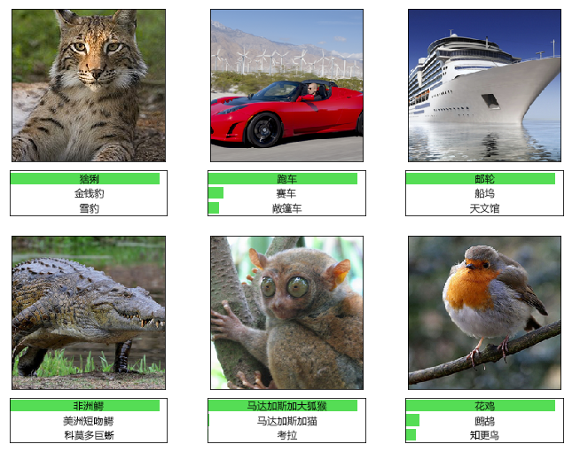

# Azure 上 Python Scikit-Learn 和深度学习模型的实时评分

本参考体系结构演示如何将 Python 模型部署为 Web 服务用于进行实时预测。 将介绍两种方案：部署常规 Python 模型，以及部署深度学习模型所要满足的具体要求。 这两种方案都使用下面所示的体系结构。

GitHub 上提供了本体系结构的两种参考实现，一个适用于[常规 Python 模型][github-python]，另一个适用于[深度学习模型][github-dl]。

## 方案

参考实现演示使用本体系结构的两种方案。

**方案 1：常见问题解答匹配**。 此方案演示如何将常见问题 (FAQ) 匹配模型部署为 Web 服务，用于对用户的问题提供预测。 对于此方案，体系结构示意图中的“输入数据”是指包含要与 FAQ 列表匹配的用户问题的文本字符串。 此方案是针对适用于 Python 的 [scikit-learn][scikit] 机器学习库设计的，但可通用化为使用 Python 模型进行实时预测的任何方案。

此方案使用堆栈溢出问题数据的子集，其中包括标记为 JavaScript 的原始问题、其重复问题及其答案。 此方案训练某个 scikit-learn 管道来预测某个重复问题与每个原始问题匹配的概率。 这些预测是使用 REST API 终结点实时做出的。

本体系结构的应用程序流如下：

1. 客户端发送包含已编码问题数据的 HTTP POST 请求。

2. Flask 应用从请求中提取问题。

3. 将问题发送到 scikit-learn 管道模型进行特征化和评分。

4. 通过管道将匹配的 FAQ 问题及其评分传递给 JSON 对象，并将其返回给客户端。

下面是使用结果的示例应用的屏幕截图：

**方案 2：图像分类**。 此方案演示如何将卷积神经网络 (CNN) 模型部署为 Web 服务，以基于图像提供预测。 对于此方案，体系结构示意图中的“输入数据”指图像文件。 在计算机视觉领域，CNN 对图像分类和对象检测等任务非常有效。 此方案是针对 TensorFlow、Keras（具有 TensorFlow 后端）和 PyTorch 等框架设计的。 但是，它可以通用化为使用深度学习模型进行实时预测的任何方案。

此方案使用基于 ImageNet-1K（1,000 个类）数据集预先训练的 ResNet-152 模型来预测某个图像属于哪些类别（参阅下图）。 这些预测是使用 REST API 终结点实时做出的。

深度学习模型的应用程序流如下：

1. 客户端发送包含已编码图像数据的 HTTP POST 请求。

2. Flask 应用从请求中提取图像。

3. 预处理图像，并将其发送到模型进行评分。

4. 通过管道将评分结果传递给 JSON 对象，并将其返回给客户端。

## 体系结构

该体系结构包括以下组件。

**[虚拟机][vm]** (VM)。 VM 显示为本地或云中的设备示例，它可以发送 HTTP 请求。

**[Azure Kubernetes 服务][aks]** (AKS) 用于在 Kubernetes 群集上部署应用程序。 AKS 简化了 Kubernetes 的部署和操作。 可以使用仅有 CPU 的 VM 为常规 Python 模型配置群集，或使用支持 GPU 的 VM 为深度学习模型配置群集。

**[负载均衡器][lb]**。 AKS 预配的负载均衡器用于在外部公开服务。 来自负载均衡器的流量将定向到后端 pod。

**[Docker 中心][docker]** 用于存储 Kubernetes 群集中部署的 Docker 映像。 之所以为本体系结构选择 Docker 中心，是因为它易于使用，并且是 Docker 用户的默认映像存储库。 也可以对本体系结构使用 [Azure 容器注册表][acr]。

## 性能注意事项

对于实时评分体系结构，吞吐量性能是首要考虑因素。 对于常规 Python 模型，仅使用 CPU 通常就足以处理工作负荷。

但是，对于深度学习工作负荷，如果速度是一个瓶颈，则可以使用 GPU，因为它的[性能][gpus-vs-cpus]通常优于 CPU。 若要在使用 CPU 的情况下获得相当于 GPU 的性能，通常一个具有需要大量 CPU 的群集。

可在任一方案中对本体系结构使用 CPU，但对于深度学习模型，GPU 提供的吞吐量值明显高于 CPU 群集，而且成本类似。 AKS 支持使用 GPU，这是对本体系结构使用 AKS 的一个优势。 另外，深度学习部署通常使用具有大量参数的模型。 使用 GPU 可以防止模型与 Web 服务之间发生资源争用，这在仅用 CPU 的部署中是一个问题。

## 可伸缩性注意事项

对于 AKS 群集是使用仅有 CPU 的 VM 预配的常规 Python 模型，在[扩展 pod 数][manually-scale-pods]时请小心。 目标是充分利用群集。 缩放取决于为 pod 定义的 CPU 请求和限制。 Kubernetes 还支持 pod 的[自动缩放][autoscale-pods]，以根据 CPU 利用率或其他选择指标调整部署中的 pod 数。 [群集自动缩放程序][autoscaler]（预览版）可以根据等待中的 pod 缩放代理节点。

对于使用支持 GPU 的 VM 的深入学习方案，pod 的资源限制方式是将一个 GPU 分配给一个 pod。 根据所用的 VM 类型，必须[缩放群集的节点][scale-cluster]来满足服务的需求。 可以使用 Azure CLI 和 kubectl 轻松实现此目的。

## 监视和日志记录注意事项

### AKS 监视

若要洞察 AKS 性能，请使用[用于容器的 Azure Monitor][monitor-containers] 功能。 此服务通过指标 API 从 Kubernetes 中提供的控制器、节点和容器收集内存与处理器指标。

部署应用程序时，请监视 AKS 群集，以确保它按预期方式工作、所有节点都正常运行，并且所有 pod 都在运行。 尽管你可以使用 [kubectl][kubectl] 命令行工具来检索 pod 状态，但 Kubernetes 还包含一个 Web 仪表板，用于进行基本的群集状态监视和管理。

若要查看群集和节点的总体状态，请转到 Kubernetes 仪表板的“节点”部分。 如果某个节点处于非活动状态或发生故障，可以在该页中显示错误日志。 同样，转到“Pod”和“部署”部分可获取有关 pod 数目和部署状态的信息。

### AKS 日志

AKS 自动将所有 stdout/stderr 记录到群集中 pod 的日志。 使用 kubectl 可查看这些日志，以及节点级别的事件和日志。 有关详细信息，请参阅部署步骤。

使用[用于容器的 Azure Monitor][monitor-containers] 通过适用于 Linux 的 Log Analytics 代理的容器化版本，来收集存储在 Log Analytics 工作区中的指标和日志。

## 安全注意事项

使用 [Azure 安全中心][security-center]可在一个中心视图中获得 Azure 资源的安全状态。 安全中心会监视潜在的安全问题并全面描述部署的安全运行状况，不过，它不会监视 AKS 代理节点。 安全中心针对每个 Azure 订阅进行配置。 根据[将 Azure 订阅载入安全中心标准版][get-started]中所述启用安全数据收集。 启用数据收集后，安全中心会自动扫描该订阅下创建的所有 VM。

**操作**。 若要使用 Azure Active Directory (Azure AD) 身份验证令牌登录到 AKS 群集，请将 AKS 配置为使用 Azure AD 进行[用户身份验证][aad-auth]。 群集管理员还可以根据用户标识或目录组成员身份来配置 Kubernetes 基于角色的访问控制 (RBAC)。

使用 [RBAC][rbac] 控制对已部署的 Azure 资源的访问。 RBAC 允许将授权角色分配给开发运营团队的成员。 可将一个用户分配到多个角色，并且可以创建自定义角色以实现更细化的[权限]。

**HTTPS**。 作为安全最佳做法，应用程序应强制实施 HTTPS 并重定向 HTTP 请求。 使用[入口控制器][ingress-controller]部署一个反向代理，用于终止 SSL 并重定向 HTTP 请求。 有关详细信息，请参阅[在 Azure Kubernetes 服务 (AKS) 中创建 HTTPS 入口控制器][https-ingress]。

“身份验证”。 此解决方案不限制对终结点的访问。 若要在企业设置中部署本体系结构，请通过 API 密钥保护终结点，并将某种形式的用户身份验证添加到客户端应用程序。

**容器注册表**。 此解决方案使用公共注册表来存储 Docker 映像。 应用程序依赖的代码以及模型将包含在此映像中。 企业应用程序应使用专用注册表来帮助防范运行恶意代码以及容器中的信息泄密。

**DDOS 防护**。 考虑启用 [DDoS 防护标准版][ddos]。 尽管基本 DDoS 防护已作为 Azure 平台的一部分启用，但 DDoS 防护标准版提供专门针对 Azure 虚拟网络资源优化的缓解功能。

**日志记录**。 在存储日志数据之前采用最佳做法，例如，清理可能被用来实施安全欺诈行为的用户密码和其他信息。

## 部署

若要部署本参考体系结构，请遵循 GitHub 存储库中所述的步骤：

- [常规 Python 模型][github-python]
- [深度学习模型][github-dl]

<!-- links -->

[aad-auth]: /azure/aks/aad-integration
[acr]: /azure/container-registry/
[something]: https://kubernetes.io/docs/reference/access-authn-authz/authentication/
[aks]: /azure/aks/intro-kubernetes
[autoscaler]: /azure/aks/autoscaler
[autoscale-pods]: /azure/aks/tutorial-kubernetes-scale#autoscale-pods
[azcopy]: /azure/storage/common/storage-use-azcopy-linux
[ddos]: /azure/virtual-network/ddos-protection-overview
[docker]: https://hub.docker.com/
[get-started]: /azure/security-center/security-center-get-started
[github-python]: https://github.com/Azure/MLAKSDeployment
[github-dl]: https://github.com/Microsoft/AKSDeploymentTutorial
[gpus-vs-cpus]: https://azure.microsoft.com/en-us/blog/gpus-vs-cpus-for-deployment-of-deep-learning-models/
[https-ingress]: /azure/aks/ingress-tls
[ingress-controller]: https://kubernetes.io/docs/concepts/services-networking/ingress/
[kubectl]: https://kubernetes.io/docs/tasks/tools/install-kubectl/
[lb]: /azure/load-balancer/load-balancer-overview
[manually-scale-pods]: /azure/aks/tutorial-kubernetes-scale#manually-scale-pods
[monitor-containers]: /azure/monitoring/monitoring-container-insights-overview
[权限]: /azure/aks/concepts-identity
[rbac]: /azure/active-directory/role-based-access-control-what-is
[scale-cluster]: /azure/aks/scale-cluster
[scikit]: https://pypi.org/project/scikit-learn/
[security-center]: /azure/security-center/security-center-intro
[vm]: /azure/virtual-machines/
