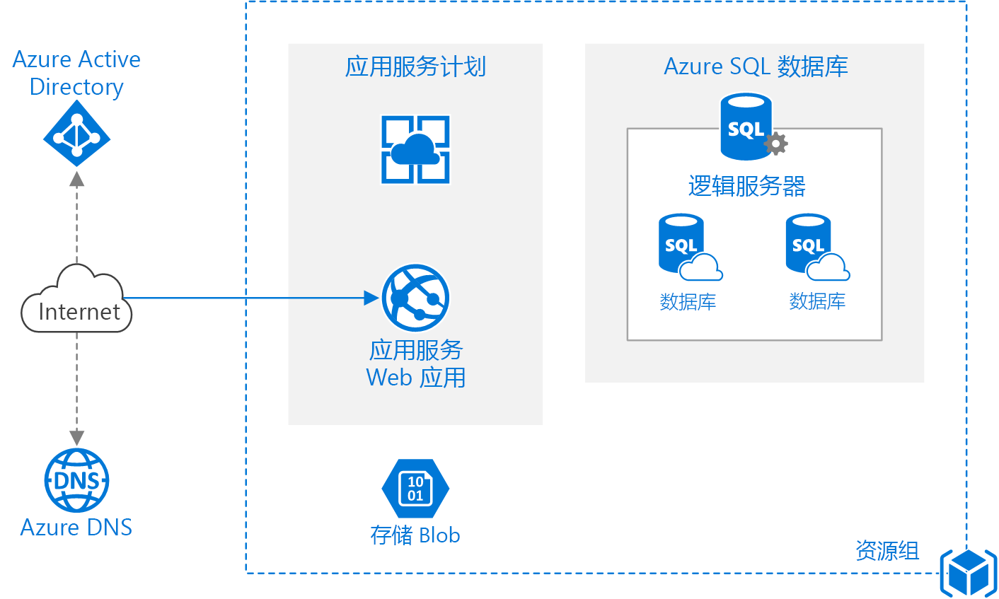

# <a name="run-a-basic-web-application-in-azure"></a>在 Azure 中运行基本的 Web 应用程序

此参考体系结构演示使用 [Azure 应用服务][app-service]和 [Azure SQL 数据库][sql-db]的 Web 应用程序适用的成熟做法。 [**部署此解决方案**](#deploy-the-solution)。



下载此体系结构的 [Visio 文件][visio-download]。

## <a name="architecture"></a>体系结构

> [!NOTE]
> 此体系结构不侧重于应用程序开发，也不假设采用任何特定的应用程序框架。 目标是让读者了解如何将各种 Azure 服务拟合在一起。
>

此体系结构具有以下组件：

- 资源组。 [资源组](/azure/azure-resource-manager/resource-group-overview)是 Azure 资源的逻辑容器。

- **应用服务应用**。 [Azure 应用服务][app-service]是用于创建和部署云应用程序的完全托管平台。

- **应用服务计划**。 [应用服务计划][app-service-plans]提供用于承载应用的托管虚拟机 (VM)。 与某个计划关联的所有应用在同一个 VM 实例上运行。

- **部署槽位**。  使用[部署槽位][deployment-slots]可以分阶段完成部署，然后将阶段部署（过渡部署）交换为生产部署。 这样，便可以避免直接部署到生产环境。 有关具体的建议，请参阅[可管理性](#manageability-considerations)部分。

- **IP 地址**。 应用服务应用具有一个公共 IP 地址和域名。 域名是 `azurewebsites.net` 的子域，例如 `contoso.azurewebsites.net`。

- **Azure DNS**。 [Azure DNS][azure-dns] 是 DNS 域的托管服务，它使用 Microsoft Azure 基础结构提供名称解析。 通过在 Azure 中托管域，可以使用与其他 Azure 服务相同的凭据、API、工具和计费来管理 DNS 记录。 若要使用自定义域名（例如 `contoso.com`），请创建可将自定义域名映射到 IP 地址的 DNS 记录。 有关详细信息，请参阅[在 Azure 应用服务中配置自定义域名][custom-domain-name]。

- **Azure SQL 数据库**。 [SQL 数据库][sql-db]是云中的关系数据库即服务。 SQL 数据库与 Microsoft SQL Server 数据库引擎共享其代码库。 也可使用 [Azure Database for MySQL](/azure/mysql) 或 [Azure Database for PostgreSQL](/azure/postgresql)，具体取决于应用程序要求。 这些是完全托管的数据库服务，分别基于开源 MySQL 服务器和 Postgres 数据库引擎。

- **逻辑服务器**。 在 Azure SQL 数据库中，逻辑服务器承载你的数据库。 可为每个逻辑服务器创建多个数据库。

- **Azure 存储**。 创建一个包含 Blob 容器的 Azure 存储帐户用于存储诊断日志。

- **Azure Active Directory (Azure AD)**。 使用 Azure AD 或其他标识提供者进行身份验证。

## <a name="recommendations"></a>建议

你的要求可能不同于此处描述的体系结构。 请使用本部分中的建议作为入手点。

### <a name="app-service-plan"></a>应用服务计划

使用标准或高级层，因为它们支持横向扩展、自动缩放和安全套接字层 (SSL)。 每个层支持若干种实例大小，具体数量根据核心数和内存而异。 创建计划后，可以更改层或实例大小。 有关应用服务计划的详细信息，请参阅[应用服务定价][app-service-plans-tiers]。

即使应用已停止，应用服务计划中的实例也会产生费用。 请务必删除未使用的计划（例如测试部署）。

### <a name="sql-database"></a>SQL 数据库

使用 SQL 数据库 [V12 版][sql-db-v12]。 SQL 数据库支持基本、标准和高级[服务层][sql-db-service-tiers]，每个层中包含多个以[数据库事务单位 (DTU)][sql-dtu] 计量的性能级别。 请执行容量规划，并选择符合要求的层和性能级别。

### <a name="region"></a>区域

在同一个区域中预配应用服务计划和 SQL 数据库，以尽量降低网络延迟。 一般情况下，应选择离用户最近的区域。

资源组中还有一个区域指定了部署元数据的存储位置。 请资源组及其资源放入同一个区域。 这可以在部署过程中提高可用性。

## <a name="scalability-considerations"></a>可伸缩性注意事项

Azure 应用服务的主要优势是能够根据负载缩放应用程序。 下面是在计划缩放应用程序时需要考虑的一些注意事项。

### <a name="scaling-the-app-service-app"></a>缩放应用服务应用

可通过两种方法缩放应用服务应用：

- 纵向缩放：指更改实例大小。 实例大小决定了每个 VM 实例上的内存、核心数和存储。 可以通过更改实例大小或计划层进行手动纵向缩放。

- 横向缩放：指添加实例来处理增大的负载。 每个定价层包含的实例数存在上限。

  可以通过更改实例计数进行手动横向缩放，或者使用[自动缩放][web-app-autoscale]，让 Azure 根据计划和/或性能指标自动添加或删除实例。 每项缩放操作可快速完成 &mdash; 通常只需几秒钟。

  若要启用自动缩放，请创建自动缩放配置文件，用于定义最小和最大实例数。 可以计划配置文件。 例如，可为工作日和周末单独创建配置文件。 （可选）配置文件包含有关何时添加或删除实例的规则。 （示例：如果 CPU 使用率高于 70% 达到 5 分钟，则添加两个实例。）

有关缩放 Web 应用的建议：

- 尽量避免纵向扩展和缩减，因为这可能会触发应用程序重启。 应选择满足典型负载下的性能要求的层和大小，然后横向缩放实例来处理流量变化。
- 启用自动缩放。 如果应用程序具有可预测的常规工作负荷，请提前创建配置文件来计划实例计数。 如果工作负荷不可预测，请使用基于规则的自动缩放，对发生的负载变化做出反应。 可以组合这两种方法。
- CPU 使用率通常是自动缩放规则的适当指标。 但是，应该对应用程序进行负载测试，识别潜在瓶颈，并使自动缩放规则基于该数据。
- 自动缩放规则包括一个冷却期，即，在完成某项缩放操作之后、启动新的缩放操作之前所要等待的时间间隔。 冷却期可让系统在再次缩放之前变稳定。 若要添加实例，请设置较短的冷却期；若要删除实例，请设置较长的冷却期。 例如，设置 5 分钟来添加实例，但设置 60 分钟来删除实例。 在负载加重的情况下，最好是快速添加新实例来处理额外的流量，然后逐渐缩减。

### <a name="scaling-sql-database"></a>缩放 SQL 数据库

如果需要为 SQL 数据库使用更高的服务层或性能级别，可以纵向扩展单个数据库，且无需关闭应用程序。 有关详细信息，请参阅 [SQL 数据库选项和性能：了解每个服务层中有哪些可用资源][sql-db-scale]。

## <a name="availability-considerations"></a>可用性注意事项

在撰写本文时，应用服务的服务级别协议 (SLA) 为 99.95%，基本、标准和高级层 SQL 数据库的 SLA 为 99.99%。

> [!NOTE]
> 应用服务 SLA 适用于单个和多个实例。
>

### <a name="backups"></a>备份

如果发生数据丢失，SQL 数据库可提供时间点还原和异地还原。 这些功能已在所有层中提供，并会自动启用。 不需要计划或管理备份。

- 使用时间点还原可将数据库还原到以前的某个时间点，从而可[在发生人为失误后进行恢复][sql-human-error]。
- 使用异地还原可从异地冗余的备份还原数据库，从而可[在发生服务中断后进行恢复][sql-outage-recovery]。

有关详细信息，请参阅[云业务连续性与使用 SQL 数据库进行数据库灾难恢复][sql-backup]。

应用服务为应用程序文件提供[备份和还原][web-app-backup]功能。 但请注意，备份的文件包含纯文本形式的应用设置，而这些内容可能包含机密，例如连接字符串。 请避免使用应用服务备份功能备份 SQL 数据库，因为它会将数据库导出到 SQL .bacpac 文件，因而会消耗 [DTU][sql-dtu]。 应使用前面所述的 SQL 数据库时间点还原。

## <a name="manageability-considerations"></a>可管理性注意事项

为生产、开发和测试环境创建单独的资源组。 这可以更方便地管理部署、删除测试部署，以及分配访问权限。

将资源分配到资源组时，请注意以下事项：

- 生命周期 一般情况下，应将具有相同生命周期的资源放入同一个资源组。
- 访问。 可以使用[基于角色的访问控制][rbac] (RBAC) 向组中的资源应用访问策略。
- 计费。 可以查看资源组的累计成本。

有关详细信息，请参阅 [Azure 资源管理器概述](/azure/azure-resource-manager/resource-group-overview)。

### <a name="deployment"></a>部署

部署涉及两个步骤：

1. 预配 Azure 资源。 我们建议使用 [Azure 资源管理器模板][arm-template]完成此步骤。 使用模板可以通过 PowerShell 或 Azure 命令行接口 (CLI) 更轻松地自动完成部署。
2. 部署应用程序（代码、二进制文件和内容文件）。 可以使用多个选项，包括从本地 Git 存储库部署、使用 Visual Studio，或者通过基于云的源代码管理进行持续部署。 请参阅[将应用部署到 Azure 应用服务][deploy]。

应用服务应用始终有一个名为 `production` 的部署槽位，该槽位表示实际生产站点。 我们建议创建过渡槽位用于部署更新。 使用过渡槽位的好处包括：

- 在将部署交换到生产环境之前，可以验证部署是否成功。
- 部署到过渡槽位可确保所有实例在交换到生产环境之前已预热。 许多应用程序的预热和冷启动时间很长。

此外，我们还建议创建第三个槽位用于保存上次已知正常的部署。 交换过渡部署和生产部署之后，请将以前的生产部署（现在为过渡部署）移到上次已知正常的槽位中。 这样，如果以后发现问题，可以快速还原到上次已知正常的版本。

![[1]][1]

若要还原到以前的版本，请确保数据库架构发生的任何更改可向后兼容。

不要使用生产部署中的槽位进行测试，因为同一应用服务计划中的所有应用共享相同的 VM 实例。 例如，负载测试可能使实时生产站点降级。 应该为生产和测试创建单独的应用服务计划。 如果将测试部署放入单独的计划，则可将其与生产版本相隔离。

### <a name="configuration"></a>配置

将配置设置存储为[应用设置][app-settings]。 在资源管理器模板中或者使用 PowerShell 定义应用设置。 在运行时，应用程序可将应用设置用作环境变量。

切勿将密码、访问密钥或连接字符串签入源代码管理。 应将这些值作为参数传递给可将其存储为应用设置的部署脚本。

交换部署槽位时，默认会交换应用设置。 如果需要对生产部署和过渡部署使用不同的设置，可以创建依附在某个槽位上的、不被交换的应用设置。

### <a name="diagnostics-and-monitoring"></a>诊断和监控

启用[诊断日志记录][diagnostic-logs]，包括应用程序日志记录和 Web 服务器日志记录。 将日志记录配置为使用 Blob 存储。 出于性能方面的原因，请创建单独的存储帐户来存储诊断日志。 不要对日志和应用程序数据使用相同的存储帐户。 有关日志记录的更详细指导，请参阅[监视和诊断指南][monitoring-guidance]。

使用 [New Relic][new-relic] 或 [Application Insights][app-insights] 等服务来监视承受负载时的应用程序性能和行为。 请注意 Application Insights 的[数据率限制][app-insights-data-rate]。

使用 [Azure DevOps][azure-devops]、[Visual Studio Team Foundation Server][tfs] 等工具执行负载测试。 有关云应用程序中性能分析的一般性概述，请参阅[性能分析入门][perf-analysis]。

有关排查应用程序问题的提示：

- 使用 Azure 门户中的[故障排除边栏选项卡][troubleshoot-blade]找到常见问题的解决方法。
- 启用[日志流][web-app-log-stream]可以近乎实时地查看日志记录信息。
- [Kudu 仪表板][kudu]提供了多个工具用于监视和调试应用程序。 有关详细信息，请参阅博客文章 [Azure Websites online tools you should know about][kudu]（应该了解的 Azure 网站联机工具）。 可以通过 Azure 门户访问 Kudu 仪表板。 打开应用的边栏选项卡，依次单击“工具”、“Kudu”。
- 如果使用的是 Visual Studio，请参阅[使用 Visual Studio 对 Azure 应用服务中的 Web 应用进行故障排除][troubleshoot-web-app]一文，获取有关调试和故障排除的提示。

## <a name="security-considerations"></a>安全注意事项

本部分列出专门与本文中所述 Azure 服务相关的安全注意事项， 内容并非安全最佳做法的完整列表。 有关其他一些安全注意事项，请参阅[保护 Azure 应用服务中的应用][app-service-security]。

### <a name="sql-database-auditing"></a>SQL 数据库审核

借助审核可以保持合规，洞察可能表示需要企业引以关注的问题或疑似出现安全违规的偏差和异常。 请参阅 [SQL 数据库审核入门][sql-audit]。

### <a name="deployment-slots"></a>部署槽

每个部署槽位有一个公共 IP 地址。 使用 [Azure Active Directory 登录][aad-auth]保护非生产槽位，以便只有开发团队和 DevOps 团队的成员可以访问这些终结点。

### <a name="logging"></a>日志记录

日志中不可记录诸如用户密码或其他可用于实行身份诈骗的信息。 在存储这些数据之前，请清除其中的这些详细信息。

### <a name="ssl"></a>SSL

应用服务应用在子域 `azurewebsites.net` 中免费包含一个 SSL 终结点。 该 SSL 终结点包括 `*.azurewebsites.net` 域的通配符证书。 如果使用自定义域名，必须提供与该自定义域匹配的证书。 最简单的方法是直接通过 Azure 门户购买证书。 也可以从其他证书颁发机构导入证书。 有关详细信息，请参阅[为 Azure 应用服务购买和配置 SSL 证书][ssl-cert]。

作为一项安全最佳做法，应用应该通过重定向 HTTP 请求来强制实施 HTTPS。 可以在应用程序内部实施此做法，或者根据[为 Azure 应用服务中的应用启用 HTTPS][ssl-redirect] 中所述使用 URL 重写规则。

### <a name="authentication"></a>身份验证

我们建议通过 Azure AD、Facebook、Google 或 Twitter 等标识提供者 (IDP) 进行身份验证。 为身份验证流使用 OAuth 2 或 OpenID Connect (OIDC)。 Azure AD 提供管理用户和组、创建应用程序角色、集成本地标识，以及使用 Office 365 和 Skype for Business 等后端服务的功能。

请避免让应用程序直接管理用户登录名和凭据，因为这会造成潜在的攻击面。  最起码需要配置电子邮件确认、密码恢复和多重身份验证；验证密码强度；安全存储密码哈希。 大型标识提供者可自动处理所有这些操作，并会持续监视及改进其安全做法。

请考虑使用[应用服务身份验证][app-service-auth]来实施 OAuth/OIDC 身份验证流。 应用服务身份验证的好处包括：

- 易于配置。
- 对于简单的身份验证方案无需编写代码。
- 支持使用 OAuth 访问令牌实现委托授权，以代表用户使用资源。
- 提供内置的令牌缓存。

应用服务身份验证的一些限制：

- 自定义选项有限。
- 仅限针对每个登录会话的一个后端资源使用委托授权。
- 如果使用了多个 IDP，没有内置的机制可用于执行主领域发现。
- 对于多租户方案，应用程序必须实施验证令牌颁发者的逻辑。

## <a name="deploy-the-solution"></a>部署解决方案

[GitHub][paas-basic-arm-template] 上提供了此体系结构的示例资源管理器模板。

若要使用 PowerShell 部署该模板，请运行以下命令：

```powershell
New-AzureRmResourceGroup -Name <resource-group-name> -Location "West US"

$parameters = @{"appName"="<app-name>";"environment"="dev";"locationShort"="uw";"databaseName"="app-db";"administratorLogin"="<admin>";"administratorLoginPassword"="<password>"}

New-AzureRmResourceGroupDeployment -Name <deployment-name> -ResourceGroupName <resource-group-name> -TemplateFile .\PaaS-Basic.json -TemplateParameterObject  $parameters
```

有关详细信息，请参阅[使用 Azure 资源管理器模板部署资源][deploy-arm-template]。

<!-- links -->

[aad-auth]: /azure/app-service-mobile/app-service-mobile-how-to-configure-active-directory-authentication
[app-insights]: /azure/application-insights/app-insights-overview
[app-insights-data-rate]: /azure/application-insights/app-insights-pricing
[app-service]: https://azure.microsoft.com/documentation/services/app-service/
[app-service-auth]: /azure/app-service-api/app-service-api-authentication
[app-service-plans]: /azure/app-service/azure-web-sites-web-hosting-plans-in-depth-overview
[app-service-plans-tiers]: https://azure.microsoft.com/pricing/details/app-service/
[app-service-security]: /azure/app-service-web/web-sites-security
[app-settings]: /azure/app-service-web/web-sites-configure
[arm-template]: /azure/azure-resource-manager/resource-group-overview#resource-groups
[azure-devops]: /azure/devops/
[azure-dns]: /azure/dns/dns-overview
[custom-domain-name]: /azure/app-service-web/web-sites-custom-domain-name
[deploy]: /azure/app-service-web/web-sites-deploy
[deploy-arm-template]: /azure/resource-group-template-deploy
[deployment-slots]: /azure/app-service-web/web-sites-staged-publishing
[diagnostic-logs]: /azure/app-service-web/web-sites-enable-diagnostic-log
[kudu]: https://azure.microsoft.com/blog/windows-azure-websites-online-tools-you-should-know-about/
[monitoring-guidance]: ../../best-practices/monitoring.md
[new-relic]: https://newrelic.com/
[paas-basic-arm-template]: https://github.com/mspnp/reference-architectures/tree/master/managed-web-app/basic-web-app/Paas-Basic/Templates
[perf-analysis]: https://github.com/mspnp/performance-optimization/blob/master/Performance-Analysis-Primer.md
[rbac]: /azure/active-directory/role-based-access-control-what-is
[resource-group]: /azure/azure-resource-manager/resource-group-overview
[sla]: https://azure.microsoft.com/support/legal/sla/
[sql-audit]: /azure/sql-database/sql-database-auditing-get-started
[sql-backup]: /azure/sql-database/sql-database-business-continuity
[sql-db]: https://azure.microsoft.com/documentation/services/sql-database/
[sql-db-overview]: /azure/sql-database/sql-database-technical-overview
[sql-db-scale]: /azure/sql-database/sql-database-service-tiers#scaling-up-or-scaling-down-a-single-database
[sql-db-service-tiers]: /azure/sql-database/sql-database-service-tiers
[sql-db-v12]: /azure/sql-database/sql-database-features
[sql-dtu]: /azure/sql-database/sql-database-service-tiers
[sql-human-error]: /azure/sql-database/sql-database-business-continuity#recover-a-database-after-a-user-or-application-error
[sql-outage-recovery]: /azure/sql-database/sql-database-business-continuity#recover-a-database-to-another-region-from-an-azure-regional-data-center-outage
[ssl-redirect]: /azure/app-service-web/web-sites-configure-ssl-certificate#bkmk_enforce
[sql-resource-limits]: /azure/sql-database/sql-database-resource-limits
[ssl-cert]: /azure/app-service-web/web-sites-purchase-ssl-web-site
[troubleshoot-blade]: https://azure.microsoft.com/updates/self-service-troubleshooting-for-app-service-web-apps-customers/
[tfs]: /tfs/index
[troubleshoot-web-app]: /azure/app-service-web/web-sites-dotnet-troubleshoot-visual-studio
[visio-download]: https://archcenter.blob.core.windows.net/cdn/app-service-reference-architectures.vsdx
[web-app-autoscale]: /azure/app-service-web/web-sites-scale
[web-app-backup]: /azure/app-service-web/web-sites-backup
[web-app-log-stream]: /azure/app-service-web/web-sites-enable-diagnostic-log#streamlogs
[1]: ./images/paas-basic-web-app-staging-slots.png "交换生产部署和过渡部署的槽位"
