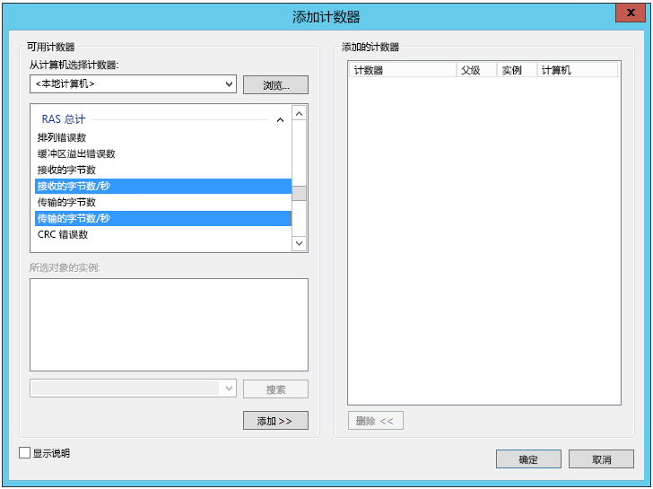
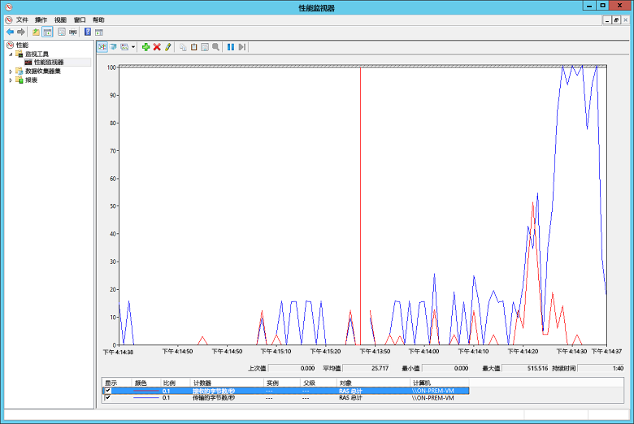

# <a name="troubleshoot-a-hybrid-vpn-connection"></a>排查混合 VPN 连接问题

本文提供的一些提示说明了如何排查本地网络和 Azure 之间的 VPN 网关连接问题。 有关常见 VPN 相关错误故障排除的常规信息，请参阅[常见 VPN 相关错误故障排除][troubleshooting-vpn-errors]。

## <a name="verify-the-vpn-appliance-is-functioning-correctly"></a>验证 VPN 设备是否正常运行

以下建议可用于确定本地 VPN 设备是否正常运行。

**在 VPN 设备生成的任何日志文件中检查是否存在错误或故障。** 这会帮助确定 VPN 设备是否正常运行。 此信息的位置因设备而异。 例如，如果在 Windows Server 2012 上使用 RRAS，则可以使用以下 PowerShell 命令显示 RRAS 服务的错误事件信息：

```PowerShell
Get-EventLog -LogName System -EntryType Error -Source RemoteAccess | Format-List -Property *
```

每个条目的 Message 属性提供错误的说明。 一些常见示例包括：

- 无法进行连接，可能是因为在 RRAS VPN 网络接口配置中为 Azure VPN 网关指定的 IP 地址不正确。

  ```console
  EventID            : 20111
  MachineName        : on-prem-vm
  Data               : {41, 3, 0, 0}
  Index              : 14231
  Category           : (0)
  CategoryNumber     : 0
  EntryType          : Error
  Message            : RoutingDomainID- {00000000-0000-0000-0000-000000000000}: A demand dial connection to the remote
                          interface AzureGateway on port VPN2-4 was successfully initiated but failed to complete
                          successfully because of the  following error: The network connection between your computer and
                          the VPN server could not be established because the remote server is not responding. This could
                          be because one of the network devices (for example, firewalls, NAT, routers, and so on) between your computer
                          and the remote server is not configured to allow VPN connections. Please contact your
                          Administrator or your service provider to determine which device may be causing the problem.
  Source             : RemoteAccess
  ReplacementStrings : {{00000000-0000-0000-0000-000000000000}, AzureGateway, VPN2-4, The network connection between
                          your computer and the VPN server could not be established because the remote server is not
                          responding. This could be because one of the network devices (for example, firewalls, NAT, routers, and so on)
                          between your computer and the remote server is not configured to allow VPN connections. Please
                          contact your Administrator or your service provider to determine which device may be causing the
                          problem.}
  InstanceId         : 20111
  TimeGenerated      : 3/18/2016 1:26:02 PM
  TimeWritten        : 3/18/2016 1:26:02 PM
  UserName           :
  Site               :
  Container          :
  ```

- 在 RRAS VPN 网络接口配置中指定了错误的共享密钥。

  ```console
  EventID            : 20111
  MachineName        : on-prem-vm
  Data               : {233, 53, 0, 0}
  Index              : 14245
  Category           : (0)
  CategoryNumber     : 0
  EntryType          : Error
  Message            : RoutingDomainID- {00000000-0000-0000-0000-000000000000}: A demand dial connection to the remote
                          interface AzureGateway on port VPN2-4 was successfully initiated but failed to complete
                          successfully because of the  following error: Internet key exchange (IKE) authentication credentials are unacceptable.

  Source             : RemoteAccess
  ReplacementStrings : {{00000000-0000-0000-0000-000000000000}, AzureGateway, VPN2-4, IKE authentication credentials are
                          unacceptable.
                          }
  InstanceId         : 20111
  TimeGenerated      : 3/18/2016 1:34:22 PM
  TimeWritten        : 3/18/2016 1:34:22 PM
  UserName           :
  Site               :
  Container          :
  ```

还可以使用以下 PowerShell 命令获取有关通过 RRAS 服务尝试连接的事件日志信息：

```powershell
Get-EventLog -LogName Application -Source RasClient | Format-List -Property *
```

如果出现连接故障，则此日志会包含类似于以下内容的错误：

```console
EventID            : 20227
MachineName        : on-prem-vm
Data               : {}
Index              : 4203
Category           : (0)
CategoryNumber     : 0
EntryType          : Error
Message            : CoId={B4000371-A67F-452F-AA4C-3125AA9CFC78}: The user SYSTEM dialed a connection named
                        AzureGateway that has failed. The error code returned on failure is 809.
Source             : RasClient
ReplacementStrings : {{B4000371-A67F-452F-AA4C-3125AA9CFC78}, SYSTEM, AzureGateway, 809}
InstanceId         : 20227
TimeGenerated      : 3/18/2016 1:29:21 PM
TimeWritten        : 3/18/2016 1:29:21 PM
UserName           :
Site               :
Container          :
```

## <a name="verify-connectivity"></a>验证连接性

**验证跨 VPN 网关的连接和路由。** VPN 设备可能无法通过 Azure VPN 网关正确路由流量。 使用 [PsPing][psping] 这类工具可验证跨 VPN 网关的连接和路由。 例如，若要测试从本地计算机到位于 VNet 上的 Web 服务器的连接，请运行以下命令（将 `<<web-server-address>>` 替换为 Web 服务器的地址）：

```console
PsPing -t <<web-server-address>>:80
```

如果本地计算机可以将流量路由到 Web 服务器，则你应看到类似于以下内容的输出：

```console
D:\PSTools>psping -t 10.20.0.5:80

PsPing v2.01 - PsPing - ping, latency, bandwidth measurement utility
Copyright (C) 2012-2014 Mark Russinovich
Sysinternals - www.sysinternals.com

TCP connect to 10.20.0.5:80:
Infinite iterations (warmup 1) connecting test:
Connecting to 10.20.0.5:80 (warmup): 6.21ms
Connecting to 10.20.0.5:80: 3.79ms
Connecting to 10.20.0.5:80: 3.44ms
Connecting to 10.20.0.5:80: 4.81ms

    Sent = 3, Received = 3, Lost = 0 (0% loss),
    Minimum = 3.44ms, Maximum = 4.81ms, Average = 4.01ms
```

如果本地计算机无法与指定目标进行通信，则你会看到如下消息：

```console
D:\PSTools>psping -t 10.20.1.6:80

PsPing v2.01 - PsPing - ping, latency, bandwidth measurement utility
Copyright (C) 2012-2014 Mark Russinovich
Sysinternals - www.sysinternals.com

TCP connect to 10.20.1.6:80:
Infinite iterations (warmup 1) connecting test:
Connecting to 10.20.1.6:80 (warmup): This operation returned because the timeout period expired.
Connecting to 10.20.1.6:80: This operation returned because the timeout period expired.
Connecting to 10.20.1.6:80: This operation returned because the timeout period expired.
Connecting to 10.20.1.6:80: This operation returned because the timeout period expired.
Connecting to 10.20.1.6:80:
    Sent = 3, Received = 0, Lost = 3 (100% loss),
    Minimum = 0.00ms, Maximum = 0.00ms, Average = 0.00ms
```

**验证本地防火墙是否允许 VPN 流量通过以及正确的端口是否打开。**

**验证本地 VPN 设备使用的加密方法是否与 Azure VPN 网关兼容。** 对于基于策略的路由，Azure VPN 网关支持 AES256、AES128 和 3DES 加密算法。 基于路由的网关支持 AES256 和 3DES。 有关详细信息，请参阅[关于用于站点到站点 VPN 网关连接的 VPN 设备和 IPsec/IKE 参数][vpn-appliance]。

## <a name="check-for-problems-with-the-azure-vpn-gateway"></a>检查 Azure VPN 网关是否存在问题

以下建议可用于确定是否存在与 Azure VPN 网关有关的问题：

**在 Azure VPN 网关诊断日志中检查是否存在潜在问题。** 请参阅[分步指南：捕获 Azure 资源管理器 VNET 网关诊断日志][gateway-diagnostic-logs]。

**验证 Azure VPN 网关和本地 VPN 设备是否使用相同的共享身份验证密钥进行配置。** 可以使用以下 Azure CLI 命令查看 Azure VPN 网关存储的共享密钥：

```azurecli
azure network vpn-connection shared-key show <<resource-group>> <<vpn-connection-name>>
```

使用适合于本地 VPN 设备的命令显示为该设备配置的共享密钥。

验证包含 Azure VPN 网关的 GatewaySubnet 子网是否不与 NSG 关联。

可以使用以下 Azure CLI 命令查看子网详细信息：

```azurecli
azure network vnet subnet show -g <<resource-group>> -e <<vnet-name>> -n GatewaySubnet
```

确保没有名为 *Network Security Group ID* 的数据字段。 以下示例显示分配了 NSG (VPN-Gateway-Group) 的 GatewaySubnet 实例的结果。 如果没有为此 NSG 定义任何规则，则这可能会阻止网关正常工作。

```console
C:\>azure network vnet subnet show -g profx-prod-rg -e profx-vnet -n GatewaySubnet
    info:    Executing command network vnet subnet show
    + Looking up virtual network "profx-vnet"
    + Looking up the subnet "GatewaySubnet"
    data:    Id                              : /subscriptions/########-####-####-####-############/resourceGroups/profx-prod-rg/providers/Microsoft.Network/virtualNetworks/profx-vnet/subnets/GatewaySubnet
    data:    Name                            : GatewaySubnet
    data:    Provisioning state              : Succeeded
    data:    Address prefix                  : 10.20.3.0/27
    data:    Network Security Group id       : /subscriptions/########-####-####-####-############/resourceGroups/profx-prod-rg/providers/Microsoft.Network/networkSecurityGroups/VPN-Gateway-Group
    info:    network vnet subnet show command OK
```

**验证 Azure VNet 中的虚拟机是否配置为允许来自 VNet 外部的流量进入。** 检查与包含这些虚拟机的子网关联的任何 NSG 规则。 可以使用以下 Azure CLI 命令查看所有 NSG 规则：

```azurecli
azure network nsg show -g <<resource-group>> -n <<nsg-name>>
```

**验证 Azure VPN 网关是否已连接。** 可以使用以下 Azure PowerShell 命令检查 Azure VPN 连接的当前状态。 `<<connection-name>>` 参数是链接虚拟网络网关和本地网关的 Azure VPN 连接的名称。

```powershell
Get-AzureRmVirtualNetworkGatewayConnection -Name <<connection-name>> - ResourceGroupName <<resource-group>>
```

以下代码片段突出显示在网关已连接（第一个示例）和断开连接（第二个示例）时生成的输出：

```powershell
PS C:\> Get-AzureRmVirtualNetworkGatewayConnection -Name profx-gateway-connection -ResourceGroupName profx-prod-rg

AuthorizationKey           :
VirtualNetworkGateway1     : Microsoft.Azure.Commands.Network.Models.PSVirtualNetworkGateway
VirtualNetworkGateway2     :
LocalNetworkGateway2       : Microsoft.Azure.Commands.Network.Models.PSLocalNetworkGateway
Peer                       :
ConnectionType             : IPsec
RoutingWeight              : 0
SharedKey                  : ####################################
ConnectionStatus           : Connected
EgressBytesTransferred     : 55254803
IngressBytesTransferred    : 32227221
ProvisioningState          : Succeeded
...
```

```powershell
PS C:\> Get-AzureRmVirtualNetworkGatewayConnection -Name profx-gateway-connection2 -ResourceGroupName profx-prod-rg

AuthorizationKey           :
VirtualNetworkGateway1     : Microsoft.Azure.Commands.Network.Models.PSVirtualNetworkGateway
VirtualNetworkGateway2     :
LocalNetworkGateway2       : Microsoft.Azure.Commands.Network.Models.PSLocalNetworkGateway
Peer                       :
ConnectionType             : IPsec
RoutingWeight              : 0
SharedKey                  : ####################################
ConnectionStatus           : NotConnected
EgressBytesTransferred     : 0
IngressBytesTransferred    : 0
ProvisioningState          : Succeeded
...
```

## <a name="miscellaneous-issues"></a>其他问题

以下建议可用于确定主机 VM 配置、网络带宽利用率或应用程序性能是否存在问题：

**验证防火墙配置。** 验证在子网中 Azure VM 上运行的来宾操作系统中的防火墙是否正确配置为允许来自本地 IP 范围的流量。

**验证流量是否未接近可供 Azure VPN 网关使用的带宽限制。** 如何进行验证取决于在本地运行的 VPN 设备。 例如，如果在 Windows Server 2012 上使用 RRAS，则可以使用性能监视器跟踪通过 VPN 连接接收和传输的数据量。 使用 RAS Total 对象，选择 Bytes Received/Sec 和 Bytes Transmitted/Sec 计数器：



应该将结果与 VPN 网关可用的带宽（从基本 SKU 提供的 100 Mbps，到 VpnGw3 SKU 提供的 1.25 Gbps）进行比较：



**验证是否已为应用程序负载部署了正确数量和大小的 VM。** 确定 Azure VNet 中是否有任何虚拟机运行缓慢。 如果有，则它们可能过载、可能数量太少而无法处理负载或负载均衡器未正确配置。 若要确定这种情况，请[捕获并分析诊断信息][azure-vm-diagnostics]。 可以使用 Azure 门户检查结果，不过还有许多可以提供有关性能数据的详细深入信息的第三方工具可用。

**验证该应用程序是否在高效使用云资源。** 检测每个 VM 上运行的应用程序代码以确定应用程序是否在充分利用资源。 可以使用 [Application Insights][application-insights] 这类工具。

<!-- links -->

[application-insights]: /azure/application-insights/app-insights-overview-usage
[azure-vm-diagnostics]: https://azure.microsoft.com/blog/windows-azure-virtual-machine-monitoring-with-wad-extension/
[gateway-diagnostic-logs]: https://blogs.technet.microsoft.com/keithmayer/2016/10/12/step-by-step-capturing-azure-resource-manager-arm-vnet-gateway-diagnostic-logs/
[psping]: https://technet.microsoft.com/sysinternals/jj729731.aspx
[troubleshooting-vpn-errors]: https://blogs.technet.microsoft.com/rrasblog/2009/08/12/troubleshooting-common-vpn-related-errors/
[vpn-appliance]: /azure/vpn-gateway/vpn-gateway-about-vpn-devices
