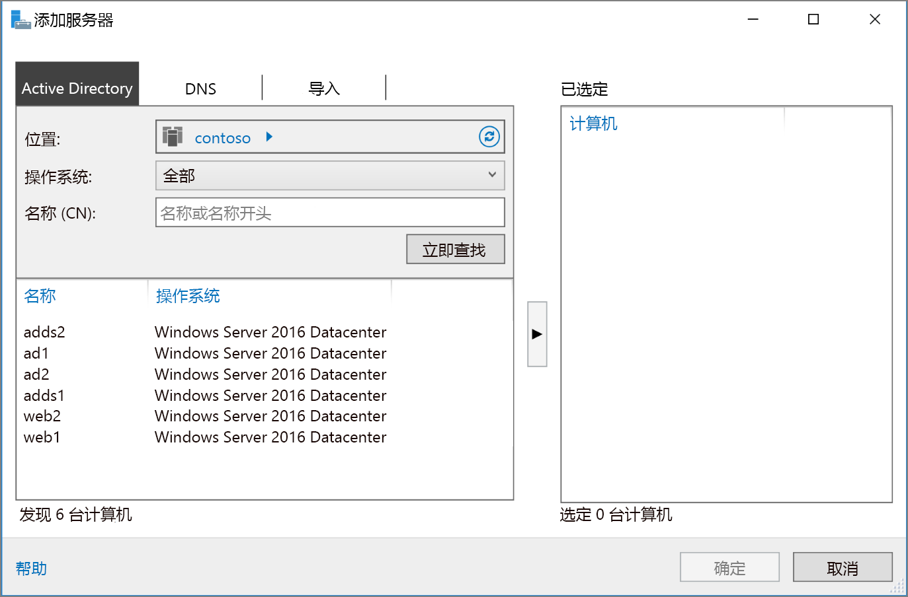

# <a name="extend-active-directory-domain-services-ad-ds-to-azure"></a>将 Active Directory 域服务 (AD DS) 扩展到 Azure

此参考体系结构展示了如何使用 Active Directory 域服务 (AD DS) 将 Active Directory 环境扩展到 Azure 以提供分布式身份验证服务。 [**部署此解决方案**。](#deploy-the-solution)

[![0]][0] 

下载此体系结构的 [Visio 文件][visio-download]。

AD DS 用来对安全域中包括的用户、计算机、应用程序或其他标识进行身份验证。 它可以托管在本地，但是如果你的应用程序部分托管在本地部分托管在 Azure 中，则将此功能复制到 Azure 中可能更为高效。 这可以降低由于将身份验证和本地授权请求从云发送回在本地运行的 AD DS 而导致的延迟。 

如果本地网络和 Azure 虚拟网络通过 VPN 或 ExpressRoute 连接进行连接，通常会使用此体系结构。 此体系结构还支持双向复制，这意味着既可以在本地又可以在云中进行更改，并且两个源都将保持一致。 此体系结构的典型用途包括功能分布在本地和 Azure 中的混合应用程序以及使用 Active Directory 执行身份验证的应用程序和服务。

有关其他注意事项，请参阅[选择用于将本地 Active Directory 与 Azure 相集成的解决方案][considerations]。 

## <a name="architecture"></a>体系结构 

此体系结构扩展了 [Azure 与 Internet 之间的外围网络][implementing-a-secure-hybrid-network-architecture-with-internet-access]中显示的体系结构。 它包括以下组件。

* **本地网络**。 本地网络包括可以对位于本地的组件执行身份验证和授权的本地 Active Directory 服务器。
* **Active Directory 服务器**。 它们是域控制器，用于实现在云中作为 VM 运行的目录服务 (AD DS)。 这些服务器可以为在 Azure 虚拟网络中运行的组件提供身份验证。
* **Active Directory 子网**。 AD DS 服务器托管在一个单独的子网中。 网络安全组 (NSG) 规则对 AD DS 服务器进行保护，并提供防火墙以阻止来自意外来源的流量。
* **Azure 网关和 Active Directory 同步**。 Azure 网关在本地网络与 Azure VNet 之间提供连接。 这可以是 [VPN 连接][azure-vpn-gateway]，也可以是 [Azure ExpressRoute][azure-expressroute]。 云中的 Active Directory 服务器与本地 Active Directory 服务器之间的所有同步请求都通过该网关。 用户定义的路由 (UDR) 处理传递到 Azure 的本地流量的路由。 传入到 Active Directory 服务器或从中传出的流量不通过此方案中使用的网络虚拟设备 (NVA)。

有关配置 UDR 和 NVA 的详细信息，请参阅[在 Azure 中实现安全的混合网络体系结构][implementing-a-secure-hybrid-network-architecture]。 

## <a name="recommendations"></a>建议

以下建议适用于大多数方案。 除非有优先于这些建议的特定要求，否则请遵循这些建议。 

### <a name="vm-recommendations"></a>VM 建议

根据预计的身份验证请求量决定 [VM 大小][vm-windows-sizes]。 使用在本地托管着 AD DS 的计算机的规范作为起点，并使其与 Azure VM 大小相匹配。 在部署后，监视利用率并根据 VM 上的实际负载纵向扩展或收缩。 有关确定 AD DS 域控制器大小的详细信息，请参阅 [Capacity Planning for Active Directory Domain Services][capacity-planning-for-adds]（Active Directory 域服务的容量规划）。

创建一个单独的虚拟数据磁盘，用以存储 Active Directory 的数据库、日志和 SYSVOL。 不要将这些项与操作系统存储在同一磁盘上。 注意，默认情况下，附加到 VM 的数据磁盘使用直写式缓存。 但是，这种形式的缓存可能会与 AD DS 的要求发生冲突。 因此，请将数据磁盘上的“主机缓存首选项”设置设为“无”。 有关详细信息，请参阅[在 Azure 虚拟机上部署 Windows Server Active Directory 的指南][adds-data-disks]。

部署至少两个运行 AD DS 作为域控制器的 VM，并将它们添加到[可用性集][availability-set]中。

### <a name="networking-recommendations"></a>网络建议

为每个 AD DS 服务器的 VM 网络接口 (NIC) 配置一个静态专用 IP 地址，以提供完整的域名服务 (DNS) 支持。 有关详细信息，请参阅[如何在 Azure 门户中设置静态专用 IP 地址][set-a-static-ip-address]。

> [!NOTE]
> 不要为任何 AD DS 的 VM NIC 配置公共 IP 地址。 有关更多详细信息，请参阅[安全注意事项][security-considerations]。
> 
> 

Active Directory 子网 NSG 要求规则允许来自本地的传入流量。 有关 AD DS 使用的端口的详细信息，请参阅 [Active Directory and Active Directory Domain Services Port Requirements][ad-ds-ports]（Active Directory 和 Active Directory 域服务端口要求）。 此外，请确保 UDR 表不通过此体系结构中使用的 NVA 来路由 AD DS 流量。 

### <a name="active-directory-site"></a>Active Directory 站点

在 AD DS 中，站点表示一个物理位置、网络或表示设备集合。 AD DS 站点用来管理 AD DS 数据库复制，它们将位置彼此靠近且由高速网络连接的 AD DS 对象分组到一起。 AD DS 包括了相应的逻辑来选择用于在站点之间复制 AD DS 数据库的最佳策略。

建议你创建一个 AD DS 站点，并使其包括在 Azure 中为你的应用程序定义的子网。 然后，配置本地 AD DS 站点之间的站点链接，AD DS 将自动执行最高效的数据库复制。 注意，除了初始配置之外，此数据库复制还要求进行少量其他配置。

### <a name="active-directory-operations-masters"></a>Active Directory 操作主机

可以向 AD DS 域控制器分配操作主机角色以支持在复制的 AD DS 数据库实例之间执行一致性检查。 有五个操作主机角色：架构主机、域命名主机、相对标识符主机、主域控制器主机模拟器和基础结构主机。 有关这些角色的详细信息，请参阅 [What are Operations Masters?][ad-ds-operations-masters]（什么是操作主机？）。

建议不要向在 Azure 中部署的域控制器分配操作主机角色。

### <a name="monitoring"></a>监视

监视域控制器 VM 以及 AD DS 服务的资源并创建一个计划来快速更正任何问题。 有关详细信息，请参阅 [Monitoring Active Directory][monitoring_ad]（监视 Active Directory）。 可以在监视服务器上（请参阅体系结构图）安装 [Microsoft Systems Center][microsoft_systems_center] 之类的工具来帮助执行这些任务。  

## <a name="scalability-considerations"></a>可伸缩性注意事项

AD DS 是为实现可伸缩性而设计的。 你不需要配置负载均衡器或流量控制器来将请求定向到 AD DS 域控制器。 唯一的可伸缩性注意事项是为运行 AD DS 的 VM 配置满足你的网络负载要求的合适大小，监视 VM 上的负载并根据需要纵向扩展或收缩。

## <a name="availability-considerations"></a>可用性注意事项

将运行 AD DS 的 VM 部署到一个[可用性集][availability-set]中。 另外，请考虑根据需要向至少一台（可能更多）服务器分配[备用操作主机][standby-operations-masters]角色。 备用操作主机是操作主机的主动副本，在故障转移期间可以用来替代主操作主机服务器。

## <a name="manageability-considerations"></a>可管理性注意事项

执行定期 AD DS 备份。 不要只是简单地复制域控制器的 VHD 文件，而是要执行定期备份，因为在复制 VHD 上的 AD DS 数据库文件时，该文件可能会未处于一致状态，导致无法重新启动数据库。

不要使用 Azure 门户关闭域控制器 VM。 相反，请从来宾操作系统进行关闭和重新启动。 通过门户进行关闭会导致 VM 被解除分配，这会重置 Active Directory 存储库的 `VM-GenerationID` 和 `invocationID`。 这将放弃 AD DS 相对标识符 (RID) 池并将 SYSVOL 标记为非权威的，并且可能需要配置域控制器。

## <a name="security-considerations"></a>安全注意事项

AD DS 服务器提供身份验证服务并且是引入注目的攻击目标。 若要保护它们，请通过以下方法阻止直接 Internet 连接：将 AD DS 服务器放置在一个单独的子网中并使用 NSG 作为防火墙。 关闭 AD DS 服务器上的所有端口，但身份验证、授权和服务器同步所需的那些端口除外。 有关详细信息，请参阅 [Active Directory and Active Directory Domain Services Port Requirements][ad-ds-ports]（Active Directory 和 Active Directory 域服务端口要求）。

考虑通过一对子网和 NVA 在服务器周围实现一个额外的安全外围，如[在 Azure 中实现具有 Internet 访问的安全的混合网络体系结构][implementing-a-secure-hybrid-network-architecture-with-internet-access]中所述。

使用 BitLocker 或 Azure 磁盘加密对托管着 AD DS 数据库的磁盘进行加密。

## <a name="deploy-the-solution"></a>部署解决方案

[GitHub][github] 上提供了此体系结构的部署。 请注意，整个部署最长可能需要花费两个小时，包括创建 VPN 网关和运行配置 AD DS 的脚本。

### <a name="prerequisites"></a>先决条件

[!INCLUDE [ref-arch-prerequisites.md](../../../includes/ref-arch-prerequisites.md)]

### <a name="deploy-the-simulated-on-premises-datacenter"></a>部署模拟的本地数据中心

1. 导航到 GitHub 存储库的 `identity/adds-extend-domain` 文件夹。

2. 打开 `onprem.json` 文件。 搜索 `adminPassword` 和 `Password` 的实例并添加密码值。

3. 运行以下命令，并等待部署完成：

    ```bash
    azbb -s <subscription_id> -g <resource group> -l <location> -p onprem.json --deploy
    ```

### <a name="deploy-the-azure-vnet"></a>部署 Azure VNet

1. 打开 `azure.json` 文件。  搜索 `adminPassword` 和 `Password` 的实例并添加密码值。 

2. 在同一文件中，搜索 `sharedKey` 的实例并输入 VPN 连接的共享密钥。 

    ```bash
    "sharedKey": "",
    ```

3. 运行以下命令并等待部署完成。

    ```bash
    azbb -s <subscription_id> -g <resource group> -l <location> -p onoprem.json --deploy
    ```

   部署到本地 VNet 所在的同一个资源组。

### <a name="test-connectivity-with-the-azure-vnet"></a>测试与 Azure VNet 的连接

部署完成后，可以测试从模拟本地环境到 Azure VNet 的连接。

1. 使用 Azure 门户导航到已创建的资源组。

2. 找到名为 `ra-onpremise-mgmt-vm1` 的 VM。

3. 单击 `Connect` 来与 VM 建立远程桌面会话。 用户名为 `contoso\testuser`，密码为 `onprem.json` 参数文件中指定的密码。

4. 在远程桌面会话中，与 10.0.4.4（名为 `adds-vm1` 的 VM 的 IP 地址）建立另一个远程桌面会话。 用户名为 `contoso\testuser`，密码为 `azure.json` 参数文件中指定的密码。

5. 在 `adds-vm1` 的远程桌面会话中，转到“服务器管理器”并单击“添加要管理的其他服务器”。 

6. 在“Active Directory”选项卡中，单击“立即查找”。 应会看到 AD、AD DS 和 Web VM 的列表。

   

## <a name="next-steps"></a>后续步骤

* 了解在 Azure 中[创建 AD DS 资源林][adds-resource-forest]的最佳做法。
* 了解在 Azure 中[创建 Active Directory 联合身份验证服务 (AD FS) 基础结构][adfs]的最佳做法。

<!-- links -->

[adds-resource-forest]: adds-forest.md
[adfs]: adfs.md
[azure-cli-2]: /azure/install-azure-cli
[azbb]: https://github.com/mspnp/template-building-blocks/wiki/Install-Azure-Building-Blocks
[implementing-a-secure-hybrid-network-architecture]: ../dmz/secure-vnet-hybrid.md
[implementing-a-secure-hybrid-network-architecture-with-internet-access]: ../dmz/secure-vnet-dmz.md

[adds-data-disks]: https://msdn.microsoft.com/en-us/library/mt674703.aspx
[ad-ds-operations-masters]: https://technet.microsoft.com/library/cc779716(v=ws.10).aspx
[ad-ds-ports]: https://technet.microsoft.com/library/dd772723(v=ws.11).aspx
[availability-set]: /azure/virtual-machines/virtual-machines-windows-create-availability-set
[azure-expressroute]: /azure/expressroute/expressroute-introduction
[azure-vpn-gateway]: /azure/vpn-gateway/vpn-gateway-about-vpngateways
[capacity-planning-for-adds]: https://social.technet.microsoft.com/wiki/contents/articles/14355.capacity-planning-for-active-directory-domain-services.aspx
[considerations]: ./considerations.md
[GitHub]: https://github.com/mspnp/reference-architectures/tree/master/identity/adds-extend-domain
[microsoft_systems_center]: https://www.microsoft.com/server-cloud/products/system-center-2016/
[monitoring_ad]: https://msdn.microsoft.com/library/bb727046.aspx
[security-considerations]: #security-considerations
[set-a-static-ip-address]: /azure/virtual-network/virtual-networks-static-private-ip-arm-pportal
[standby-operations-masters]: https://technet.microsoft.com/library/cc794737(v=ws.10).aspx
[visio-download]: https://archcenter.blob.core.windows.net/cdn/identity-architectures.vsdx
[vm-windows-sizes]: /azure/virtual-machines/virtual-machines-windows-sizes

[0]: ./images/adds-extend-domain.png "使用 Active Directory 保护混合网络体系结构的安全"
