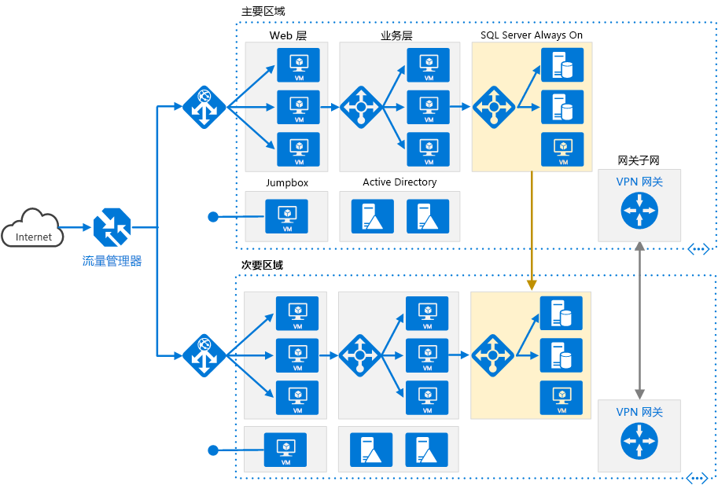

# <a name="run-an-n-tier-application-in-multiple-azure-regions-for-high-availability"></a>在多个 Azure 区域中运行 N 层应用程序以确保高可用性

此参考体系结构展示了在多个 Azure 区域中运行 N 层应用程序以实现可用性和强健的灾难恢复基础结构的一组经过实践检验的做法。



下载此体系结构的 [Visio 文件][visio-download]。

## <a name="architecture"></a>体系结构

此体系结构基于[使用 SQL Server 的 N 层应用程序](n-tier-sql-server.md)中所示的体系结构。

- **主要和次要区域**。 使用两个区域来实现更高的可用性。 其中一个是主要区域。 另一个区域用于故障转移。

- **Azure 流量管理器**。 [流量管理器][traffic-manager]将传入请求路由到其中一个区域。 在正常运行期间，它将请求路由到主要区域。 如果该区域变得不可用，则流量管理器将故障转移到次要区域。 有关详细信息，请参阅[流量管理器配置](#traffic-manager-configuration)部分。

- **资源组**。 为主要区域、次要区域和流量管理器创建单独的[资源组][resource groups]。 这允许你将每个区域作为单个资源集合灵活进行管理。 例如，可以重新部署一个区域而无需关闭另一个区域。 [链接资源组][resource-group-links]，以便可以运行查询来列出应用程序的所有资源。

- **Vnet**。 为每个区域创建一个单独的 VNet。 请确保地址空间不重叠。

- **SQL Server Always On 可用性组**。 如果使用的是 SQL Server，建议使用 [SQL Always On 可用性组][sql-always-on]以实现高可用性。 创建同时包含两个区域中的 SQL Server 实例的单个可用性组。

    > [!NOTE]
    > 另外请考虑使用 [Azure SQL 数据库][azure-sql-db]，它以云服务形式提供关系数据库。 使用 SQL 数据库，不需要配置可用性组或管理故障转移。
    >

- **VPN 网关**。 在每个 VNet 中创建一个 [VPN 网关][vpn-gateway]，并配置一个 [VNet 到 VNet 连接][vnet-to-vnet]以在两个 VNet 之间实现网络流量传输。 对于 SQL Always On 可用性组，这是必需的。

## <a name="recommendations"></a>建议

与部署到单个区域相比，多区域体系结构可以提供更高的可用性。 如果区域性故障影响了主要区域，则可以使用[流量管理器][traffic-manager]故障转移到次要区域。 当应用程序的单个子系统出现故障时，此体系结构可能也比较有用。

有多种常规方法可跨区域实现高可用性：

- 主动/被动（采用热备用模式）。 流量将前往一个区域，而另一个区域将以热备用模式等待。 “热备用模式”意味着次要区域中的 VM 已被分配并总是处于运行状态。
- 主动/被动（采用冷备用模式）。 流量将前往一个区域，而另一个区域将以冷备用模式等待。 “冷备用模式”意味着次要区域中的 VM 不会被分配，直到故障转移需要它们。 此方法的运行成本较低，但是当发生故障时通常需要花费更长时间才能联机。
- 主动/主动。 两个区域都处于活动状态，并且会在它们之间对请求进行负载均衡。 如果一个区域变得不可用，则不再使其参与轮换。

此参考体系结构侧重于“主动/被动（采用热备用模式）”，使用流量管理器进行故障转移。 注意，可以为热备用模式部署少量 VM，然后根据需要横向扩展。

### <a name="regional-pairing"></a>区域配对

每个 Azure 区域都与同一地域内的另一个区域配对。 通常，请选择同一区域对中的区域（例如“美国东部 2”和“美国中部”）。 这样做的好处包括：

- 如果发生大范围的故障，会优先恢复每个区域对中的至少一个区域。
- 计划内 Azure 系统更新会按顺序提供给配对的区域，以尽可能减少停机时间。
- 区域对位于同一地域内，以满足数据驻留要求。

但请确保两个区域都支持应用程序所需的所有 Azure 服务（请参阅[每个区域的服务][services-by-region]）。 有关区域对的详细信息，请参阅[业务连续性和灾难恢复 (BCDR)：Azure 配对区域][regional-pairs]。

### <a name="traffic-manager-configuration"></a>流量管理器配置

配置流量管理器时，请考虑以下几点：

- **路由**。 流量管理器支持多个[路由算法][tm-routing]。 对于本文中所述的情况，请使用“优先级”路由（以前称为“故障转移”路由）。 使用此设置时，流量管理器将所有请求都发送到主要区域，除非主要区域变得无法访问。 那时，它将自动故障转移到次要区域。 请参阅[配置故障转移路由方法][tm-configure-failover]。
- **运行状况探测**。 流量管理器使用 HTTP（或 HTTPS）[探测][tm-monitoring]来监视每个区域的可用性。 探测检查指定 URL 路径的 HTTP 200 响应。 作为最佳做法，请创建一个用于报告应用程序整体运行状况的终结点，并使用此终结点进行运行状况探测。 否则，探测可能会在应用程序的关键部分实际上已出现故障时报告终结点运行状况正常。 有关详细信息，请参阅[运行状况终结点监视模式][health-endpoint-monitoring-pattern]。

当流量管理器进行故障转移时，一段时间内客户端将无法访问应用程序。 持续时间受以下因素影响：

- 运行状况探测必须检测主要区域是否变得无法访问。
- DNS 服务器必须更新 IP 地址的已缓存 DNS 记录，这取决于 DNS 生存时间 (TTL)。 默认 TTL 为 300 秒（5 分钟），但可以在创建流量管理器配置文件时配置此值。

相关详细信息，请参阅[关于流量管理器监视][tm-monitoring]。

如果流量管理器进行故障转移，我们建议执行手动故障回复，而不是实施自动故障回复。 否则，可能会造成应用程序在区域之间来回转移的情况。 在进行故障回复之前，请验证是否所有应用程序子系统的运行状况都正常。

请注意，默认情况下，流量管理器会自动进行故障回复。 若要禁止此操作，请在发生故障转移事件后手动降低主要区域的优先级。 例如，假设主要区域的优先级为 1，次要区域的优先级为 2。 在故障转移后，请将主要区域的优先级设置为 3，以禁止自动故障回复。 当准备好切换回来时，请将优先级更新为 1。

以下 [Azure CLI][azure-cli] 命令更新优先级：

```azurecli
az network traffic-manager endpoint update --resource-group <resource-group> --profile-name <profile>
    --name <endpoint-name> --type azureEndpoints --priority 3
```

另一种方法是暂时禁用终结点，直到你准备好进行故障回复：

```azurecli
az network traffic-manager endpoint update --resource-group <resource-group> --profile-name <profile>
    --name <endpoint-name> --type azureEndpoints --endpoint-status Disabled
```

可能需要重新部署某个区域中的资源，具体取决于故障转移原因。 在进行故障回复之前，请执行操作准备情况测试。 测试应当验证的事项如下所示：

- VM 是否已正确配置。 （所有必需的软件是否已安装、IIS 是否正在运行，等等。）
- 应用程序子系统运行状况是否正常。
- 功能测试。 （例如，是否可以从 Web 层访问数据库层。）

### <a name="configure-sql-server-always-on-availability-groups"></a>配置 SQL Server Always On 可用性组

在 Windows Server 2016 之前，SQL Server Always On 可用性组需要一个域控制器，并且可用性组中的所有节点必须在同一 Active Directory (AD) 域中。

若要配置可用性组，请执行以下操作：

- 至少在每个区域中放置两个域控制器。
- 为每个域控制器提供一个静态 IP 地址。
- 创建 VNet 到 VNet 连接，以允许在 Vnet 之间进行通信。
- 针对每个 VNet，将两个区域中的域控制器的 IP 地址添加到 DNS 服务器列表。 可以使用以下 CLI 命令。 有关详细信息，请参阅[更改 DNS 服务器][vnet-dns]。

    ```azurecli
    az network vnet update --resource-group <resource-group> --name <vnet-name> --dns-servers "10.0.0.4,10.0.0.6,172.16.0.4,172.16.0.6"
    ```

- 创建一个 [Windows Server 故障转移群集][wsfc] (WSFC) 群集，使其包括两个区域中的 SQL Server 实例。
- 创建一个 SQL Server Always On 可用性组，使其包括主要区域和次要区域中的 SQL Server 实例。 有关步骤，请参阅[将 Always On 可用性组扩展到远程 Azure 数据中心 (PowerShell)](https://blogs.msdn.microsoft.com/sqlcat/2014/09/22/extending-alwayson-availability-group-to-remote-azure-datacenter-powershell/)。

  - 将主要副本放置在主要区域中。
  - 将一个或多个次要副本放置在主要区域中。 对它们进行配置以将同步提交与自动故障转移一起使用。
  - 将一个或多个次要副本放置在次要区域中。 出于性能方面的原因，请对它们进行配置以使用*异步*提交。 （否则，所有 T-SQL 事务必须等待通过网络到次要区域的往返旅程。）

    > [!NOTE]
    > 异步提交副本不支持自动故障转移。

## <a name="availability-considerations"></a>可用性注意事项

使用复杂的 N 层应用时，可能不需要在次要区域中复制整个应用程序。 相反，可能只需复制支持业务连续性所需的关键子系统。

流量管理器是系统中的一个潜在故障点。 如果流量管理器服务出现故障，则客户端在停机期间无法访问应用程序。 查看[流量管理器 SLA][tm-sla]，然后确定仅使用流量管理器是否能满足业务对高可用性的需求。 如果不能，请考虑添加另一个流量管理解决方案作为故障回复机制。 如果 Azure 流量管理器服务出现故障，请将 DNS 中的 CNAME 记录更改为指向其他流量管理服务。 （此步骤必须手动执行，并且在 DNS 更改被传播之前，应用程序将不可用。）

对于 SQL Server 群集，有两个故障转移方案需要考虑：

- 主要区域中的所有 SQL Server 数据库副本都失败。 例如，在发生区域性中断期间可能会出现此情况。 在这种情况下，必须手动故障转移可用性组，尽管流量管理器在前端会自动进行故障转移。 请按照[执行可用性组的强制手动故障转移 (SQL Server)](https://msdn.microsoft.com/library/ff877957.aspx) 一文中的步骤进行操作，该文章介绍了如何在 SQL Server 2016 中使用 SQL Server Management Studio、Transact-SQL 或 PowerShell 执行强制故障转移。

   > [!WARNING]
   > 使用强制故障转移时存在数据丢失风险。 在主要区域恢复联机状态后，创建数据库快照并使用 [tablediff] 查明差异。

- 流量管理器故障转移到次要区域，但主要 SQL Server 数据库副本仍然可用。 例如，前端层可能会失败，但不会影响 SQL Server VM。 在这种情况下，Internet 流量将路由到次要区域中，并且该区域仍可以连接到主要副本。 但是，延迟将有所增加，因为 SQL Server 连接是跨区域的。 在此情况下，应当执行手动故障转移，如下所述：

   1. 暂时将次要区域中的 SQL Server 数据库副本切换为*同步*提交。 这可确保在故障转移期间不会丢失数据。
   2. 故障转移到该副本。
   3. 在故障回复到主要区域后，还原异步提交设置。

## <a name="manageability-considerations"></a>可管理性注意事项

更新部署时，请一次更新一个区域，以减少由于错误配置或应用程序中的错误而导致全局故障的可能性。

测试系统在发生故障时的复原能力。 下面是要测试的一些常见故障方案：

- 关闭 VM 实例。
- 对 CPU 和内存等资源进行压力测试。
- 断开网络连接/使网络传输出现延迟。
- 使进程崩溃。
- 使证书过期。
- 模拟硬件错误。
- 关闭域控制器上的 DNS 服务。

测量恢复时间，并验证它们是否满足你的业务要求。 另外还测试故障模式的组合。

## <a name="related-resources"></a>相关资源

可以查看以下 [Azure 示例方案](/azure/architecture/example-scenario)，了解使用部分相同技术的具体解决方案：

- [Azure 上可实现高可用性和灾难恢复的多层 Web 应用程序](/azure/architecture/example-scenario/infrastructure/multi-tier-app-disaster-recovery)
- [使用 Windows 虚拟机在 Azure 上构建安全的 Web 应用程序](/azure/architecture/example-scenario/infrastructure/regulated-multitier-app)

<!-- links -->

[hybrid-vpn]: ../hybrid-networking/vpn.md
[azure-dns]: /azure/dns/dns-overview
[azure-sla]: https://azure.microsoft.com/support/legal/sla/
[azure-sql-db]: /azure/sql-database/
[health-endpoint-monitoring-pattern]: https://msdn.microsoft.com/library/dn589789.aspx
[azure-cli]: /cli/azure/
[regional-pairs]: /azure/best-practices-availability-paired-regions
[resource groups]: /azure/azure-resource-manager/resource-group-overview
[resource-group-links]: /azure/resource-group-link-resources
[resource-manager-overview]: /azure/azure-resource-manager/resource-group-overview
[services-by-region]: https://azure.microsoft.com/regions/#services
[sql-always-on]: https://msdn.microsoft.com/library/hh510230.aspx
[tablediff]: https://msdn.microsoft.com/library/ms162843.aspx
[tm-configure-failover]: /azure/traffic-manager/traffic-manager-configure-failover-routing-method
[tm-monitoring]: /azure/traffic-manager/traffic-manager-monitoring
[tm-routing]: /azure/traffic-manager/traffic-manager-routing-methods
[tm-sla]: https://azure.microsoft.com/support/legal/sla/traffic-manager
[traffic-manager]: https://azure.microsoft.com/services/traffic-manager
[visio-download]: https://archcenter.blob.core.windows.net/cdn/vm-reference-architectures.vsdx
[vnet-dns]: /azure/virtual-network/manage-virtual-network#change-dns-servers
[vnet-to-vnet]: /azure/vpn-gateway/vpn-gateway-vnet-vnet-rm-ps
[vpn-gateway]: /azure/vpn-gateway/vpn-gateway-about-vpngateways
[wsfc]: https://msdn.microsoft.com/library/hh270278.aspx
