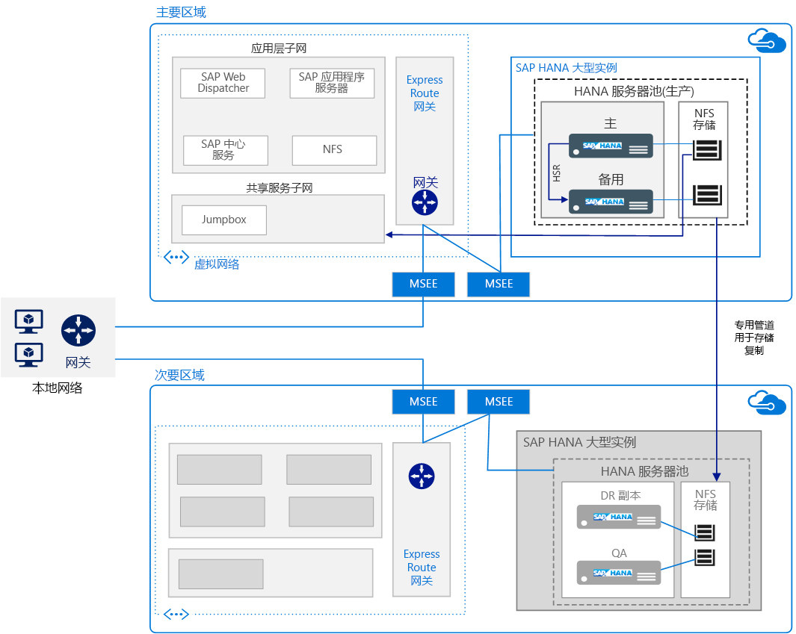

# 运行 Azure SAP HANA 大型实例

此参考体系结构演示有关运行 Azure 上的 SAP HANA（大型实例）和实现高可用性与灾难恢复 (DR) 的一套成熟做法。 此产品/服务称作 HANA 大型实例，部署在 Azure 区域中的物理服务器上。

下载此体系结构的 [Visio 文件][visio-download]。

> [!NOTE]
> 部署此参考体系结构需要获取 SAP 产品和其他非 Microsoft 技术的相应许可。

## 体系结构

此体系结构包括以下基础结构组件。

- 虚拟网络。 [Azure 虚拟网络][vnet]服务在不同的 Azure 资源之间建立安全连接，并针对每个层划分为单独的[子网][subnet]。 SAP 应用程序层部署在 Azure 虚拟机 (VM) 上，以连接到大型实例上的 HANA 数据库层。

- **虚拟机**。 虚拟机在 SAP 应用程序层和共享服务层中使用。 后者包括一个 Jumpbox，让管理员设置 HANA 大型实例以及提供对其他虚拟机的访问。

- **HANA 大型实例**。 一台经认证符合 SAP HANA 定制数据中心集成 (TDI) 标准的[物理服务器][physical]运行 SAP HANA。 此体系结构使用两个 HANA 大型实例：主要计算单位和次要计算单位。 通过 HANA 系统复制 (HSR) 提供数据层的高可用性。

- **高可用性对**。 统一管理一组 HANA 大型实例刀片服务器，以提供应用程序冗余和可靠性。

- **MSEE (Microsoft Enterprise Edge)**。 MSEE 是连接提供商或网络边缘中通过 ExpressRoute 线路连接到的连接点。

- **网络接口卡 (NIC)**。 为了实现通信，HANA 大型实例服务器默认提供四个虚拟 NIC。 此体系结构需要将一个 NIC 用于客户端通信，将第二个 NIC 用于 HSR 所需的节点间连接，将第三个 NIC 用于 HANA 大型实例存储，将第四个 NIC 用于高可用性群集中使用的 iSCSI。

- **网络文件系统 (NFS) 存储**。 [NFS][nfs] 服务器支持网络文件共享。网络文件共享为 HANA 大型实例提供安全的数据保留。

- **ExpressRoute**。 要在本地网络与 Azure 虚拟网络之间创建不经由公共 Internet 的专用连接，我们建议使用 [ExpressRoute][expressroute] Azure 网络服务。 Azure VM 使用另一个 ExpressRoute 连接来与 HANA 大型实例建立连接。 Azure 虚拟网络与 HANA 大型实例之间的 ExpressRoute 连接设置为 Microsoft 产品/服务的一部分。

- **网关**。 ExpressRoute 网关用于将 SAP 应用层所用的 Azure 虚拟网络连接到 HANA 大型实例网络。 使用[高性能或超高性能][sku] SKU。

- **灾难恢复 (DR)**。 可根据请求提供存储复制支持。存储复制配置为从主要站点复制到另一区域中的 [DR 站点][DR-site]。

## 建议

要求可能有所不同。请使用以下建议作为入手点。

### HANA 大型实例计算

[大型实例][physical]是基于 Intel EX E7 CPU 体系结构的物理服务器，并在大型实例堆栈（即，特定的一组服务器或刀片服务器）中配置。 一个计算单位等于一台服务器或刀片服务器，一个堆栈由多台服务器或刀片服务器构成。 在大型实例堆栈中，服务器不会共享，而是专门用于运行一个客户的 SAP HANA 部署。

HANA 大型实例有各种可用的 SKU，S/4HANA 或其他 SAP HANA 工作负荷最多支持 20 TB 的单一内存实例（可扩展到 60 TB）。 提供[两类][classes]服务器：

- I 类：S72、S72m、S144、S144m、S192 和 S192m

- II 类：S384、S384m、S384xm、S576m、S768m 和 S960m

例如，S72 SKU 附带 768 GB RAM，3 TB 存储，以及 2 个 36 核 Intel Xeon 处理器 (E7-8890 v3)。 请选择满足体系结构和设计会议中所决定的大小要求的 SKU。 请始终确保大小与正确的 SKU 相搭配。 功能和部署要求[根据类型而异][type]，可用性根据[区域][region]而异。 还可以从一个 SKU 升级到更大的 SKU。

Microsoft 可帮助建立大型实例设置，但你要负责验证操作系统的配置设置。 请务必查看确切 Linux 版本的最新 SAP 说明。

### 存储

根据 SAP HANA TDI 的建议实施存储布局。 HANA 大型实例根据标准的 TDI 规范随附特定的存储配置。 但是，可以 1 TB 为增量购买更多的存储。

为了支持任务关键型环境的要求（包括快速恢复），将使用 NFS 而不是直接附加存储。 HANA 大型实例的 NFS 存储服务器托管在多租户环境中，其中的租户已通过计算、网络和存储隔离技术进行分离和保护。

若要支持主站点的高可用性，请使用不同的存储布局。 例如，在多主机横向扩展部署中，存储是共享的。 另一种高可用性做法是使用基于应用程序的复制，例如 HSR。 但是，对于灾难恢复，应使用基于快照的存储复制。

### 网络

此体系结构使用虚拟网络和物理网络。 虚拟网络是 Azure IaaS 的一部分，通过 [ExpressRoute][expressroute]] 线路连接到离散的 HANA 大型实例物理网络。 跨界网关将 Azure 虚拟网络中的工作负荷连接到本地站点。

出于安全考虑，HANA 大型实例网络相互隔离。 位于不同区域的实例不会相互通信，专用存储复制除外。 但是，若要使用 HSR，必须进行区域间的通信。 [IP 路由表][ip]或代理可用于实现跨区域 HSR。

连接到一个区域中的 HANA 大型实例的所有 Azure 虚拟网络可以通过 ExpressRoute [跨界连接][cross-connected]到次要区域中的 HANA 大型实例。

在预配期间，默认会包含 HANA 大型实例的 ExpressRoute。 在设置期间，需要特定的网络布局，包括所需的 CIDR 地址范围和域路由。 有关详细信息，请参阅 [Azure 上的 SAP HANA（大型实例）的基础结构和连接][HLI-infrastructure]。

## 可伸缩性注意事项

若要纵向扩展或缩减，可以从适用于 HANA 大型实例的多种服务器大小中进行选择。 这些大小分类为 [I 型和 II 型][classes]，是针对不同工作负荷定制的。 请选择在未来三年能够适应工作负荷增长的大小。 我们还提供满足一年需求的承诺。

作为一种数据库分区策略，通常会将多主机横向扩展部署用作 BW/4HANA 部署。 若要横向扩展，请在安装前规划 HANA 表的位置。 从基础结构的角度看，多个主机会连接到共享的存储卷，以便在 HANA 系统中的某个计算工作节点发生故障时，后备主机能够快速接管工作。

使用单个“HANA 大型实例”实例，就能将一台刀片服务器中的 S/4HANA 和 SAP Business Suite on HANA 纵向扩展到 20 TB。

针对节约型的方案，可以使用 [SAP Quick Sizer][quick-sizer] 来计算在 HANA 的基础上实施 SAP 软件时的内存要求。 HANA 的内存需求将随数据量增长而增加。 基于系统的当前内存消耗量预测未来的消耗量，然后将需求对应到某个 HANA 大型实例大小。

对于现有的 SAP 部署，SAP 会提供报告，用于检查现有系统使用的数据并计算 HANA 实例的内存要求。 有关示例，请参阅以下 SAP 说明：

- SAP 说明 [1793345][sap-1793345] - SAP Suite on HANA 的大小
- SAP 说明 [1872170][sap-1872170] - Suite on HANA 和 S/4 HANA 大小报告
- SAP 说明 [2121330][sap-2121330] - 常见问题解答：SAP BW on HANA 大小报告
- SAP 说明 [1736976][sap-1736976] - BW on HANA 的大小报告
- SAP 说明 [2296290][sap-2296290] - BW on HANA 的新大小报告

## 可用性注意事项

资源冗余是高可用性基础结构解决方案中的常见话题。 对于 SLA 不太苛刻的组织而言，单一实例 Azure VM 可以保障运行时间 SLA。 有关详细信息，请参阅 [Azure 服务级别协议](https://azure.microsoft.com/support/legal/sla/)。

咨询 SAP、系统集成商和/或 Microsoft，以便正确构建和实施[高可用性和灾难恢复][hli-hadr]策略。 此体系结构遵循 Azure 上的 HANA（大型实例）的[服务级别协议][sla] (SLA)。 若要评估可用性要求，请考虑任何单一故障点、所需的服务运行时间级别，以及以下常见指标：

- 恢复时间目标 (RTO) 表示 HANA 大型实例服务器处于不可用状态的持续时间。

- 恢复点目标 (RPO) 表示故障导致客户数据丢失的最长可容许期限。

若要实现高可用性，请在高可用性对中部署多个实例，并在同步模式下使用 HSR，以尽量减少数据丢失和停机时间。 除了本地的双节点高可用性设置以外，HSR 还支持多层复制，其中，单独的 Azure 区域中的第三个节点会注册到 HSR 群集对的辅助副本（复制目标）。 这就构成了复制菊花链。 故障转移到 DR 节点是一个手动过程。

如果使用自动故障转移设置了 HANA 大型实例 HSR，则可以请求 Microsoft 服务管理团队为现有的服务器设置 [STONITH 设备][stonith]。

## 灾难恢复注意事项

此体系结构支持不同 Azure 区域中 HANA 大型实例之间的[灾难恢复][hli-dr]。 可以在 HANA 大型实例上使用两种方法来支持 DR：

- 存储复制。 主存储内容会不断复制到指定的 DR HANA 大型实例服务器上提供的远程 DR 存储系统。 在存储复制中，HANA 数据库不会加载到内存中。 从管理角度看，此 DR 选项更简单。 若要确定此策略是否合适，请根据可用性 SLA 考虑数据库加载时间。 使用存储复制还能执行时间点恢复。 如果设置了多用途（成本优化）DR，则必须在 DR 位置购买相同大小的额外存储。 Microsoft 通过 HANA 大型实例产品/服务为 HANA 故障转移提供自助服务[存储快照和故障转移脚本][scripts]。

- DR 区域中包含第三个副本的多层 HSR（其中的 HANA 数据库会加载到内存中）。 此选项支持更快的恢复时间，但不支持时间点恢复。 HSR 需要辅助系统。 DR 站点的 HANA 系统复制通过 nginx 等代理或 IP 表进行处理。

> [!NOTE]
> 可以在单一实例环境中运行此参考体系结构，以优化其成本。 此[成本优化方案](https://blogs.sap.com/2016/07/19/new-whitepaper-for-high-availability-for-sap-hana-cost-optimized-scenario/)适合用于非生产 HANA 工作负荷。

## 备份注意事项

根据业务要求，从[备份和恢复][hli-backup]的多个可用选项中做出选择。

| 备份选项                   | 优点                                                                                                   | 缺点                                                       |
|---------------------------------|--------------------------------------------------------------------------------------------------------|------------------------------------------------------------|
| HANA 备份        | 本机到 SAP。 内置的一致性检查。                                                             | 备份和恢复时间较长。 消耗存储空间。 |
| HANA 快照      | 本机到 SAP。 备份和还原速度较快。                                                               |                                       |
| 存储快照   | HANA 大型实例已随附。 已优化 HANA 大型实例的 DR。 支持启动卷备份。 | 每个卷最多 254 个快照。                          |
| 日志备份         | 时间点恢复需要此选项。                                                                   |                                                            |
| 其他备份工具 | 冗余备份位置。                                                                             | 额外的许可费用。                                |

## 可管理性注意事项

使用 SAP HANA Studio、SAP HANA Cockpit、SAP Solution Manager 和其他本机 Linux 工具来监视 CPU、内存、网络带宽和存储空间等 HANA 大型实例资源。 HANA 大型实例未随附内置的监视工具。 Microsoft 会提供所需的资源用于根据组织的要求进行[故障排除和监视][hli-troubleshoot]，Microsoft 支持团队可以帮助排查技术问题。

如需更大的计算能力，必须购买更大的 SKU。

## 安全注意事项

- 默认情况下，HANA 大型实例针对静态数据使用基于 TDE（透明数据加密）的存储加密。

- HANA 大型实例与虚拟机之间的传输中数据不会加密。 若要加密数据传输，请启用应用程序特定的加密。 请参阅 SAP 说明 [2159014][sap-2159014] - 常见问题解答：SAP HANA 安全性。

- 隔离功能在多租户 HANA 大型实例环境中的租户之间提供安全性。 使用租户自身的 VLAN 来隔离租户。

- [Azure 网络安全最佳做法][network-best-practices]提供了有用的指导。

- 与处理任何部署一样，我们建议进行[操作系统强化][os-hardening]。

- 出于物理安全性考虑，仅限已获授权的人员访问 Azure 数据中心。 任何客户都不能访问物理服务器。

有关详细信息，请参阅 [SAP HANA 安全性 - 概述][sap-security]。（需要创建一个 SAP Service Marketplace 帐户进行访问。）

## 社区

社区可以解答问题，并帮助设置成功的部署。 请注意以下几点：

- [在 Microsoft 平台上运行 SAP 应用程序（博客）][running-sap-blog]
- [Azure 社区支持][azure-forum]
- [SAP 社区][sap-community]
- [Stack Overflow SAP][stack-overflow]

[azure-forum]: https://azure.microsoft.com/support/forums/
[azure-large-instances]: /azure/virtual-machines/workloads/sap/hana-overview-architecture
[classes]: /azure/virtual-machines/workloads/sap/hana-overview-architecture
[cross-connected]: /azure/virtual-machines/workloads/sap/hana-overview-high-availability-disaster-recovery#network-considerations-for-disaster-recovery-with-hana-large-instances
[dr-site]: /azure/virtual-machines/workloads/sap/hana-overview-high-availability-disaster-recovery
[expressroute]: /azure/architecture/reference-architectures/hybrid-networking/expressroute
[filter-network]: https://azure.microsoft.com/blog/multiple-vm-nics-and-network-virtual-appliances-in-azure/
[hli-dr]: /azure/virtual-machines/workloads/sap/hana-overview-high-availability-disaster-recovery#network-considerations-for-disaster-recovery-with-hana-large-instances
[hli-backup]: /azure/virtual-machines/workloads/sap/hana-overview-high-availability-disaster-recovery#backup-and-restore
[hli-hadr]: /azure/virtual-machines/workloads/sap/hana-overview-high-availability-disaster-recovery?toc=%2fazure%2fvirtual-machines%2flinux%2ftoc.json
[hli-infrastructure]: /azure/virtual-machines/workloads/sap/hana-overview-infrastructure-connectivity
[hli-overview]: /azure/virtual-machines/workloads/sap/hana-overview-architecture
[hli-troubleshoot]: /azure/virtual-machines/workloads/sap/troubleshooting-monitoring
[ip]: https://blogs.msdn.microsoft.com/saponsqlserver/2018/02/10/setting-up-hana-system-replication-on-azure-hana-large-instances/
[network-best-practices]: /azure/security/azure-security-network-security-best-practices
[nfs]: /azure/virtual-machines/workloads/sap/high-availability-guide-suse-nfs
[os-hardening]: /azure/security/azure-security-iaas
[physical]: /azure/virtual-machines/workloads/sap/hana-overview-architecture
[planning]: /azure/vpn-gateway/vpn-gateway-plan-design
[protecting-sap]: https://blogs.msdn.microsoft.com/saponsqlserver/2016/05/06/protecting-sap-systems-running-on-vmware-with-azure-site-recovery/
[ref-arch]: /azure/architecture/reference-architectures/
[running-SAP]: https://blogs.msdn.microsoft.com/saponsqlserver/2016/06/07/sap-on-sql-general-update-for-customers-partners-june-2016/
[region]: https://azure.microsoft.com/global-infrastructure/services/
[running-sap-blog]: https://blogs.msdn.microsoft.com/saponsqlserver/2017/05/04/sap-on-azure-general-update-for-customers-partners-april-2017/
[quick-sizer]: https://service.sap.com/quicksizing
[sap-1793345]: https://launchpad.support.sap.com/#/notes/1793345
[sap-1872170]: https://launchpad.support.sap.com/#/notes/1872170
[sap-2121330]: https://launchpad.support.sap.com/#/notes/2121330
[sap-2159014]: https://launchpad.support.sap.com/#/notes/2159014
[sap-1736976]: https://launchpad.support.sap.com/#/notes/1736976
[sap-2296290]: https://launchpad.support.sap.com/#/notes/2296290
[sap-community]: https://www.sap.com/community.html
[sap-security]: https://archive.sap.com/documents/docs/DOC-62943
[scripts]: /azure/virtual-machines/workloads/sap/hana-overview-high-availability-disaster-recovery
[sku]: /azure/expressroute/expressroute-about-virtual-network-gateways
[sla]: https://azure.microsoft.com/support/legal/sla/virtual-machines
[stack-overflow]: https://stackoverflow.com/tags/sap/info
[stonith]: /azure/virtual-machines/workloads/sap/ha-setup-with-stonith
[subnet]: /azure/virtual-network/virtual-network-manage-subnet
[swd]: https://help.sap.com/doc/saphelp_nw70ehp2/7.02.16/en-us/48/8fe37933114e6fe10000000a421937/frameset.htm
[type]: /azure/virtual-machines/workloads/sap/hana-installation
[vnet]: /azure/virtual-network/virtual-networks-overview
[visio-download]: https://archcenter.blob.core.windows.net/cdn/sap-reference-architectures.vsdx