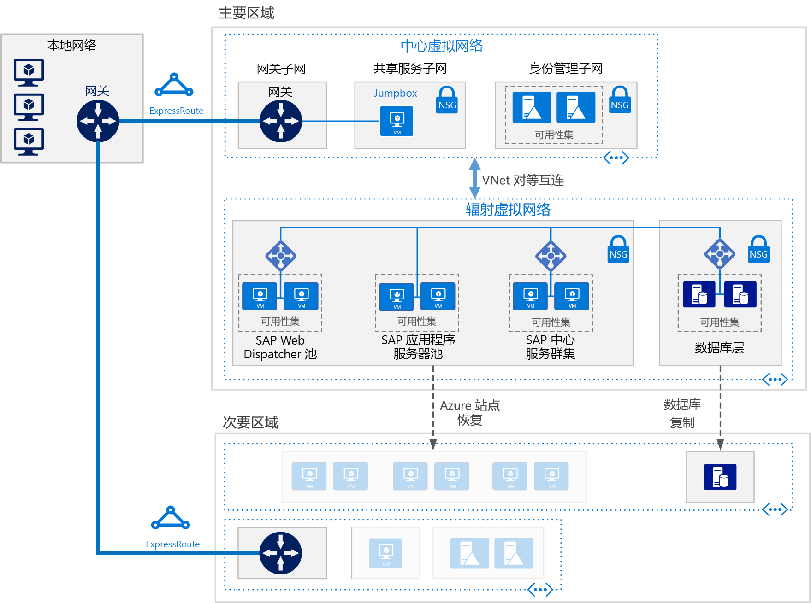

# 在 Azure 虚拟机上部署适用于 AnyDB 的 SAP NetWeaver (Windows)

此参考体系结构演示有关在 Azure 上的高可用性 Windows 环境中运行 SAP NetWeaver 的一套成熟做法。 数据库为 AnyDB（除了 SAP HANA 之外，该 SAP 术语还指任何受支持的 DBMS）。 将使用可根据组织需求更改的特定虚拟机 (VM) 大小部署此体系结构。

下载此体系结构的 [Visio 文件][visio-download]。

> [!NOTE] 
> 部署此参考体系结构需要获取 SAP 产品和其他非 Microsoft 技术的相应许可。

## 体系结构
该体系结构包括以下基础结构和关键软件组件。

虚拟网络。 Azure 虚拟网络服务在 Azure 资源之间建立安全连接。 在此体系结构中，虚拟网络将通过[中心-分支型](../hybrid-networking/hub-spoke.md)拓扑的中心内部署的 VPN 网关连接到本地环境。 分支是用于 SAP 应用程序和数据库层的虚拟网络。

**子网**。 针对以下每个层将虚拟网络细分为单独的子网：应用 (SAP NetWeaver)、数据库、共享服务 (jumpbox) 和 Active Directory。
    
**虚拟机**。 此体系结构对应用层和数据库层使用虚拟机。这些层划分为：

- **SAP NetWeaver**。 应用层使用 Windows 虚拟机，并运行 SAP Central Services 和 SAP 应用程序服务器。 运行 Central Services 的 VM 配置为 SIOS DataKeeper Cluster Edition 支持的 Windows Server 故障转移群集，以实现高可用性。
- **AnyDB**。 数据库层运行用作源数据库的 AnyDB，例如 Microsoft SQL Server、Oracle 或 IBM DB2。
- **Jumpbox**。 也称为守护主机。 这是网络中的一个安全虚拟机，管理员使用它来连接其他虚拟机。
- **Windows Server Active Directory 域控制器。** 对域中的所有 VM 和用户使用域控制器。

**负载均衡器**。 [Azure 负载均衡器](/azure/load-balancer/load-balancer-overview)实例用于将流量分配到应用层子网中的虚拟机。 在数据层，可以通过内置 SAP 负载均衡器、Azure 负载均衡器或其他机制来实现高可用性，具体取决于 DBMS。 有关详细信息，请参阅[适用于 SAP NetWeaver 的 Azure 虚拟机 DBMS 部署](/azure/virtual-machines/workloads/sap/dbms-guide)。 

**可用性集**。 用于 SAP Web 调度程序、SAP 应用程序服务器和 (A)SCS 角色的虚拟机已分组到单独的[可用性集](/azure/virtual-machines/windows/tutorial-availability-sets)，为每个角色至少预配两个虚拟机。 这样，虚拟机便可以满足更高的[服务级别协议 (SLA)](https://azure.microsoft.com/support/legal/sla/virtual-machines)。

**NIC**。 [网络接口卡](/azure/virtual-network/virtual-network-network-interface) (NIC) 使虚拟网络中的虚拟机能够实现各种通信。

**网络安全组**。 若要限制虚拟网络中的传入、传出和子网内部流量，可以创建[网络安全组](/azure/virtual-network/virtual-networks-nsg) (NSG)。

**网关**。 网关将本地网络扩展到 Azure 虚拟网络。 建议使用 [ExpressRoute](/azure/architecture/reference-architectures/hybrid-networking/expressroute) Azure 服务来创建不必经由公共 Internet 的专用连接，但也可以使用[站点到站点](/azure/vpn-gateway/vpn-gateway-howto-site-to-site-resource-manager-portal)连接。

**Azure 存储**。 若要提供虚拟机的虚拟硬盘 (VHD) 持久存储，必须使用 [Azure 存储](/azure/storage/storage-standard-storage)。 [云见证](/windows-server/failover-clustering/deploy-cloud-witness)也会使用 Azure 存储来实施故障转移群集操作。 

## 建议
你的要求可能不同于此处描述的体系结构。 请使用以下建议作为入手点。

### SAP Web 调度程序池

Web 调度程序组件用作 SAP 应用程序服务器之间的 SAP 流量的负载均衡器。 若要实现 Web 调度程序组件的高可用性，需使用 Azure 负载均衡器来实施并行的 Web 调度程序设置。 Web 调度程序使用轮循机制配置，在均衡器池中的可用 Web 调度程序之间分配 HTTP(S) 流量。

有关在 Azure VM 中运行 SAP NetWeaver 的详细信息，请参阅[适用于 SAP NetWeaver 的 Azure 虚拟机规划和实施](/azure/virtual-machines/workloads/sap/planning-guide)。

### 应用程序服务器池

若要管理 ABAP 应用程序服务器的登录组，需使用 SMLG 事务。 该事务使用 Central Services 的消息服务器中的负载均衡功能，在 SAPGUI 的 SAP 应用程序服务器池之间分配工作负荷，以及分配 RFC 流量。 与高可用性 Central Services 的应用程序服务器连接通过群集虚拟网络名称来建立。

### SAP Central Services 群集

此参考体系结构在应用层中的 VM 上运行 Central Services。 如果将 Central Services 部署到单个 VM（高可用性不是一项要求时，通常采用这种部署方式），则它可能会成为潜在的单一故障点 (SPOF)。 若要实施高可用性解决方案，可以使用共享的磁盘群集或文件共享群集。

若要为共享磁盘群集配置 VM，请使用 [Windows Server 故障转移群集](https://blogs.sap.com/2018/01/25/how-to-create-sap-resources-in-windows-failover-cluster/)。 建议将[云见证](/windows-server/failover-clustering/deploy-cloud-witness)用作仲裁见证。 为了支持故障转移群集环境，[SIOS DataKeeper Cluster Edition](https://azuremarketplace.microsoft.com/marketplace/apps/sios_datakeeper.sios-datakeeper-8) 会通过复制群集节点拥有的独立磁盘来执行群集共享卷功能。 Azure 原生并不支持共享磁盘，因此需要 SIOS 提供的解决方案。

有关详细信息，请参阅 [在 Microsoft 平台上运行 SAP 应用程序](https://blogs.msdn.microsoft.com/saponsqlserver/2017/05/04/sap-on-azure-general-update-for-customers-partners-april-2017/)中的“3. 针对在 Azure 上的 SIOS 中运行 ASCS 的 SAP 客户的重要更新”。

处理群集的另一种方法是使用 Windows Server 故障转移群集实施文件共享群集。 [SAP](https://blogs.sap.com/2018/03/19/migration-from-a-shared-disk-cluster-to-a-file-share-cluster/) 最近修改了 Central Services 部署模式，以允许通过 UNC 路径访问 /sapmnt 全局目录。 此项更改[消除了](https://blogs.msdn.microsoft.com/saponsqlserver/2017/08/10/high-available-ascs-for-windows-on-file-share-shared-disk-no-longer-required/)需要在 Central Services VM 上使用 SIOS 或其他共享磁盘解决方案的要求。 我们仍然建议确保 /sapmnt UNC 共享具有[高可用性](https://blogs.sap.com/2017/07/21/how-to-create-a-high-available-sapmnt-share/)。 可在 Central Services 实例上实现此目的：配合 Windows Server 2016 中的[横向扩展文件服务器](https://blogs.msdn.microsoft.com/saponsqlserver/2017/11/14/file-server-with-sofs-and-s2d-as-an-alternative-to-cluster-shared-disk-for-clustering-of-an-sap-ascs-instance-in-azure-is-generally-available/) (SOFS) 和[存储空间直通](https://blogs.sap.com/2018/03/07/your-sap-on-azure-part-5-ascs-high-availability-with-storage-spaces-direct/) (S2D) 功能使用 Windows Server 故障转移群集。 

### 可用性集

可用性集将服务器分配到不同的物理基础结构，并更新组以提高服务可用性。 将执行相同角色的虚拟机放入某个可用性集有助于避免 Azure 基础结构维护工作造成的停机，并有助于满足 [SLA](https://azure.microsoft.com/support/legal/sla/virtual-machines)。 建议为每个可用性集配置两个或更多个虚拟机。

一个集内的所有虚拟机必须执行相同的角色。 不要在同一个可用性集中混合不同角色的服务器。 例如，不要将 Central Services 节点放到应用程序服务器所在的同一个可用性集中。

### NIC

传统的本地 SAP 部署为每个计算机实施多个网络接口卡 (NIC)，以便将管理流量与业务流量相分离。 在 Azure 上，虚拟网络是软件定义的网络，它通过同一网络结构发送所有流量。 因此，没有必要使用多个 NIC。 但是，如果组织需要分离流量，则可为每个 VM 部署多个 NIC，将每个 NIC 连接到不同的子网，然后使用 NSG 强制实施不同的访问控制策略。

### 子网和 NSG

此体系结构将虚拟网络地址空间划分为子网。 此参考体系结构主要侧重于应用层子网。 每个子网可与定义子网访问策略的 NSG 相关联。 请将应用程序服务器放在单独的子网中，以便可以通过管理子网安全策略而不是单个服务器，更轻松地为服务器提供保护。

NSG 在与某个子网关联后，将应用到该子网中的所有服务器。 有关使用 NSG 对子网中的服务器进行精细控制的详细信息，请参阅[使用网络安全组筛选网络流量](https://azure.microsoft.com/en-us/blog/multiple-vm-nics-and-network-virtual-appliances-in-azure/)。

### 负载均衡器

[SAP Web 调度程序](https://help.sap.com/doc/saphelp_nw73ehp1/7.31.19/en-US/48/8fe37933114e6fe10000000a421937/frameset.htm)处理对发往 SAP 应用程序服务器池的 HTTP(S) 流量的负载均衡。

对于通过 DIAG 协议或远程函数调用 (RFC) 连接 SAP 服务器的 SAP GUI 客户端发出的流量，Central Services 消息服务器会通过 SAP 应用程序服务器[登录组](https://wiki.scn.sap.com/wiki/display/SI/ABAP+Logon+Group+based+Load+Balancing)进行负载均衡，因此，无需额外的负载均衡器。

### Azure 存储

对于所有数据库服务器虚拟机，我们建议使用 Azure 高级存储，以保持一致的读/写延迟。 对于将高级存储用于所有操作系统磁盘和数据磁盘的任何单一实例虚拟机，请参阅[虚拟机的 SLA](https://azure.microsoft.com/support/legal/sla/virtual-machines)。 此外，对于 SAP 生产系统，我们建议在所有场合下都使用高级 [Azure 托管磁盘](/azure/storage/storage-managed-disks-overview)。 为提高可靠性，可使用托管磁盘来管理磁盘的 VHD 文件。 托管磁盘可确保隔离可用性集中虚拟机的磁盘，以避免单一故障点。

对于 SAP 应用程序服务器，包括 Central Services 虚拟机，可以使用标准 Azure 存储来降低成本，因为应用程序执行在内存中发生，只将磁盘用于日志记录。 但是，目前只有标准存储才通过了非托管存储的认证。 由于应用程序服务器不会托管任何数据，因此你可以借助较小的 P4 和 P6 高级存储磁盘来尽量降低成本。

[云见证](/windows-server/failover-clustering/deploy-cloud-witness)也使用 Azure 存储来维护远程 Azure 区域（远离群集所在的主要区域）中设备的仲裁。

对于备份数据存储，我们建议使用 Azure [冷访问层](/azure/storage/storage-blob-storage-tiers)和[存档访问层存储](/azure/storage/storage-blob-storage-tiers)。 这些存储层的性价比较高，适合用于存储不经常访问的长久留存数据。

## 性能注意事项

SAP 应用程序服务器与数据库服务器不断通信。 对于任何数据库平台上运行的性能关键型应用程序，包括 SAP HANA，请考虑启用[写入加速器](/azure/virtual-machines/linux/how-to-enable-write-accelerator)来改善日志写入延迟。 若要优化服务器间的通信，请使用[加速网络](https://azure.microsoft.com/blog/linux-and-windows-networking-performance-enhancements-accelerated-networking/)。 请注意，这些加速器仅适用于某些 VM 系列。

若要实现较高的 IOPS 和磁盘带宽吞吐量，可向 Azure 存储布局应用[优化存储卷性能](/azure/virtual-machines/windows/premium-storage-performance)时采用的常见做法。 例如，将多个磁盘合并在一起以创建条带化磁盘卷可以提高 IO 性能。 针对不经常更改的存储内容启用读取缓存可增强数据检索的速度。

对于 SQL 上的 SAP，[Top 10 Key Considerations for Deploying SAP Applications on Azure](https://blogs.msdn.microsoft.com/saponsqlserver/2015/05/25/top-10-key-considerations-for-deploying-sap-applications-on-azure/)（有关在 Azure 上部署 SAP 应用程序的最关键 10 条注意事项）博客文章提供了有关在 SQL Server 上为 SAP 工作负荷优化 Azure 存储的极佳建议。

## 可伸缩性注意事项

在 SAP 应用程序层，Azure 提供多种虚拟机大小供纵向和横向扩展。有关详尽列表，请参阅 [SAP 说明 1928533](https://launchpad.support.sap.com/#/notes/1928533) - Azure 上的 SAP 应用程序：支持的产品和 Azure VM 类型。 （需要创建 SAP Service Marketplace 帐户进行访问。） 可以纵向扩展/缩减 SAP 应用程序服务器和 Central Services 群集，或者通过添加更多的实例对其进行横向扩展。 AnyDB 数据库可以纵向扩展/缩减，但不能横向扩展。AnyDB 的 SAP 数据库容器不支持分片。

## 可用性注意事项

资源冗余是高可用性基础结构解决方案中的常见话题。 对于 SLA 不太苛刻的组织而言，单一实例 Azure VM 可以保障运行时间 SLA。 有关详细信息，请参阅 [Azure 服务级别协议](https://azure.microsoft.com/support/legal/sla/)。

在这种 SAP 应用程序分布式安装中，将会复制基本安装以实现高可用性。 对于体系结构的每个层，高可用性设计各不相同。

### 应用层

SAP Web 调度程序的高可用性是通过冗余实例实现的。 请参阅 SAP 文档中的 [SAP Web 调度程序](https://help.sap.com/doc/saphelp_nw70ehp2/7.02.16/en-us/48/8fe37933114e6fe10000000a421937/frameset.htm)。

Central Services 的高可用性是通过 Windows Server 故障转移群集实现的。 在 Azure 上部署群集后，可以使用两种方法来配置故障转移群集的群集存储：群集共享卷或文件共享。

由于 Azure 不支持共享磁盘，因此需使用 SIOS Datakeeper 来复制附加到群集节点的独立磁盘的内容，并将驱动器抽象化为群集管理器的群集共享卷。 有关实施方式的详细信息，请参阅[在 Azure 上组建 SAP ASCS 群集](https://blogs.msdn.microsoft.com/saponsqlserver/2015/05/20/clustering-sap-ascs-instance-using-windows-server-failover-cluster-on-microsoft-azure-with-sios-datakeeper-and-azure-internal-load-balancer/)。

另一种做法是使用[横向扩展文件服务器](https://blogs.msdn.microsoft.com/saponsqlserver/2017/11/14/file-server-with-sofs-and-s2d-as-an-alternative-to-cluster-shared-disk-for-clustering-of-an-sap-ascs-instance-in-azure-is-generally-available/) (SOFS) 提供的文件共享。 SOFS 提供弹性文件共享，可将其用作 Windows 群集的群集共享卷。 可在多个 Central Services 节点之间共享 SOFS 群集。 截至本文编写之时，SOFS 仅适用于高可用性设计，因为 SOFS 群集不会跨区域扩展来提供灾难恢复支持。

SAP 应用程序服务器的高可用性是通过对应用程序服务器池中的流量进行负载均衡来实现的。
请参阅[在 Microsoft Azure 上运行的 SAP 认证和配置](/azure/virtual-machines/workloads/sap/sap-certifications)。

### 数据库层

此参考体系结构假设源数据库在 AnyDB（即，SQL Server、SAP ASE、IBM DB2 或 Oracle 等 DBMS）上运行。 数据库层的本机复制功能在复制的节点之间提供手动或自动故障转移。

有关特定数据库系统的实施方法详细信息，请参阅[适用于 SAP NetWeaver 的 Azure 虚拟机 DBMS 部署](/azure/virtual-machines/workloads/sap/dbms-guide)。

## 灾难恢复注意事项

对于灾难恢复 (DR)，必须能够故障转移到次要区域。 每个层使用不同的策略提供灾难恢复 (DR) 保护。

- **应用程序服务器层**。 SAP 应用程序服务器不包含业务数据。 在 Azure 上，简单的 DR 策略是在次要区域中创建 SAP 应用程序服务器，然后关闭这些服务器。 在主要应用程序服务器上进行任何配置更改或内核更新后，必须将相同的更改复制到次要区域中的虚拟机。 例如，将内核可执行文件复制到 DR 虚拟机。 要将应用程序服务器自动复制到次要区域，建议使用 [Azure Site Recovery](/azure/site-recovery/site-recovery-overview) 解决方案。

- **Central Services**。 SAP 应用程序堆栈的此组件也不会保存业务数据。 可以在灾难恢复区域中构建一个 VM 来运行 Central Services 角色。 在主要 Central Services 节点中，要同步的唯一内容是 /sapmnt 共享内容。 此外，如果主要 Central Services 服务器上发生配置更改或内核更新，必须在灾难恢复区域中运行 Central Services 的 VM 上重复这些操作。 若要同步两个服务器，可以使用 Azure Site Recovery 复制群集节点，或只需使用定期计划的复制作业将 /sapmnt 复制到灾难恢复区域。 有关此简单复制方法的生成、复制和测试故障转移过程的详细信息，请下载[ SAP NetWeaver：生成基于 Hyper-V 和 Microsoft Azure 的灾难恢复解决方案](http://download.microsoft.com/download/9/5/6/956FEDC3-702D-4EFB-A7D3-2DB7505566B6/SAP%20NetWeaver%20-%20Building%20an%20Azure%20based%20Disaster%20Recovery%20Solution%20V1_5%20.docx)，并参阅“4.3. SAP SPOF 层 (ASCS)”。

- **数据库层**。 最好是使用数据库本身的集成复制技术来实现 DR。 例如，对于 SQL Server，我们建议使用 AlwaysOn 可用性组在远程区域中建立副本，并通过手动故障转移以异步方式复制事务。 异步复制可避免影响到主站点中交互式工作负荷的性能。 用户可以借助手动故障转移来评估 DR 影响，并确定是否适合从 DR 站点操作。

若要使用 Azure Site Recovery 自动构建出原始站点的完整复制生产站点，必须运行自定义的[部署脚本](/azure/site-recovery/site-recovery-runbook-automation)。 Site Recovery 首先在可用性集中部署 VM，然后运行脚本来添加负载均衡器等资源。

## 可管理性注意事项

Azure 提供多种功能用于[监视和诊断](/azure/architecture/best-practices/monitoring)整个基础结构。 此外，Azure Operations Management Suite (OMS) 可处理 Azure 虚拟机的增强型监视。

若要针对 SAP 基础结构的资源和服务性能提供基于 SAP 的监视，可使用 [Azure SAP 增强型监视](/azure/virtual-machines/workloads/sap/deployment-guide#detailed-tasks-for-sap-software-deployment)扩展。 此扩展会将 Azure 监视统计信息馈送到 SAP 应用程序，以执行操作系统监视和 DBA Cockpit 功能。

## 安全注意事项

SAP 具有自身的用户管理引擎 (UME)，可在 SAP 应用程序中控制基于角色的访问和授权。 有关详细信息，请参阅[适用于 ABAP 的 SAP NetWeaver 应用程序服务器安全指南](https://help.sap.com/doc/7b932ef4728810148a4b1a83b0e91070/1610 001/en-US/frameset.htm?4dde53b3e9142e51e10000000a42189c.html)和 [SAP NetWeaver 应用程序服务器 Java 安全指南](https://help.sap.com/doc/saphelp_snc_uiaddon_10/1.0/en-US/57/d8bfcf38f66f48b95ce1f52b3f5184/frameset.htm)。

在其他网络安全性方面，请考虑实施[外围网络](../dmz/secure-vnet-hybrid.md)。外围网络使用网络虚拟设备在 Web 调度程序子网的前面创建防火墙。

在基础结构安全性方面，传输中数据和静态数据会加密。 可参考 [Azure 虚拟机 (VM) 上的 SAP NetWeaver - 规划和实施指南](/azure/virtual-machines/workloads/sap/planning-guide)的“安全注意事项”部分解决网络安全问题。 该指南还指定了为使应用程序能够通信，而必须在防火墙中打开的网络端口。

若要加密 Windows 虚拟机磁盘，可以使用 [Azure 磁盘加密](/azure/security/azure-security-disk-encryption)。 磁盘加密使用 Windows 的 BitLocker 功能，为操作系统和数据磁盘提供卷加密。 该解决方案还可与 Azure Key Vault 配合工作，帮助管理 Key Vault 订阅中的磁盘加密密钥和机密。 虚拟机磁盘上的数据将在 Azure 存储中静态加密。

## 社区

社区可以解答问题，并帮助设置成功的部署。 请注意以下几点：

- [在 Microsoft 平台上运行 SAP 应用程序（博客）](https://blogs.msdn.microsoft.com/saponsqlserver/2017/05/04/sap-on-azure-general-update-for-customers-partners-april-2017/)
- [Azure 社区支持](https://azure.microsoft.com/support/community/)
- [SAP 社区](https://www.sap.com/community.html)
- [Stack Overflow](https://stackoverflow.com/tags/sap/)

[visio-download]: https://archcenter.blob.core.windows.net/cdn/sap-reference-architectures.vsdx
