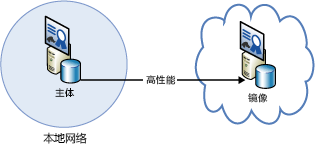
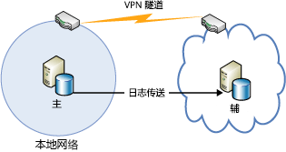
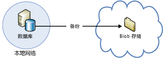

[!INCLUDE [header](../_includes/header.md)]
# Azure 复原技术指南：从本地恢复到 AzureAzure resiliency technical guidance: Recovery from on-premises to Azure
Azure 提供一整套服务，可让你将本地数据中心扩展到 Azure，用于高可用性和灾难恢复目的：Azure provides a comprehensive set of services for enabling the extension of an on-premises datacenter to Azure for high availability and disaster recovery purposes:

* **网络**：通过虚拟专用网络，可以安全地将本地网络扩展到云。**Networking**: With a virtual private network, you securely extend your on-premises network to the cloud.
* **计算**：使用本地 Hyper-V 的客户可以将现有虚拟机 (VM)“提起并移动”到 Azure。**Compute**: Customers using Hyper-V on-premises can “lift and shift” existing virtual machines (VMs) to Azure.
* **存储**：StorSimple 可将文件系统扩展到 Azure 存储。**Storage**: StorSimple extends your file system to Azure Storage. Azure 备份服务提供将文件和 SQL 数据库备份到 Azure 存储的功能。The Azure Backup service provides backup for files and SQL databases to Azure Storage.
* **数据库复制**：使用 SQL 2014（或更高版本）可用性组，可以为本地数据实现高可用性和灾难恢复。**Database replication**: With SQL Server 2014 (or later) Availability Groups, you can implement high availability and disaster recovery for your on-premises data.

## 联网Networking
可以使用 Azure 虚拟网络在 Azure 中创建一个逻辑上独立的部分，并可使用 IPsec 连接将其连接到本地数据中心或单个客户端计算机。You can use Azure Virtual Network to create a logically isolated section in Azure and securely connect it to your on-premises datacenter or a single client machine by using an IPsec connection. 通过虚拟网络，可轻松地利用 Azure 中按需可缩放的基础架构，同时可连接到本地数据和应用程序，包括 Windows Server、大型机和 UNIX 上运行的系统。With Virtual Network, you can take advantage of the scalable, on-demand infrastructure in Azure while providing connectivity to data and applications on-premises, including systems running on Windows Server, mainframes, and UNIX. 有关详细信息，请参阅 [Azure 网络文档](/azure/virtual-network/virtual-networks-overview/)。See [Azure networking documentation](/azure/virtual-network/virtual-networks-overview/) for more information.

## 计算Compute
使用本地 Hyper-V 的客户可以将现有的虚拟机“提起并移动”到 Azure 和运行 Windows Server 2012（或更高版本）的服务提供程序，而不需要对 VM 进行更改或转换 VM 格式。If you're using Hyper-V on-premises, you can “lift and shift” existing virtual machines to Azure and service providers running Windows Server 2012 (or later), without making changes to the VM or converting VM formats. 有关详细信息，请参阅[关于 Azure 虚拟机的磁盘和 VHD](/azure/virtual-machines/virtual-machines-linux-about-disks-vhds/?toc=%2fazure%2fvirtual-machines%2flinux%2ftoc.json)。For more information, see [About disks and VHDs for Azure virtual machines](/azure/virtual-machines/virtual-machines-linux-about-disks-vhds/?toc=%2fazure%2fvirtual-machines%2flinux%2ftoc.json).

## Azure Site RecoveryAzure Site Recovery
如果希望灾难恢复作为一项服务 (DRaaS)，Azure 提供了 [Azure Site Recovery](https://azure.microsoft.com/services/site-recovery/)。If you want disaster recovery as a service (DRaaS), Azure provides [Azure Site Recovery](https://azure.microsoft.com/services/site-recovery/). Azure Site Recovery 为 VMware、Hyper-V 和物理服务器提供全面的保护。Azure Site Recovery offers comprehensive protection for VMware, Hyper-V, and physical servers. 借助 Azure Site Recovery，可以使用另一台本地服务器或 Azure 作为恢复站点。With Azure Site Recovery, you can use another on-premises server or Azure as your recovery site. 有关 Azure Site Recovery 的详细信息，请参阅 [Azure Site Recovery 文档](https://azure.microsoft.com/documentation/services/site-recovery/)。For more information on Azure Site Recovery, see the [Azure Site Recovery documentation](https://azure.microsoft.com/documentation/services/site-recovery/).

## 存储Storage
可以使用多个选项将 Azure 用作本地数据的备份站点。There are several options for using Azure as a backup site for on-premises data.

### StorSimpleStorSimple
StorSimple 可安全、透明地整合本地应用程序的云存储。StorSimple securely and transparently integrates cloud storage for on-premises applications. 它还提供单个设备来实现高性能的分层本地和云存储、实时存档、基于云的数据保护和灾难恢复。It also offers a single appliance that delivers high-performance tiered local and cloud storage, live archiving, cloud-based data protection, and disaster recovery. 有关详细信息，请参阅 [StorSimple 产品页](https://azure.microsoft.com/services/storsimple/)。For more information, see the [StorSimple product page](https://azure.microsoft.com/services/storsimple/).

### Azure 备份Azure Backup
Azure 备份让可以使用 Windows Server 2012（或更高版本）、Windows Server 2012 Essentials（或更高版本）和 System Center 2012 Data Protection Manager（或更高版本）中熟悉的备份工具进行云备份。Azure Backup enables cloud backups by using the familiar backup tools in Windows Server 2012 (or later), Windows Server 2012 Essentials (or later), and System Center 2012 Data Protection Manager (or later). 这些工具提供了独立于备份存储位置（无论是本地磁盘还是 Azure 存储）的备份管理工作流。These tools provide a workflow for backup management that is independent of the storage location of the backups, whether a local disk or Azure Storage. 数据备份到云后，经过授权的用户可以轻松地恢复到任何服务器的备份。After data is backed up to the cloud, authorized users can easily recover backups to any server.

使用增量备份时，只会将文件更改传输到云。With incremental backups, only changes to files are transferred to the cloud. 这有助于高效使用存储空间、降低带宽消耗并支持多个数据版本的时间点恢复。This helps to efficiently use storage space, reduce bandwidth consumption, and support point-in-time recovery of multiple versions of the data. 也可以选择使用其他功能，如数据保留策略、数据压缩和数据传输限制。You can also choose to use additional features, such as data retention policies, data compression, and data transfer throttling. 使用 Azure 作为备份位置有一个明显的优点，那就是自动在“场外”备份。Using Azure as the backup location has the obvious advantage that the backups are automatically “offsite”. 这样就不再需要额外对现场备份媒体进行保护了。This eliminates the extra requirements to secure and protect on-site backup media.

有关详细信息，请参阅[什么是 Azure 备份？](/azure/backup/backup-introduction-to-azure-backup/)和[为 DPM 数据配置 Azure 备份](https://technet.microsoft.com/library/jj728752.aspx)。For more information, see [What is Azure Backup?](/azure/backup/backup-introduction-to-azure-backup/) and [Configure Azure Backup for DPM data](https://technet.microsoft.com/library/jj728752.aspx).

## 数据库Database
可使用 AlwaysOn 可用性组、数据库镜像、日志传送以及备份和还原与 Azure Blob 存储配合使用，在混合 IT 环境中为 SQL Server 数据库提供灾难恢复解决方案。You can have a disaster recovery solution for your SQL Server databases in a hybrid-IT environment by using AlwaysOn Availability Groups, database mirroring, log shipping, and backup and restore with Azure Blob storage. 所有这些解决方案都使用 Azure 虚拟机上运行的 SQL Server。All of these solutions use SQL Server running on Azure Virtual Machines.

AlwaysOn 可用性组可在本地和云中都有数据库副本的混合 IT 环境中使用。AlwaysOn Availability Groups can be used in a hybrid-IT environment where database replicas exist both on-premises and in the cloud. 下图显示了此特点。This is shown in the following diagram.

在基于证书的设置中，数据库镜像也可以横跨本地服务器和云。Database mirroring can also span on-premises servers and the cloud in a certificate-based setup. 下图演示了此概念。The following diagram illustrates this concept.

日志传送可用于同步本地数据库和 Azure 虚拟机中的 SQL Server 数据库。Log shipping can be used to synchronize an on-premises database with a SQL Server database in an Azure virtual machine.

最后，可以直接将本地数据库备份到 Azure Blob 存储。Finally, you can back up an on-premises database directly to Azure Blob storage.

有关详细信息，请参阅 [Azure 虚拟机中 SQL Server 的高可用性和灾难恢复](/azure/virtual-machines/windows/sql/virtual-machines-windows-sql-high-availability-dr/)和 [Azure 虚拟机中 SQL Server 的备份和还原](/azure/virtual-machines/windows/sql/virtual-machines-windows-sql-backup-recovery/)。For more information, see [High availability and disaster recovery for SQL Server in Azure virtual machines](/azure/virtual-machines/windows/sql/virtual-machines-windows-sql-high-availability-dr/) and [Backup and restore for SQL Server in Azure virtual machines](/azure/virtual-machines/windows/sql/virtual-machines-windows-sql-backup-recovery/).

## Microsoft Azure 中的本地恢复清单Checklists for on-premises recovery in Microsoft Azure
### 联网Networking
1. 查看本文档的“网络”部分。Review the Networking section of this document.
2. 使用虚拟网络安全地将本地部署与云相连。Use Virtual Network to securely connect on-premises to the cloud.

### 计算Compute
1. 查看本文档的“计算”部分。Review the Compute section of this document.
2. 在 Hyper-V 和 Azure 之间重新定位 VM。Relocate VMs between Hyper-V and Azure.

### 存储Storage
1. 查看本文档的“存储”部分。Review the Storage section of this document.
2. 通过 StorSimple 服务来使用云存储。Take advantage of StorSimple services for using cloud storage.
3. 使用 Azure 备份服务。Use the Azure Backup service.

### 数据库Database
1. 查看本文档的“数据库”部分。Review the Database section of this document.
2. 考虑使用 Azure VM 上的 SQL Server 作为备份。Consider using SQL Server on Azure VMs as the backup.
3. 设置 AlwaysOn 可用性组。Set up AlwaysOn Availability Groups.
4. 配置基于证书的数据库镜像。Configure certificate-based database mirroring.
5. 使用日志传送。Use log shipping.
6. 将本地数据库备份到 Azure Blob 存储。Back up on-premises databases to Azure Blob storage.

